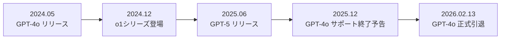
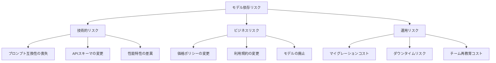
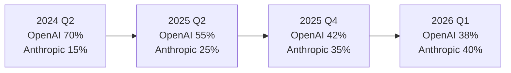
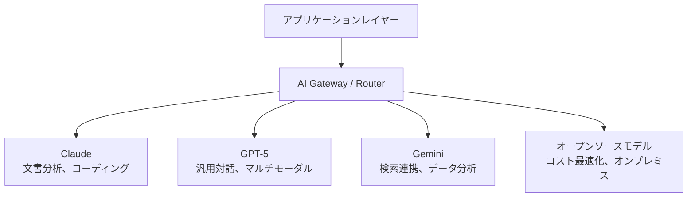
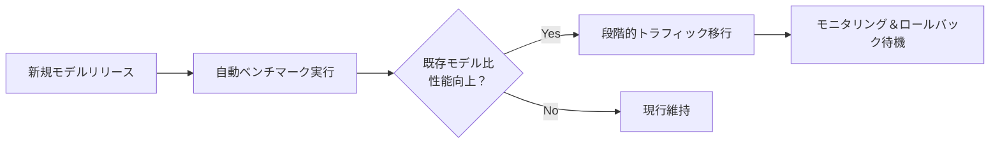

## 概要

2026年2月13日、OpenAIのGPT-4oが正式に引退します。2024年5月のリリースから約2年での退場です。この出来事は単なるモデル交代ではありません。<strong>単一モデルに依存した企業が直面する構造的リスク</strong>を如実に示す事例であり、同時にAnthropicのClaudeがエンタープライズ市場でシェアを逆転した背景を理解する鍵でもあります。

本記事では、GPT-4o引退が企業AI戦略に与える影響、Claudeが企業市場で台頭した理由、そしてマルチモデル戦略がなぜ必須なのかを分析します。

## GPT-4o引退：何が変わるのか

### タイムライン

GPT-4oは2024年5月にリリースされ、OpenAIの主力モデルとして定着しました。マルチモーダル機能、高速レスポンス、合理的な価格設定により、多くの企業がプロダクションシステムに統合しました。



### 影響を受ける企業

GPT-4o APIを直接呼び出すプロダクションシステムを運用している企業は、以下の課題に直面します：

- <strong>APIエンドポイントのマイグレーション</strong>：GPT-4o専用パラメータとレスポンス形式の変更対応
- <strong>プロンプトの再最適化</strong>：新モデルに合わせてプロンプトを書き直すコスト
- <strong>性能回帰テスト</strong>：既存ワークフローが新モデルで同等の品質を保証するかの検証
- <strong>コスト構造の変化</strong>：後継モデルのトークン価格変動に伴う予算再編

## モデル依存リスクとは何か

### ベンダーロックインのAI版

従来のソフトウェアにおけるベンダーロックイン（Vendor Lock-in）と同様に、AI分野でも<strong>モデルロックイン（Model Lock-in）</strong>という新たな形態の依存性が出現しました。



### 実例：GPT-4o依存企業のジレンマ

GPT-4oに深く依存した企業が直面する典型的な問題を見てみましょう：

1. <strong>プロンプトエンジニアリング資産の価値低下</strong>：数ヶ月かけて最適化したプロンプトが新モデルで同様に動作しない
2. <strong>ファインチューニングモデルの喪失</strong>：GPT-4oベースでファインチューニングしたカスタムモデルが互換性を失う可能性
3. <strong>評価基準の再設定</strong>：品質ベンチマークと評価パイプラインをゼロから再構築

## Claudeのエンタープライズ市場シェア逆転

### なぜ企業はClaudeに移行するのか

AnthropicのClaudeは2025年後半からエンタープライズ市場で目覚ましい成長を見せています。その背景にはいくつかの構造的要因があります：

<strong>1. 安全性と信頼性を優先する哲学</strong>

AnthropicはConstitutional AIなどの安全技術を企業環境に適した形で提供しています。規制が強化される金融、医療、法律分野でこのアプローチが高い信頼を得ています。

<strong>2. 一貫したAPIポリシー</strong>

OpenAIが頻繁なモデル交代とAPI変更で企業顧客に不確実性を与えた一方、Anthropicは比較的安定したモデルバージョン管理と明確なサポート終了（deprecation）ポリシーを維持してきました。

<strong>3. コーディングおよび分析能力の優位性</strong>

Claude 3.5 Sonnet以降、Claudeシリーズはコーディング、文書分析、長文処理で競合モデルを上回る性能を示してきました。特に企業内部文書処理とコードレビュー自動化で高い評価を得ています。

<strong>4. 200Kコンテキストウィンドウの実用性</strong>

Claudeの200Kトークンコンテキストウィンドウは、企業環境での長い契約書、技術文書、コードベース分析に直接的な価値を提供します。

### 市場シェアの変化



上記の数値は業界アナリストの推定値を総合したもので、エンタープライズAPI使用量基準です。特にFortune 500企業のAI導入事例でClaudeの採用率が急増していることが目立ちます。

## マルチモデル戦略：リスクを管理する方法

### マルチモデルアーキテクチャの基本構造

単一モデル依存から脱却するためのマルチモデル戦略は、以下のような構造を持ちます：



### 実践的な実装戦略

#### 1. 抽象化レイヤーの導入

```typescript
// AI Gateway抽象化の例
interface AIProvider {
  name: string;
  chat(messages: Message[], options: ModelOptions): Promise<Response>;
  embed(text: string): Promise<number[]>;
}

class AIRouter {
  private providers: Map<string, AIProvider>;
  private fallbackChain: string[];

  async route(task: TaskType, messages: Message[]): Promise<Response> {
    const primary = this.selectProvider(task);
    try {
      return await primary.chat(messages, this.getOptions(task));
    } catch (error) {
      // フォールバックチェーンに従って次のプロバイダーに切り替え
      return this.fallback(task, messages, error);
    }
  }

  private selectProvider(task: TaskType): AIProvider {
    // タスクの種類に応じて最適なプロバイダーを選択
    switch (task) {
      case 'code-review': return this.providers.get('claude');
      case 'multimodal': return this.providers.get('gpt5');
      case 'search-augmented': return this.providers.get('gemini');
      default: return this.providers.get('claude');
    }
  }
}
```

#### 2. プロンプトのポータビリティ確保

モデル間で移植可能なプロンプト設計原則：

- <strong>モデル固有の機能に依存しない</strong>：特定モデルでのみ動作するシステムプロンプト手法を回避
- <strong>構造化出力の使用</strong>：JSON Schemaベースのレスポンス形式でモデル間の互換性を確保
- <strong>評価基準の標準化</strong>：モデルに依存しない品質評価パイプラインの構築

#### 3. 継続的ベンチマーキング



## 企業が今やるべきこと

### すぐに実行可能なチェックリスト

1. <strong>現在のモデル依存度の監査</strong>：プロダクションで使用中のすべてのAIモデルとAPI呼び出し箇所をリスト化
2. <strong>フォールバック戦略の策定</strong>：主力モデル障害時に代替モデルへ切り替える自動化メカニズムの構築
3. <strong>プロンプト資産の管理</strong>：プロンプトをバージョン管理し、モデル別変換テストを自動化
4. <strong>コストシミュレーション</strong>：マルチモデル運用時のコスト構造を事前にシミュレーション
5. <strong>チーム能力の多様化</strong>：特定モデルの専門家ではなく、AIエンジニアリング汎用能力の育成

### 長期的な視点

AIモデル市場は今後さらに速く変化するでしょう。[2026年2月だけでも7つ以上の主要モデルが同時リリース](/ja/blog/ai-model-rush-february-2026)される状況です。このような環境で<strong>特定モデルにオールインすることは技術的負債を積む行為</strong>です。

## 結論

GPT-4oの引退はAI業界の自然な世代交代ですが、準備ができていない企業にとっては危機となります。この出来事から学べる核心的な教訓は以下の通りです：

1. <strong>単一モデル依存は技術的負債である</strong>：どのモデルも最終的には引退する
2. <strong>抽象化レイヤーは保険である</strong>：AI Gatewayによるマルチモデルルーティングは選択ではなく必須
3. <strong>Claudeの台頭は偶然ではない</strong>：安定性、性能、企業親和的なポリシーが市場を動かした
4. <strong>マルチモデル戦略が競争力である</strong>：各モデルの強みを活用する戦略的アプローチが勝利する

AIモデルはツールです。ツールに依存するのではなく、<strong>ツールを交換できる柔軟性</strong>を持つことが真の競争力です。

## 参考資料

- [OpenAI Model Deprecation Policy](https://platform.openai.com/docs/deprecations)
- [Anthropic Claude Enterprise](https://www.anthropic.com/enterprise)
- [2026年2月AIモデルラッシュ分析](/ja/blog/ai-model-rush-february-2026)
