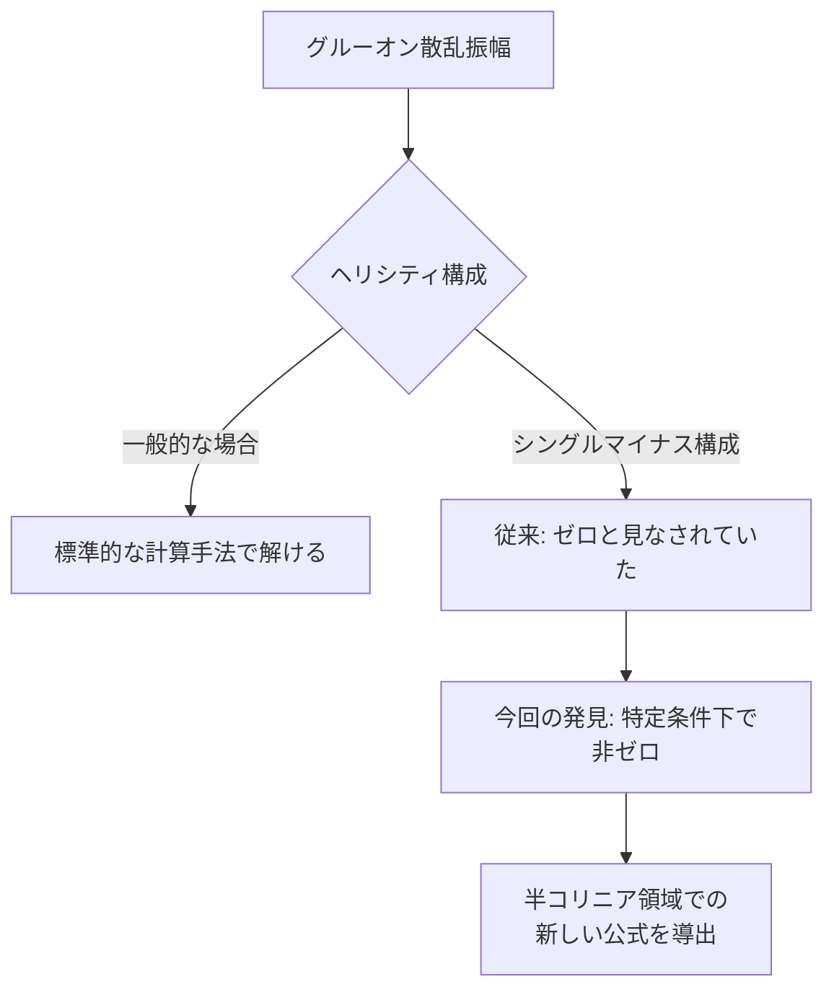
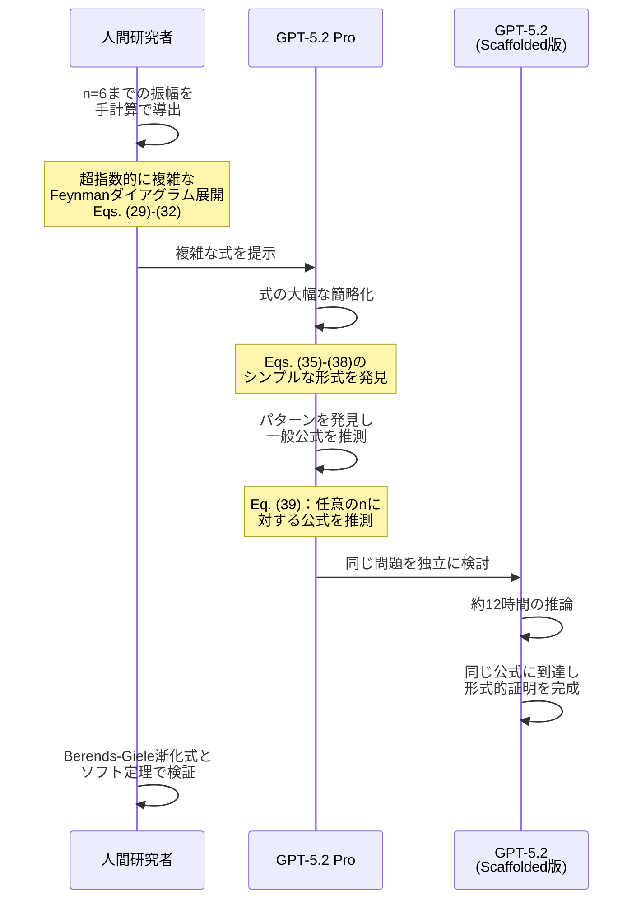
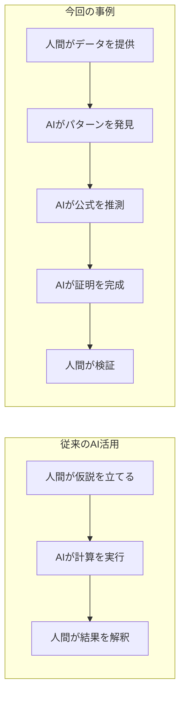

## 概要

2026年2月、OpenAIは理論物理学における画期的な成果を発表しました。<strong>GPT-5.2 Pro</strong>が、グルーオン（強い核力を媒介する粒子）の散乱振幅に関する新しい公式を<strong>自ら推測し、さらに形式的な証明まで完成</strong>させたのです。

この成果はarXivにプレプリントとして公開され、プリンストン高等研究所、ハーバード大学、ケンブリッジ大学の研究者との共同研究として発表されました。AIが科学研究において「ツール」から「発見者」へと変わる歴史的な転換点と言えるでしょう。

## 何が発見されたのか

### シングルマイナスグルーオン振幅の再発見

論文タイトルは<strong>「Single-minus gluon tree amplitudes are nonzero」</strong>です。これは素粒子物理学の中心的概念である「散乱振幅」に関する発見です。

従来の教科書的な議論では、1つのグルーオンが負のヘリシティを持ち、残りのn-1個が正のヘリシティを持つ場合、ツリーレベルの振幅はゼロになるとされてきました。

しかし今回の研究は、<strong>「半コリニア（half-collinear）領域」</strong>と呼ばれる特定の運動学的条件下では、この振幅がゼロにならないことを示しました。

### なぜ重要なのか

散乱振幅の単純化は、量子場の理論における深い構造を繰り返し明らかにしてきました。今回の発見は：

- <strong>教科書の常識を覆す</strong>：長年ゼロとされてきた振幅が非ゼロであることを証明
- <strong>重力子への拡張</strong>：同様の解析が重力を媒介する粒子（重力子）にも適用可能
- <strong>新しい研究領域の開拓</strong>：多くの後続研究の出発点となる

## AIの役割：ツールから発見者へ

### GPT-5.2の具体的な貢献

この研究におけるAIの役割は、単なる計算支援ではありませんでした。

<strong>ステップ1</strong>：人間の研究者がn=6までの散乱振幅を手計算で求めました。これらは非常に複雑な式でした。

<strong>ステップ2</strong>：GPT-5.2 Proが、これらの複雑な式を大幅に簡略化しました。

<strong>ステップ3</strong>：簡略化された式からパターンを発見し、任意のnに対して有効な一般公式（論文のEq. 39）を<strong>推測</strong>しました。

<strong>ステップ4</strong>：内部のスキャフォールドされたGPT-5.2が約12時間かけて同じ公式に独立に到達し、<strong>形式的な証明</strong>を完成させました。

### 従来のAI活用との決定的な違い

従来のAI活用では、仮説の生成は人間の役割でした。しかし今回は：

- <strong>パターン認識</strong>：複雑な式から法則性を見出した
- <strong>仮説生成</strong>：一般公式を自ら推測した
- <strong>証明</strong>：約12時間の自律的な推論で形式的証明を完成させた

これは、AIが科学的発見プロセスの中核部分を担った初めての重要な事例の一つです。

## 科学界の反応

### 高等研究所 ニマ・アルカニ＝ハメド教授

> 「教科書的な方法で計算された物理量の式が、恐ろしく複雑に見えるが実は非常にシンプルである、ということはこの分野ではよく起こることです。（中略）<strong>『シンプルな公式を見つける』ことは、近い将来に汎用的な『シンプルな公式パターン認識』ツールへと発展する</strong>傾向の始まりを見ているようです。」

### UCSB ナサニエル・クレイグ教授

> 「この論文は<strong>AI支援科学の未来を垣間見せるもの</strong>であり、物理学者がAIと手を取り合って新しい洞察を生み出し検証する姿を示しています。物理学者とLLMの対話が<strong>根本的に新しい知識を生み出せる</strong>ことに疑いの余地はありません。」

## 科学研究ワークフローへの影響

### 研究パラダイムの変化

今回の事例は、科学研究のワークフローに根本的な変化をもたらす可能性を示しています。

<strong>1. 超人的なパターン認識</strong>

人間には認識困難な、超指数的に複雑な式からのパターン発見。GPT-5.2はこれを実現し、ニマ・アルカニ＝ハメド教授が指摘するように「汎用的なシンプル公式パターン認識ツール」への道を開きました。

<strong>2. 長時間の自律的推論</strong>

12時間にわたる形式的証明の完成は、AIが短時間の応答だけでなく、長時間の深い思考が可能であることを示しています。

<strong>3. 人間とAIの新しい協業モデル</strong>

この研究では、人間が基礎的な計算を行い、AIがその先の発見を担うという新しい協業パターンが確立されました。著者リストにはOpenAIのKevin Weilが「OpenAIを代表して」含まれており、AIの貢献が正式に認められています。

### 今後の展望

研究チームは既にGPT-5.2の助けを借りて：

- グルーオンから<strong>重力子</strong>への拡張を完了
- その他の一般化も進行中
- これらのAI支援による成果は、別途報告予定

## エンジニアにとっての示唆

### 技術的な観点

この事例は、ソフトウェアエンジニアリングにも重要な示唆を与えます：

- <strong>AIの推論能力の進化</strong>：12時間の連続推論と形式的証明は、コード生成やバグ修正を超えた能力を示唆
- <strong>ドメイン専門家との協業パターン</strong>：人間が問題を定義し、AIが解決策を探索する協業モデルは、他の分野にも適用可能
- <strong>検証の重要性</strong>：AIが出した結果を人間が既存の手法（Berends-Giele漸化式）で検証するプロセスが重要

### AIオーサーシップの問題

今回の論文では、OpenAIのKevin Weilが「OpenAIを代表して」著者に含まれています。これは、AIの科学的貢献をどのように認定するかという新しい問題を提起しています。

## 結論

GPT-5.2による理論物理学の新成果導出は、<strong>AIが科学的発見者として機能した歴史的な転換点</strong>です。単なる計算ツールではなく、パターンの発見、公式の推測、そして形式的証明の完成まで — 科学的発見プロセスの中核を担いました。

この事例は、AI支援科学研究の未来における一つのテンプレートを提供しています。人間の研究者とAIが対等なパートナーとして協業し、どちらか一方では到達できなかった発見に至る — そんな科学の新時代の幕開けを告げるものと言えるでしょう。

## 参考資料

- [OpenAI公式発表：GPT-5.2 derives a new result in theoretical physics](https://openai.com/index/new-result-theoretical-physics)
- [arXivプレプリント：Single-minus gluon tree amplitudes are nonzero (arXiv:2602.12176)](https://arxiv.org/abs/2602.12176)
