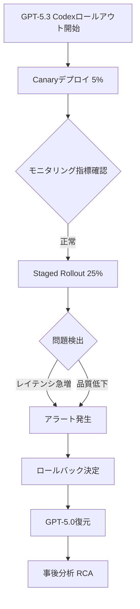
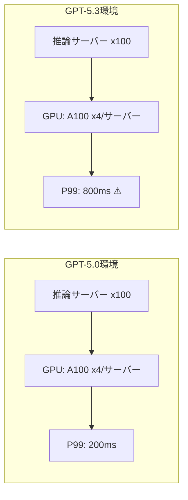

## 概要

2026年2月、GitHubはGPT-5.3ベースのCodex機能をプラットフォーム全体にロールアウトする最中に深刻な信頼性問題を発見し、<strong>一時的に旧バージョン（GPT-5.0）へロールバック</strong>する決定を下しました。この事件は、AIモデルのバージョンアップグレードが単なる機能改善ではなく、プロダクションインフラ全体の安定性に直結する問題であることを改めて示しました。

本記事では、GitHub Codexロールバック事件の背景と原因を分析し、エンジニアリングマネージャー（EM）の視点からAIモデルバージョンアップリスクをどのように管理すべきかを論じます。

## 事件の経緯

### GPT-5.3 Codexとは

GitHub CopilotのコアエンジンであるCodexは、OpenAIのGPTモデルをベースにコード生成、オートコンプリート、コードレビューなどの機能を提供しています。GPT-5.3へのアップグレードは以下の改善を目標としていました：

- <strong>コード生成精度の向上</strong>：複雑なマルチファイルコンテキスト理解能力の強化
- <strong>応答速度の改善</strong>：推論最適化によるレイテンシ低減
- <strong>新言語サポート</strong>：Rust、Zigなどのシステムプログラミング言語サポート拡大

### ロールアウト中に発生した問題

ロールアウトは段階的（canary → staged rollout）に進められましたが、本格的な拡大デプロイの段階で以下の問題が報告されました：

1. <strong>応答レイテンシの急増</strong>：P99レイテンシが従来比3〜5倍に増加
2. <strong>コード提案品質の低下</strong>：特定言語（TypeScript、Python）でハルシネーション率が上昇
3. <strong>VSCode拡張のクラッシュ</strong>：メモリ使用量の急増によるIDE不安定化
4. <strong>API Rate Limitingの問題</strong>：バックエンド推論サーバーの過負荷による連鎖障害

### ロールバックの決定

GitHubエンジニアリングチームは<strong>ユーザー影響度</strong>と<strong>復旧時間</strong>を考慮してGPT-5.0への即時ロールバックを決定しました。これは「安全第一（safety-first）」の原則に基づく判断でした。

## 技術分析：なぜ問題が発生したのか

### 1. モデルサイズと推論コストのトレードオフ

GPT-5.3は5.0と比較してパラメータ数が約40%増加しました。理論的にはより高品質な出力が期待できますが、実際のプロダクション環境では：

- <strong>GPUメモリ使用量の増加</strong> → 同時処理可能なリクエスト数の減少
- <strong>推論時間の増加</strong> → ユーザー体感レイテンシの悪化
- <strong>バッチ処理効率の低下</strong> → サーバーあたりのスループット減少

### 2. プロンプト互換性の問題

既存のGPT-5.0に最適化されたシステムプロンプトとfew-shotサンプルが5.3では予想と異なる動作をしました。特に：

- <strong>コードコンテキストウィンドウの処理方式変更</strong>：ファイル境界認識ロジックの差異
- <strong>トークン分割（tokenization）の変更</strong>：コードトークナイザーの微細な差異が出力に影響
- <strong>安全フィルターの強化</strong>：過度なフィルタリングにより正常なコード提案まで遮断

### 3. インフラスケーリングのミスマッチ

同一インフラでより大きなモデルをサービングする際にキャパシティプランニングが不足していたことが根本原因の一つでした。

## エンジニアリングマネージャー視点での教訓

### 1. AIモデルのバージョンアップはインフラ変更である

AIモデルのバージョンアップグレードを単なる「ソフトウェアアップデート」として扱ってはなりません。モデル変更は以下を伴います：

- <strong>インフラ容量の再算定</strong>：GPU、メモリ、ネットワーク帯域幅
- <strong>パフォーマンスベースラインの再設定</strong>：SLA/SLOの再検討
- <strong>統合テストの全面再実行</strong>：ダウンストリームサービスへの影響評価

### 2. カナリアデプロイだけでは不十分

今回の事件ではカナリアデプロイ（5%）では問題が顕在化しませんでした。これは以下の落とし穴を示唆しています：

- <strong>トラフィックパターンの差異</strong>：カナリア対象ユーザーの使用パターンが全体と異なる可能性
- <strong>負荷依存の問題</strong>：一定規模以上の同時リクエストでのみ発生するボトルネック
- <strong>長時間累積問題</strong>：メモリリークなど時間経過で悪化する問題

<strong>対策</strong>：Shadow traffic testing（実トラフィック複製テスト）、負荷テスト（load testing）の併用が必須です。

### 3. ロールバック戦略を事前に策定せよ

GitHubチームが迅速にロールバックできた理由は、<strong>事前にロールバック計画が策定されていた</strong>からです。EMとして以下を保証すべきです：

- <strong>Feature Flagベースのデプロイ</strong>：モデルバージョンをランタイムで切り替え可能な設計
- <strong>自動ロールバックトリガー</strong>：コア指標（レイテンシ、エラー率）の閾値超過時に自動復元
- <strong>ロールバックリハーサル</strong>：定期的にロールバックシナリオをテスト

### 4. ユーザーコミュニケーション体制

プラットフォーム障害時にユーザーへ透明に状況を共有することが信頼維持の鍵です：

- <strong>Status Pageの即時更新</strong>：障害認知後15分以内に公知
- <strong>技術的原因の適切なレベルでの開示</strong>：過度な詳細は不要だが原因と対策は明確に
- <strong>復旧タイムラインの提示</strong>：不確実でも予想時間を共有

## AIモデルバージョンアップのリスク管理フレームワーク

エンジニアリング組織でAIモデルバージョンアップ時に活用できるチェックリストを提案します：

### デプロイ前（Pre-deployment）

| 項目 | 詳細 |
|------|------|
| ベンチマークテスト | 既存モデル比の精度/レイテンシ/スループット比較 |
| インフラ容量検証 | 新モデルのリソース要件算定とプロビジョニング |
| プロンプト互換性検証 | 既存システムプロンプトの動作確認 |
| ロールバック計画策定 | Feature flag、自動トリガー、リハーサル |
| Shadow Testing | 実トラフィック複製による事前検証 |

### デプロイ中（During deployment）

| 項目 | 詳細 |
|------|------|
| 段階的ロールアウト | 5% → 25% → 50% → 100% |
| リアルタイムモニタリング | レイテンシ、エラー率、ユーザーフィードバック |
| 自動ロールバック閾値 | P99 > 2x baseline → 自動停止 |
| ユーザー影響分析 | 実ユーザー体験指標の追跡 |

### デプロイ後（Post-deployment）

| 項目 | 詳細 |
|------|------|
| RCA（Root Cause Analysis） | 問題発生時の根本原因分析 |
| ポストモーテム共有 | Blamelessポストモーテム文化 |
| プロセス改善 | チェックリスト更新、自動化強化 |

## VSCode拡張エコシステムへの影響

今回の事件はVSCode拡張（extension）開発者エコシステムにも重要な示唆を残しました：

- <strong>拡張安定性の依存関係</strong>：Copilot拡張が不安定になると他の拡張にも影響
- <strong>リソース使用ガイドラインの必要性</strong>：AIベース拡張のメモリ/CPU使用制限
- <strong>Graceful degradationパターン</strong>：バックエンド障害時もIDEが正常動作するよう設計

## 結論

GitHubのGPT-5.3 Codexロールバック事件は、<strong>AIモデルのプロダクションデプロイがいかに複雑なエンジニアリング課題であるか</strong>を示す事例です。単に「より良いモデル」を適用すればサービスが改善されるという前提は危険です。

エンジニアリングマネージャーとして私たちが記憶すべき核心は：

1. <strong>AIモデル変更にはインフラ変更と同等のリスク管理が必要です</strong>
2. <strong>カナリアデプロイ + Shadow Testing + 負荷テストの三重検証が必須です</strong>
3. <strong>ロールバック計画はデプロイ計画の一部であるべきです</strong>
4. <strong>ユーザーコミュニケーションは技術的対応と同等に重要です</strong>

今回の事件を契機に、AIベースサービスのデプロイプロセスがさらに成熟することを期待します。

## 参考資料

- [GitHub Status — Codexロールバック公知](https://x.com/github/status/2021040916451164412)
- [GitHub Copilot公式ドキュメント](https://docs.github.com/en/copilot)
- [Google SRE Book — Release Engineering](https://sre.google/sre-book/release-engineering/)
- [Progressive Delivery: Feature Flags, Canary, and Shadow Traffic](https://launchdarkly.com/blog/progressive-delivery/)
