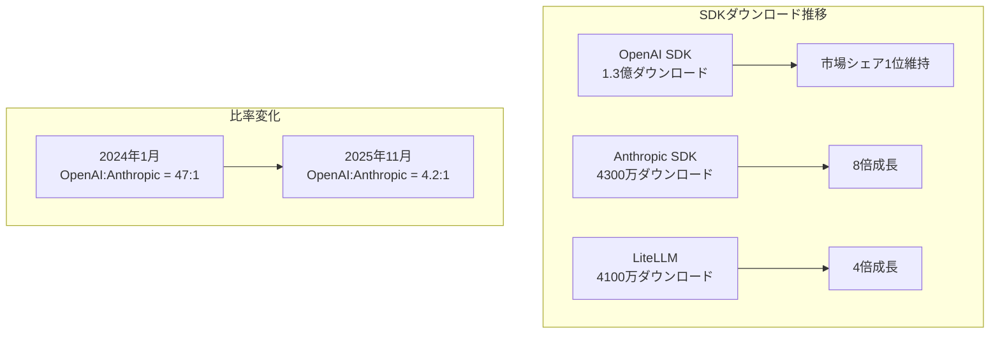
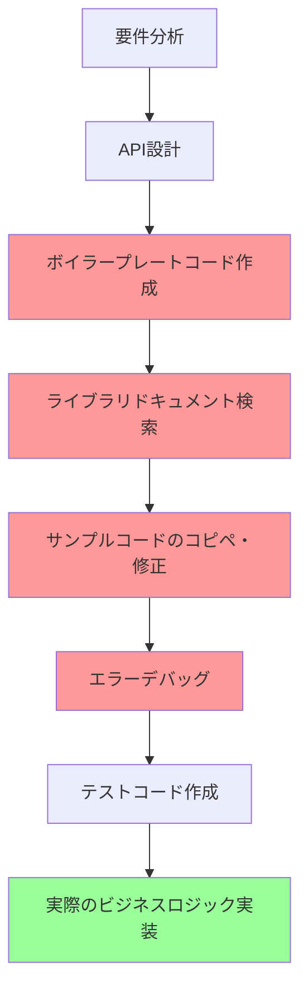
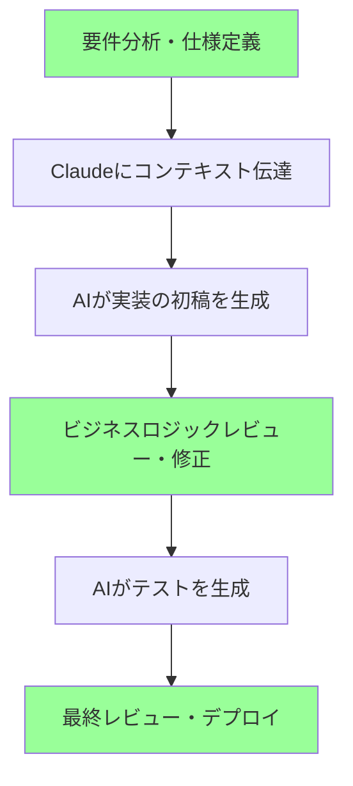

## 概要

Greptileが発表した**「The State of AI Coding 2025」**レポートが業界で大きな注目を集めています。このレポートは2025年3月から11月までのデータを基に、AIコーディングツールが実際に開発者の生産性にどのような影響を与えたかを定量的に分析した資料です。

この記事では、レポートの重要な発見を整理し、私の個人的な経験を基にAIコーディングツールがもたらした実質的な変化について論じます。

> **参考**：この記事は[Greptile State of AI Coding 2025](https://www.greptile.com/state-of-ai-coding-2025)レポートのレビューです。

## レポートの重要な発見まとめ

### 1. 開発者生産性指標の劇的な変化

レポートで最も注目すべき数値です：

| 指標 | 変化率 | 詳細 |
|------|--------|------|
| **開発者あたりのコード出力量** | **+76%** | 4,450行 → 7,839行 |
| **PRサイズ（中央値）** | **+33%** | 57行 → 76行 |
| **ファイルあたりの変更行数** | **+20%** | 18行 → 22行 |

特に6〜15名規模の中間サイズのチームで**89%のコード出力増加**を記録した点が印象的です。これはAIツールが単に個人開発者だけでなく、チーム単位の協業環境でも効果的であることを示しています。

### 2. AIツールエコシステムの急速な成長

OpenAIが依然として市場をリードしていますが、Anthropicの成長率は驚異的です。**1,547倍成長**という数値は、Claudeが開発者コミュニティでいかに急速に採用されているかを示しています。

### 3. CLAUDE.mdファイルの標準化

レポートによると、**全リポジトリの67%がCLAUDE.mdルールファイルを採用**しました。これはAIエージェントにコードベースのコンテキストを提供することが開発ワークフローの標準として定着したことを意味します。

17%のリポジトリは3つの形式（CLAUDE.md、.cursorrules、.github/copilot-instructions.md）すべてを使用しており、マルチAIツール環境が現実化しています。

### 4. モデル性能ベンチマーク

| モデル | TTFT (p50) | コスト倍率 |
|--------|-----------|-----------|
| Claude Opus 4.5 | < 2.5秒 | 3.30x |
| Claude Sonnet 4.5 | < 2.5秒 | 2.00x |
| GPT-5.1 | > 5秒 | 1x（基準） |
| GPT-5 Codex | > 5秒 | 1x |
| Gemini 3 Pro | 13.1秒 | 1.40x |

Anthropicのモデルがレスポンス速度で優位を示しており、これは開発者体験に直接影響します。コード作成中の遅延が減少すると開発フローが途切れず、生産性が向上します。

## 私の経験：仕様とビジネスロジックだけに集中できるようになった

レポートの数値は印象的ですが、私にとってより重要なのは**働き方の根本的な変化**です。

### Before：実装の詳細に時間を取られていた頃

以前は**開発時間全体の70%以上を実装の詳細に費やしていました**：
- 「このライブラリはどうやって設定するんだろう？」
- 「このエラーメッセージはどういう意味だ？」
- 「似たようなコードをどこかで見たはずなのに...」
- 「テストコードはどう構造化しよう？」

### After：ビジネスロジックに集中する現在

今は**仕様定義とビジネスロジックのレビューに集中**しています：

1. **明確な仕様作成**：「何を作るか」についての明確な定義
2. **コンテキスト提供**：CLAUDE.mdを通じてプロジェクト構造とルールを伝達
3. **成果物レビュー**：AIが生成したコードがビジネス要件を満たしているか確認
4. **コアロジック調整**：複雑なビジネスルールやエッジケースの処理

### 具体的な生産性向上事例

#### 1. 新機能開発

**以前**：新しいAPIエンドポイントを1つ追加するのに2〜3時間
- ルーティング設定
- リクエスト/レスポンス型定義
- エラーハンドリング
- テスト作成

**現在**：30分以内
- 要件をClaudeに説明
- 生成されたコードをレビュー
- ビジネスロジックの微調整
- テスト実行と確認

#### 2. デバッグ

**以前**：エラーログ分析 → Stack Overflow検索 → 試行錯誤（1〜2時間）

**現在**：エラーメッセージとコンテキストを提供 → 原因分析と解決策提示（10〜20分）

#### 3. コードレビュー

**以前**：コードスタイル、潜在的バグ、パフォーマンス問題を手動で確認

**現在**：AIが1次レビュー後、コアビジネスロジックとアーキテクチャ決定にのみ集中

### 定量的な体感変化

| 業務領域 | 時間削減 | 主な要因 |
|----------|----------|----------|
| ボイラープレートコード | **90%** | AIがパターンベースで即座に生成 |
| ライブラリ学習 | **80%** | ドキュメントの代わりにコンテキストベースの例を提供 |
| デバッグ | **70%** | エラー原因分析の自動化 |
| テスト作成 | **75%** | テストケースの自動生成 |
| コードリファクタリング | **60%** | パターン認識と改善案の提示 |

## 生産性向上の真の意味

レポートでは76%のコード出力増加が言及されていますが、私は**より重要な変化**があると考えています。

### 1. 認知負荷の軽減

AIツールが「どう実装するか」の負担を軽減してくれることで、**「何を作るか」**への思考により多くのエネルギーを注げるようになりました。

### 2. 学習曲線の緩和

新しい技術やフレームワークを導入する際の障壁が低くなりました。ドキュメントを最初から読む代わりに、現在のコードベースに合った具体的な例をすぐに得られます。

### 3. 実験の容易さ

アイデアを素早くプロトタイプにできるため、より多くの実験と反復が可能になりました。

## 注意すべき点

もちろん、AIコーディングツールは万能ではありません。

### 1. コンテキスト提供の重要性

AIが良い成果物を出すには**明確なコンテキストと要件**が必要です。CLAUDE.mdのようなルールファイルの品質が成果物の品質に直接影響します。

### 2. レビューの必須性

AIが生成したコードをそのまま使用してはいけません。特に：
- セキュリティ関連コード
- ビジネスクリティカルなロジック
- パフォーマンスに敏感な部分

### 3. ドメイン知識の重要性

AIはツールです。**ドメイン専門性とシステム設計能力**は依然として開発者のコア能力です。

## 結論

Greptileのレポートは、AIコーディングツールが実際に開発生産性にポジティブな影響を与えていることをデータで示しています。76%のコード出力増加、33%のPRサイズ増加などの数値がこれを裏付けています。

しかし、私にとってより意味のある変化は**働き方の転換**です。実装の詳細に時間を取られず、**仕様とビジネスロジックに集中**できるようになりました。これこそがAIコーディングツールがもたらした真の生産性向上だと考えています。

AI時代の開発者はもはや「コードをタイピングする人」ではありません。**「問題を定義し解決策を設計する人」**へと役割が進化しています。そして、この変化はまだ始まったばかりです。

## 参考資料

- [Greptile - The State of AI Coding 2025](https://www.greptile.com/state-of-ai-coding-2025)
- [Anthropic - Claude Code Best Practices](https://www.anthropic.com/engineering/claude-code-best-practices)
- [GitHub - Copilot Impact Report 2024](https://github.blog/news-insights/research/the-state-of-the-octoverse-2024/)
