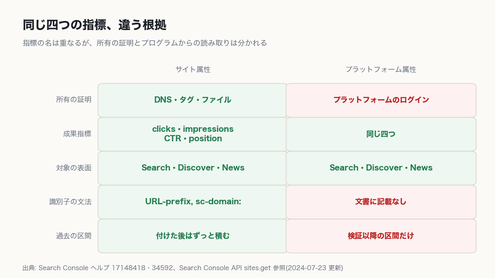

2026年7月7日、GoogleがSearch Consoleに新しい種類の属性を足した。Instagram、TikTok、X、YouTubeの四つで、自分のアカウントの投稿がGoogle検索でどう出ているかを、サイトと同じ画面で読める。7月29日には全世界に開放された。ここまでは、機能が一つ増えたという話だ。

結論を先に置く。Search Consoleを人が開いて読んでいるチームは、今日この四つを繋いだほうがいい。料金はかからず、失うものもない。一方、Search ConsoleをAPIやBigQueryで吸い上げて自動レポートにしているチームには反対する。属性は作ってよいが、パイプラインには入れるな。理由は権限でも料金でもなく、名前だ。測定をきれいに自動化した組織ほど、新しく開いたデータを遅く見ることになる。

## プラットフォーム属性が数えないもの

名前が誤解を招く。TikTokの属性を作っても、TikTokのアプリの中で自分の動画が何回表示されたかは分からない。ヘルプはアプリ内の表示を追わないと最初に断っている。

> Platform properties only show how your content performs on Google Search. They don’t track when people see your content on the platform itself (for example, they won’t show how many times your video appeared on TikTok).
> — [About platform properties in Search Console](https://support.google.com/webmasters/answer/17148418)

見えるのはGoogleの側だけで、対象は検索、Discover、Google Newsだ。DiscoverとNewsのレポートは、その表面から実際に流入があったときにだけ現れる。何も来ていなければタブごと出ない。属性を作った直後のグラフが空でも、異常ではない。

## 「創作者向けの機能だ」という反対

一番強い反論を先に置く。技術系やB2Bのサイトでは、ソーシャルや動画からGoogle検索を経て来る人はたいてい微々たるものだ。しかもYouTube StudioもInstagramのインサイトも、各アプリ内でもっと細かい数字を出している。プラットフォーム属性は発信者向けの道具であって、ウェブ開発の組織が測定の設計をやり直す根拠にはならない。属性を四つ足す手間だけが増える。

この反対が正しい範囲がある。ソーシャルのアカウントを実質的に動かしておらず、流入の圧倒的多数が自分のサイトへのオーガニック検索だという組織だ。そこでは新しい属性は空のグラフを四枚増やして終わる。私はここを譲る。測定設計をやり直す、という言い方も引っ込める。やり直すほどの話ではない。

反対が崩れるのはクエリのところだ。プラットフォーム自身のインサイトは「Google検索から来た」までは教えるが、どの検索語で来たかまでは割ってくれない。プラットフォーム属性が数える対象も、Googleでの成果だけでプラットフォームの中の露出は入らない。二つは互いに相手の見えない区間を持っている。片方があるからもう片方が不要になるわけではない。

だから私が足すのは、属性四つとレポートの脚注一行だけだ。設計はいじらない。

## つけるのにかかるもの

料金はない。かかるのは手間と時間だ。検証の仕方が今までと違って、DNSレコードでもタグでもファイルでもない。[属性を追加する手順](https://support.google.com/webmasters/answer/34592)は、既にあるサイト属性から自動で繋ぐか、プラットフォームに直接ログインするかのどちらかだと書いている。アカウントごと、チャンネルごとに別の属性になるので、ブランドのアカウントが複数あれば四つにその数を掛けた回数だけ作業が増える。

| 項目 | 中身 |
|---|---|
| 利用料 | なし |
| 上限 | アカウントあたり1,000属性 |
| 反映 | 検証してから数日。既定の期間は28日 |
| 中断 | 外部ログインが切れるとレポートが止まる |

止まったときの復旧は軽い。再検証すれば同じレポートに戻り、データが溜まり直すのを待つ必要はないとヘルプにある。止まっていた間の穴が埋まるとは書いていない。

## 同じクリック数が二つ並んでいる

最初に問い合わせが来るのはここだと思う。Insightsの画面で、上の要約カードの数と、その下のリストを足した数が合わない。

> the top summary card shows all clicks to your property across Google (including web, image, video, and news searches). However, the detailed lists below the summary card focus specifically on traffic from web search results.
> — [About platform properties in Search Console](https://support.google.com/webmasters/answer/17148418)

上のカードはウェブ、画像、動画、ニュースの検索を全部足している。下のリストはウェブ検索だけだ。下の合計が上より小さいのは正常で、不具合ではない。

問題は、どちらも同じ「クリック数」という名前で出ていることだ。[prerenderのLCPが6.2秒と出た](/ja/blog/ja/prerender-activationstart-cwv-measurement-2026/)ときと同じ形だ。名前は同じで、数え始めの時計が違う。人が見ているうちは、ヘルプを一度読めば済む。自動レポートに引き込んだ瞬間に、どちらを引いたのかがコードのどこにも残らなくなる。半年後に数字が食い違ったとき、集計コードを書いた人はもういない。

## 指し示す名前がない

なぜAPIが追いついていないのか。権限の問題だと思っていたが、そうではなかった。名前の問題だ。

Search Console APIは、どの属性を読むかを siteUrl という文字列一つで指す。その文字列の書き方として文書化されているのは二種類しかない。

> Examples: http://www.example.com/ (for a URL-prefix property) or sc-domain:example.com (for a Domain property)
> — [Sites: get | Search Console API](https://developers.google.com/webmaster-tools/search-console-api-original/v3/sites/get)

URLで始まる形と、sc-domain: を頭に付ける形。ところがプラットフォーム属性の識別子はURLではなく、instagram.com/username のようなアカウントの経路だ。三つ目の書き方が要る。参照ページを取得して探しても、三つ目の書き方は載っていない。

```bash
curl -sSL "https://developers.google.com/webmaster-tools/search-console-api-original/v3/sites/get" | grep -o "sc-domain:example.com\|Last updated 2024-07-23 UTC\|instagram" | sort | uniq -c
```

sc-domain:example.com は出る。ページの最終更新も出る。2024-07-23、プラットフォーム属性が入る二年前だ。instagram は一件も出ない。

だからパイプラインは、権限がなくて読めないのではない。指す名前を知らなくて読めない。エンドポイントが実際にどの文字列を受け付けるのかは、外からは分からない。

困るのは、うまく自動化した側だ。[Google Analytics MCPでレポートを自動化した](/ja/blog/ja/google-analytics-mcp-automation/)ときのように、普段は自動化したほうが速い。今回は、自動化した分だけ遅くなる。

## 文書の側がまだ揃っていない

話を時系列に戻す。[7月7日の告知](https://developers.google.com/search/blog/2026/07/search-console-social-video-platforms)は、数週間かけて順に出していくと書いていた。三週間後の7月29日、その但し書きが消える。対象の表面にGoogle Newsが加わったのもこの日だ。

> Today, platform properties are globally available to everyone.
> — [Platform properties roll out globally, plus a new social and video performance guide](https://developers.google.com/search/blog/2026/07/platform-properties-social-video-guide)

同じ日付で、分析ガイドの追加が[ドキュメントの更新ログ](https://developers.google.com/search/updates)にも残っている。ところがヘルプセンターの側は、8月18日の今日読んでもこう書いたままだ。

> We’re rolling out this feature gradually, so it might not be available to everyone yet.
> — [About platform properties in Search Console](https://support.google.com/webmasters/answer/17148418)

生きている文なのかどうかは、取得して探せば分かる。

```bash
curl -sSL -A "Mozilla/5.0" "https://support.google.com/webmasters/answer/17148418?hl=en" | python3 -c "import sys,re,html;s=sys.stdin.read();s=re.sub(r'<[^>]+>',' ',s);print('HIT' if 'rolling out this feature gradually' in html.unescape(s) else 'GONE')"
```

HIT が返る。ログインしていない状態の、日本のIPからだ。属性を追加する手順を書いたヘルプ記事34592も同じ文を持っている。

文書の更新漏れなのか、アカウント種別や地域による例外が残っているのかは、外から読んでも決められない。分かるのは、二枚の文書が違う可用性を言っているという事実までだ。属性追加の画面に四つが出ないと社内から報告が来ても、告知を根拠に「出るはずだ」とは押し切れない。

## 所有を証明するものが変わった

サイト属性とプラットフォーム属性は、出てくる数字の名前が同じだ。クリック数、表示回数、平均CTR、平均掲載順位の四つで、画面の作りも変わらない。違うのは、その手前と後ろにある。



手前にあるのが所有の証明だ。サイト属性のDNSレコードもタグもファイルも、置いたのは自分で消すのも自分だ。プラットフォーム属性はそこがログインに変わる。しかも、一度繋いだら終わりでもない。

> For security, ownership is periodically checked.
> — [About platform properties in Search Console](https://support.google.com/webmasters/answer/17148418)

繋ぎが切れれば、外部ログインの期限切れであっても、レポートへのアクセスは再検証まで止まる。以前[プルリクエストには出てこないSearch Consoleの制御点](/ja/blog/ja/official-geo-subtraction-gsc-control-2026/)を測ったが、コードのどこにもない設定が画面の中にだけある構図はそのときと同じだ。今回はそこに、設定が他人の都合で外れる性質が乗った。

後ろにあるのが過去の区間だ。サイト属性は付けてしまえば黙って積み続けるが、プラットフォーム属性は検証より前が空のままで、前年同期比が成立しない。全社のKPIに上げれば、最初の一年は伸び率がすべて意味のない数字になる。

## 向く場合と向かない場合

向くのは、ブランド名で検索した人が自分のサイトではなくYouTubeのチャンネルやInstagramのプロフィールに吸われている感触があって、その量をどのレポートでも見られなかった組織だ。ソーシャルと動画を別のチームが回していて共通の物差しがなかったところにも向く。同じクリック数と表示回数で横に並ぶ。題名やキャプションを直した効果を見たいなら、変更した日を注記で固定して前後を比べる手順がガイドにある。

自分のウェブサイトを持たずプラットフォームだけで発信している人にも意味がある。サイトを持たない発信者には、これまでSearch Consoleに入る理由がなかった。

向かないほうは境界が具体的だ。プラットフォームの中の推薦や探索から来た流入は数えない。プレイリストのフィルタも期待とずれる。

> Note that this will show you the performance for the playlist page itself, not the videos included in it.
> — [Analyze your social and video platform content performance in Search Console](https://developers.google.com/search/docs/monitor-debug/analyze-social-video-content)

掴んでいるのはプレイリストのページであって、中の一本ずつではない。種類ごとに分けたい場合も正式な区分はなく、/watch を含むURLと /shorts/ を含むURLを文字列で比べる、というのがガイドの案内だ。動くが、次元ではない。

私の判断はこうだ。今日やることはチームの形で二つに割れる。Search Consoleを人が開いて読んでいるなら、四つ繋いで28日の窓をそのまま読む。自動レポートを回しているなら、属性は作るがパイプラインには入れず、月に一度だけ書き出して別のシートに隔離し、ダッシュボードの中に「この数字はプラットフォーム属性を含まない」と一行書く。明日変わるのは数字ではなく、脚注のほうだ。

この判断が外れる場合を書いておく。参照文書に載るより先に、エンドポイントがアカウント経路の文字列を受け付けていた場合だ。そうなら私は、隔離しなくてよかったものを一か月隔離したことになる。文書にない文字列を試す気はないので、この可能性は開いたままにする。

測定権限の根拠が所有の証明からセッションの維持に移った。観測の継続性が自分の手を離れた最初の例が、このプラットフォーム属性だ。

## 参考資料

- [See how content from social and video platforms performs on Google Search](https://developers.google.com/search/blog/2026/07/search-console-social-video-platforms)
- [Platform properties roll out globally, plus a new social and video performance guide](https://developers.google.com/search/blog/2026/07/platform-properties-social-video-guide)
- [About platform properties in Search Console](https://support.google.com/webmasters/answer/17148418)
- [Analyze your social and video platform content performance in Search Console](https://developers.google.com/search/docs/monitor-debug/analyze-social-video-content)
- [Add a website or platform property to Search Console](https://support.google.com/webmasters/answer/34592)
- [Sites: get | Search Console API](https://developers.google.com/webmaster-tools/search-console-api-original/v3/sites/get)
- [Latest Google Search Documentation Updates](https://developers.google.com/search/updates)
