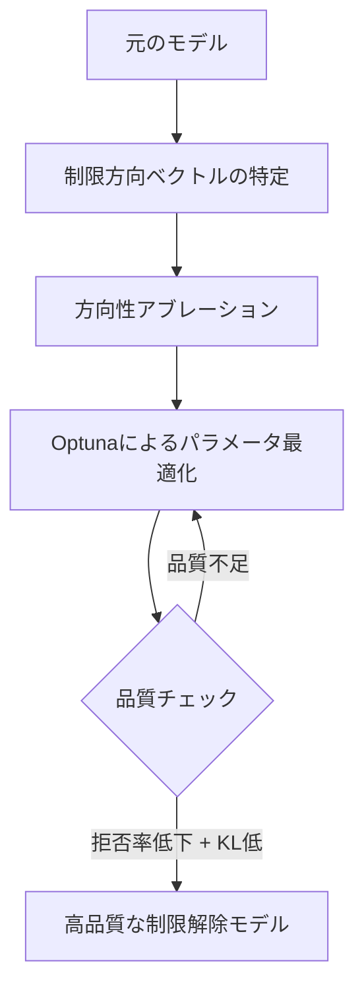
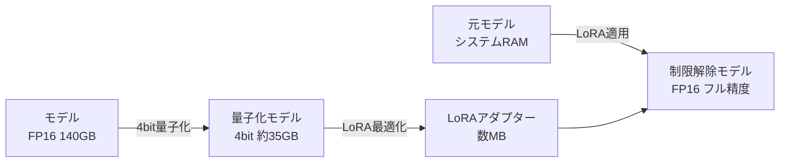
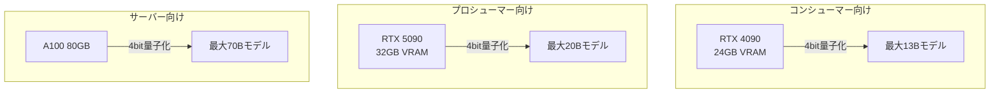

## 概要

ローカルLLMを運用する上で、<strong>VRAM不足</strong>は最大のボトルネックです。大規模モデルのアブリテレーション（制限解除）処理には通常、フルプレシジョンでのモデルロードが必要で、数十GBのVRAMを消費します。

2026年2月、<strong>Heretic 1.2</strong>がリリースされました。Reddit r/LocalLLaMAで268ポイントを獲得し、コミュニティから高い評価を受けています。本バージョンでは、4bit量子化による<strong>VRAM使用量最大70%削減</strong>と、<strong>Magnitude-Preserving Orthogonal Ablation（MPOA）</strong>という新しいアブリテレーション手法が導入されました。

## Hereticとは何か

[Heretic](https://github.com/p-e-w/heretic)は、トランスフォーマーベースの言語モデルからセンサーシップ（安全性アライメント）を自動的に除去するツールです。初回リリースから3ヶ月で、コミュニティによって<strong>1,300以上のモデル</strong>がHereticを使って公開されています。

Hereticの核心技術は以下の2つです：

- <strong>方向性アブレーション（Directional Ablation）</strong>：モデルの特定方向のベクトルを除去することで、制限を解除
- <strong>TPEベースパラメータ最適化</strong>：[Optuna](https://optuna.org/)を活用し、拒否回数とKLダイバージェンスを同時最小化



## VRAM 70%削減：LoRAベース量子化エンジン

### 従来の課題

従来のアブリテレーション処理では、モデル全体をフルプレシジョン（FP16/BF16）でVRAMにロードする必要がありました。例えば、70Bパラメータのモデルでは<strong>約140GBのVRAM</strong>が必要です。

### 新しいアプローチ

Heretic 1.2では、コントリビューターのaccemlccが実装した<strong>LoRAベースのアブリテレーションエンジン</strong>が導入されました。

```yaml
# Heretic設定例
quantization: bnb_4bit    # 4bit量子化を有効化
orthogonalize_direction: true  # MPOAを有効化
row_normalization: full        # 行正規化
```

このアプローチの仕組みは以下の通りです：

1. <strong>4bit量子化ロード</strong>：bitsandbytesを使用してモデルを4bitで読み込み、VRAM使用量を最大70%削減
2. <strong>LoRAアダプター最適化</strong>：PEFTベースで、量子化された状態でアブリテレーションパラメータを最適化
3. <strong>フルプレシジョンエクスポート</strong>：元のモデルをシステムRAMに再ロードし、最適化されたLoRAアダプターを適用



### 実際のVRAM比較

| モデルサイズ | 従来の方式 | Heretic 1.2（4bit） | 削減率 |
|:---:|:---:|:---:|:---:|
| 7B | ~14GB | ~4.2GB | 70% |
| 13B | ~26GB | ~7.8GB | 70% |
| 70B | ~140GB | ~42GB | 70% |

消費者向けGPU（RTX 4090、24GB VRAM）でも<strong>13Bクラスのモデル</strong>を処理できるようになりました。

## MPOA：高品質アブリテレーションの新手法

### Magnitude-Preserving Orthogonal Ablationとは

MPOAは、Jim Laiが開発したアブリテレーション手法で、従来の方法と比較して<strong>モデルの品質劣化を最小限に抑える</strong>ことができます。

従来のアブリテレーションでは、制限方向のベクトルを除去する際に重みの大きさ（ノルム）が変化してしまい、モデルの能力が低下する問題がありました。MPOAは以下のアプローチでこれを解決します：

1. <strong>直交射影</strong>：制限方向に直交する部分空間にベクトルを射影
2. <strong>ノルム保存</strong>：射影後のベクトルのノルムを元の大きさに復元
3. <strong>Optuna最適化</strong>：重みパラメータをOptunaで最適化し、層選択を自動化

### ベンチマーク比較

Hereticの公式例として、gpt-oss-20bモデルでの比較結果があります：

| モデル | UGIスコア | W/10 | NatInt | Writing |
|:---|:---:|:---:|:---:|:---:|
| Heretic版（MPOA） | <strong>39.05</strong> | 勝利 | 勝利 | 勝利 |
| 従来のDerestricted版 | 34.22 | — | — | — |

Heretic版はすべてのカテゴリで従来版を上回り、<strong>UGIスコアで約14%の改善</strong>を達成しています。

### 設定方法

```yaml
# MPOA有効化設定
orthogonalize_direction: true
row_normalization: full
```

たった2行の設定追加で、MPOAの恩恵を受けることができます。

## その他の注目機能

### ビジョン言語モデル（VLM）対応

Heretic 1.2では、コントリビューターのanrpによって<strong>VLMのサポート</strong>が追加されました。テキストデコーダー部分のみをアブリテレートし、画像エンコーダーはそのまま保持されます。

### セッション自動保存・再開

長時間の最適化実行中にクラッシュしても、Hereticは自動的に進捗を保存します。再起動すると中断した箇所から再開できます。Ctrl+Cで手動中断してから後で再開することも可能です。

## 実践ガイド：Heretic 1.2の使い方

### 前提条件

- Python 3.10以上
- CUDA対応GPU（4bit量子化にはNVIDIA GPUが必要）
- 十分なシステムRAM（フルプレシジョンエクスポート用）

### インストールと実行

```bash
# Hereticのインストール
pip install heretic

# 基本的な実行（4bit量子化 + MPOA）
heretic --model meta-llama/Llama-3.1-8B-Instruct \
  --quantization bnb_4bit \
  --orthogonalize-direction true \
  --row-normalization full
```

### 推奨ハードウェア構成



## コミュニティの反応

Reddit r/LocalLLaMAでの投稿は<strong>268ポイント</strong>を獲得し、コミュニティから高い評価を受けています。HuggingFaceでは、Hereticを使用して作成されたモデルが<strong>1,300以上</strong>公開されており、これは全アブリテレーションモデルの3分の1以上を占めています。

特に注目されているポイント：

- <strong>コスト効率</strong>：消費者向けGPUでの大規模モデル処理が可能に
- <strong>品質向上</strong>：MPOAによる従来手法を超える品質
- <strong>使いやすさ</strong>：完全自動化されたワークフロー

## まとめ

Heretic 1.2は、ローカルLLM運用において2つの大きな課題を同時に解決しました：

1. <strong>VRAM使用量の大幅削減</strong>：4bit量子化により、これまで高価なGPUが必要だった処理が消費者向けハードウェアで実行可能に
2. <strong>アブリテレーション品質の向上</strong>：MPOAにより、モデルの能力を維持しながら制限を解除

ローカルLLMの民主化が加速する中、Hereticのようなツールは<strong>誰もが高品質なモデルを利用できる環境</strong>を構築する重要な役割を果たしています。

## 参考資料

- [Heretic GitHub リポジトリ](https://github.com/p-e-w/heretic)
- [Reddit r/LocalLLaMA: Heretic 1.2リリーススレッド](https://www.reddit.com/r/LocalLLaMA/comments/1r4n3as/heretic_12_released_70_lower_vram_usage_with/)
- [Arditi et al. 2024 — Refusal in Language Models Is Mediated by a Single Direction](https://arxiv.org/abs/2406.11717)
- [Jim Lai — Norm-Preserving Biprojected Abliteration](https://huggingface.co/blog/grimjim/norm-preserving-biprojected-abliteration)
- [Heretic HuggingFace Organization](https://huggingface.co/heretic-org)
