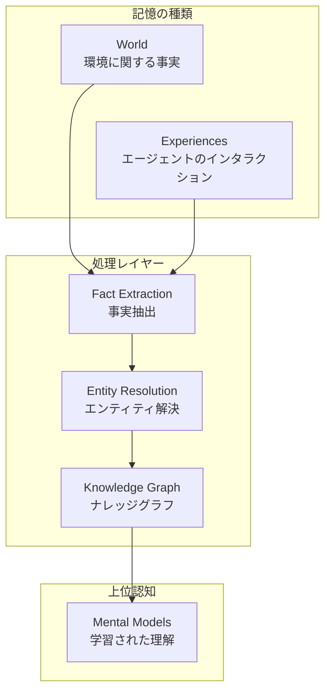
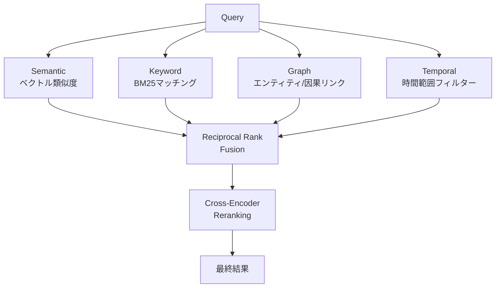
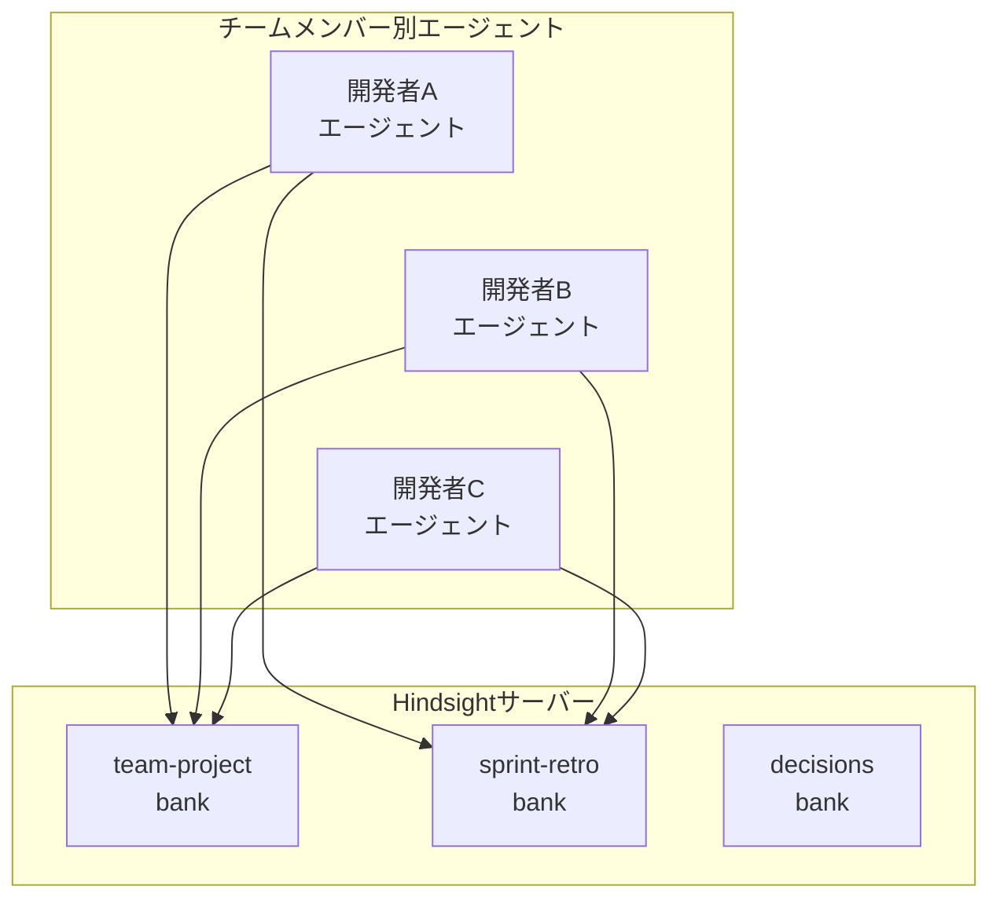

## AIエージェントの記憶問題

AIエージェントをプロダクションにデプロイした経験のあるEngineering Managerなら、一度はこんな経験があるのではないでしょうか。「昨日議論した内容を覚えていますか？」というリクエストに対して、エージェントが何も分からないまま見つめ返してくる状況です。会話が終わるとすべてのコンテキストが消え、次のセッションではゼロからやり直しになります。

RAG（Retrieval-Augmented Generation）や単純なベクトルDBでこの問題を解決しようとする試みは多くありましたが、そのほとんどは「検索」にとどまり、「学習」にまで至っていませんでした。単に過去の会話を検索することと、経験からパターンを抽出してメンタルモデルを形成することは、本質的に異なります。

<strong>Hindsight</strong>は、この問題に正面から挑むオープンソースプロジェクトです。[MCP（Model Context Protocol）](/ja/blog/ja/mcp-server-build-practical-guide-2026)互換でClaude、Cursor、VS Codeなどの主要AIツールと即座に連携でき、LongMemEvalベンチマークで91.4%を達成し、エージェントメモリシステムとして初めて90%の壁を突破しました。

## Hindsightのアーキテクチャ

Hindsightは人間の認知構造にインスパイアされたバイオミメティック（生体模倣）データ構造で記憶を組織化します。



記憶は大きく3つのレイヤーに分かれます：

- <strong>World</strong>：環境に関する事実（「ストーブは熱い」）
- <strong>Experiences</strong>：エージェント自身のインタラクション記録（「ストーブに触ったら熱かった」）
- <strong>Mental Models</strong>：生の記憶をリフレクション（振り返り）して形成された学習済みの理解

既存のRAGシステムとの決定的な違いは、このMental Modelsにあります。単にデータを保存して検索するのではなく、記憶を分析しパターンを形成することで、エージェントが「経験から学ぶ」構造を作り上げています。

## 3つのコアオペレーション

Hindsightのすべての機能は、3つのコアオペレーションで構成されています。

### Retain — 記憶の保存

単なるテキスト保存ではありません。RetainはLLMを活用して、入力されたコンテンツから事実、時間情報、エンティティ、関係を自動的に抽出し正規化します。

```python
from hindsight_client import Hindsight

client = Hindsight(base_url="http://localhost:8888")

# 単純なテキストではなく、構造化された記憶として保存
client.retain(
    bank_id="project-alpha",
    content="김 팀장이 Sprint 23에서 인증 모듈 리팩토링을 완료했다. "
            "기존 세션 기반에서 JWT로 전환했으며, 응답 시간이 40% 개선되었다.",
    context="sprint-retrospective",
    timestamp="2026-03-15T10:00:00Z"
)
```

この1回の呼び出しで、Hindsightは内部的に以下を実行します：

1. エンティティ抽出：「キムチーム長」「Sprint 23」「認証モジュール」
2. 関係マッピング：「キムチーム長 → 完了 → 認証モジュールリファクタリング」
3. 事実の正規化：「セッション → JWT移行」「レスポンスタイム40%改善」
4. 時間インデキシング：2026-03-15に発生したイベントとして記録
5. ベクトルエンベディング生成およびナレッジグラフの更新

### Recall — 記憶の検索

Recallは4つの並列検索戦略を同時に実行します：



```python
# 自然言語クエリで関連する記憶を検索
result = client.recall(
    bank_id="project-alpha",
    query="인증 관련 최근 변경 사항은?",
    max_tokens=4096
)
```

4つの戦略の結果を<strong>Reciprocal Rank Fusion</strong>で統合し、<strong>Cross-Encoder Reranking</strong>で最終順位を決定します。単純なベクトル検索のみを使用するシステムと比較して、精度が大幅に向上するポイントです。

### Reflect — 振り返りと学習

Reflectは、Hindsightを単なるメモリシステムから「[学習するシステム](/ja/blog/ja/hermes-agent-self-evolving-ai-framework)」へと昇格させるコア機能です。

```python
# 既存の記憶を分析して新たなインサイトを導出
insight = client.reflect(
    bank_id="project-alpha",
    query="우리 팀의 스프린트 회고에서 반복되는 패턴이 있나?",
)
```

Reflectは保存された記憶を総合的に分析し：
- 繰り返されるパターンを発見します
- 複数の記憶間の因果関係を推論します
- メンタルモデルを自動的にアップデートします

たとえば、複数のスプリントレトロスペクティブの記憶が蓄積されると、「認証関連の作業は予想より平均1.5倍時間がかかる」というメンタルモデルが自動的に形成されます。

## MCP連携：5分で始める

Hindsightの最大の強みの一つはMCP互換性です。Dockerひとつでスタック全体をローカルで実行できます。

### インストールと実行

```bash
export OPENAI_API_KEY=sk-xxx
docker run --rm -it --pull always \
  -p 8888:8888 -p 9999:9999 \
  -e HINDSIGHT_API_LLM_API_KEY=$OPENAI_API_KEY \
  -v $HOME/.hindsight-docker:/home/hindsight/.pg0 \
  ghcr.io/vectorize-io/hindsight:latest
```

- <strong>ポート8888</strong>：API + MCPエンドポイント
- <strong>ポート9999</strong>：Admin UI（記憶の探索、デバッグ）

### MCPクライアント設定

Claude Desktop、Cursor、VS Codeなどで以下のように設定します：

```json
{
  "mcpServers": {
    "hindsight": {
      "type": "http",
      "url": "http://localhost:8888/mcp/my-project/"
    }
  }
}
```

`my-project`の部分がbank_idとなり、プロジェクトごとに独立したメモリ空間を持つことになります。チームプロジェクトごとに別々のバンクを作成すれば、記憶が混在しません。

### 対応LLMプロバイダー

| プロバイダー | 設定値 | 備考 |
|-----------|--------|------|
| OpenAI | `openai` | デフォルト、gpt-4o-mini推奨 |
| Anthropic | `anthropic` | Claudeモデルを使用 |
| Google | `gemini` | Geminiモデル |
| Groq | `groq` | 高速推論 |
| Ollama | `ollama` | [ローカルモデル](/ja/blog/ja/local-llm-private-mcp-server-gemma4-fastmcp) |
| LM Studio | `lmstudio` | ローカルモデル |

エージェントが使用するLLMとHindsight内部のLLMは独立して設定できます。

## Engineering Manager視点の導入戦略

### ステップ1：個人エージェントから始める

```bash
"url": "http://localhost:8888/mcp/jangwook-dev/"
```

2〜3週間使用しながら以下を観察します：
- 繰り返しの質問が減るかどうか
- プロジェクトコンテキスト切り替え時の適応速度
- メンタルモデルの品質と有用性

### ステップ2：チーム共有メモリの構築



バンクを目的別に分離すると：
- <strong>team-project</strong>：コードベース、アーキテクチャ決定、技術スタック情報
- <strong>sprint-retro</strong>：スプリントレトロスペクティブ、ベロシティ指標、繰り返しの課題
- <strong>decisions</strong>：ADR、技術選択の根拠

### ステップ3：運用モニタリング

Admin UI（ポート9999）を活用してモニタリングします。

## 実践活用シナリオ

### シナリオ1：オンボーディングの加速
新規チームメンバーのエージェントをチームプロジェクトバンクに接続すれば、既存チームのアーキテクチャ決定、コーディングコンベンション、過去のイシュー履歴を即座に活用できます。

### シナリオ2：スプリントレトロスペクティブの自動分析
毎スプリントのレトロスペクティブ内容をretainすれば、reflectを通じた分析が可能になります。

### シナリオ3：技術意思決定の追跡
過去の意思決定の記憶に基づいて、コンテキストのある回答を提供します。

## 既存アプローチとの比較

| 特性 | 単純ベクトルDB | RAG | ナレッジグラフ | Hindsight |
|------|-------------|-----|-----------------|-----------|
| 保存 | エンベディングのみ | ドキュメントチャンキング + エンベディング | エンティティ + 関係 | 事実 + エンティティ + 時系列 + ベクトル |
| 検索 | ベクトル類似度のみ | ベクトル + キーワード | グラフトラバーサル | 4重並列検索 + リランキング |
| 学習 | なし | なし | 限定的 | メンタルモデル自動形成 |
| 時間認識 | なし | 限定的 | 限定的 | ネイティブ時間インデキシング |
| ベンチマーク | - | - | - | LongMemEval 91.4% |

## 注意すべき点

1. <strong>処理遅延</strong>：retain後すぐにrecallすると、処理が完了していない場合があります。
2. <strong>LLMコスト</strong>：内部処理に別途のLLM呼び出しが必要です。
3. <strong>データセキュリティ</strong>：記憶に機密情報が含まれる可能性があります。
4. <strong>メンタルモデルの品質</strong>：自動生成されたメンタルモデルが常に正確とは限りません。

## まとめ

Hindsightは、AIエージェントメモリの分野で意義のある進展を示すプロジェクトです。MITライセンスのオープンソースであり、Dockerひとつで5分以内に始められます。

## 参考資料

- [Hindsight GitHub](https://github.com/vectorize-io/hindsight)
- [Hindsight 公式ドキュメント](https://hindsight.vectorize.io/)
- [Hindsight 研究論文 (arXiv)](https://arxiv.org/abs/2512.12818)
- [MCP Agent Memory ブログポスト](https://hindsight.vectorize.io/blog/2026/03/04/mcp-agent-memory)
