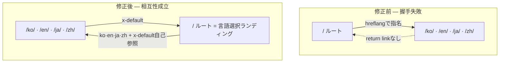

30行のスクリプトを自サイトの`dist/`フォルダに向けた。ブログ記事248本はすべて緑ランプだった。たった1つが赤ランプで、よりによってトップページだった。

```text
[PASS] return-link reciprocity    broken pairs : 0   (1記事の4言語)
...
[FAIL] return-link reciprocity    broken pairs : 4   (サイト全体249ページ)
[FAIL] self-referencing hreflang   missing      : 1
```

hreflangは多言語サイトで「このページの日本語版・英語版はここにある」と検索エンジンへ知らせるタグだ。入れるのは簡単。問題は、これが<strong>双方向の契約</strong>だという点にある。片方だけ手を差し出しても握手は成立せず、Googleはその注釈を丸ごと捨てる。私はこの規則をドキュメントで知っていただけで、本当に自サイトが守れているのか気になって実際に測った。結果が上のとおりだ。順に解いていく。

## hreflangが保証すること、しないこと

まず期待値を下げよう。hreflangは順位を上げない。Google Search Centralのドキュメントは、このタグを「言語や地域に応じて最も適切なバージョンへユーザーを案内する」ツールと説明する。順位ブーストではなく<strong>ルーティングシグナル</strong>だ。

この区別が実務で効く。私は以前「hreflangをきちんと入れれば各言語版がそれぞれの市場で順位が上がるだろう」と漠然と期待していた。間違った期待だった。hreflangがするのはこうだ。日本のユーザーが検索したとき、英語版ではなく日本語版が表示されるよう、すでに順位に乗った結果を正しい言語へ<strong>差し替える</strong>。無かった順位を作るのではない。

逆に間違って入れると損は確実だ。相互リンクが崩れた注釈は無視され、最悪の場合、検索エンジンがどれが正本か迷って見当違いの言語版を出す。だからhreflangは「入れれば得、入れなければ現状維持」ではなく、「正確に入れれば現状維持、間違えれば損」に近い。この非対称を知ると、検証に時間を割くのが惜しくなくなる。

## 双方向（return link）規則 — なぜ片方だけでは駄目か

Googleドキュメントの一文は短く断固としている。「2つのページが互いを指していなければ、タグは無視される（If two pages don't both point to each other, the tags will be ignored）」。

かみ砕くと三つだ。

1. <strong>Return link</strong>: AがBを代替版と指名したら、BもAを指名しなければならない。
2. <strong>Self-reference</strong>: 各ページは自分自身もhreflangリストに入れる。日本語版なら、リストの中に自分（ja）もいなければならない。
3. <strong>絶対URL</strong>: `href`はプロトコルとドメインを含む完全なアドレスであること。

この規則がこれほど厳しい理由は自分なりに腑に落ちた。hreflangは、信頼できない第三者が自分のページを勝手に代替版だと主張するのを防がねばならない。もし片方向で認めれば、どこかのサイトが「私のスペイン語版はあなたの有名な英語ページだ」と宣言してシグナルを汚染できてしまう。両方が互いを指してはじめて認める規則は、いわば相互署名だ。スパム対策の観点ではむしろきれいな設計といえる。

問題は、この規則が人手では守りにくいことだ。言語4つに記事数百本ならクラスターは数百個。1ページでもリストがずれると、そのクラスターだけが静かに無視される。エラーが画面に出るわけでもない。だから私はチェッカーを書いた。

## 自サイトを直接監査した

ビルド成果物（`dist/`）のすべての`index.html`を読んでhreflangリンクを抜き出し、グラフを作ってreturn linkが実在するか確認するスクリプトだ。RSSフィードに付いた`hreflang`はHTMLページではないので除外した。

````javascript
// hreflang-audit.mjs（中核部）
function extractHreflang(html) {
  const out = [];
  const linkRe = /<link\b[^>]*rel=["']alternate["'][^>]*>/gi;
  for (const m of html.match(linkRe) || []) {
    if (/type=["']application\/rss\+xml["']/i.test(m)) continue; // RSS除外
    const lang = (m.match(/hreflang=["']([^"']+)["']/i) || [])[1];
    const href = (m.match(/href=["']([^"']+)["']/i) || [])[1];
    if (lang && href) out.push({ lang, href });
  }
  return out;
}
// 各注釈のtargetが自分を指し返すか？
const target = pages.get(a.href);
if (target && !target.alts.some(t => t.href === url)) brokenReturn++;
````

まず記事1本の4言語版だけを検査した。アクセシビリティ監査を扱った[Lighthouseアクセシビリティの記事](/ja/blog/ja/a11y-lighthouse-audit-fix-2026/)を対象にした。

```text
$ node hreflang-audit.mjs dist a11y-lighthouse-audit-fix-2026
pages with hreflang annotations : 4
----------------------------------------------------
[PASS] return-link reciprocity    broken pairs : 0
[PASS] self-referencing hreflang   missing      : 0
[PASS] x-default present            missing      : 0
[PASS] absolute URLs                relative     : 0
[PASS] language code format         invalid      : 0
```

きれいだ。実際のタグを開くと、4言語が互いを、そして自分自身を正確に指名している。

```html
<!-- /ja/blog/ja/a11y-.../ が出すもの -->
<link rel="canonical" href="https://jangwook.net/ja/blog/ja/a11y-lighthouse-audit-fix-2026/">
<link rel="alternate" hreflang="ko" href="https://jangwook.net/ko/blog/ko/a11y-lighthouse-audit-fix-2026/">
<link rel="alternate" hreflang="en" href="https://jangwook.net/en/blog/en/a11y-lighthouse-audit-fix-2026/">
<link rel="alternate" hreflang="ja" href="https://jangwook.net/ja/blog/ja/a11y-lighthouse-audit-fix-2026/">
<link rel="alternate" hreflang="zh" href="https://jangwook.net/zh/blog/zh/a11y-lighthouse-audit-fix-2026/">
<link rel="alternate" hreflang="x-default" href="https://jangwook.net/en/blog/en/a11y-lighthouse-audit-fix-2026/">
```

ここまでは満足だった。ところがサイト全体に範囲を広げると絵が変わった。

```text
$ node hreflang-audit.mjs dist
pages with hreflang annotations : 249
----------------------------------------------------
[FAIL] return-link reciprocity    broken pairs : 4
[FAIL] self-referencing hreflang   missing      : 1
[PASS] x-default present            missing      : 0
[PASS] absolute URLs                relative     : 0
[PASS] language code format         invalid      : 0

first broken return links:
  https://jangwook.net/
    → https://jangwook.net/ko/ (ko) has NO return link
  https://jangwook.net/
    → https://jangwook.net/en/ (en) has NO return link
  https://jangwook.net/
    → https://jangwook.net/ja/ (ja) has NO return link
  https://jangwook.net/
    → https://jangwook.net/zh/ (zh) has NO return link
```

壊れた4組はすべて一箇所を指していた。言語コードの無い<strong>裸のルート</strong>`https://jangwook.net/`だ。248本の記事は完璧で、トップページ1枚がクラスターを乱していた。

## なぜトップページだけ壊れたか

2つのページの実際のタグを並べると原因がすぐ見える。

```html
<!-- 裸のルート / が出すもの -->
<link rel="canonical" href="https://jangwook.net/">
<link rel="alternate" hreflang="ko" href="https://jangwook.net/ko/">
<link rel="alternate" hreflang="en" href="https://jangwook.net/en/">
<link rel="alternate" hreflang="ja" href="https://jangwook.net/ja/">
<link rel="alternate" hreflang="zh" href="https://jangwook.net/zh/">
<link rel="alternate" hreflang="x-default" href="https://jangwook.net/en/">

<!-- /ja/ ホームが出すもの -->
<link rel="canonical" href="https://jangwook.net/ja/">
<link rel="alternate" hreflang="ko" href="https://jangwook.net/ko/">
<link rel="alternate" hreflang="en" href="https://jangwook.net/en/">
<link rel="alternate" hreflang="ja" href="https://jangwook.net/ja/">
<link rel="alternate" hreflang="zh" href="https://jangwook.net/zh/">
<link rel="alternate" hreflang="x-default" href="https://jangwook.net/en/">
```

裸のルート`/`は自分自身を正本（`canonical`）に宣言しつつ、代替版として`/ko/` `/en/` `/ja/` `/zh/`を指名する。ところが肝心の`/ja/`のリストには`/`が無い。`/ja/`は自分自身と他の3言語しか指名しない。つまりルートは言語ホームへ手を差し出すが、言語ホームの誰一人ルートへ手を差し出さない。握手失敗。おまけにルートは自分のリストに自身（`/`）を入れておらず、self-referenceも無い。チェッカーが拾った「missing self : 1」がこのルートだ。

正直、これはよくある落とし穴だ。多言語サイトで言語コードの無い「中立ルート」は、たいてい言語ホームのどれかへリダイレクトするか、言語選択ページの役割を担う。ところがこのルートが<strong>独立した正本ページのように自分のhreflangハブを別途出すと</strong>、言語ホームですでに完結したクラスターに割り込む異物になる。言語ホームはルートの存在を知らないから、return linkを作る理由がない。

もう一つ。x-defaultが`/en/`を指している。これ自体は間違いではない。Googleはx-defaultが特定の言語版を指してもよいと明記している。ただしx-defaultの狙いは「どの言語にもマッチしないユーザー向けのページ」、つまり言語選択画面や自動リダイレクトホームだ。その役割に最も合うのはむしろ中立ルート`/`だ。今の構造は「中立ルートはあるのにx-defaultは英語を指し、その中立ルートはクラスターで浮いている」という中途半端な状態にある。

この問題を最小再現でもう一度確かめた。ハブAがBを指すがBはAを指さない2ページを作り、チェッカーを走らせた。

```text
===== BROKEN =====
[FAIL] return-link reciprocity    broken pairs : 1
[FAIL] self-referencing hreflang   missing      : 1

===== FIXED（すべて自身＋全バリアントを相互指名） =====
[PASS] return-link reciprocity    broken pairs : 0
[PASS] self-referencing hreflang   missing      : 0
[PASS] x-default present            missing      : 0
```

直す方向は三つのうちどれかだ。(1) ルートを言語ホームへ301リダイレクトしてクラスターから外す、(2) ルートの`canonical`を言語ホームへ譲って重複シグナルを整理する、(3) ルートをx-defaultの本当のターゲットにして、すべての言語ホームがx-defaultでルートを指すようにし相互性を回復する。私は(3)が意味的に最も正直だと思う。ただしこれは生きているサイトのcanonical・リダイレクトを触る変更なので、248個の健全なクラスターに影響が無いかステージングで再検証してから別途ロールアウトするつもりだ。この記事でライブSEOの挙動を思いつきで変えてはいない。チェッカーが回帰テストになってくれるので、直したあと同じスクリプトを再度走らせて緑ランプを確認すればいい。

<strong>2026-07-04 追記</strong>: この修正はデプロイ済みだ。方法(3)のとおりホームクラスターのx-defaultを中立ルート`/`へ変更し、上のチェッカーをビルドパイプラインのpostbuildゲートとして常設化した。再実行の結果は253ページでbroken pairs 0・missing self 0 — 緑ランプである。

修正前後を図で比べると問題が一目で分かる。



## 3つの実装方法 — いつ何を使うか

hreflangを出す方法は三つで、Googleは「3つの方法は同等」と釘を刺す。同等という言葉は、<strong>どれを選んでもよいが混ぜるな</strong>と読むべきだ。1ページについてHTMLタグとサイトマップが違うことを言えば、検証が地獄になるだけだ。

| 方法 | どこに入れる | 強み | 弱み | こういう時 |
|------|-----------|------|------|--------|
| HTML `<link>`タグ | 各ページ`<head>` | 実装・確認が最も簡単。静的ビルドで自動生成 | ページごとにN個のタグ。ページが多いとHTMLが重くなる | 静的ブログ、数百ページ規模 |
| HTTP `Link:`ヘッダー | レスポンスヘッダー | PDF・画像など非HTML文書にも適用可 | サーバー・CDN設定が必要。目視確認が面倒 | 非HTMLリソース、ヘッダー制御が容易な環境 |
| サイトマップ `xhtml:link` | XMLサイトマップ | HTMLを触らない。大規模に有利、一箇所で管理 | サイトマップが肥大化、生成パイプラインが必要 | 数万ページ、マークアップ修正が困難なCMS |

私のブログは静的ビルドなのでHTMLタグ方式が合う。ページ数が数百の今は、タグ方式の「HTMLが重くなる」弱点はまだ負担にならない。もし数万ページに育てば、サイトマップ方式へ移すことを考える。その場合は[LocalBusiness構造化データをサーバーサイドで出した経験](/ja/blog/ja/localbusiness-structured-data-server-side-vs-js-2026/)と同じで、シグナルはビルド時点で決定論的に刻む方が、人が手で管理するよりずっと安全だ。

## よく踏む地雷 — 特に中国語

私のサイトは言語コードは通ったが、規則自体によくある落とし穴がいくつかあるのでチェックリストで残す。

- <strong>地域コードの誤用</strong>: イギリスは`UK`ではなく`GB`だ。`EU`、`UN`もISO 3166-1 Alpha 2ではないので無効。Googleが公式に指摘する代表的なミスだ。
- <strong>言語と地域の混同</strong>: `hreflang="us"`は間違い。`us`は言語ではなく地域だ。`en-US`のように言語を先に書く。
- <strong>中国語サブタグ</strong>: 私のサイトは`zh`（bare）を使う。有効ではあるが簡体字・繁体字を区別できない。本土の読者だけが対象なら`zh`で十分、台湾・香港まで狙うなら`zh-Hans` / `zh-Hant`でスクリプトを明示する方が正確だ。このブログは中国語を後から追加する際に簡体字ひとつで始めたが、今見直すと少なくとも`zh-Hans`と明示すべきだった。これは自分のミスとして記録しておく。
- <strong>相対パス</strong>: `href="/en/..."`は駄目。絶対URLでなければならない。
- <strong>noindexとの同時使用</strong>: hreflang対象が`noindex`だと、シグナル同士が矛盾する。インデックスするなと言いながら代替版へ案内する格好だ。

最後の項目は特に[AIクローラーをrobots.txtで制御した記事](/ja/blog/ja/ai-crawler-control-robots-txt-llms-txt-2026/)とつながる。インデックス・クロール・言語のシグナルはそれぞれ別のファイルやタグに散らばっているが、互いに矛盾するとクローラーは最も保守的に解釈するか、そのまま無視する。シグナルを入れることより、<strong>シグナル同士を衝突させないこと</strong>が実務の半分だ。

## だから開発者がすぐやること

まとめると順序はこうだ。

1. <strong>ビルド成果物を検査する。</strong>ソーステンプレートではなく、実際に出たHTMLを見る。上の30行スクリプトを`dist/`に向ければ、5秒でreturn link・self-reference・絶対URL・コード形式を一度に拾う。
2. <strong>self-referenceを漏らさない。</strong>各ページのhreflangリストに自分自身がいること。これを忘れるのが一番多い。
3. <strong>中立ルートを整理する。</strong>言語コードの無い`/`が独立したcanonicalとhreflangハブを別途出していないか確認する。リダイレクトするか、canonicalを言語ホームへ譲るか、x-defaultのターゲットにして相互性を作る。
4. <strong>1つの方法に統一する。</strong>HTMLタグ・HTTPヘッダー・サイトマップを混ぜない。
5. <strong>チェッカーをCIに掛ける。</strong>ビルド後に自動で走らせ、broken pairが0でなければ失敗させる。私はこのスクリプトをそう使うつもりだ。言語をもう一つ足す日、新しい言語が既存クラスターを静かに壊す事故を防いでくれる。

一つだけ残すならこれだ。hreflangは「入れた」ではなく「ビルド成果物で双方向に噛み合った」を確認して初めて終わる。その確認は目ではなくスクリプトでやる。私ですらドキュメントを全部知っていながら、自分のトップページが壊れているのに気づかなかった。

---

多言語サイトのhreflang・canonical・構造化データがビルド成果物で実際に噛み合って出ているか点検したい、あるいは静的／サーバーサイドレンダリングでこれらのシグナルを決定論的に出す構造を整えたい場合、個人で相談・実装のご依頼を受けています。上のチェッカーのような小さな回帰装置ひとつが、数百ページの静かなミスを防ぎます。連絡はブログプロフィールのお問い合わせ経路からどうぞ。
