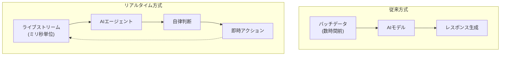
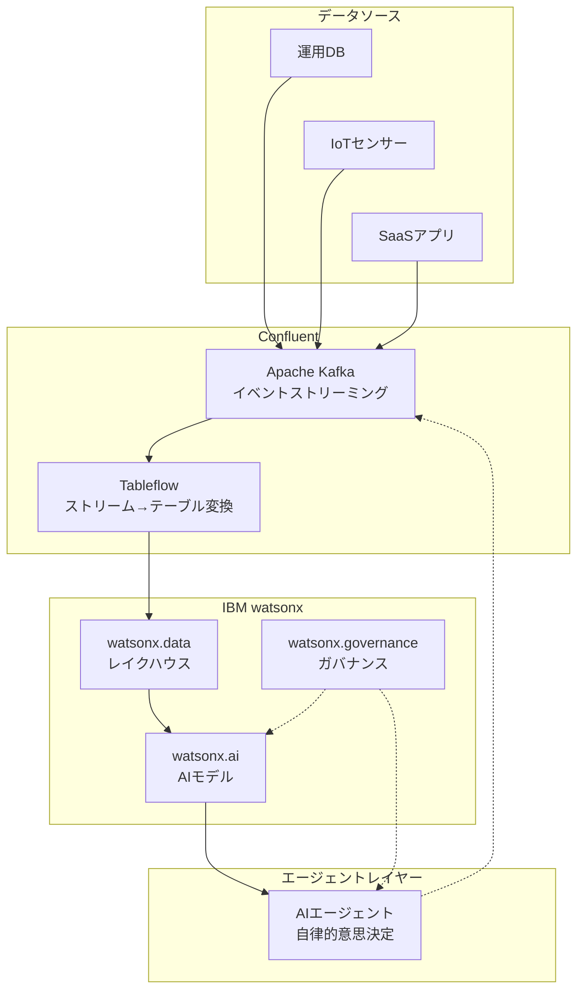
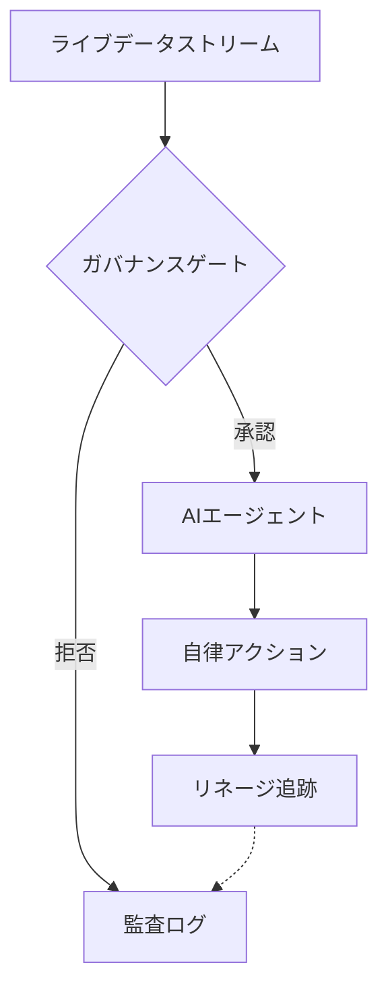

## 概要

2026年3月17日、IBMがデータストリーミングプラットフォーム企業Confluentを<strong>110億ドル（約1兆6,500億円）</strong>で買収完了しました。Fortune 500企業の40%以上が利用するConfluentのApache Kafkaベースプラットフォームが、IBMのwatsonxエコシステムに統合されたことで、<strong>リアルタイムデータストリーミングがエンタープライズAIエージェントの中核インフラ</strong>として確立されました。

今回の買収は単なるM&Aを超え、AI時代のデータアーキテクチャがどの方向に進化しているかを明確に示しています。Engineering ManagerからCTOまで、エンジニアリングリーダーがこの変化をどう読み解くべきかを分析します。

## なぜリアルタイムデータなのか — 「Data Latency Gap」問題

### 従来のAIシステムの限界

ほとんどのエンタープライズAIシステムは<strong>バッチ処理（Batch Processing）</strong>ベースで運用されています。データを収集し、ETL（Extract, Transform, Load）パイプラインで整形した後、モデルに投入する方式です。

```
[運用DB] → [ETLパイプライン] → [データウェアハウス] → [AIモデル]
          数時間〜数日の遅延
```

この構造ではAIモデルが参照するデータは常に<strong>「過去のスナップショット」</strong>です。リアルタイムに変化する市場状況、顧客行動、システム状態を反映できません。

### AIエージェントが求めるもの

2026年のAIエージェントは、単に質問に答えるチャットボットではありません。<strong>自律的に判断し、行動し、結果を確認する能動的なシステム</strong>です。[LangGraph、CrewAI、Daprなどのエージェントフレームワーク](/ja/blog/ja/ai-agent-framework-comparison-2026-langgraph-crewai-dapr-production)がこのようなエージェントの実装基盤となり、「昨日のデータ」に基づいて意思決定を行えばその結果は信頼できません。



IBMがConfluentを買収した核心的な理由が、まさにこの<strong>「Data Latency Gap」</strong>を解消するためです。

## IBM + Confluent 統合アーキテクチャ

### 主要な統合ポイント

IBMのRob Thomas SVPは今回の買収を<strong>「Agentic AIパズルの最後のピース」</strong>と表現しました。具体的な統合構造は以下の通りです。



### ゼロコピーデータシェアリング

最も注目すべき技術は<strong>ConfluentのTableflowとwatsonx.dataの統合</strong>です。

従来はKafkaのストリーミングデータをAIモデルで使用するには、別途のETLプロセスを経る必要がありました。Tableflowを活用すれば、<strong>Kafkaストリームをまるでデータベーステーブルのように直接クエリ</strong>できます。

```python
# 従来: ETLパイプラインが必要
raw_data = kafka_consumer.poll()
transformed = etl_pipeline.transform(raw_data)
warehouse.insert(transformed)
result = ai_model.predict(warehouse.query("SELECT * FROM orders"))

# Tableflow統合: ゼロコピー直接クエリ
result = ai_model.predict(
    watsonx_data.query("SELECT * FROM kafka_stream.orders")
)
```

この方式は<strong>ETLコストを排除</strong>し、データ遅延をミリ秒単位に短縮し、AIエージェントが常に最新データに基づいて行動できるようにします。

## CTO/VPoE視点の戦略的示唆

### 1. 「Live Agentic AI」パラダイムの台頭

今回の買収は業界全体の方向性を示しています。AIエージェントが静的データではなく<strong>ライブイベントストリーム</strong>に基づいて動作する「Live Agentic AI」パラダイムが本格化しています。

<strong>実務への影響:</strong>
- 既存のバッチベースMLパイプラインをストリーミングアーキテクチャへの転換検討が必要
- データエンジニアリングチームにKafka/イベントストリーミングのケイパビリティ確保が必要
- AIエージェントの意思決定品質がデータ鮮度（Data Freshness）に直結

### 2. ガバナンスとリネージの重要性

リアルタイムデータがAIエージェントの意思決定に直接影響を与える場合、<strong>[データガバナンス](/ja/blog/ja/nist-ai-agent-security-standards)</strong>の重要性が急激に高まります。



<strong>チェックポイント:</strong>
- データリネージ（lineage）追跡システムの構築
- AIエージェントの意思決定根拠データを監査可能な状態で保存
- ポリシーベースアクセスコントロール（Policy-Based Access Control）の適用

### 3. ベンダーロックイン vs オープンソース戦略

IBMの統合プラットフォームは強力ですが、<strong>ベンダーロックインのリスク</strong>を伴います。CTOとして検討すべき代替戦略は以下の通りです。

| アプローチ | メリット | デメリット |
|-----------|------|------|
| IBMフルスタック（Confluent + watsonx） | 統合管理、ガバナンス一体型 | 高コスト、ベンダーロックイン |
| OSS構成（Kafka + 自社AI） | 柔軟性、コスト削減 | 統合の複雑さ、ガバナンス自前構築が必要 |
| ハイブリッド（Confluent Cloud + マルチAI） | データレイヤー統一、AI柔軟性 | 複雑なアーキテクチャ管理 |

### 4. 組織ケイパビリティの転換

今回の変化は技術だけの問題ではありません。<strong>組織構造とケイパビリティ</strong>の転換も必要です。

<strong>データエンジニアリングチームの役割変化:</strong>
- バッチETL運用 → イベントストリーミングアーキテクチャ設計
- データウェアハウス管理 → リアルタイムデータパイプライン運用
- 静的レポーティング → AIエージェント向けデータフィード最適化

<strong>AI/MLエンジニアの役割拡大:</strong>
- モデル学習/デプロイ → エージェントオーケストレーション
- オフライン評価 → リアルタイムモニタリングおよびフィードバックループ設計

## 実務適用: 最初の一歩

IBM-Confluent規模のインフラがなくても、リアルタイムデータ + AIエージェントパターンは小規模でも適用可能です。

### 最小構成の例

```yaml
# docker-compose.yml（最小リアルタイムAIエージェントスタック）
services:
  kafka:
    image: confluentinc/cp-kafka:latest
    ports:
      - "9092:9092"

  agent-worker:
    build: ./agent
    environment:
      - KAFKA_BOOTSTRAP_SERVERS=kafka:9092
      - LLM_API_KEY=${LLM_API_KEY}
    depends_on:
      - kafka

  monitoring:
    image: grafana/grafana:latest
    ports:
      - "3000:3000"
```

### イベントドリブンAIエージェントパターン

```python
from confluent_kafka import Consumer
import anthropic

client = anthropic.Anthropic()
consumer = Consumer({
    'bootstrap.servers': 'localhost:9092',
    'group.id': 'ai-agent-group',
    'auto.offset.reset': 'latest'
})
consumer.subscribe(['business-events'])

while True:
    msg = consumer.poll(1.0)
    if msg is None:
        continue

    event = json.loads(msg.value())

    # AIエージェントがリアルタイムイベントに基づいて判断
    response = client.messages.create(
        model="claude-sonnet-4-6",
        max_tokens=1024,
        messages=[{
            "role": "user",
            "content": f"次のビジネスイベントを分析し、対応策を提案してください: {event}"
        }]
    )

    # エージェントの判断結果を再びイベントとして発行
    producer.produce(
        'agent-decisions',
        json.dumps({"event": event, "decision": response.content})
    )
```

## まとめ

IBMのConfluent買収は、<strong>「AIエージェント時代のデータインフラはリアルタイムでなければならない」</strong>というメッセージを明確に伝えています。110億ドルという金額は、リアルタイムデータストリーミングが単なる技術トレンドではなく、<strong>エンタープライズAIの基盤インフラ</strong>であることを証明しています。[Deloitteの2026 Agentic AI分析](/ja/blog/ja/deloitte-agentic-ai-operations-2026)でも、リアルタイムデータ連携がエージェント運用の最重要要素として挙げられています。

エンジニアリングリーダーとして今すぐ始められるアクション:

1. <strong>現在のデータアーキテクチャの遅延時間の監査</strong> — AIエージェントが参照するデータがどれほど「新鮮」かを測定
2. <strong>イベントストリーミングPoCの実施</strong> — 最も時間に敏感なワークフローにKafkaベースストリーミングのパイロットを適用
3. <strong>ガバナンスフレームワークの設計</strong> — リアルタイムデータがAIの意思決定に投入される前にポリシーおよび監査体制を整備
4. <strong>チームケイパビリティのロードマップ策定</strong> — データエンジニアリング + AIエンジニアリングのクロスファンクショナルなスキル開発計画

バッチからストリーミングへ、チャットボットからエージェントへ — データとAIの関係が根本的に再定義されています。

## 参考資料

- [IBM Completes Acquisition of Confluent — IBM Newsroom](https://newsroom.ibm.com/2026-03-17-ibm-completes-acquisition-of-confluent,-making-real-time-data-the-engine-of-enterprise-ai-and-agents)
- [IBM Solidifies AI Infrastructure Dominance with $11 Billion Confluent Acquisition](https://www.financialcontent.com/article/marketminute-2026-3-19-ibm-solidifies-ai-infrastructure-dominance-with-11-billion-confluent-acquisition)
- [IBM closes $11B Confluent deal for AI data](https://www.stocktitan.net/news/IBM/ibm-completes-acquisition-of-confluent-making-real-time-data-the-lbuwdbharsqe.html)
- [Deloitte Agentic AI Strategy](https://www.deloitte.com/us/en/insights/topics/technology-management/tech-trends/2026/agentic-ai-strategy.html)
