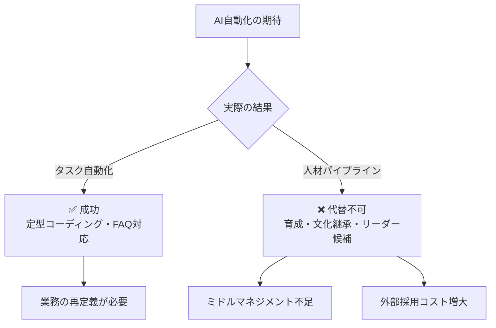
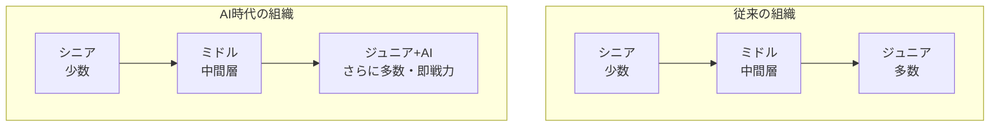
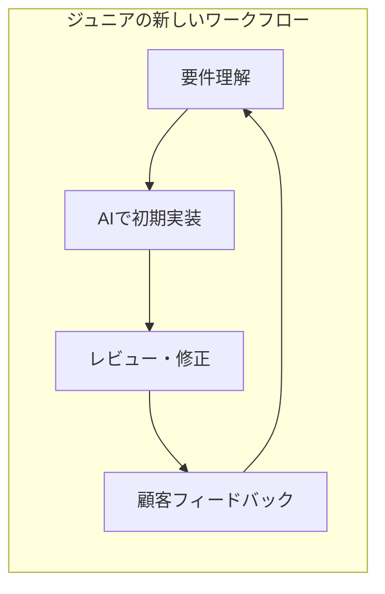

## はじめに

「AIがエントリーレベルの仕事を奪う」——この数年、テック業界で繰り返されてきた予言が、いま大きな転換点を迎えています。

2026年2月、<strong>IBMのCHRO（最高人事責任者）Nickle LaMoreaux氏</strong>が衝撃的な発表を行いました。IBMは<strong>エントリーレベルの採用を3倍に拡大する</strong>というのです。しかも、「AIができると言われているソフトウェア開発者などの職種」においてです。

[Fortune の報道](https://fortune.com/2026/02/13/tech-giant-ibm-tripling-gen-z-entry-level-hiring-according-to-chro-rewriting-jobs-ai-era/)によれば、IBMだけでなくDropboxやCognizantも同様の動きを見せています。

エンジニアリングマネージャー（EM）として、この動向は非常に示唆に富んでいます。AI置換の「期待」と「現実」のギャップ、そしてそこから見える組織設計の本質について考察していきます。

## AI置換の現実 vs 期待

### 期待されていたシナリオ

2023〜2025年にかけて、多くの企業幹部が次のようなビジョンを語りました：

- エントリーレベルのコーディング作業はAIで自動化できる
- ジュニアエンジニアの採用を減らし、シニア中心の少数精鋭チームへ移行
- Korn Ferryの調査では、<strong>37%の組織がエントリーレベル職をAIで代替する計画</strong>を持っていた

### IBMが直面した現実

しかしIBMが実際に経験したのは、異なる現実でした：

- エントリーレベルの「タスク」は自動化できても、「人材育成パイプライン」は代替できない
- ジュニア人材を削減すると、3〜5年後に<strong>ミドルマネジメント層の深刻な不足</strong>が発生する
- 外部からの中途採用は高コストで、社内文化への適応にも時間がかかる

LaMoreaux氏はこう述べています：

> 「3〜5年後に最も成功する企業は、この環境でエントリーレベル採用を倍増させた企業です」

### EMとしての教訓

AIは「タスクの自動化」には優れていますが、「組織の持続可能性」は別の問題です。チームを長期的に維持するには、育成パイプラインが不可欠なのです。

## 大企業の人員計画：IBMの戦略転換

### 「削減」から「再定義」へ

IBMの興味深い点は、単にジュニアを増やすのではなく、<strong>役割そのものを再定義している</strong>ことです：

| 従来の役割 | AI時代の新しい役割 |
|---|---|
| ソフトウェアエンジニア：定型コーディング中心 | ソフトウェアエンジニア：顧客対応・AI活用設計 |
| HR担当：質問への直接回答 | HR担当：チャットボット介入・例外処理 |
| ジュニア：先輩の指示でタスク実行 | ジュニア：AIツール活用で即戦力化 |

### Dropboxの見解

DropboxのCPO（最高人事責任者）Melanie Rosenwasser氏は、Gen Zの AI スキルについて印象的なコメントを残しています：

> 「彼らはツール・ド・フランスを走っているのに、私たちはまだ補助輪付きです。それくらい、彼らは私たちを周回しています」

DropboxはインターンシップとNew Gradプログラムを<strong>25%拡大</strong>する予定です。

### Cognizantの「逆ピラミッド」構想

CognizantのCEO Ravi Kumar S氏も、組織構造の変化を予見しています：

> 「従来のピラミッド構造はより広く、より短くなる。そして専門性への到達も速くなる」

## 組織設計論：EMが今考えるべきこと

### 1. 人材パイプラインは「インフラ」である

道路や水道と同じように、人材パイプラインは短期的なROIでは測れないインフラです。IBMのケースは、<strong>パイプラインを止めた場合のコスト</strong>が、<strong>維持するコスト</strong>をはるかに上回ることを示しています。

EMとして、四半期のヘッドカウント最適化だけでなく、3〜5年スパンの人材計画を経営層に提案することが重要です。

### 2. ジュニアの役割を「再発明」する

AIがジュニアの従来タスクを代替するなら、ジュニアの役割を再定義する必要があります：

- <strong>AIオーケストレーター</strong>：AIツールを組み合わせて問題を解決する
- <strong>ドメインブリッジ</strong>：技術と顧客の間の橋渡し役
- <strong>品質ゲートキーパー</strong>：AI生成コードのレビューとテスト

### 3. 「AI + 人間」のハイブリッド組織を設計する

従来、ジュニアが1週間かかっていた実装が、AIの支援で1〜2日になる。しかし、その分<strong>顧客対応やドメイン理解に時間を割ける</strong>。これこそがIBMが目指す「より耐久性のあるスキル」の構築です。

### 4. 採用戦略の見直し

Korn Ferryの調査では37%の企業がジュニア職をAIで代替する計画でしたが、IBMの動きは逆方向です。EMとして考慮すべきポイント：

- AI リテラシーの高い新卒の方が、既存社員より早くAIツールを活用できる
- LinkedInのデータでは、<strong>AI リテラシーが米国で最も急成長しているスキル</strong>
- 「AIを使いこなせるジュニア」は、「AIを使えないシニア」より生産性が高い可能性がある

## まとめ：AIは人材の「代替」ではなく「増幅器」

IBMの決断は、テック業界に重要なメッセージを送っています：

1. <strong>AIはタスクを自動化するが、人材育成は自動化できない</strong>
2. <strong>エントリーレベル採用の削減は、中長期的に大きなリスクをもたらす</strong>
3. <strong>役割の「再定義」こそが、AI時代の組織戦略の核心</strong>

Cognizant CEOの言葉が、この変化の本質を見事に表現しています：

> 「AIは人間の可能性の増幅器であり、代替戦略ではない」

EMとして、私たちはAIツールの導入だけでなく、<strong>組織設計そのものを再考する時期</strong>に来ています。ジュニアを切り捨てるのではなく、AIと共に成長できる新しい役割と環境を設計すること——それが、3〜5年後に勝ち残る組織の条件です。

## 参考資料

- [Fortune: IBM is tripling Gen Z entry-level hiring](https://fortune.com/2026/02/13/tech-giant-ibm-tripling-gen-z-entry-level-hiring-according-to-chro-rewriting-jobs-ai-era/)
- [Korn Ferry: Companies plan to replace entry roles with AI](https://www.hrdive.com/news/companies-plan-to-replace-entry-roles-ai/804870/)
- [LinkedIn: AI literacy is fastest-growing skill](https://www.linkedin.com/pulse/linkedin-skills-rise-2025-15-fastest-growing-us-linkedin-news-hy0le/)
