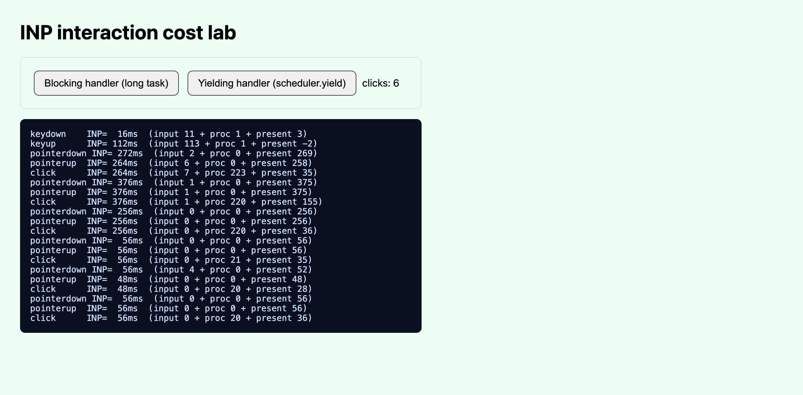

まずログを一行。

```text
click   INP= 264ms  (input 7 + proc 223 + present 35)
```

ボタンを1回押しただけで、画面が描き直されるまで264ミリ秒かかった。指が触れてから目に変化が出るまで、4分の1秒以上なにも起きなかったということだ。同じボタンのコードを手直しして測り直すと56msまで落ちた。CPUがこなした仕事の総量は変わっていない。変えたのは「いつ手を止めて画面を描くか」だけ。

LCPとCLSはみんな気にする。読み込みが速いか、レイアウトがずれないかは目につくから。ところが読み込みが終わった後、ボタンを押したときの反応の速さ、つまりINPは後回しのチームが多い。私もそうだった。今回は口で言わず、ブラウザが吐く数字を受け取って測った。以下のログと表は、すべてChrome 150でEvent Timing APIから取った実測値だ。

## INPが測るもの:クリック1回を三つに刻む

INPはInteraction to Next Paint、「操作から次のペイントまで」。ユーザーが何かを押した瞬間から、その結果が画面に描かれるフレームまでの遅延を測る。肝心なのは、一つの操作が一枚岩の数字ではなく三区間に分かれる点だ。[web.devの公式ドキュメント](https://web.dev/articles/inp)が定義する三区間はこうなっている。

1. <strong>入力遅延(input delay)</strong>:ユーザーが押した瞬間から、それに紐づくコールバックが初めて走るまでの時間。ここでメインスレッドが別の処理でふさがっていると、この値がふくらむ。
2. <strong>処理時間(processing duration)</strong>:イベントのコールバックが実際に走る時間。あなたが付けたクリックハンドラが重ければ、ここが伸びる。
3. <strong>表示遅延(presentation delay)</strong>:コールバックが終わってから、次のフレームが実際に画面へ描かれるまでの時間。

三区間の合計がその操作の遅延で、INPは訪問中に起きた操作のうち(ほぼ)最も遅い値を代表として報告する。ここが旧指標のFIDと決定的に違う。FIDは最初の操作の「入力遅延」しか測らなかった。ページで初めて押したボタン一つの反応を見ていただけだ。INPはクリック・タップ・キー入力すべてを観測し、その中で最悪に近いものを代表にする。第一印象ではなく、体感の全体を見る。

しきい値は[web.dev基準](https://web.dev/articles/inp)で、フィールドデータの75パーセンタイルでこう分かれる。

| INP (p75) | 判定 | 体感 |
|---|---|---|
| 200ms以下 | 良好(good) | 押したらすぐ返る |
| 200ms超〜500ms以下 | 改善が必要 | わずかに引っかかる |
| 500ms超 | 不良(poor) | 効いてないかと思って押し直す |

日付も押さえておく。INPは2024年3月12日にCore Web Vitalsの正式指標となってFIDを置き換え([web.devの告知](https://web.dev/blog/inp-cwv-march-12))、FIDは同年9月9日付でChromeのツールから外された。つまり今「応答性」を代表するCWV指標はINP一つだ。

## なぜ今、Web開発者がINPを自分で測るべきか

INPを気にする理由は二つ。一つは人、もう一つは検索だ。

人のほうは明快だ。読み込みがどれだけ速くても、ボタンを押すたびに300msずつ固まるページは「遅いサイト」として記憶される。しかもこれはアクセシビリティの問題と重なる。反応がないと、認知負荷のある利用者や手の震えがある利用者は同じボタンを繰り返し押し、その間にフォームが二重送信されることもある。応答速度を、[Lighthouseでアクセシビリティを実測して直した話](/ja/blog/ja/a11y-lighthouse-audit-fix-2026)と同じ筋で見るべき理由だ。

検索のほうは正直に言う。Core Web VitalsはGoogleのページエクスペリエンス信号の一部で、INPもその中にある。ただしGoogleはこれを「同程度に関連性の高いページ同士を分ける要素」くらいに説明していて、関連性を覆す決め手とは言っていない。<strong>INPを200ms未満に下げたから順位が上がる、という保証はない。</strong>これは私の意見ではなく公式の立場がそうだ。それでも測って直す価値があるのは、同じ労力が検索信号と実際の体感を同時に動かすからだ。片方だけ見ても割に合う。

ここで一つ性質を覚えておきたい。INPは根本的にフィールド(field)指標だ。実ユーザーのChromeで集めたデータ(CrUX)で判定される。ラボ(lab)ツールでも推定はできるが、その値は「あなたがどの操作を押したか」に完全に依存する。だから今回の実験も「何を押したか」をはっきり制御し、その条件で出た数字だけで語る。実際の訪問者の遅い端末までは肩代わりできない、という意味だ。この限界は後でまた触れる。この性質は[LCPを実測した記事](/ja/blog/ja/lcp-image-preload-scanner-fetchpriority-2026)の「読み込み完了の速さ」と対になる。LCPが前を、INPが後ろを担う。同じCore Web Vitalsの束では、[画面のずれ(CLS)を実測して抑えた記録](/ja/blog/ja/cls-layout-shift-reserve-space-measure-2026)や[レンダーコストをCSS一行で削ったcontent-visibilityの実験](/ja/blog/ja/content-visibility-auto-render-cost-measure-2026)も同じ姿勢で扱った。ただしフィールド指標は、測る側のコードが間違っていると黙って嘘をつく。[prerenderを入れたらLCPが6.2秒になった実測](/ja/blog/ja/prerender-activationstart-cwv-measurement-2026)がその例だ。

## サンドボックス:同じ処理を、二つのやり方で

実験はシンプルに組んだ。ボタンを二つ置いた静的HTMLページが一つ。どちらもきっちり220ms分の計算をする。違いはその220msの使い方だけだ。

一つ目のボタンは一気に回す。クリックハンドラの中で220msのあいだメインスレッドを握って放さない。実務でよくあるパターンだ。クリック1回で一覧を並べ替え、ローカルストレージをなめ、チャートを描き直すのを、一つの関数で全部やってしまうケース。

```javascript
function busy(ms) {
  const end = performance.now() + ms;
  while (performance.now() < end) { /* メインスレッド占有 */ }
}

document.getElementById('blocking').addEventListener('click', () => {
  busy(220);                        // ひと塊で220ms
  document.body.style.background = '#fff7ed';
});
```

二つ目のボタンは同じ220msを20msの11片に刻み、片と片の間ごとにメインスレッドをブラウザへ返す。

```javascript
const yield_ = () =>
  ('scheduler' in window && 'yield' in scheduler)
    ? scheduler.yield()                       // 対応ブラウザ:優先度つきの再開
    : new Promise(r => setTimeout(r, 0));      // 非対応:setTimeoutフォールバック

document.getElementById('yielding').addEventListener('click', async () => {
  for (let i = 0; i < 11; i++) {
    busy(20);
    await yield_();                            // 片ごとに譲る
  }
  document.body.style.background = '#ecfdf5';
});
```

測定はブラウザに任せた。フィールドでINPを集めるのと同じ道具、Event Timing APIだ。`PerformanceObserver`で`event`型を観測すると、実ユーザーの操作には`interactionId`が付いて渡ってくる。ここから三区間を自分で計算できる。

```javascript
new PerformanceObserver((list) => {
  for (const e of list.getEntries()) {
    if (!e.interactionId) continue;                 // 本物の操作だけ
    const inputDelay    = e.processingStart - e.startTime;
    const processing    = e.processingEnd   - e.processingStart;
    const presentation  = (e.startTime + e.duration) - e.processingEnd;
    console.log(e.name, Math.round(e.duration), inputDelay, processing, presentation);
  }
}).observe({ type: 'event', durationThreshold: 16, buffered: true });
```

このページをChrome 150で開き、各ボタンを三回ずつ実際に押した。自動化スクリプトの偽クリックは`interactionId`が付かず、この実験には拾われない。だから信頼された(trusted)本物のクリックだけで押した。

## ログの読み方



上はページにそのまま出た実測ログだ。一気に回すボタン(上の三組)と刻むボタン(下の三組)がはっきり分かれる。代表値を表にするとこうなる。

| やり方 | 代表INP | 入力遅延 | 処理 | 表示遅延 | 判定 |
|---|---|---|---|---|---|
| 一気に220msハンドラ | 264ms | 7 | 223 | 35 | 改善が必要 |
| 一気に220msハンドラ(最悪) | 376ms | 1 | 220 | 155 | 改善が必要 |
| scheduler.yieldで刻む | 56ms | 0 | 21 | 35 | 良好 |
| scheduler.yieldで刻む | 48ms | 0 | 20 | 28 | 良好 |

一気に回すほうは`proc`(処理時間)が220ms台でまるごと計上された。クリックハンドラが終わるまで、ブラウザがフレームを描けなかったわけだ。三回とも200msを超え「改善が必要」に落ちた。

刻むほうは一つのイベントに計上された処理時間が20ms程度。まだ220ms分の計算を全部こなしているのに、最初の片が終わってブラウザに譲った瞬間、画面を描く隙が生まれ、操作は56msで片づいた。同じ処理、4.7倍速い応答。CPUが怠けたのではなく、画面を描く機会を奪わなかっただけだ。

ログにはもう一つ面白い点がある。一つのクリックは`pointerdown`・`pointerup`・`click`の三イベントが同じ`interactionId`で束ねられる。一気に回すボタンでは`pointerup`が処理時間0なのに表示遅延が258msで計上された。計算は`click`ハンドラがやったのに、それがメインスレッドを握ったせいで`pointerup`の次フレームも一緒にずれ込んだのだ。INPはこう束ねられたイベントのうち最も長い一つをその操作の代表にする。だから「ハンドラ自体は速いのになぜINPが高い?」という状況が起きる。答えはたいてい、近くでメインスレッドを握った別の処理だ。

## 実務でINPを削る、よくある犯人

私のサンドボックスは220msのループをわざと仕込んだので、原因は明白だった。実際のサイトではこの220msが一か所ではなく複数の破片に散らばっていて、見つけにくい。測りながら、そして他人のページをのぞきながら繰り返し出くわした犯人を並べておく。

<strong>一つ目、ハイドレーションと再レンダー。</strong>ReactやVueで作ったページは、読み込み直後にJavaScriptがDOMへイベントを付け、状態を合わせるハイドレーションを行う。これが重いと、その間にユーザーが押したクリックはハイドレーションが終わるまで待たされる。入力遅延がまるごとふくらむ典型だ。そこにクリック一つでコンポーネントツリーの半分を描き直す再レンダーが乗れば、処理時間も一緒に膨らむ。「速いフレームワーク」という言葉に油断してはいけない。

<strong>二つ目、サードパーティのタグ。</strong>分析スクリプト、広告、チャットウィジェット、ヒートマップツール。たいてい他人のコードで刻めず、好きなタイミングでメインスレッドを使う。よりによってその瞬間にユーザーがボタンを押すと、入力遅延が跳ねる。自分のコードがどれだけきれいでもINPが悪く出る、よくある理由だ。これは[JSで後からコンテンツを差し込むCSRの癖](/ja/blog/ja/ai-crawlers-dont-render-javascript-csr-2026)が、クローラーには空ページを、ユーザーには遅い応答を作るのと同じ根だ。後でメインスレッドでやる処理には、いつも代償がある。

<strong>三つ目、イベント委譲の裏にある重い共通ハンドラ。</strong>ドキュメント最上部にリスナーを一つ付けて全クリックを受ける形は楽だが、そのハンドラが毎クリック重い分岐や計算をすると、クリック全部が遅くなる。

<strong>四つ目、大きすぎるDOM。</strong>ノードが数万あるページは、クリック一回で起きるスタイル再計算とレイアウトのコストがそれだけ大きい。これは表示遅延として出やすい。コールバックはすぐ終わったのに、ブラウザがそのフレームを描くのに難儀している状態だ。無限スクロールのリストや巨大なテーブルを使うなら、仮想化(virtualization)で実際に描くノード数を減らすことを先に検討する。

肝心なのは、INPが悪いからといってすぐ「自分のクリックハンドラが重い」と決めつけないことだ。ログで見たとおり、計算は別の場所で起き、遅延は無関係なイベントに計上されうる。三区間のどこが大きいかをまず見て、それから処方する。目で確かめず当てずっぽうで手を付けると、無事なハンドラばかり磨いて、本当のボトルネックであるサードパーティのタグはそのまま、という骨折り損になる。計測が先、修正はその後だ。

## scheduler.yieldで長いタスクを刻む

`scheduler.yield()`は名前のとおりメインスレッドをブラウザへ譲る。ブラウザにたまった描画や待機中の入力を処理する隙を与えたあと、元の関数のその場所から実行を続ける。50msを超える処理は[web.devの定義上](https://web.dev/articles/optimize-long-tasks)長いタスク(long task)で、長いタスクはその間ずっと入力を受け取れない。だから長いタスクを刻むと、入力遅延と表示遅延がそろって減る。

`setTimeout(fn, 0)`でも譲れる。ただ違いがある。`scheduler.yield()`で渡した残りの処理は、新しいタスクより少し高い優先度のキューに入り、途中で割り込んだ無関係な処理に押しのけられずに続く。`setTimeout`はその保証がなく、譲った隙に別のタイマーが先に割り込みうる。

限界も正直に。`scheduler.yield()`はまだ[Baselineではない](https://developer.mozilla.org/en-US/docs/Web/API/Scheduler/yield)。広く使われるブラウザ全部で動くわけではない、という意味だ。だから上のコードのように、プログレッシブエンハンスメントで包むのが正しい。対応すれば優先度つきの再開を使い、なければ`setTimeout`フォールバックでも最低限「譲る」効果は得られる。非対応ブラウザでアプリが壊れないよう、機能検出を必ず前に置く。

もう一つ。刻むのが常に正解ではない。本当に重い計算なら、そもそもメインスレッドから追い出すほうがいい。Web Workerへ移す、結果を先に計算しておく、いっそその時点でその処理をやらない、を先に検討する。`scheduler.yield()`は「メインスレッドでどうしてもやる処理を細かく割って応答性を守る」道具であって、重い処理を軽くする魔法ではない。

## すぐ使えるチェックリスト

今回測って整理した、今日すぐ手を付けられる順番だ。

- <strong>まずフィールドから見る。</strong>Search ConsoleのCWVレポートやCrUXで実際のINP p75を確認する。ラボの数字から始めると「自分の速いノートPCでは平気なのになぜフィールドは悪い」にはまる。
- <strong>遅い操作を特定する。</strong>DevToolsのPerformanceパネルで問題の操作を録画するか、上のようにEvent Timing APIを本番に付けて、`interactionId`を持つイベントの三区間をログする。入力遅延が大きいのか、処理が大きいのか、表示が大きいのかで処方が変わる。
- <strong>入力遅延が大きいなら</strong>、その瞬間にメインスレッドを握る別の処理(重い初期化、サードパーティスクリプト、タイマー)を見つけて後ろへずらすか刻む。
- <strong>処理時間が大きいなら</strong>、ハンドラ自体が重い。長いタスクを`scheduler.yield()`で割り、急がない部分(ロギング、分析送信)は操作の後へ回す。
- <strong>表示遅延が大きいなら</strong>、コールバックでレイアウトを揺らしたりDOMを触りすぎていないか見る。1フレームで描くものが多すぎると表示がずれ込む。
- <strong>避けること</strong>:クリック1回ですべてを同期処理する、操作直後に即座に重い再描画をかける、機能検出なしで`scheduler.yield()`を呼ぶ。

## 正直な限界

この実験はChrome 150、デスクトップ、速い端末で出たラボ測定だ。フィールドのINPは低スペックのAndroidまで含めて、はるかに広く散らばる。だからここの数字(264ms→56ms)は「刻めば応答が速くなる」という方向とその原理を示すには十分でも、あなたのサイトのフィールドINPを予測する値ではない。そして前述のとおり、INPを良好にしたから検索順位が上がる保証はない。Core Web Vitalsが関連性に勝ったことはない。この二つを差し引いて残る本当の得は一つ。あなたのサイトを実際に使う人がボタンを押したとき、264msではなく56msで画面が返ってくること。それだけで、測る価値は十分ある。

---

構造化データをサーバーサイドで確実に出す、あるいは既存サイトのCore Web Vitalsとアクセシビリティを実測で点検したい、という相談は個人で受けている。こうした「測って直す」作業が必要なら、プロフィールの問い合わせ経路から連絡してほしい。
