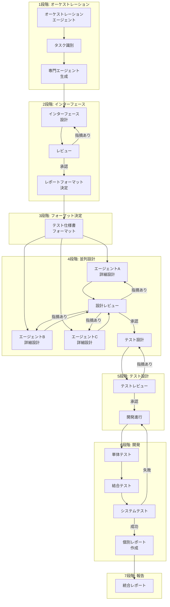
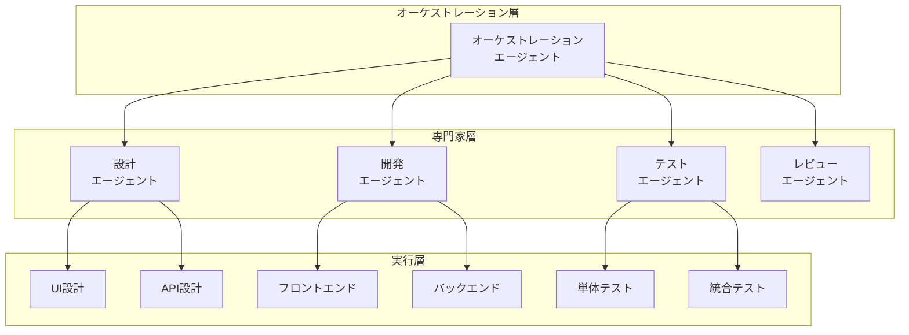
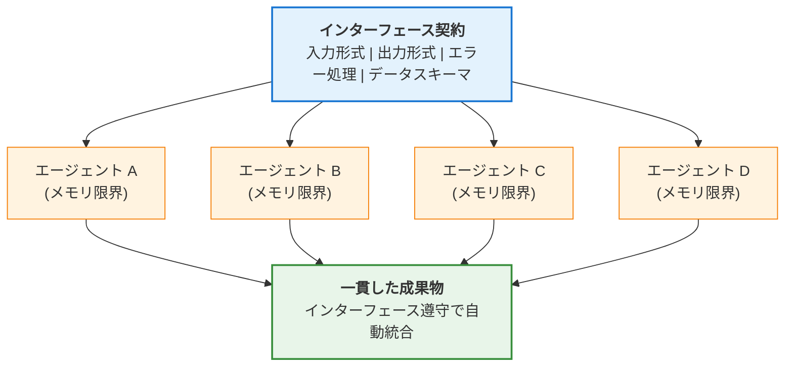
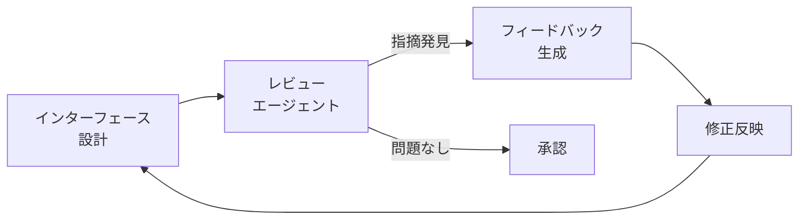
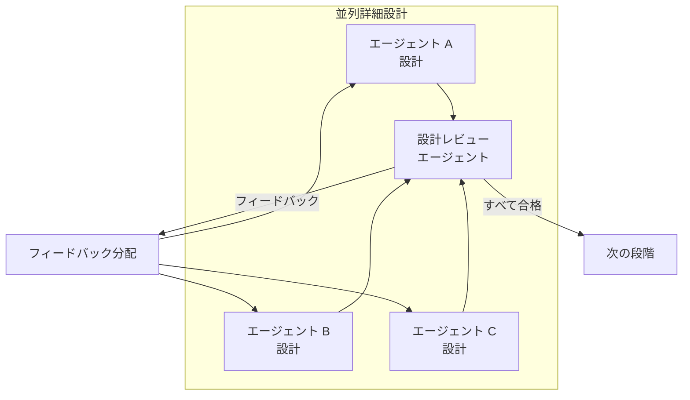
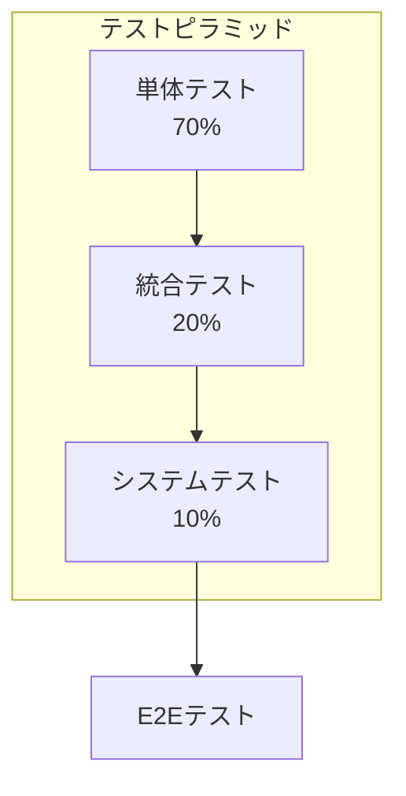
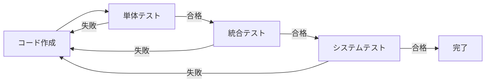
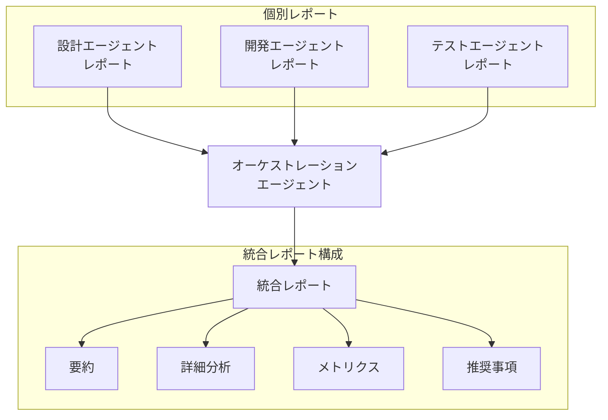
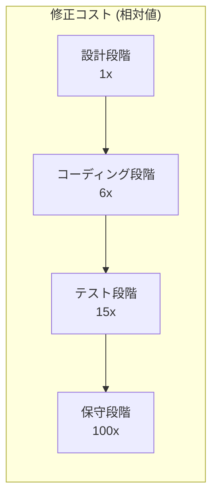

## はじめに

複雑なソフトウェア開発プロジェクトにおいて、エラー管理は常に最も大きな課題の一つでした。機能が増え、システム間の依存関係が複雑になるにつれて、単純なバグ一つが全体システムの安定性を脅かす状況が頻繁に発生します。従来の開発方法論はこの問題を解決するために様々なアプローチを提示してきましたが、AI時代に突入してから全く新しいパラダイムが登場しました。

### 本方法論の核心的洞察

本ポストで紹介する方法論の核心はシンプルです:

> <strong>「インターフェースを先に設計し、すべてのエージェントがこのインターフェース契約を遵守すれば、個別エージェントのメモリ限界にもかかわらず、エラーが最小化されます。」</strong>

LLMベースのエージェントには<strong>コンテキストウィンドウ(メモリ)の限界</strong>という本質的な制約があります。複雑なプロジェクトでは、全体の文脈を一つのエージェントが把握することは困難です。しかし<strong>インターフェースを北極星(North Star)のように</strong>先に確立すれば:

1. 個別エージェントが全体コンテキストを知らなくても<strong>自身の入出力契約だけ守れば</strong>良い
2. メモリがリセットされても<strong>インターフェースドキュメントを参照</strong>すれば一貫性維持
3. 複数エージェントの成果物が<strong>自然に統合</strong>可能
4. 結果的に<strong>エラー率40〜90%削減</strong>を達成

### 既存方法論の限界

<strong>ウォーターフォール(Waterfall)モデル</strong>は順次的で予測可能な開発プロセスを提供しますが、後半で発見される欠陥の修正コストが指数関数的に増加する問題があります。Boehmの研究によると、保守段階で発見された欠陥の修正コストは設計段階と比較して<strong>100倍</strong>に達します。

<strong>アジャイル(Agile)方法論</strong>は反復的開発と迅速なフィードバックループを通じてこの問題を緩和しましたが、複雑なシステムのアーキテクチャ的一貫性を維持することが難しく、開発者の能力に大きく依存する限界があります。

### AIマルチエージェントシステムの登場

2024-2025年を起点としてLLM(Large Language Model)ベースのマルチエージェントシステムがソフトウェア工学分野で革新的な変化を導いています。ACM Transactions on Software Engineering and Methodologyに発表されたHe et al.(2024)の研究によると、マルチエージェントシステムは複雑な問題を小さな単位に分解し、専門化されたエージェントたちが協業して解決する方式で既存方法論の限界を克服します。

McKinseyの2025年レポートによると、<strong>79〜85%の企業</strong>がAIエージェントを導入または導入を計画しており、<strong>23%の組織</strong>がすでにエージェンティックAIシステムをビジネス全般に拡大適用しています。

---

## 核心方法論: 反復的レビューサイクル

本方法論は7段階の体系的なプロセスで構成され、各段階で<strong>「レビュー → 修正」</strong>サイクルを指摘事項がなくなるまで繰り返します。このアプローチの核心はオーケストレーションエージェントを中心とした階層的構造と並列処理の組み合わせです。




### 1段階: オーケストレーションエージェント確立

方法論の最初の段階は、全体プロセスを調整する<strong>オーケストレーションエージェント</strong>を確立することです。このエージェントは中央指揮者の役割を果たし、次のような核心機能を担当します。

#### タスク識別と分解

オーケストレーションエージェントは全体プロジェクトを分析して独立して実行可能なタスク単位に分解します。このプロセスで重要なのは:

1. <strong>タスク間の依存関係把握</strong>: どのタスクが他のタスクに先行されるべきかを明確に定義
2. <strong>並列処理可能性の識別</strong>: 同時に進行できるタスクをグループ化
3. <strong>リソース要求事項の分析</strong>: 各タスクに必要な専門性とツールを把握

#### 専門エージェント生成の委任

識別された各タスクに対して、オーケストレーションエージェントは適切な専門エージェントの生成を委任します。MicrosoftのMagentic-Oneアーキテクチャで見られるように、効果的なエージェント構成には次が含まれます:

- <strong>設計エージェント</strong>: アーキテクチャおよび詳細設計担当
- <strong>レビューエージェント</strong>: 品質検証およびフィードバック提供
- <strong>開発エージェント</strong>: 実際のコード実装
- <strong>テストエージェント</strong>: テスト設計および実行

#### 階層的オーケストレーションパターン

Microsoft Azure Architecture Centerが提示する5つの核心オーケストレーションパターンのうち、本方法論は<strong>階層的(Hierarchical)パターン</strong>を基盤とします:



---

### 2段階: インターフェース構造設計 (核心段階)

> <strong>🎯 この段階が全体方法論の核心です。</strong>

エージェントたちが確立されたら、次の段階はこれらの間の<strong>最適なインターフェース構造</strong>を設計することです。<strong>この段階を開発より先に徹底的に完了することが、本方法論の最も重要な原則です。</strong>

#### なぜインターフェースが先なのか?

LLMエージェントの最大の限界は<strong>コンテキストウィンドウ(メモリ)制限</strong>です。複雑なプロジェクトでは:

- 単一エージェントが全体システムを理解することが困難
- 会話が長くなると初期の文脈を忘れる
- 複数エージェント間の作業結果が不一致になる可能性がある

しかし<strong>インターフェースを先に確定</strong>すれば:



<strong>各エージェントは全体の文脈を知らなくても、自身の入出力契約だけ守れば良いのです。</strong> これがメモリ限界を克服する核心メカニズムです。

#### インターフェース設計原則

1. <strong>明確な入出力定義</strong>: 各エージェントが受け入れる入力と生成する出力を明確に定義
2. <strong>最小限の結合度</strong>: エージェント間の依存性を最小化して独立的修正を可能に
3. <strong>標準化されたメッセージフォーマット</strong>: JSON、Protocol Buffersなど一貫したデータ形式を使用
4. <strong>エラー処理規約</strong>: 例外状況での行動様式を事前定義
5. <strong>バージョン管理</strong>: インターフェース変更時の互換性維持戦略

#### レビュー → 修正サイクル

インターフェース設計後には必ずレビューエージェントによる検証が必要です:



このサイクルは<strong>これ以上指摘事項が出なくなるまで</strong>繰り返されます。研究によると平均的に2〜4回の反復が必要であり、各反復ごとにイシュー発見率が次のように減少します:

| 反復回数 | イシュー発見率 | 累積解決率 |
|:---:|:---:|:---:|
| 1回目 | 55% | 55% |
| 2回目 | 25% | 80% |
| 3回目 | 12% | 92% |
| 4回目 | 5% | 97% |

---

### 3段階: レポートおよびテスト仕様書フォーマット決定

インターフェースが確定されたら、プロジェクト全般で使用する<strong>文書化標準</strong>を確立します。この段階はしばしば見過ごされがちですが、一貫した文書化は次を保証します:

- すべてのエージェントが同一形式で成果物を提出
- オーケストレーションエージェントの効率的な取りまとめ作業
- 後の監査(Audit)および追跡の容易性

#### 作業完了報告書フォーマット

各専門エージェントが作業完了時に提出すべき報告書の標準構造:

```yaml
report:
  agent_id: "design-agent-001"
  task_id: "TASK-2024-001"
  completion_timestamp: "2025-12-06T14:30:00Z"
  status: "completed"

  summary:
    objectives_achieved: true
    deliverables:
      - type: "design_document"
        path: "/docs/api-design-v1.0.md"
      - type: "interface_specification"
        path: "/specs/interface-contract.json"

  metrics:
    review_cycles: 3
    issues_found: 12
    issues_resolved: 12

  dependencies:
    upstream:
      - task_id: "TASK-2024-000"
        status: "verified"
    downstream:
      - task_id: "TASK-2024-002"
        ready: true
```

#### テスト仕様書フォーマット

各テスト段階別の仕様書は次の構造に従います:

```yaml
test_specification:
  phase: "integration"  # unit | integration | system
  version: "1.0"

  test_cases:
    - id: "TC-INT-001"
      name: "APIエンドポイント統合検証"
      priority: "high"
      preconditions:
        - "単体テスト100%合格"
        - "APIサーバー稼働状態"
      steps:
        - action: "POST /api/users 呼び出し"
          expected: "201 Created レスポンス"
        - action: "GET /api/users/{id} 呼び出し"
          expected: "生成されたユーザー情報返却"
      postconditions:
        - "データベース正常記録確認"
```

---

### 4段階: 並列詳細設計

この段階では各専門エージェントが<strong>同時に(Parallel)</strong>自身の担当領域に対する詳細設計を実行します。並列処理は全体開発期間を大幅に短縮しますが、適切な調整なしでは不一致問題が発生する可能性があります。

#### 並列設計の利点

MITの2025年研究によると、並列エージェント作業は順次的作業と比較して<strong>26%の生産性向上</strong>をもたらします。特に:

- 独立したモジュールは同時に設計可能
- レビュー待ち時間を最小化
- リソース活用率を最大化

#### 設計レビューエージェント活用

各エージェントの設計成果物は専任<strong>設計レビューエージェント</strong>に提出されます。レビューエージェントは:

1. <strong>一貫性検証</strong>: 全体システム設計との整合性確認
2. <strong>インターフェース遵守</strong>: 2段階で合意されたインターフェース契約の遵守有無
3. <strong>ベストプラクティス適用</strong>: 業界標準およびベストプラクティス充足
4. <strong>潜在的問題の識別</strong>: 今後の統合時に発生し得るイシューを事前探知

#### レビューサイクルの反復



このプロセスはすべての設計がレビューを通過するまで繰り返されます。Microsoft/IBMの研究によると、このような反復的レビューは欠陥を<strong>40〜90%削減</strong>させます。

---

### 5段階: テスト設計および実装

確定された設計を基にテストを先に設計します。これは<strong>TDD(Test-Driven Development)</strong>原則の拡張です。

#### テストピラミッド適用



| テストタイプ | 割合 | 目的 |
|:---:|:---:|:---|
| 単体テスト | 70% | 個別関数/メソッドの正確性検証 |
| 統合テスト | 20% | モジュール間の相互作用検証 |
| システムテスト | 10% | 全体システムの要求事項充足検証 |

#### テスト設計レビュー

テスト設計もレビュー → 修正サイクルを経ます:

- <strong>カバレッジ検証</strong>: すべての要求事項がテストされているか確認
- <strong>エッジケース</strong>: 境界条件および例外状況テストを含む
- <strong>パフォーマンス基準</strong>: 非機能的要求事項テスト設計

---

### 6段階: 開発および統合テスト

テストが準備された状態で開発を開始します。この段階の核心は<strong>すべてのテストが合格するまで</strong>開発を続けることです。

#### 継続的テスト実行



研究によると、<strong>変更後すぐにテストを実行</strong>すれば欠陥を90%削減できます(MoldStud, 2024)。

#### 結合テストおよびシステムテスト

単体テストが完了したら、テスト専門家エージェントは次を実行します:

1. 単体テスト結果分析
2. 結合テストケース導出
3. システムテストシナリオ設計
4. テスト実行および結果報告

---

### 7段階: 統合レポート作成

すべての開発とテストが完了したら、各専門家エージェントは自身の作業に対する<strong>個別レポート</strong>を作成します。このレポートは3段階で定義されたフォーマットに従う必要があります。

#### レポート取りまとめプロセス



オーケストレーションエージェントはすべての個別レポートを取りまとめて次を含む<strong>統合レポート</strong>を生成します:

1. <strong>プロジェクト要約</strong>: 全体目標達成有無
2. <strong>段階別詳細分析</strong>: 各段階の成果およびイシュー
3. <strong>品質メトリクス</strong>: レビューサイクル回数、発見/解決イシュー数
4. <strong>教訓および推奨事項</strong>: 今後の改善点

---

## 有効性検証および研究結果

### 産業研究結果

本方法論の有効性は多数の学術研究および産業レポートで実証されました。

#### Microsoft/IBM研究: 40-90%欠陥削減

Nagappan et al.の研究(Microsoft Research)によると、TDDおよび反復的レビューを適用した4つの産業チームで<strong>40〜90%の欠陥削減</strong>が観察されました。ただし、初期開発時間が15〜35%増加しましたが、保守コストの削減で相殺されました。

#### MIT研究2025: 26%生産性向上

GitHub Copilotを活用したMITの研究では、AIツール使用時に平均<strong>26%の生産性向上</strong>が現れました。特に:

- 新人開発者: 27〜39%向上
- 経験豊富な開発者: 混合結果(構造化されたオーケストレーション必須)

#### 即座のテストの効果: 90%欠陥削減

変更後すぐにテストを実行すれば欠陥を<strong>90%まで削減</strong>できるという研究結果があります(MoldStud, 2024)。

### 既存方法論との比較

| 指標 | ウォーターフォール | アジャイル | 反復的レビューサイクル |
|:---|:---:|:---:|:---:|
| 生産性向上 | ベースライン | 20〜40% | <strong>26%以上</strong> |
| 欠陥率 | 高い | 中間 | <strong>40〜90%削減</strong> |
| 柔軟性 | 低い | 高い | 適応的 |
| 後期変更コスト | 100x | 中間 | <strong>低い</strong> |
| 文書化レベル | 高い | 低い | <strong>標準化</strong> |

### 欠陥修正コスト分析

Boehmの研究に基づく欠陥発見時点別修正コスト:



反復的レビューサイクル方法論は欠陥を<strong>設計およびコーディング段階</strong>で大部分発見して修正コストを最小化します。

---

## 実装時の核心成功要素

### 1. 構造化されたオーケストレーションの重要性

METRの2025年研究は重要な教訓を提供します。経験豊富なオープンソース開発者を対象とした無作為対照実験で、AIツールを<strong>非構造化された方式で使用</strong>した場合、かえって<strong>19%遅い成果</strong>を見せました。

一方、<strong>構造化されたオーケストレーション</strong>を適用した場合:
- Amazon社内研究: 57%速い作業完了
- ServiceNow: 80%のサポートチケットを人間の介入なしで解決

### 2. エージェント専門化

Microsoft、IBM、OpenAIのガイドラインに従ったエージェント設計原則:

1. <strong>特定ドメインに集中</strong>: 検索、研究、作成、レビューなど明確な役割分離
2. <strong>ツール権限バインディング</strong>: 役割によるツールアクセス権限制限
3. <strong>役割ベースのアーキテクチャ</strong>: Planner、Coder、Criticなど明確な分業

### 3. 反復的レビューの必須性

単一レビューですべての問題を発見することはできません。研究によると:

- 1回目のレビュー: 55%のイシュー発見
- 2回目のレビュー: 追加25%発見(累積80%)
- 3回目のレビュー: 追加12%発見(累積92%)
- 4回目のレビュー: 追加5%発見(累積97%)

### 4. 可観測性(Observability)

Azure AI Foundryのアプローチを参考にした可観測性実装:

- <strong>パフォーマンスメトリクス</strong>: 各エージェントの応答時間、スループット
- <strong>品質メトリクス</strong>: レビュー合格率、欠陥発見率
- <strong>コストメトリクス</strong>: トークン使用量、API呼び出し回数
- <strong>安全性メトリクス</strong>: セキュリティ検証結果、規定遵守有無

---

## 実際の適用事例

### HyperAgent: SWE-Bench 26%成功率

OpenReview(2024)に発表されたHyperAgentはGitHubイシュー解決で:

- <strong>SWE-Bench-Lite</strong>: 26%成功率
- <strong>SWE-Bench-Verified</strong>: 33%成功率

これは既存の単一エージェント方式(18%)を大きく上回る結果です。

### Microsoft Magentic-One

Microsoftのマルチエージェントシステムは:

- 中央オーケストレーターが4つの専門エージェント(WebSurfer、FileSurfer、Coder、ComputerTerminal)を調整
- GAIAベンチマークで<strong>54.3%</strong>達成
- 単一LLM(14.3%)と比較して顕著に高い成果

### 業界採用動向

| 出典 | 統計 |
|:---|:---|
| PwC 2025 | 79〜85%の企業がAIエージェント導入/計画 |
| McKinsey 2025 | 23%の組織がエージェンティックAI拡大適用 |
| Deloitte 2025 | 26%が自律エージェント開発探索 |
| 市場規模 | 2024年$54.3億 → 2025年$79.2億 (40%成長) |

### 産業別成果

| 産業 | 成果 |
|:---|:---|
| 航空宇宙/自動車 | 市場投入時間50%短縮、コスト30%削減 |
| 金融サービス | リスク評価および規定遵守自動化 |
| ソフトウェア開発 | 2024年上位AIモデルの90%が開発に活用 |

---

## 結論

### 核心原則の再確認

本方法論の最も重要な洞察を再度強調します:

> <strong>「インターフェースを先に設計し、すべてのエージェントがこのインターフェース契約を遵守すれば、個別エージェントのメモリ限界にもかかわらず、エラーが最小化されます。」</strong>

これが既存のAI開発方式(非構造化プロンプティング)と本方法論の根本的な違いです:

| 区分 | 非構造化AI活用 | インターフェース優先方法論 |
|:---|:---:|:---:|
| メモリ限界対応 | 対応なし(文脈損失) | <strong>インターフェースで一貫性維持</strong> |
| エージェント間統合 | 手動調整必要 | <strong>自動統合可能</strong> |
| エラー率 | 高い | <strong>40〜90%削減</strong> |
| 拡張性 | 制限的 | <strong>無限拡張可能</strong> |

### 方法論の核心価値

<strong>反復的レビューサイクル方法論</strong>はAIマルチエージェントシステムの潜在力を最大限活用して複雑なソフトウェア開発のエラーを最小化します:

1. <strong>インターフェースが北極星</strong>: すべてのエージェントが同一の契約に従う
2. <strong>メモリ限界克服</strong>: 個別エージェントが全体を知らなくても一貫した結果生成
3. <strong>検証された効果</strong>: 40〜90%欠陥削減、26%以上の生産性向上
4. <strong>無限拡張性</strong>: プロジェクト規模に応じたエージェント追加/調整が可能

### 今後の展望

2025〜2028年の間、マルチエージェントシステムの採用はさらに加速すると予想されます。Gartnerによると、2028年までに<strong>33%の企業ソフトウェア</strong>がエージェンティック機能を内蔵すると見られ、これは2024年の1%未満から大きく増加した数値です。

<strong>インターフェース優先設計</strong>というシンプルな原則を守るだけで、LLMの本質的限界を克服し、複雑なプロジェクトを成功に導くことができます。

---

## 参考資料

### 学術論文

1. He, J., et al. (2024). "LLM-Based Multi-Agent Systems for Software Engineering: Literature Review, Vision and the Road Ahead." *ACM Transactions on Software Engineering and Methodology*. DOI: 10.1145/3712003

2. Nagappan, N., et al. "Realizing Quality Improvement Through Test Driven Development: Results and Experiences of Four Industrial Teams." *Microsoft Research*.

3. arXiv 2507.08944v1 (2025). "Optimizing Sequential Multi-Step Tasks with Parallel LLM Agents"

4. METR (2025). "Measuring the Impact of Early-2025 AI on Experienced Open-Source Developer Productivity" (arXiv 2507.09089)

### 産業レポート

5. McKinsey (2025). "The State of AI in 2025: Agents, Innovation, and Transformation"

6. PwC (2025). "AI Agent Survey" & "2025 AI Business Predictions"

7. Deloitte (2025). "State of Generative AI in the Enterprise Report"

### 技術ガイド

8. Microsoft Azure Architecture Center. "AI Agent Orchestration Patterns" - https://learn.microsoft.com/en-us/azure/architecture/ai-ml/guide/ai-agent-design-patterns

9. OpenAI. "Orchestrating Multiple Agents - OpenAI Agents SDK" - https://openai.github.io/openai-agents-python/multi_agent/

10. IBM Think (2025). "What is AI Agent Orchestration?" - https://www.ibm.com/think/topics/ai-agent-orchestration
