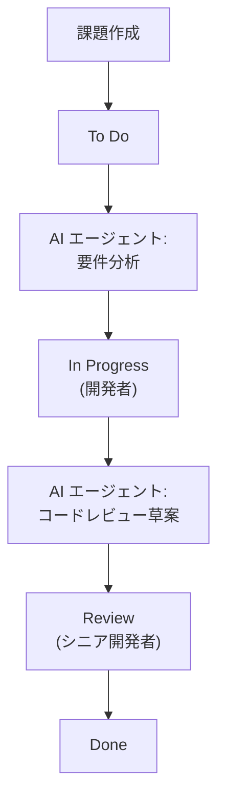
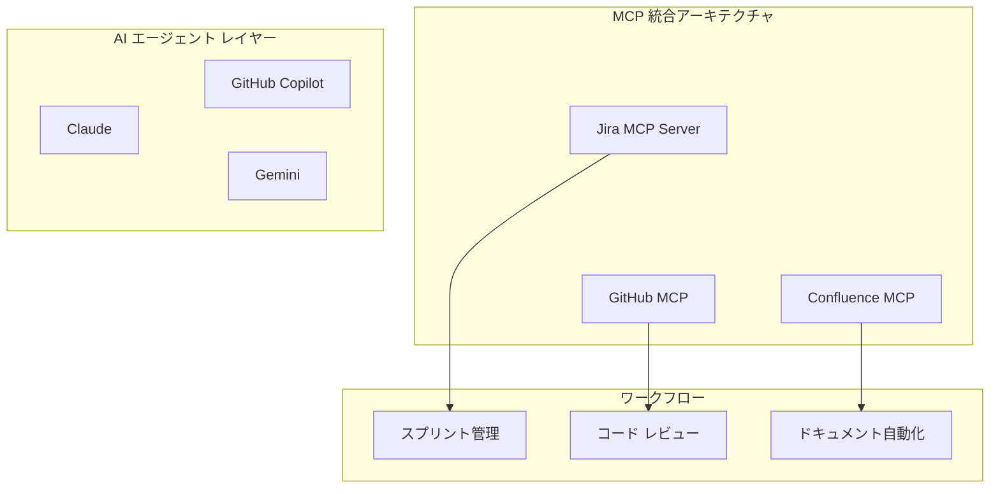

## 概要

2026年2月25日、Atlassian が <strong>Jira に AI エージェントを公式導入</strong>しました。単なるチャットボットではありません。AI エージェントが Jira ワークフロー内で <strong>タスクの割り当てを受け、コメントで協働し、ワークフロー ステップを自動実行</strong>する構造です。

同時に Atlassian は <strong>Model Context Protocol(MCP)</strong>を全面採用し、自社の Rovo だけでなく GitHub Copilot、Claude、Gemini などの外部 AI エージェントも Jira と直接接続できるようになりました。

エンジニアリングマネージャーの立場からすると、これは単なる機能アップデートではありません。<strong>チーム運営方式そのものが変わる信号</strong>です。この記事では、EM 視点で何が変わり、どのように準備すべきかをまとめます。

## 何が変わったのか — Jira AI エージェント 3 つの主要機能

### 1. エージェントをチームメンバーのように割り当て

今、Jira の課題の担当者（Assignee）に AI エージェントを指定できるようになりました。人と同じフィールド パターンを使用するため、既存のワークフローを壊すことなく AI を導入できます。

```
# 既存ワークフロー
課題作成 → 開発者割り当て → 作業 → レビュー → 完了

# AI エージェント統合ワークフロー
課題作成 → AI エージェント割り当て(草案・リサーチ) → 開発者レビュー → 作業 → 完了
```

### 2. コメントベースの @mention 協働

AI エージェントをコメント内で @mention すれば、その課題のコンテキスト内で要約、リサーチ、ソリューション提案を受け取ることができます。別途ツールを開く必要なく、Jira 内で直接 AI と協働します。

### 3. ワークフロー自動トリガー

Jira ワークフローの特定のステータスに AI エージェントを配置し、ステータス遷移時に自動的にタスクを実行させることができます。



## MCP が重要な理由 — ツール ロックインからの解放

Atlassian の MCP 採用は、単なる技術的選択ではありません。<strong>ベンダー ロックイン（Vendor Lock-in）からの解放</strong>を意味しています。

### MCP 統合の現況

Atlassian がホストする MCP サーバーを通じて、以下の AI クライアントが Jira/Confluence に直接接続されます：

| AI クライアント | 接続方式 |
|---|---|
| Claude (Anthropic) | MCP ネイティブ |
| GitHub Copilot | MCP 統合 |
| Gemini CLI (Google) | MCP 統合 |
| Cursor | MCP 統合 |
| Lovable | MCP 統合 |
| WRITER | MCP 統合 |

### Rovo MCP ギャラリー

Atlassian の Rovo MCP ギャラリーを通じて、GitHub、Box、Figma などのサードパーティ ツールのエージェントも Jira 内で動作します。注目すべきは、現在 <strong>MCP 使用量の約 1/3 が書き込み（Write）操作</strong>という点です。単なるデータ照会ではなく、実際にタスクを実行していることを意味しています。

### エンタープライズ導入の現況

- MCP 使用量の <strong>93% が有料顧客</strong>から発生
- エンタープライズ アカウントが MCP 作業の <strong>約半分</strong>を占める
- すでに実務で本格的に活用されている証拠

## EM が準備すべき 5 つのこと

### 1. AI エージェント ガバナンス体系の確立

AI エージェントがチームメンバーとして参加する場合、<strong>権限と責任の境界</strong>を明確にする必要があります。

```yaml
# AI エージェント ガバナンス チェックリスト
permissions:
  - エージェントがアクセス可能なプロジェクト範囲の定義
  - 書き込み権限の付与基準の設定
  - 本番環境への影響作業は人間による承認が必須

audit:
  - エージェント活動ログの監視周期の決定
  - 異常な動作の検出基準の設定
  - 月間エージェント成果レビュー プロセス

escalation:
  - エージェント失敗時のフォールバック プロセス
  - エージェント → 人間のエスカレーション条件
  - 緊急時のエージェント停止手順
```

### 2. チーム役割の再定義

AI エージェントが反復作業を担当すると、チームメンバーの役割が変わります。

<strong>Before</strong>: 開発者が課題のトリアージ、コード レビュー草案、ドキュメント更新を直接実施
<strong>After</strong>: AI が草案を生成し、開発者は検証と意思決定に集中

EM として、この転換を <strong>脅威ではなく機会</strong>として位置付けることが重要です。チームメンバーがより価値のある作業に集中できるよう、AI が担当するタスクと人が担当するタスクの境界を明確に設計してください。

### 3. MCP ベース ツール統合戦略

MCP はもはや事実上の標準（de facto standard）です。Anthropic が作成しましたが、Linux Foundation に寄付され、OpenAI、Google、Microsoft、AWS がすべてサポートしています。



### 4. 段階的導入ロードマップ

一度にすべてを変えようとしないでください。段階的に導入します。

<strong>フェーズ 1（1〜2週間）</strong>: 読み取り専用エージェントで開始
- 課題要約、スプリント レポート自動生成
- リスク: 低、価値: 即座に体感

<strong>フェーズ 2（3〜4週間）</strong>: 書き込みエージェントの限定的導入
- 課題ラベリング、優先度提案
- 人間による承認ゲート必須

<strong>フェーズ 3（2 か月〜）</strong>: ワークフロー自動化
- ステータス遷移トリガー エージェント
- CI/CD パイプラインとの連携
- 定期的な効果測定と調整

### 5. 測定指標の設計

AI エージェント導入の成果を定量的に測定できる必要があります。

| 指標 | 測定方法 | 目標 |
|---|---|---|
| 課題トリアージ時間 | 課題作成 → 初回対応時間 | 50% 短縮 |
| 反復作業の割合 | AI が処理したタスク / 全体タスク | 30% 以上 |
| 開発者満足度 | 月間調査（1〜5） | 3.5 以上 |
| エージェント正確度 | AI 提案採択率 | 70% 以上 |
| スプリント速度の変化 | ポイント / スプリント | 20% 向上 |

## 実践シナリオ — EM の 1 日はこのように変わる

### Before: 従来のスプリント管理

```
09:00 - 課題トリアージ（30分）
09:30 - スタンドアップ準備（各チームメンバーの状況確認、15分）
10:00 - スタンドアップ ミーティング
10:30 - ブロッカー解決（別チームの調整、1時間）
14:00 - コード レビュー（1時間）
15:00 - スプリント レビュー準備（30分）
```

### After: AI エージェント活用

```
09:00 - AI がトリアージした結果をレビュー（10分）
09:10 - AI 生成のスタンドアップ要約をレビュー（5分）
09:30 - スタンドアップ ミーティング（AI 要約ベースでより生産的）
10:00 - 戦略的ブロッカー解決に集中（AI が事前分析を提供）
14:00 - AI コード レビュー草案ベースのレビュー（30分）
14:30 - 削減時間で 1:1 ミーティング、技術負債の整理
```

<strong>主要な変化</strong>: EM の役割が「タスク管理者」から「意思決定者」へ転換します。

## 注意すべき点

### AI エージェント ≠ 万能

- エージェントはツールです。<strong>判断は依然として人間の責務</strong>です
- 初期段階では、エージェント出力の品質が不安定である可能性があります。必ず検証プロセスを設けてください
- チームメンバーの心理的安全性を考慮してください。「AI が私の仕事を代替する」という不安に先制的に対応してください

### セキュリティとコンプライアンス

- Jira の既存権限体系をそのまま尊重します
- すべてのエージェント活動は監査ログ（Audit Trail）に記録されます
- 本番環境の変更は必ず人間による承認が必要です
- 開発者別に隔離されたサンドボックス環境でエージェントが動作します

## 結論

Atlassian の Jira AI エージェント + MCP 導入は、<strong>プロジェクト管理ツールのパラダイム転換</strong>です。MCP が事実上の標準として確立されるにつれて、AI エージェントが開発ツール全般に統合される速度はさらに加速するでしょう。

エンジニアリングマネージャーとして、今すべきことは明確です：

1. <strong>MCP エコシステムを理解</strong>し、チームに適した AI エージェントの組み合わせを見つけてください
2. <strong>ガバナンス体系を最初に設計</strong>してから導入してください
3. <strong>段階的に導入</strong>しつつ、測定可能な指標とともに進めてください
4. <strong>チームメンバーの役割転換</strong>を機会として位置付けてください

2026年は AI エージェントがデモから実務へ移行する年です。数百万のチームが使用する Jira というプラットフォームでのこの変化は、その転換の最も明確な信号です。

## 参考資料

- [Atlassian 公式発表 — AI Agents in Jira](https://www.atlassian.com/blog/announcements/ai-agents-in-jira)
- [TechCrunch — Jira's latest update allows AI agents and humans to work side by side](https://techcrunch.com/2026/02/25/jiras-latest-update-allows-ai-agents-and-humans-to-work-side-by-side/)
- [SiliconANGLE — Atlassian embeds agents into Jira and embraces MCP](https://siliconangle.com/2026/02/25/atlassian-embeds-agents-jira-embraces-mcp-third-party-integrations/)
- [MCP 公式サイト](https://modelcontextprotocol.io/)
