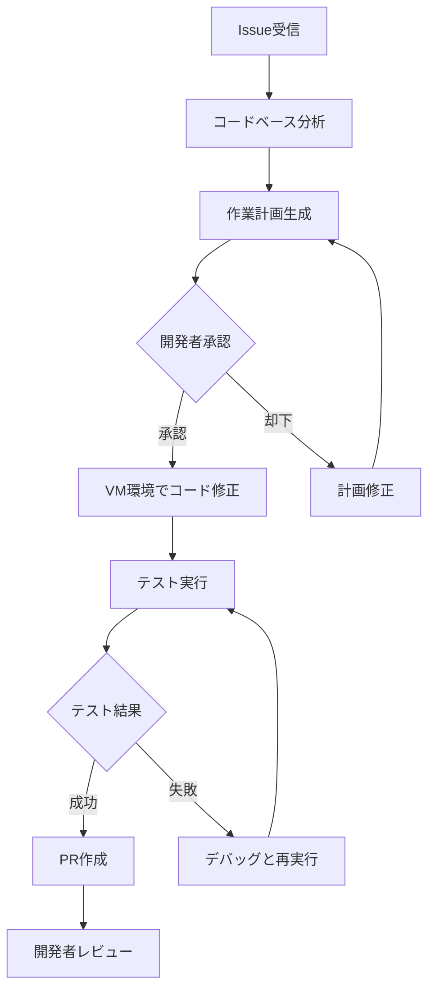
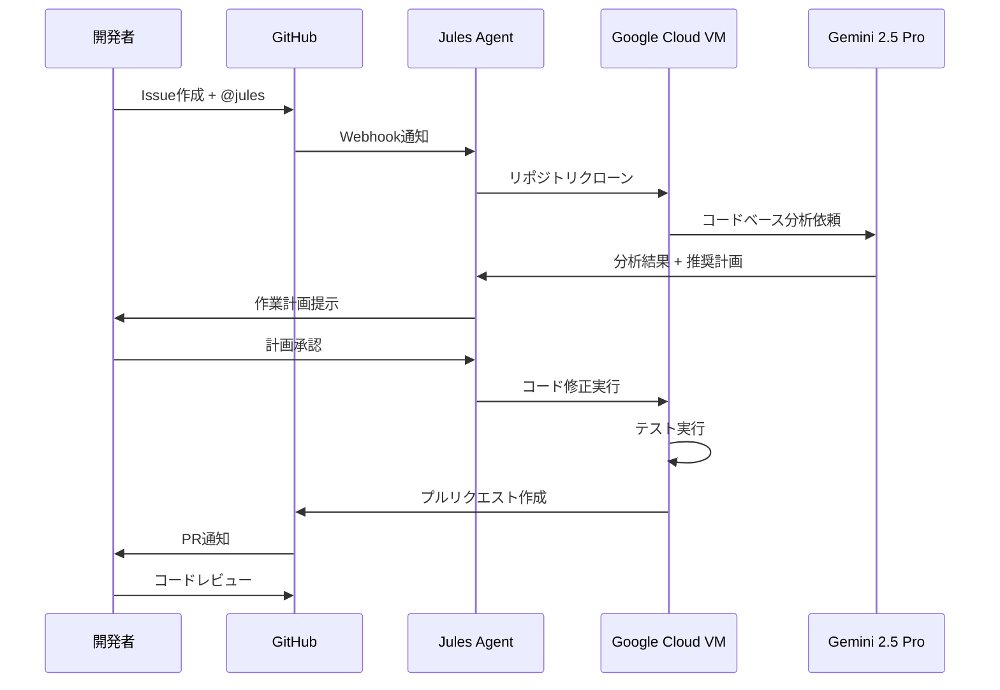
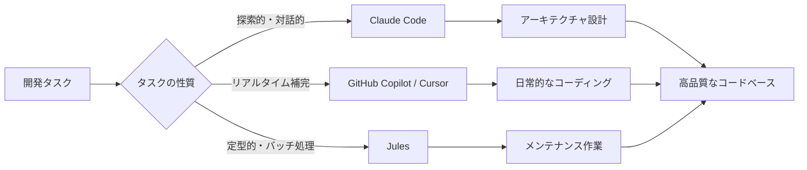

## はじめに

2025年8月、Googleは革新的なAIコーディングエージェント<strong>Jules</strong>をパブリックベータから正式リリースしました。GitHub CopilotやClaude Codeといった既存のAI開発支援ツールとは異なり、Julesは<strong>非同期で自律的に動作する</strong>点が最大の特徴です。

開発者がコーディング中にリアルタイムで補完を提供するのではなく、Julesはバックグラウンドで完全に独立してタスクを実行し、完成したコードをプルリクエストとして提出します。本記事では、Julesの機能、活用方法、他のツールとの比較、そして実践的なベストプラクティスまで包括的に解説します。

## Julesとは何か

### 非同期自律型コーディングエージェント

Julesは、Googleの最新AIモデル<strong>Gemini 2.5 Pro</strong>を基盤とする自律型コーディングエージェントです。従来のAIコーディングアシスタントが開発者の入力に対してリアルタイムで応答するのに対し、Julesは以下のような特徴を持ちます：

- <strong>完全自律実行</strong>：開発者の監視なしにタスクを完遂
- <strong>GitHub統合</strong>：Issueからプルリクエストまでのワークフロー全体を自動化
- <strong>透明な計画プロセス</strong>：実行前に詳細な作業計画を提示し、開発者の承認を得る
- <strong>クラウドベース実行</strong>：Google Cloud VMで動作し、ローカル環境を汚染しない

### 核心的価値提案

Julesの最大の価値は「<strong>開発者の時間を解放する</strong>」ことにあります。例えば：

```text
従来の開発フロー：
1. GitHub Issueを確認
2. ローカル環境でコードを修正
3. テストを実行
4. プルリクエストを作成
5. コードレビュー対応

Julesを使った開発フロー：
1. GitHub IssueにJulesをアサイン
2. （Julesがバックグラウンドで1〜4を実行）
3. 完成したPRをレビュー
```

開発者は単純作業から解放され、アーキテクチャ設計やコードレビューといった高付加価値な業務に集中できます。

## Julesの主要機能

### 1. GitHubネイティブ統合

JulesはGitHubと深く統合されており、以下の操作が可能です：

- <strong>Issue自動解決</strong>：Issueにメンションするだけでタスクを開始
- <strong>自動PR作成</strong>：修正内容を含むプルリクエストを自動生成
- <strong>コメント対応</strong>：PRコメントでの追加修正依頼にも対応

````javascript
// GitHub IssueでJulesをメンション
@jules Fix the authentication bug in login.js

// Julesが自動的に：
// 1. コードベース全体を分析
// 2. バグの原因を特定
// 3. 修正コードを生成
// 4. テストを実行
// 5. PRを作成
````

### 2. 全コードベース理解

Gemini 2.5 Proの長大なコンテキストウィンドウ（最大100万トークン）により、Julesはプロジェクト全体を一度に理解できます：

- <strong>依存関係の追跡</strong>：ファイル間の関連性を正確に把握
- <strong>影響範囲分析</strong>：変更が他のコードに与える影響を予測
- <strong>一貫性のある修正</strong>：コーディングスタイルやアーキテクチャパターンを維持

### 3. 透明な計画と推論プロセス

Julesは実行前に必ず<strong>詳細な作業計画</strong>を提示します：



この透明性により、開発者は以下のメリットを得られます：

- <strong>予測可能性</strong>：Julesが何をするのか事前に把握
- <strong>制御可能性</strong>：不適切な計画を事前に却下
- <strong>学習機会</strong>：Julesのアプローチから新しい手法を学べる

### 4. 非同期ワークフロー

Julesは独立したGoogle Cloud VM上で動作するため：

- <strong>開発環境の隔離</strong>：ローカル環境に影響を与えない
- <strong>並行実行</strong>：複数のタスクを同時進行（Proプラン：5タスク、Ultraプラン：20タスク）
- <strong>長時間タスク対応</strong>：数時間かかる大規模リファクタリングも可能

## 技術アーキテクチャと動作原理

Julesの内部動作を詳しく見ていきましょう。

### ワークフロー全体像



### 各ステップの詳細

#### ステップ1：タスク割り当て

開発者がGitHub IssueまたはPRコメントでJulesをメンションすると、GitHubのWebhookがJulesに通知を送信します。

````markdown
<!-- GitHub Issueの例 -->
## Bug: Login fails with special characters

When a user enters a password containing special characters like `@` or `#`,
the login fails with a 500 error.

@jules Please fix this authentication bug
````

#### ステップ2：コードベース分析

JulesはGoogle Cloud VM上にリポジトリをクローンし、Gemini 2.5 Proにコード全体を送信します。Geminiは以下を分析：

- <strong>関連ファイルの特定</strong>：認証関連のすべてのファイル
- <strong>バグの原因推測</strong>：特殊文字のエスケープ処理不備
- <strong>テストカバレッジ確認</strong>：既存テストの有無

#### ステップ3：計画生成と承認

分析結果を基に、Julesは具体的な作業計画を生成します：

```text
作業計画：
1. src/auth/validator.js の validatePassword 関数を修正
   - 特殊文字を正規表現でエスケープ
2. tests/auth/validator.test.js にテストケース追加
   - パスワード: "Test@123#"
   - パスワード: "P@ssw0rd!"
3. 既存の44個の認証テストを実行して回帰バグがないことを確認

予想所要時間: 15〜20分
変更ファイル数: 2
```

開発者はこの計画をレビューし、承認または修正依頼を出します。

#### ステップ4〜5：自律実行とPR作成

承認後、Julesは以下を自動実行：

```bash
# 実際の実行ログ（概念的表現）
[Jules] Modifying src/auth/validator.js...
[Jules] Adding test cases to tests/auth/validator.test.js...
[Jules] Running test suite...
[Jules] ✓ All 46 tests passed (44 existing + 2 new)
[Jules] Creating pull request...
[Jules] ✓ PR #342 created: "Fix password validation for special characters"
```

## 統合方法

Julesを開発ワークフローに統合する方法は3つあります。

### 1. GitHub Webインターフェース

最もシンプルな方法です：

1. [jules.google](https://jules.google)でGitHubアカウントを連携
2. GitHubリポジトリへのアクセスを許可
3. IssueまたはPRコメントで`@jules`とメンション

### 2. Jules Tools CLI

2025年10月にリリースされたコマンドラインインターフェースです：

````bash
# インストール（Node.js 18+が必要）
npm install -g @google/jules-tools

# 初期設定
jules auth login

# タスク作成
jules task create \
  --repo="myorg/myproject" \
  --title="依存関係をアップデート" \
  --description="npm packagesを最新版に更新"

# タスク状態確認
jules task list

# 特定タスクの詳細
jules task show <task-id>

# タスクの計画を承認
jules task approve <task-id>
````

CLIを使うメリット：

- <strong>バッチ処理</strong>：複数タスクを一括作成
- <strong>CI/CD統合</strong>：自動化パイプラインに組み込み可能
- <strong>スクリプト化</strong>：定期的なメンテナンスタスクを自動化

### 3. Jules Public API（アーリーアクセス）

プログラマティックにJulesを制御できるREST APIです：

````javascript
// Node.js例
import { JulesClient } from '@google/jules-api';

const client = new JulesClient({
  apiKey: process.env.JULES_API_KEY
});

// タスク作成
const task = await client.tasks.create({
  repository: 'myorg/myproject',
  title: 'Refactor user authentication module',
  description: 'Extract authentication logic into separate service class',
  priority: 'high'
});

// 計画取得
const plan = await client.tasks.getPlan(task.id);
console.log('Proposed changes:', plan.changes);

// 計画承認
await client.tasks.approve(task.id);

// 進捗監視
const status = await client.tasks.getStatus(task.id);
console.log(`Progress: ${status.progress}%`);
````

APIを使うと、以下のような高度な統合が可能です：

- <strong>自動トリアージ</strong>：新しいIssueを自動分類し、適切なものをJulesに割り当て
- <strong>定期メンテナンス</strong>：毎週依存関係更新タスクを自動実行
- <strong>カスタムダッシュボード</strong>：Julesの活動状況を可視化

## 実践的な活用事例

Julesが最も効果を発揮する具体的なシナリオを紹介します。

### 1. バグトリアージと修正

<strong>シナリオ</strong>：ユーザーから報告された100件以上のバグIssueが溜まっている

<strong>従来のアプローチ</strong>：
- 開発者が1件ずつIssueを読み、優先度を判断
- 各バグを修正（1件あたり30分〜2時間）
- 週に10〜15件程度しか処理できない

<strong>Julesを使ったアプローチ</strong>：

````bash
# CLIで簡単なバグを一括処理
jules task batch-create \
  --repo="myapp/backend" \
  --label="bug:simple" \
  --auto-approve-trivial

# 結果：
# - 50件の単純なバグを自動修正
# - 平均処理時間：15分/件
# - 開発者は複雑なバグに集中可能
````

<strong>実際の成果（仮想事例）</strong>：
- バグ解決速度：3倍向上
- 開発者の作業時間：週20時間 → 8時間
- 残り12時間を新機能開発に投入

### 2. テストカバレッジ向上

<strong>シナリオ</strong>：レガシーコードのテストカバレッジが30%しかない

<strong>Julesへのタスク</strong>：

````markdown
@jules

Please improve test coverage for the following modules:
- src/payment/processor.js (currently 25% coverage)
- src/user/profile.js (currently 40% coverage)

Target: 80% coverage for both modules
Requirements:
- Use Jest testing framework
- Include edge cases and error scenarios
- Follow existing test patterns in tests/payment/
````

<strong>Julesの実行結果</strong>：
- 48個の新しいテストケースを追加
- カバレッジ：30% → 82%
- 3つの潜在的バグを発見（エッジケーステストで判明）

### 3. 依存関係アップデート

<strong>シナリオ</strong>：npmパッケージの脆弱性アラートが12件発生

<strong>従来の課題</strong>：
- 各パッケージの変更履歴を確認
- 破壊的変更の有無をチェック
- アップデート後の影響範囲をテスト
- 所要時間：半日〜1日

<strong>Julesを使った自動化</strong>：

````bash
# 週次自動実行スクリプト
#!/bin/bash
jules task create \
  --repo="myapp/frontend" \
  --title="Weekly dependency update" \
  --description="Update all npm packages to latest secure versions. Run full test suite before creating PR." \
  --schedule="weekly"
````

<strong>結果</strong>：
- セキュリティアップデート漏れ：ゼロ
- 開発者の手動作業：月8時間 → 1時間（レビューのみ）

### 4. コードリファクタリング

<strong>シナリオ</strong>：モノリシックな1500行のファイルを複数モジュールに分割

<strong>Julesへの指示</strong>：

````markdown
@jules

Refactor src/api/handler.js (1500 lines) into smaller modules:

1. Extract authentication logic → src/api/auth/
2. Extract validation logic → src/api/validation/
3. Extract error handling → src/api/errors/
4. Keep only routing logic in handler.js

Requirements:
- Maintain existing API contracts
- Ensure all 120 existing tests pass
- Add JSDoc comments to new modules
````

<strong>成果</strong>：
- 5つの明確に分離されたモジュール
- コードの可読性とメンテナンス性が向上
- すべてのテストが通過
- 開発者の作業時間：推定8時間 → 実際30分（レビューのみ）

## 他のAIコーディングツールとの比較

Julesを他の主要AIコーディングツールと比較してみましょう。

| 特徴 | Jules | Claude Code | GitHub Copilot | Cursor |
|------|-------|-------------|----------------|--------|
| <strong>動作モード</strong> | 非同期・自律型 | 対話型 | リアルタイム補完 | リアルタイム補完 |
| <strong>実行環境</strong> | クラウドVM | ローカル | ローカル | ローカル |
| <strong>GitHub統合</strong> | ネイティブ | CLI経由 | あり | あり |
| <strong>自動PR作成</strong> | ○ | × | × | × |
| <strong>並行タスク実行</strong> | ○（最大20） | × | × | × |
| <strong>コンテキスト理解</strong> | 全コードベース | 全コードベース | ファイル単位 | プロジェクト単位 |
| <strong>価格（月額）</strong> | 無料〜$124.99 | $20 | $10〜$39 | $20〜$40 |
| <strong>無料プラン</strong> | 15タスク/日 | なし | 制限付き | トライアルのみ |
| <strong>対応言語</strong> | Python, JS/TS | すべて | すべて | すべて |
| <strong>理想的な用途</strong> | バグ修正、テスト、メンテナンス | 探索的コーディング | コード補完 | インタラクティブ開発 |

### 各ツールの最適なユースケース

#### Jules：バックグラウンドタスク

- <strong>単純だが時間がかかる作業</strong>：依存関係更新、テスト追加
- <strong>明確に定義されたタスク</strong>：Issue記述が詳細な場合
- <strong>複数タスクの並行処理</strong>：バッチ処理が必要な場合

#### Claude Code：探索的開発

- <strong>アーキテクチャ設計</strong>：対話しながら最適解を模索
- <strong>学習</strong>：新しい技術の使い方を質問しながら実装
- <strong>コードレビュー</strong>：詳細な説明とフィードバック

#### GitHub Copilot：日常的なコーディング

- <strong>関数実装</strong>：コメントから関数本体を生成
- <strong>定型コード</strong>：ボイラープレート生成
- <strong>コード補完</strong>：次の行を予測

#### Cursor：インタラクティブ開発

- <strong>リアルタイム質問</strong>：コーディング中の即座な疑問解決
- <strong>エディタ内編集</strong>：コンテキストを維持した修正
- <strong>マルチファイル編集</strong>：複数ファイルの一括変更

### 組み合わせ戦略

最も効果的なのは、これらのツールを<strong>状況に応じて使い分ける</strong>ことです：

```text
開発フローの例：

1. アーキテクチャ設計
   └─ Claude Codeで対話的に検討

2. 基本実装
   └─ Cursorでインタラクティブにコーディング
   └─ GitHub Copilotで定型コードを補完

3. テスト追加
   └─ Julesに一括依頼（@jules Add comprehensive tests）

4. バグ修正
   └─ 簡単なバグ → Jules
   └─ 複雑なバグ → Claude Codeと対話

5. リファクタリング
   └─ 大規模リファクタリング → Jules
   └─ 細かい調整 → Cursor

6. ドキュメント作成
   └─ Claude Codeで詳細な説明を生成
```

## 価格と利用可能性

Julesは3つの料金プランを提供しています（2025年10月現在）。

### 無料プラン

<strong>料金</strong>：$0/月

<strong>制限</strong>：
- 1日あたり15タスク
- 同時実行：3タスク

<strong>適している人</strong>：
- 個人開発者
- 小規模プロジェクト
- Julesを試してみたい人

### Proプラン（Google AI Pro）

<strong>料金</strong>：$19.99/月

<strong>制限</strong>：
- 1日あたり75タスク（無料の5倍）
- 同時実行：5タスク

<strong>追加特典</strong>：
- Gemini Proへの完全アクセス
- 優先サポート

<strong>適している人</strong>：
- プロフェッショナル開発者
- 中規模チーム（3〜5人）
- 毎日複数のタスクを処理する人

### Ultraプラン（Google AI Ultra）

<strong>料金</strong>：$124.99/月

<strong>制限</strong>：
- 1日あたり300タスク（無料の20倍）
- 同時実行：20タスク

<strong>追加特典</strong>：
- Gemini Ultraへのアクセス
- 優先サポート
- エンタープライズ機能（今後追加予定）

<strong>適している人</strong>：
- 大規模チーム
- CI/CDパイプラインでの自動化
- 多数のリポジトリを管理

### コスト試算例

<strong>シナリオ</strong>：10人のチームが毎日バグ修正とテスト追加を実施

````text
従来のコスト：
- 1人あたり週5時間の単純作業
- 時給換算 $50 として
- 月間コスト：10人 × 20時間 × $50 = $10,000

Julesを使った場合：
- Ultraプラン：$124.99/月
- 開発者の時間削減：週5時間 → 1時間
- 削減コスト：10人 × 16時間 × $50 = $8,000/月
- 実質節約：$8,000 - $125 = $7,875/月
````

## 制限事項と考慮事項

Julesは強力なツールですが、以下の制限と注意点があります。

### 現在の制限事項

#### 1. サポート言語の制限

<strong>現在サポート</strong>：
- Python
- JavaScript / TypeScript

<strong>今後サポート予定</strong>：
- Go
- Java
- Rust
- その他の主要言語

#### 2. 英語専用インターフェース

- GitHub Issueの記述は英語が推奨
- 日本語でも動作するが、精度が低下する可能性
- ドキュメントやコメントは英語が望ましい

#### 3. 非同期レイテンシー

- タスク完了まで数分〜数十分かかる
- 即座のフィードバックが必要な場合は不向き
- リアルタイム開発には他のツールを使用

#### 4. GitHub専用

- 現在GitHubリポジトリのみサポート
- GitLab、Bitbucketには非対応（将来的には対応予定）

### 注意すべきポイント

#### セキュリティとプライバシー

```text
重要な考慮事項：

1. コードの送信
   - リポジトリ全体がGoogle Cloudに送信される
   - プライベートリポジトリも分析対象

2. 機密情報の扱い
   - APIキーやパスワードが含まれるファイルに注意
   - .gitignoreを適切に設定
   - 環境変数は別管理を推奨

3. 企業ポリシー
   - 組織のセキュリティポリシーを確認
   - 必要に応じて法務部門と相談
```

#### 品質管理

Julesが生成したコードは<strong>必ずレビュー</strong>してください：

- <strong>ロジックの正確性</strong>：意図通りに動作するか
- <strong>エッジケース</strong>：すべてのシナリオをカバーしているか
- <strong>セキュリティ</strong>：脆弱性が混入していないか
- <strong>パフォーマンス</strong>：効率的な実装か

#### コスト管理

無料プランの15タスク/日は意外と早く消費します：

````bash
# タスク使用状況を確認
jules usage show

# 月間使用パターンを分析
jules usage history --month=10

# アラート設定
jules usage alert --threshold=12
````

## ベストプラクティス

Julesを最大限活用するための実践的なアドバイスです。

### 1. 明確なGitHub Issue作成

<strong>良い例</strong>：

````markdown
## Bug: User profile page crashes on mobile

### Steps to Reproduce
1. Open app on iOS Safari
2. Navigate to /profile
3. Scroll down to "Settings" section
4. App crashes

### Expected Behavior
Settings section should load without crashing

### Actual Behavior
App crashes with error: "Cannot read property 'map' of undefined"

### Environment
- Device: iPhone 14 Pro
- iOS: 17.1
- Browser: Safari 17.0

### Relevant Files
- src/components/Profile.jsx
- src/hooks/useUserSettings.js

@jules Please investigate and fix this crash
````

<strong>悪い例</strong>：

````markdown
profile page broken

@jules fix it
````

<strong>ポイント</strong>：
- <strong>再現手順</strong>を明確に
- <strong>期待する動作</strong>を記載
- <strong>関連ファイル</strong>を示唆
- <strong>環境情報</strong>を提供

### 2. 計画レビューのチェックポイント

Julesが提示する計画を評価する際の観点：

````text
✓ スコープの適切性
  - タスクの範囲は適切か
  - 過度に広範囲な変更になっていないか

✓ 影響範囲の理解
  - どのファイルが変更されるか
  - 依存する他のモジュールへの影響は

✓ テスト計画
  - 既存テストの実行計画は十分か
  - 新しいテストケースは必要か

✓ 時間見積もり
  - 現実的な所要時間か
  - 緊急度と優先度が合っているか
````

### 3. CI/CDパイプライン統合

GitHub Actionsとの統合例：

````yaml
# .github/workflows/jules-maintenance.yml
name: Jules Weekly Maintenance

on:
  schedule:
    - cron: '0 2 * * 1'  # 毎週月曜 2:00 AM

jobs:
  dependency-update:
    runs-on: ubuntu-latest
    steps:
      - name: Trigger Jules dependency update
        run: |
          npx @google/jules-tools task create \
            --repo="${{ github.repository }}" \
            --title="Weekly dependency update" \
            --description="Update all dependencies to latest secure versions" \
            --auto-approve-if-tests-pass
        env:
          JULES_API_KEY: ${{ secrets.JULES_API_KEY }}

  test-coverage:
    runs-on: ubuntu-latest
    steps:
      - name: Check test coverage
        run: |
          COVERAGE=$(npm test -- --coverage | grep "All files" | awk '{print $10}')
          if [ $(echo "$COVERAGE < 80" | bc) -eq 1 ]; then
            npx @google/jules-tools task create \
              --repo="${{ github.repository }}" \
              --title="Improve test coverage to 80%" \
              --description="Current coverage: $COVERAGE%. Add tests to reach 80%."
          fi
        env:
          JULES_API_KEY: ${{ secrets.JULES_API_KEY }}
````

### 4. バッチ作業の最適化

複数の類似タスクを効率的に処理：

````bash
#!/bin/bash
# batch-bug-fixes.sh

# GitHub APIでラベル "bug:simple" のIssueを取得
gh issue list --label "bug:simple" --json number,title --jq '.[] | @json' | \
while read issue; do
  NUMBER=$(echo $issue | jq -r '.number')
  TITLE=$(echo $issue | jq -r '.title')

  # Julesタスクを作成
  jules task create \
    --repo="myorg/myproject" \
    --issue-number=$NUMBER \
    --auto-approve-if-trivial \
    --max-time=30m

  echo "Created task for issue #$NUMBER: $TITLE"

  # レート制限回避のため待機
  sleep 5
done
````

### 5. エラーハンドリングと再試行

Julesのタスクが失敗した場合の対処：

````javascript
// retry-failed-tasks.js
import { JulesClient } from '@google/jules-api';

const client = new JulesClient({ apiKey: process.env.JULES_API_KEY });

async function retryFailedTasks() {
  // 失敗したタスクを取得
  const tasks = await client.tasks.list({
    status: 'failed',
    since: new Date(Date.now() - 24 * 60 * 60 * 1000) // 過去24時間
  });

  for (const task of tasks) {
    console.log(`Analyzing failed task: ${task.id}`);

    // 失敗理由を確認
    const error = await client.tasks.getError(task.id);

    if (error.type === 'test_failure') {
      // テスト失敗の場合、より詳細な指示で再試行
      await client.tasks.create({
        ...task.params,
        description: task.description + '\n\nPrevious attempt failed tests. Please ensure all edge cases are covered.'
      });
    } else if (error.type === 'timeout') {
      // タイムアウトの場合、タスクを分割
      console.log(`Task ${task.id} timed out. Consider splitting into smaller tasks.`);
    }
  }
}

retryFailedTasks();
````

## 結論

### Julesをいつ使うべきか

Julesは以下の状況で最大の価値を発揮します：

<strong>✓ 適している場合</strong>：
- 明確に定義された繰り返し作業（バグ修正、テスト追加）
- 大量のメンテナンスタスク（依存関係更新、リファクタリング）
- 開発者の時間を高付加価値な業務に振り向けたい
- バックグラウンドで並行処理したいタスクがある

<strong>✗ 適していない場合</strong>：
- 探索的な開発（要件が曖昧）
- リアルタイムフィードバックが必要な作業
- 複雑な意思決定が必要なアーキテクチャ変更
- 非常に機密性の高いコード（ポリシー次第）

### 他のツールとの組み合わせ戦略

最も効果的なアプローチは、各ツールの強みを活かした<strong>ハイブリッド戦略</strong>です：



### 今後の展望

Googleは以下の機能拡張を計画しています：

1. <strong>言語サポート拡大</strong>：Go、Java、Rust、C++など
2. <strong>VCS統合</strong>：GitLab、Bitbucketサポート
3. <strong>エンタープライズ機能</strong>：SAML認証、監査ログ
4. <strong>カスタムワークフロー</strong>：組織固有のコーディング規約の学習
5. <strong>マルチリポジトリタスク</strong>：複数リポジトリにまたがる変更

### 最後に

Julesは、AIコーディングアシスタントの新しい形を提示しました。従来のツールが「開発者の手元で補助する」のに対し、Julesは「開発者から独立してタスクを完遂する」という革新的なアプローチを取っています。

ただし、これは開発者が不要になることを意味しません。むしろ、<strong>開発者の役割がより高度な領域にシフトする</strong>ことを示しています：

- 単純作業 → Julesが処理
- アーキテクチャ設計、コードレビュー、戦略的意思決定 → 開発者が集中

Julesを適切に活用することで、開発チームの生産性を大幅に向上させ、より創造的で価値の高い仕事に時間を使えるようになるでしょう。

まずは無料プランで試してみて、チームのワークフローに合うか確認することをお勧めします。15タスク/日という制限は、十分にJulesの能力を評価できる量です。

---

<strong>参考リンク</strong>：
- [Jules公式サイト](https://jules.google)
- [Jules Tools CLI ドキュメント](https://developers.googleblog.com/en/meet-jules-tools-a-command-line-companion-for-googles-async-coding-agent/)
- [Jules API ドキュメント](https://developers.googleblog.com/en/level-up-your-dev-game-the-jules-api-is-here/)
- [Google AI プラン比較](https://jules.google/docs/usage-limits/)
