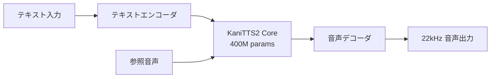

## 概要

音声合成（TTS）技術はこれまで大規模モデルと高性能GPUを必要としてきました。しかし<strong>KaniTTS2</strong>の登場により、この参入障壁が大幅に下がりました。わずか<strong>4億個（400M）のパラメータ</strong>と<strong>3GB VRAM</strong>だけでリアルタイムボイスクローニングが可能なこのモデルは、音声AI民主化の最新事例として注目されています。

nineninesix-aiチームがApache 2.0ライセンスで公開したこのプロジェクトは、事前学習（pretrain）コードまで完全に公開しており、誰でも独自のTTSモデルをゼロから学習できる環境を提供します。

## KaniTTS2の主要スペック

| 項目 | 仕様 |
|------|------|
| パラメータ数 | 400M（BF16） |
| サンプルレート | 22kHz |
| GPU VRAM | 3GB |
| RTF（Real-Time Factor） | ~0.2（RTX 5090基準） |
| 学習データ | 約10,000時間の音声データ |
| 学習時間 | 8x H100で6時間 |
| 対応言語 | 英語、スペイン語（追加言語対応予定） |
| ライセンス | Apache 2.0 |

<strong>RTF（Real-Time Factor）0.2</strong>とは、1秒の音声生成に0.2秒しかかからないことを意味し、リアルタイム会話型ユースケースに十分な性能です。

## なぜKaniTTS2が重要なのか

### 1. 極限の軽量化

従来の高品質TTSモデルは数十億パラメータと10GB以上のVRAMを要求することが多かったです。KaniTTS2は400Mパラメータでこれを実現し、<strong>コンシューマー向けGPU（RTX 3060レベル）</strong>でも動作可能です。

### 2. 完全なオープンソース事前学習フレームワーク

モデルの重みだけでなく、<strong>事前学習コード全体</strong>が公開されています。これにより以下が可能になります：

- 少数言語のためのTTSモデル学習
- 特定ドメイン（医療、法律など）に特化した音声モデル構築
- 特定のアクセントや方言に合わせたカスタマイズ

### 3. ボイスクローニング内蔵

別途のファインチューニングなしでも<strong>ボイスクローニング</strong>機能が内蔵されており、参照音声サンプルさえあれば、その話者の声でテキストを音声に変換できます。

## アーキテクチャと学習プロセス



学習は約10,000時間の音声データを使用し、<strong>8台のH100 GPUでわずか6時間</strong>で完了します。これは大規模TTSモデルの学習が数日から数週間かかることと比較すると非常に効率的です。

## はじめ方

### HuggingFaceからモデルをダウンロード

KaniTTS2は2種類のモデルを提供しています：

- <strong>多言語モデル（Pretrained）</strong>：英語、スペイン語対応
- <strong>英語専用モデル</strong>：ローカルアクセントまで対応する英語特化モデル

```bash
# HuggingFaceからモデルをダウンロード
# 多言語モデル
git clone https://huggingface.co/nineninesix/kani-tts-2-pt

# 英語専用モデル
git clone https://huggingface.co/nineninesix/kani-tts-2-en
```

### HuggingFace Spacesでデモ体験

インストールなしでブラウザから直接体験できます：

- 多言語モデル：[HF Spaces（Pretrained）](https://huggingface.co/spaces/nineninesix/kani-tts-2-pt)
- 英語モデル：[HF Spaces（English）](https://huggingface.co/spaces/nineninesix/kanitts-2-en)

### 独自モデルの学習

事前学習コードを活用すれば、独自のTTSモデルをゼロから学習できます：

```bash
# 事前学習コードをクローン
git clone https://github.com/nineninesix-ai/kani-tts-2-pretrain
cd kani-tts-2-pretrain

# 環境設定と学習開始
# 詳細はリポジトリのREADMEを参照してください
```

## 軽量TTSモデル比較

最近、ローカルで実行可能なTTSモデルが続々と登場しています：

| モデル | パラメータ | VRAM | ボイスクローニング | オープンソース学習コード |
|------|----------|------|:---:|:---:|
| <strong>KaniTTS2</strong> | 400M | 3GB | ✅ | ✅ |
| Bark | ~1B | 6GB+ | ✅ | ❌ |
| XTTS v2 | ~500M | 4GB+ | ✅ | 部分的 |
| Piper | ~60M | <1GB | ❌ | ✅ |

KaniTTS2の差別化ポイントは、<strong>ボイスクローニングと完全な事前学習コード</strong>を同時に提供しながらも軽量モデルを維持している点です。

## 音声AI民主化の意義

KaniTTS2の公開は単なるモデルリリースを超え、音声AI民主化の重要なマイルストーンです：

1. <strong>少数言語のサポート</strong>：事前学習コードの公開により、少数言語コミュニティが独自のTTSモデルを構築できます
2. <strong>コスト障壁の除去</strong>：3GB VRAMで十分なため、高価なGPUなしでもボイスクローニングが可能です
3. <strong>研究の加速</strong>：完全な学習パイプラインの公開はTTS研究の再現性と発展速度を高めます
4. <strong>個人のプライバシー</strong>：クラウドAPIの代わりにローカルで実行できるため、音声データのプライバシーが保証されます

## 結論

KaniTTS2は<strong>「小さくても強い」</strong>モデルの典型を示しています。400Mパラメータでボイスクローニングまで可能なこのモデルは、大型モデルだけが高品質音声合成を提供できるという通念に挑戦します。

特に事前学習コードの完全公開は、音声AIエコシステム全体にポジティブな影響を与えると予想されます。少数言語のサポート、特定ドメインの最適化、そしてパーソナライズされた音声アシスタントの構築など、多様なユースケースが期待されます。

ローカルAIがますます強力になる今、KaniTTS2は音声AI分野でも<strong>「ローカルファースト」</strong>が現実になりつつあることを証明しています。

## 参考資料

- [KaniTTS2 Pretrained Model（HuggingFace）](https://huggingface.co/nineninesix/kani-tts-2-pt)
- [KaniTTS2 English Model（HuggingFace）](https://huggingface.co/nineninesix/kani-tts-2-en)
- [KaniTTS2 Pretrain Code（GitHub）](https://github.com/nineninesix-ai/kani-tts-2-pretrain)
- [Reddit: KaniTTS2 Discussion（r/LocalLLaMA）](https://www.reddit.com/r/LocalLLaMA/comments/1r4sivv/kanitts2_opensource_400m_tts_model_with_voice/)
