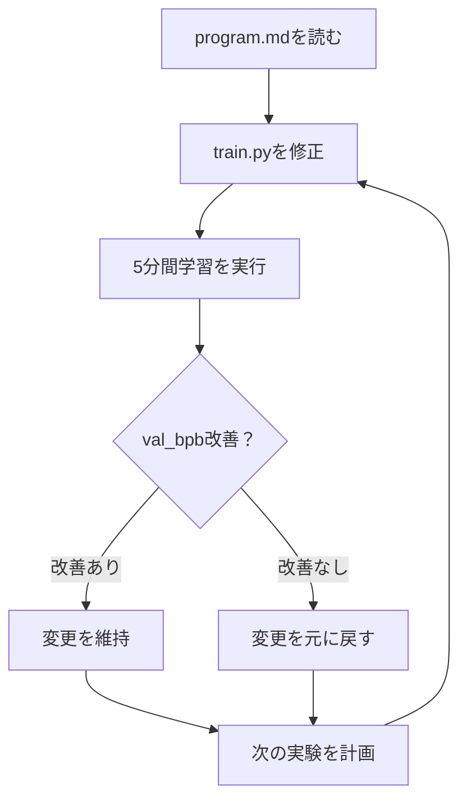

## 概要

2026年3月、Andrej Karpathy（元Tesla AIディレクター、OpenAI共同創業者）が [autoresearch](https://github.com/karpathy/autoresearch) をオープンソースとして公開しました。このプロジェクトの核心はシンプルです — <strong>AIエージェントにGPU1台と学習コードを渡し、一晩自律的に実験させること</strong>です。

エージェントはコードを修正し、5分間学習を回し、結果を評価し、改善されていれば維持し、そうでなければ元に戻します。このサイクルが1時間あたり約12回、一晩で約100回繰り返されます。公開直後にGitHubで8,000以上のスターを獲得し、3月8〜9日の夜にはHyperspaceネットワーク上で35のエージェントが333件の実験を完全無人で実行しました。

この記事では、autoresearchのアーキテクチャと動作原理を分析し、Engineering Managerの視点からR&Dチームにどのような影響を与えるかを考察します。

## autoresearchの設計思想

Karpathyの設計思想は<strong>「1つのGPU、1つのファイル、1つのメトリクス」</strong>に集約されます。

### なぜ630行なのか？

autoresearchの学習コード全体（`train.py`）は約630行です。これは意図的な制約です：

- 現代のLLMのコンテキストウィンドウ（128K+トークン）にコード全体が収まる
- エージェントがコード全体を「理解」した状態で修正が可能
- 修正範囲が限定されるためデバッグと変更追跡が容易

```python
# train.py — エージェントが修正する唯一のファイル
# GPTモデル定義、Muon + AdamWオプティマイザ、学習ループをすべて含む
# 約630行で構成 — LLMコンテキストウィンドウに完全に収容可能
```

### コアファイル構成

```
autoresearch/
├── prepare.py    # データ準備（1回実行）— トークナイザ学習、データローディング
├── train.py      # 学習コード — エージェントが修正する唯一のファイル
└── program.md    # エージェント指示文 — 人間が記述する「研究方針書」
```

各ファイルの役割が明確に分離されています：

- <strong>prepare.py</strong>：データセットのダウンロード、BPEトークナイザ学習、データローディングユーティリティ。人間もエージェントも修正しない固定インフラ
- <strong>train.py</strong>：GPTモデル全体、オプティマイザ（Muon + AdamW）、学習ループ。エージェントが修正する唯一のファイル
- <strong>program.md</strong>：人間が記述するマークダウン指示文。エージェントの研究方向を決定する「研究方針書」

## エージェント実験ループ

autoresearchの自律実験サイクルは以下のように動作します：



### 5分固定タイムバジェット

すべての実験は正確に5分間実行されます。この制約が重要です：

- アーキテクチャの変更でもハイパーパラメータの調整でも同一のタイムバジェット
- 実験間の公平な比較が可能
- 1時間あたり12実験 × 8時間 = 一晩で約100件の実験

### 評価メトリクス：val_bpb

<strong>val_bpb</strong>（validation bits per byte）は語彙サイズに依存しない評価指標です。トークナイザを変更したりアーキテクチャを完全に変えても一貫した比較が可能です。値が低いほど良い性能を意味します。

## EMの視点：R&Dチームへの示唆

Engineering Managerとしてautoresearchを見ると、単なる「面白いプロジェクト」を超える構造的変化のシグナルが見えてきます。

### 1. 繰り返し作業の自動化であり、思考の自動化ではない

autoresearchが自動化するのは<strong>「修正→学習→評価」の反復ループ</strong>です。研究者が依然として担うべきことは：

- `program.md`に実験の方向性を設定すること
- 結果を解釈し次の研究方向を決定すること
- 成功した実験からインサイトを抽出すること

これは<strong>「反復の自動化」</strong>であり<strong>「思考の自動化」</strong>ではありません。EMがチームメンバーに伝えるべき核心的なメッセージでもあります。

### 2. 研究生産性の再定義

従来のMLリサーチワークフローと比較してみましょう：

| 項目 | 従来の方式 | autoresearch |
|------|----------|--------------|
| 実験実行 | 手動（コード修正 → 学習 → 待機） | 自動（エージェントが連続実行） |
| 1日の実験回数 | 3〜5件 | 100件以上 |
| 研究者の役割 | 実行 + 分析 | 方向設定 + 分析 |
| 夜間/週末活用 | 長時間学習1件 | 短時間実験100件 |
| 失敗コスト | 時間の浪費（数時間） | 5分（自動ロールバック） |

### 3. チーム導入時の考慮事項

autoresearchをR&Dチームに導入する場合、以下を考慮する必要があります：

<strong>技術的要件</strong>：
- NVIDIA GPU 1台（H100で検証済み）
- Python 3.10+、PyTorch
- `uv`パッケージマネージャ

<strong>組織的な考慮事項</strong>：
- `program.md`の記述能力がそのまま研究力 — 良い指示文を書けるシニアリサーチャーが必要
- 実験結果の解釈と次の方向性の設定は依然として人間の仕事
- 「一晩100件の実験」が必ずしも「より良い研究」を意味するわけではない

## 実践活用ガイド

### 基本セットアップ（5分で開始）

```bash
# 1. リポジトリをクローンし依存関係をインストール
git clone https://github.com/karpathy/autoresearch.git
cd autoresearch
uv sync

# 2. データ準備（約2分）
uv run prepare.py

# 3. 手動テスト（GPU動作確認）
uv run train.py
```

### program.mdの記述例

`program.md`はエージェントの研究方向を決定する重要なファイルです。良い指示文の例：

```markdown
# Research Direction

## Goal
Reduce val_bpb by optimizing the attention mechanism.

## Constraints
- Do not change the tokenizer or vocabulary size
- Keep total training time under 5 minutes
- Maintain model parameter count within 2x of baseline

## Suggested Experiments
1. Try multi-head attention with different head counts
2. Experiment with rotary position embeddings
3. Test grouped query attention (GQA)
```

### 結果分析

一晩実行後、エージェントが残したログを分析します。各実験でのval_bpbの変化、適用された変更内容、成功/失敗の状況を確認できます。

## より広い文脈：AI研究の自動化トレンド

autoresearchは孤立した現象ではありません。2026年初頭のAI業界で見られる<strong>「AIがAIを研究する」</strong>トレンドの一部です：

- <strong>Anthropic Code Review</strong>：マルチエージェントシステムがAI生成コードを自動分析し、ロジックエラーを検出
- <strong>OpenAIの自動レッドチーミング</strong>：AIモデルが別のAIモデルの脆弱性を自動的に探索
- <strong>GoogleのAutoML進化</strong>：ニューラルネットワークアーキテクチャ自体をAIが設計

autoresearchの差別化ポイントは<strong>アクセシビリティ</strong>です。H100が1台と630行のコードだけで、誰でもこのパラダイムを体験できます。これが8,000以上のGitHubスターを短期間で集めた理由でもあります。

## まとめ

Karpathyのautoresearchは、MLリサーチの「反復実行」部分をエージェントに委任する実用的なフレームワークです。630行という意図的な制約、5分固定タイムバジェット、単一メトリクスでの比較など、設計思想が明確です。

EM/VPoEの視点から注目すべき点は：

1. <strong>研究生産性の定義の変化</strong>：「1日に何件の実験を回したか」から「どれほど良い実験方向を設定したか」へ
2. <strong>シニアリサーチャーの役割変化</strong>：自ら実験を回す人からエージェントの研究方向を設計する人へ
3. <strong>GPU遊休時間の価値</strong>：夜間/週末のGPU遊休時間が100件の実験機会に転換

「一晩100件の実験」という数値自体よりも、<strong>研究者の役割が「実行」から「方向設定」へ移行</strong>しているという構造的変化に注目すべきです。

## 参考資料

- [karpathy/autoresearch (GitHub)](https://github.com/karpathy/autoresearch)
- [Andrej Karpathy Open-Sources 'Autoresearch' (MarkTechPost)](https://www.marktechpost.com/2026/03/08/andrej-karpathy-open-sources-autoresearch-a-630-line-python-tool-letting-ai-agents-run-autonomous-ml-experiments-on-single-gpus/)
- [Karpathy Just Turned One GPU Into a Research Lab (Garry's List)](https://garryslist.org/posts/karpathy-just-turned-one-gpu-into-a-research-lab-f55754a6)
- [Autoresearch: Karpathy's Overnight AI Researcher (Top AI Product)](https://topaiproduct.com/2026/03/07/autoresearch-karpathys-overnight-ai-researcher-that-runs-100-experiments-while-you-sleep/)
