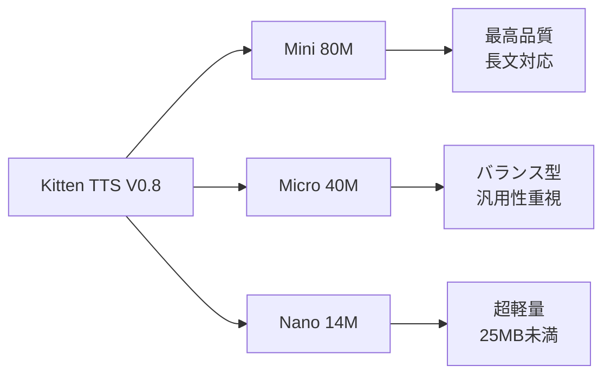
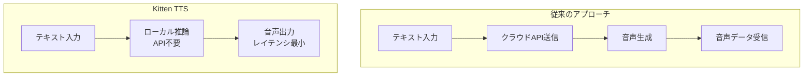
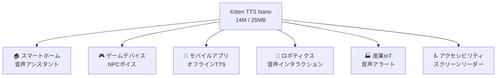

## 概要

音声AI分野で「小さいは正義」の時代が到来しました。<strong>Kitten TTS V0.8</strong>は、わずか<strong>14Mパラメータ・25MB未満</strong>というサイズでありながら、クラウドTTSに匹敵する品質を実現した超小型テキスト音声変換モデルです。

KaniTTS2、Qwen3-TTS.cpp、FreeFlowといったローカル音声AIモデルが次々と登場する中、Kitten TTSはその極限的な軽量性で新たな地平を切り開きます。本記事では、Kitten TTS V0.8の技術的特徴、3つのモデルバリアント比較、そしてエッジデバイス展開の可能性について徹底分析します。

## Kitten TTS V0.8とは

[Kitten ML](https://github.com/KittenML/KittenTTS)が開発したオープンソースTTSモデルで、Apache 2.0ライセンスで公開されています。V0.1からV0.8へのメジャーアップデートにより、品質・表現力・リアリティが大幅に向上しました。

### 3つのモデルバリアント



| モデル | パラメータ数 | サイズ | 特徴 |
|--------|-------------|--------|------|
| <strong>Mini</strong> | 80M | ~150MB | 最高品質・長文チャンクでも高い表現力 |
| <strong>Micro</strong> | 40M | ~80MB | 品質とサイズのバランス |
| <strong>Nano</strong> | 14M | <strong><25MB</strong> | 超軽量・エッジデバイス最適 |

3モデルすべてに<strong>8つの表現力豊かな音声</strong>（女性4声・男性4声）が搭載されています。現時点では英語対応で、多言語サポートは今後のリリースで追加予定です。

## 技術的な注目ポイント

### 1. CPU専用実行が可能

「GPUは不要」どころか、<strong>リソース制約のあるエッジデバイスでの動作を前提に設計</strong>されています。Raspberry PiやIoTデバイスのような低スペック環境でも動作可能であり、GPU環境がない開発者にとって大きな朗報です。

### 2. クラウドTTS品質のオンデバイス実現



クラウドAPIを一切使用せず、完全にデバイス上で推論を完結させます。これにより：

- <strong>レイテンシの大幅削減</strong>：ネットワーク往復不要
- <strong>プライバシーの確保</strong>：音声データが外部に送信されない
- <strong>コスト削減</strong>：API課金ゼロ
- <strong>オフライン動作</strong>：ネットワーク接続不要

### 3. V0.1からの進化

V0.8では以下の改善が実施されました：

- <strong>10倍の学習データセット</strong>：データ量の大幅拡充
- <strong>改良されたトレーニングパイプライン</strong>：最適化手法の刷新
- <strong>品質・表現力・リアリティの向上</strong>：自然な韻律とイントネーション

## ローカル音声AIトレンドの中での位置づけ

2025年から2026年にかけて、音声AIのローカル化が急速に進んでいます。

| モデル | 特徴 | サイズ感 |
|--------|------|---------|
| <strong>KaniTTS2</strong> | 日本語特化の高品質TTS | 中〜大規模 |
| <strong>Qwen3-TTS.cpp</strong> | 多言語対応・llama.cpp統合 | 中規模 |
| <strong>FreeFlow</strong> | 自然なプロソディ・感情表現 | 中規模 |
| <strong>Kitten TTS V0.8</strong> | <strong>極限的軽量化でSOTA品質</strong> | <strong>超小規模（14M〜80M）</strong> |

Kitten TTSの最大の差別化ポイントは<strong>サイズ</strong>です。14Mパラメータ・25MB未満というサイズは、他のどのモデルとも次元が違います。

## エッジデバイス展開の可能性

### ユースケース分析



### 具体的な展開シナリオ

<strong>1. スマートホームデバイス</strong>

25MB未満のモデルサイズは、ESP32のような低コストマイクロコントローラでも動作可能な領域です。クラウド接続不要のローカル音声アシスタントの実現が視野に入ります。

<strong>2. モバイルアプリケーション</strong>

アプリバンドルに含めても問題ないサイズ感で、オフライン環境でもTTS機能を提供できます。通信環境の悪い地域でのアクセシビリティ向上に貢献します。

<strong>3. ボイスエージェント</strong>

ローカル推論による低レイテンシTTSは、対話型音声エージェントにとって理想的です。LLMと組み合わせることで、完全ローカルの音声対話システムが構築可能です。

## クイックスタート

```bash
# リポジトリのクローン
git clone https://github.com/KittenML/KittenTTS.git
cd KittenTTS

# モデルのダウンロード（Nanoモデル）
# HuggingFaceからダウンロード
# https://huggingface.co/KittenML/kitten-tts-nano-0.8
```

HuggingFaceで公開されている3つのモデル：

- [Mini 80M](https://huggingface.co/KittenML/kitten-tts-mini-0.8) — 最高品質
- [Micro 40M](https://huggingface.co/KittenML/kitten-tts-micro-0.8) — バランス型
- [Nano 14M](https://huggingface.co/KittenML/kitten-tts-nano-0.8) — 超軽量

## 今後の展望

Kitten TTS V0.8は英語のみの対応ですが、今後のリリースで<strong>多言語サポート</strong>が予定されています。日本語対応が実現すれば、日本のエッジAI市場に大きなインパクトを与えるでしょう。

また、Apache 2.0ライセンスのため、商用利用も自由です。スタートアップから大企業まで、音声機能をプロダクトに組み込む際のハードルが大幅に下がります。

## 結論

Kitten TTS V0.8は、<strong>「小さいモデルでも高品質」</strong>という新たなパラダイムを体現するモデルです。14Mパラメータ・25MB未満という驚異的なコンパクトさでありながら、クラウドTTSに匹敵する品質を実現しています。

KaniTTS2、Qwen3-TTS.cpp、FreeFlowに続く音声AIローカル化トレンドの中で、Kitten TTSは<strong>エッジデバイス展開の決定版</strong>として際立った存在です。GPU不要、API不要、完全ローカルで動作する超小型TTSモデルは、音声AI民主化の次の一歩を示しています。

## 参考資料

- [Kitten TTS GitHub リポジトリ](https://github.com/KittenML/KittenTTS)
- [Reddit — Kitten TTS V0.8 リリーススレッド](https://www.reddit.com/r/LocalLLaMA/comments/1r8pztp/kitten_tts_v08_is_out_new_sota_supertiny_tts/)
- [HuggingFace — Kitten TTS Mini 0.8](https://huggingface.co/KittenML/kitten-tts-mini-0.8)
- [HuggingFace — Kitten TTS Micro 0.8](https://huggingface.co/KittenML/kitten-tts-micro-0.8)
- [HuggingFace — Kitten TTS Nano 0.8](https://huggingface.co/KittenML/kitten-tts-nano-0.8)
