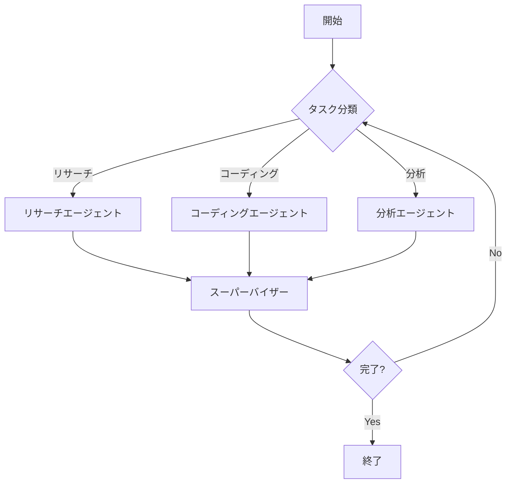
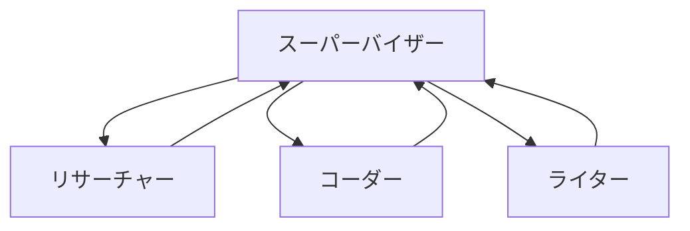

## 概要

AI エージェントシステムの構築において、単一のエージェントでは対応できない複雑なタスクが増えています。LangGraph は、複数の AI エージェントを協調させて動作させるための<strong>プロダクション対応のグラフベースオーケストレーションフレームワーク</strong>です。

従来のチェーン型アプローチとは異なり、LangGraph は<strong>ステートフルなグラフ構造</strong>を採用しており、循環的なワークフローや条件分岐を柔軟に実装できます。LinkedIn、Uber、Replit、Klarna、Elastic といった大手企業が本番環境で採用しており、その信頼性と拡張性が証明されています。

本記事では、LangGraph の核心概念から実践的なマルチエージェントパターン、プロダクション展開のベストプラクティスまで、包括的に解説します。

## LangGraph の核心概念

### グラフベースアーキテクチャ

LangGraph の最大の特徴は、<strong>グラフ構造によるワークフロー定義</strong>です。従来の LangChain のチェーン型アプローチでは線形的な処理しか実現できませんでしたが、LangGraph では以下が可能になります。

- <strong>ノード</strong>: エージェントやタスクを表現
- <strong>エッジ</strong>: ノード間の遷移を定義
- <strong>条件分岐</strong>: 実行時の状態に基づいた動的ルーティング
- <strong>循環フロー</strong>: フィードバックループや反復処理



### 状態管理システム

LangGraph は<strong>ステートフルな実行環境</strong>を提供します。すべてのエージェントが共有する状態オブジェクトを通じて、以下の機能を実現します。

1. <strong>チェックポイント機能</strong>: 任意の時点で状態を保存・復元
2. <strong>Human-in-the-Loop</strong>: 人間の介入ポイントを設定
3. <strong>エラーハンドリング</strong>: 失敗時のリトライや代替フロー
4. <strong>ストリーミング</strong>: リアルタイムな進捗状況の取得

### ノードとエッジ

ノードは Python の関数として定義され、エッジは `add_edge()` や `add_conditional_edges()` で追加します。

```python
from langgraph.graph import StateGraph, END
from typing import TypedDict, Annotated
import operator

# 状態の定義
class AgentState(TypedDict):
    messages: Annotated[list, operator.add]
    next_agent: str
    task_result: dict

# グラフの構築
workflow = StateGraph(AgentState)

# ノードの追加
workflow.add_node("supervisor", supervisor_agent)
workflow.add_node("researcher", research_agent)
workflow.add_node("coder", coding_agent)

# エッジの追加 (条件分岐)
workflow.add_conditional_edges(
    "supervisor",
    lambda x: x["next_agent"],
    {
        "researcher": "researcher",
        "coder": "coder",
        "FINISH": END
    }
)
```

## マルチエージェントアーキテクチャパターン

### 1. スーパーバイザーパターン

<strong>最も一般的なパターン</strong>で、中央のスーパーバイザーエージェントが他のワーカーエージェントを調整します。

<strong>メリット</strong>:
- シンプルな制御フロー
- タスクの優先順位付けが容易
- デバッグしやすい

<strong>ユースケース</strong>: カスタマーサポート、コンテンツ生成、データ分析パイプライン



### 2. 階層的パターン

複数のスーパーバイザーを階層的に配置し、<strong>大規模システムをモジュール化</strong>します。

<strong>メリット</strong>:
- スケーラビリティ
- 責任の分離
- 並列処理の最適化

<strong>ユースケース</strong>: エンタープライズアプリケーション、複雑なワークフロー自動化

### 3. ネットワークパターン

エージェント同士が<strong>ピアツーピアで通信</strong>し、自律的に協調します。

<strong>メリット</strong>:
- 柔軟性
- 障害耐性
- 動的な役割分担

<strong>ユースケース</strong>: シミュレーション、分散問題解決、創発的行動が必要なタスク

### 4. スワームパターン

多数の単純なエージェントが<strong>集団知性</strong>を発揮します。

<strong>メリット</strong>:
- 並列処理による高速化
- ロバスト性
- スケーラビリティ

<strong>ユースケース</strong>: データマイニング、最適化問題、大規模検索

## 実践コード例

### 基本的なマルチエージェントシステム

以下は、リサーチとコーディングを協調させるシンプルなシステムの実装です。

```python
from langgraph.graph import StateGraph, END
from langchain_openai import ChatOpenAI
from langchain.prompts import ChatPromptTemplate
from typing import TypedDict, Annotated, Literal
import operator

# 状態の型定義
class AgentState(TypedDict):
    messages: Annotated[list, operator.add]
    next: str
    research_output: str
    code_output: str

# LLMの初期化
llm = ChatOpenAI(model="gpt-4", temperature=0)

# スーパーバイザーエージェント
def supervisor_agent(state: AgentState) -> AgentState:
    """タスクを分析し、次のエージェントを決定"""
    prompt = ChatPromptTemplate.from_messages([
        ("system", """あなたはタスク管理者です。以下のエージェントから適切なものを選択してください:
        - researcher: 情報収集が必要な場合
        - coder: コード実装が必要な場合
        - FINISH: タスクが完了した場合
        """),
        ("human", "{messages}")
    ])

    result = llm.invoke(
        prompt.format(messages=state["messages"][-1])
    )

    # 次のエージェントを決定 (簡略化)
    if "リサーチ" in result.content or "調査" in result.content:
        next_agent = "researcher"
    elif "コード" in result.content or "実装" in result.content:
        next_agent = "coder"
    else:
        next_agent = "FINISH"

    return {"next": next_agent}

# リサーチエージェント
def research_agent(state: AgentState) -> AgentState:
    """情報収集を実行"""
    prompt = ChatPromptTemplate.from_messages([
        ("system", "あなたは専門的なリサーチャーです。正確な情報を収集してください。"),
        ("human", "{messages}")
    ])

    result = llm.invoke(
        prompt.format(messages=state["messages"][-1])
    )

    return {
        "messages": [f"[リサーチ結果]: {result.content}"],
        "research_output": result.content
    }

# コーディングエージェント
def coding_agent(state: AgentState) -> AgentState:
    """コード実装を実行"""
    prompt = ChatPromptTemplate.from_messages([
        ("system", "あなたはエキスパートプログラマーです。高品質なコードを生成してください。"),
        ("human", "{messages}\n\nリサーチ結果: {research}")
    ])

    result = llm.invoke(
        prompt.format(
            messages=state["messages"][-1],
            research=state.get("research_output", "")
        )
    )

    return {
        "messages": [f"[コード生成]: {result.content}"],
        "code_output": result.content
    }

# グラフの構築
workflow = StateGraph(AgentState)

# ノードの追加
workflow.add_node("supervisor", supervisor_agent)
workflow.add_node("researcher", research_agent)
workflow.add_node("coder", coding_agent)

# エントリーポイントの設定
workflow.set_entry_point("supervisor")

# 条件分岐エッジの追加
workflow.add_conditional_edges(
    "supervisor",
    lambda x: x["next"],
    {
        "researcher": "researcher",
        "coder": "coder",
        "FINISH": END
    }
)

# ワーカーからスーパーバイザーへ戻る
workflow.add_edge("researcher", "supervisor")
workflow.add_edge("coder", "supervisor")

# コンパイル
app = workflow.compile()

# 実行例
initial_state = {
    "messages": ["LangGraphについて調査し、簡単なサンプルコードを書いてください"],
    "next": "",
    "research_output": "",
    "code_output": ""
}

# ストリーミング実行
for output in app.stream(initial_state):
    for key, value in output.items():
        print(f"ノード '{key}' の出力:")
        print(value)
        print("---")
```

### 階層的システムの実装

複雑なタスクを複数のスーパーバイザーで管理する階層構造の例です。

```python
from langgraph.graph import StateGraph, END
from typing import TypedDict, Annotated
import operator

# 階層的状態の定義
class HierarchicalState(TypedDict):
    task: str
    subtasks: Annotated[list, operator.add]
    results: dict
    current_supervisor: str

# トップレベルスーパーバイザー
def top_supervisor(state: HierarchicalState) -> HierarchicalState:
    """タスクをサブタスクに分解し、担当スーパーバイザーを割り当て"""
    task = state["task"]

    # タスク分析 (実際にはLLMを使用)
    if "開発" in task:
        supervisor = "dev_supervisor"
        subtasks = ["設計", "実装", "テスト"]
    elif "マーケティング" in task:
        supervisor = "marketing_supervisor"
        subtasks = ["調査", "戦略立案", "実行"]
    else:
        supervisor = "general_supervisor"
        subtasks = ["分析", "実行"]

    return {
        "subtasks": subtasks,
        "current_supervisor": supervisor
    }

# 開発スーパーバイザー
def dev_supervisor(state: HierarchicalState) -> HierarchicalState:
    """開発関連のサブタスクを管理"""
    subtasks = state["subtasks"]
    results = {}

    for subtask in subtasks:
        # 各サブタスクをワーカーエージェントに割り当て
        if subtask == "設計":
            results[subtask] = design_agent(subtask)
        elif subtask == "実装":
            results[subtask] = implementation_agent(subtask)
        elif subtask == "テスト":
            results[subtask] = testing_agent(subtask)

    return {"results": results}

# ワーカーエージェント (簡略化)
def design_agent(task: str) -> str:
    return f"設計完了: {task}"

def implementation_agent(task: str) -> str:
    return f"実装完了: {task}"

def testing_agent(task: str) -> str:
    return f"テスト完了: {task}"

# 階層的グラフの構築
hierarchical_workflow = StateGraph(HierarchicalState)

hierarchical_workflow.add_node("top_supervisor", top_supervisor)
hierarchical_workflow.add_node("dev_supervisor", dev_supervisor)

hierarchical_workflow.set_entry_point("top_supervisor")

hierarchical_workflow.add_conditional_edges(
    "top_supervisor",
    lambda x: x["current_supervisor"],
    {
        "dev_supervisor": "dev_supervisor",
        "END": END
    }
)

hierarchical_workflow.add_edge("dev_supervisor", END)

hierarchical_app = hierarchical_workflow.compile()

# 実行
result = hierarchical_app.invoke({
    "task": "新機能の開発",
    "subtasks": [],
    "results": {},
    "current_supervisor": ""
})

print(result)
```

## プロダクション展開ガイド

### 必須考慮事項

1. <strong>状態の永続化</strong>
   - データベースバックエンド (PostgreSQL、Redis) の使用
   - チェックポイント戦略の設計
   - 状態のバージョニング

2. <strong>エラーハンドリング</strong>
   - タイムアウト設定
   - リトライロジック
   - フォールバックエージェント

3. <strong>監視とロギング</strong>
   - LangSmith との統合
   - メトリクスの収集 (レイテンシ、成功率)
   - トレーシング

4. <strong>スケーリング</strong>
   - 並列実行の最適化
   - キューイングシステムの導入
   - リソース管理

### ベストプラクティス

```python
from langgraph.checkpoint.sqlite import SqliteSaver
from langgraph.graph import StateGraph
import logging

# ロギングの設定
logging.basicConfig(level=logging.INFO)
logger = logging.getLogger(__name__)

# チェックポイントの設定
memory = SqliteSaver.from_conn_string(":memory:")

# エラーハンドリング付きノード
def safe_agent(state: AgentState) -> AgentState:
    try:
        # エージェントの処理
        result = process_task(state)
        logger.info(f"タスク成功: {state['task_id']}")
        return result
    except Exception as e:
        logger.error(f"エラー発生: {e}")
        # フォールバック処理
        return fallback_handler(state, e)

# プロダクション対応グラフ
production_workflow = StateGraph(AgentState)
production_workflow.add_node("safe_agent", safe_agent)

# チェックポイント機能を有効化してコンパイル
production_app = production_workflow.compile(checkpointer=memory)

# スレッドIDを使用した実行 (状態の分離)
config = {"configurable": {"thread_id": "user-123-session-456"}}
result = production_app.invoke(initial_state, config=config)

# 状態の復元
restored_state = production_app.get_state(config)
```

## 他のフレームワークとの比較

### LangGraph vs CrewAI

| 特徴 | LangGraph | CrewAI |
|------|-----------|--------|
| <strong>制御レベル</strong> | 高 (グラフ構造を完全制御) | 中 (抽象化されたパターン) |
| <strong>学習曲線</strong> | 急 (柔軟性の代償) | 緩やか (高レベル API) |
| <strong>カスタマイズ性</strong> | 非常に高い | 中程度 |
| <strong>プロダクション対応</strong> | 完全対応 | 発展途上 |
| <strong>適用範囲</strong> | 汎用的 | タスク指向エージェント |

<strong>推奨シナリオ</strong>:
- LangGraph: 複雑なワークフロー、カスタム制御フローが必要な場合
- CrewAI: 素早くプロトタイプを作成したい場合

### LangGraph vs AutoGen

| 特徴 | LangGraph | AutoGen |
|------|-----------|---------|
| <strong>アーキテクチャ</strong> | グラフベース | 会話ベース |
| <strong>状態管理</strong> | 明示的 | 暗黙的 |
| <strong>デバッグ性</strong> | 高 (明確なフロー) | 中 (会話履歴依存) |
| <strong>スケーラビリティ</strong> | 高 | 中 |
| <strong>コード生成</strong> | 汎用的 | 特化 |

<strong>推奨シナリオ</strong>:
- LangGraph: プロダクション環境、複雑な状態管理が必要な場合
- AutoGen: コード生成タスク、対話的な問題解決

## 実際の使用事例

### LinkedIn

LinkedInは、<strong>求人推薦システム</strong>に LangGraph を活用しています。複数のエージェントが協調して以下を実行:

- ユーザープロフィール分析エージェント
- 求人マッチングエージェント
- パーソナライゼーションエージェント
- 結果ランキングエージェント

階層的パターンを採用し、数千万のユーザーに対して低レイテンシで推薦を提供しています。

### Uber

Uberは、<strong>カスタマーサポート自動化</strong>に LangGraph を使用しています:

- 問い合わせ分類エージェント
- ナレッジベース検索エージェント
- 回答生成エージェント
- 品質チェックエージェント

Human-in-the-Loop 機能により、複雑なケースでは人間のオペレーターにエスカレーションします。

### Replit

Replitは、<strong>AIペアプログラミング機能</strong>に LangGraph を統合:

- コード理解エージェント
- 提案生成エージェント
- テスト生成エージェント
- リファクタリングエージェント

ストリーミング機能により、リアルタイムな提案を提供しています。

## 結論

LangGraph は、<strong>プロダクション対応のマルチエージェント AI システム</strong>を構築するための強力なフレームワークです。グラフベースのアーキテクチャにより、従来の線形チェーンでは実現困難だった複雑なワークフローを柔軟に実装できます。

### LangGraphを選択すべき場合

- 複雑な条件分岐や循環フローが必要
- ステートフルな実行環境が必要
- プロダクション環境での堅牢性が重要
- 詳細な制御とカスタマイズが必要
- 大規模システムへのスケーラビリティが必要

### 代替フレームワークを検討すべき場合

- シンプルなタスク指向エージェント (CrewAI)
- 主にコード生成タスク (AutoGen)
- 素早いプロトタイピング (CrewAI)

2025年10月のバージョン1.0リリースと LangGraph Platform の GA により、さらなるエンタープライズ機能と安定性が期待されます。マルチエージェントシステムの構築を検討している開発者にとって、LangGraph は最有力の選択肢となるでしょう。

## 参考資料

- [LangGraph 公式ドキュメント](https://langchain-ai.github.io/langgraph/)
- [LangGraph GitHub リポジトリ](https://github.com/langchain-ai/langgraph)
- [LangChain Blog - Multi-Agent Systems](https://blog.langchain.dev/)
- [LangSmith - Deployment and Monitoring](https://smith.langchain.com/)
- [AutoGen vs LangGraph 比較記事](https://microsoft.github.io/autogen/)
- [CrewAI 公式サイト](https://www.crewai.com/)
