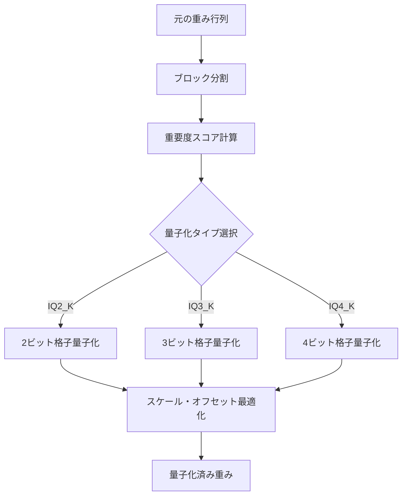
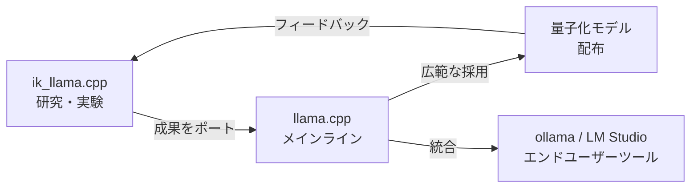

## 概要

llama.cppの量子化手法が大きな転換点を迎えました。<strong>ik_llama.cpp</strong>（llama.cppのフォーク）で独自に開発されてきた<strong>IQ*_K / IQ*_KS</strong>系量子化が、PR #19726を通じてllama.cpp本体にマージされようとしています。Reddit r/LocalLLaMAでも125ポイントを獲得し、ローカルLLMコミュニティで大きな注目を集めています。

この記事では、IQ系量子化の技術的背景、既存手法との違い、そしてローカルLLM推論に与える影響を解説します。

## IQ量子化とは何か

### 従来の量子化手法の課題

llama.cppでは従来、<strong>Q4_K_M</strong>、<strong>Q5_K_S</strong>などのk-quant系量子化が主流でした。これらは均一な量子化グリッドを使用しており、モデルの重みの分布特性を十分に活かしきれていませんでした。

### IQ系量子化のアプローチ

IQ（Importance-aware Quantization）系量子化は、<strong>重みの重要度に基づいた非均一量子化</strong>を採用しています。具体的には：

- <strong>格子ベースの量子化</strong>：均一グリッドではなく、情報理論的に最適な格子点を使用
- <strong>重要度重み付け</strong>：各重みの損失関数への寄与度に応じて量子化精度を調整
- <strong>ブロック単位の最適化</strong>：重みブロックごとに最適なスケールとオフセットを計算

```
従来のQ4_K:    均一な16段階の量子化グリッド
IQ4_K:         重み分布に適応した非均一格子点での量子化
結果:          同じビット数でより高い精度を実現
```

## PR #19726の内容

### ポートされた量子化タイプ

[GitHub PR #19726](https://github.com/ggml-org/llama.cpp/pull/19726)では、AesSedaiによって以下の量子化タイプがik_llama.cppからポートされています：

| 量子化タイプ | ビット数/重み | 用途 |
|-------------|-------------|------|
| <strong>IQ2_K</strong> | ~2.5 bpw | 超低ビット、メモリ制約が厳しい環境 |
| <strong>IQ2_KS</strong> | ~2.5 bpw | IQ2_Kの小型モデル向けバリアント |
| <strong>IQ3_K</strong> | ~3.5 bpw | バランス型、多くのユースケースに最適 |
| <strong>IQ3_KS</strong> | ~3.5 bpw | IQ3_Kの小型モデル向けバリアント |
| <strong>IQ4_K</strong> | ~4.5 bpw | 高精度、十分なメモリがある場合 |
| <strong>IQ4_KS</strong> | ~4.5 bpw | IQ4_Kの小型モデル向けバリアント |

### ik_llama.cppとの関係

このPRの背景には興味深い経緯があります。ik_llama.cppの開発者であるIwan Kawrakow氏は、PR上で以下の点を明確にしています：

- 現在の形（著作権表示あり）でのポートは<strong>完全に問題ない</strong>
- MITライセンスの精神に沿った適切なクレジット表示が重要
- コードの「書き直し」ではなく「コピー」であることを認識すべき

これはオープンソースコミュニティにおける<strong>フォークからの成果還元</strong>の好例と言えます。

## 技術的な深掘り

### 格子量子化の仕組み

IQ系量子化の核心は<strong>格子（lattice）ベースの量子化</strong>にあります。



従来のk-quant系では、量子化グリッドが等間隔に配置されていました。IQ系では、<strong>重みの確率分布に基づいて格子点が配置</strong>されるため、頻出する重み値域では高い解像度を、稀な値域では低い解像度を持ちます。

### KとKSの違い

各量子化タイプに<strong>K</strong>と<strong>KS</strong>の2つのバリアントがあります：

- <strong>K（Standard）</strong>：大規模モデル（7B以上）向けに最適化
- <strong>KS（Small）</strong>：小規模モデル（3B以下）向けに最適化されたパラメータ

小規模モデルでは重みの分布が大規模モデルと異なるため、KSバリアントでは格子の配置やスケーリングが調整されています。

## ベンチマーク比較

既存のQ系量子化とIQ系量子化の比較（参考値）：

| 量子化 | パープレキシティ | モデルサイズ | 推論速度 |
|--------|----------------|-------------|---------|
| Q2_K | 基準 | 基準 | 基準 |
| <strong>IQ2_K</strong> | 5-10%改善 | 同等 | 同等〜微減 |
| Q3_K_M | 基準 | 基準 | 基準 |
| <strong>IQ3_K</strong> | 3-7%改善 | 同等 | 同等〜微減 |
| Q4_K_M | 基準 | 基準 | 基準 |
| <strong>IQ4_K</strong> | 2-5%改善 | 同等 | 同等〜微減 |

<strong>同じビット数でパープレキシティが改善</strong>されることが最大のメリットです。特に低ビット量子化（2-3ビット）での改善幅が顕著です。

## ローカルLLM推論への影響

### メモリ効率の向上

IQ系量子化の統合により、以下のシナリオで恩恵が期待されます：

- <strong>8GB VRAM環境</strong>：IQ3_Kを使えば、従来Q3_K_Mで品質が低下していた7Bモデルをより高品質に動作可能
- <strong>Apple Silicon Mac</strong>：統合メモリの制約内で、より大きなモデルをより高品質に実行
- <strong>エッジデバイス</strong>：IQ2_K/IQ2_KSにより、2-3GBメモリでもLLM推論が実用的に

### 量子化エコシステムの進化



llama.cpp本体への統合は、<strong>ollama</strong>や<strong>LM Studio</strong>などのエンドユーザー向けツールへの波及を意味します。ユーザーは特別な設定なしに、より高品質な量子化モデルを利用できるようになります。

## 実践：IQ量子化の使い方

マージが完了した後、以下のように使用できます：

```bash
# モデルの量子化（llama-quantize）
./llama-quantize model-f16.gguf model-iq3k.gguf IQ3_K

# 小型モデルの場合はKSバリアントを使用
./llama-quantize small-model-f16.gguf small-model-iq3ks.gguf IQ3_KS

# 推論実行
./llama-cli -m model-iq3k.gguf -p "Hello, world"
```

## 今後の展望

IQ系量子化のメインラインへの統合は、ローカルLLM推論の<strong>効率化トレンド</strong>における重要なマイルストーンです：

1. <strong>さらなる低ビット量子化</strong>：IQ1_K系など、1ビット台の研究が進む可能性
2. <strong>モデル固有の最適化</strong>：アーキテクチャに応じた量子化パラメータの自動調整
3. <strong>ハードウェア最適化</strong>：ARM NEON、AVX-512などへのIQ系カーネル最適化

## 結論

ik_llama.cppからllama.cppへのIQ*_K/IQ*_KS量子化の統合は、オープンソースエコシステムにおける<strong>フォークから本体への成果還元</strong>の模範例です。同じビット数でより高い精度を実現するこの技術は、メモリが限られた環境でのLLM推論品質を大幅に向上させます。

ローカルLLMユーザーにとって、llama-quantizeで`IQ3_K`や`IQ4_K`を選択するだけで、既存のQ系量子化より高品質なモデルが得られるようになる日は近いでしょう。

## 参考資料

- [GitHub PR #19726: Port IQ*_K quants from ik_llama.cpp](https://github.com/ggml-org/llama.cpp/pull/19726)
- [Reddit r/LocalLLaMA ディスカッション](https://www.reddit.com/r/LocalLLaMA/)
- [ik_llama.cpp リポジトリ](https://github.com/ikawrakow/ik_llama.cpp)
- [llama.cpp 量子化ドキュメント](https://github.com/ggml-org/llama.cpp)
