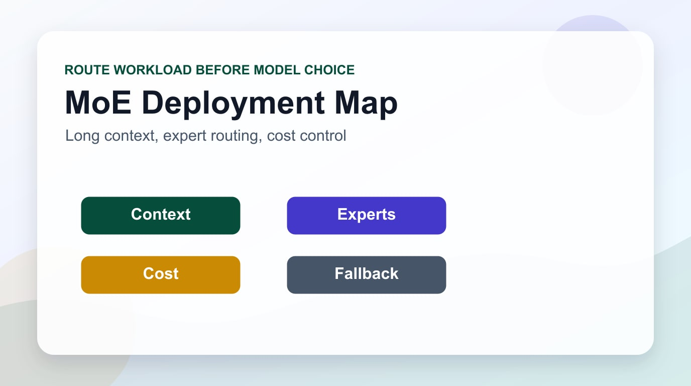

MetaがLlama 4を公開した。MaverickとScoutという2つのモデル、そしてまだリリース前の超大型モデルBehemoth（2兆パラメータ）まで含むこの発表は、単なるモデルアップデートではない。**オープンソースAIが商用最前線モデルと同等水準に達した転換点**だ。Engineering ManagerあるいはCTOとして、この発表をどう読み解くべきかを整理する。

## Llama 4の2モデル: ScoutとMaverick

### Llama 4 Scout

Scoutを一言で表すなら「長い記憶を持つ効率モデル」だ。

- **アクティブパラメータ**: 17B（MoEアーキテクチャ、16 experts）
- **総パラメータ**: 109B
- **コンテキストウィンドウ**: 業界最大 **10Mトークン**
- **ハードウェア**: 単一NVIDIA H100 GPUで動作
- **マルチモーダル**: テキスト＋画像のネイティブサポート

10Mトークンコンテキストは、数字が大きいというだけではない。たとえばGPT-4oのコンテキスト（128K）では、数百ファイルで構成される大型コードベースを一度に読むことは難しい。Scoutなら**中規模プロジェクトのコード全体**を入力に渡せる。Needle-in-a-haystackテストでは8Mトークンまで95%以上の検索精度を維持している。

### Llama 4 Maverick

Maverickは性能を極限まで高めたフラッグシップモデルだ。

- **アクティブパラメータ**: 17B（MoE、128 experts）
- **総パラメータ**: 400B
- **ポジショニング**: コーディング・マルチモーダルでGPT-4oを上回り、推論性能でDeepSeek v3と同等
- **推論コスト**: **$0.19〜$0.49/百万トークン**（GPT-4oの約1/9）

MoE（Mixture of Experts）アーキテクチャにより、総400Bのパラメータを持ちながらトークン処理時に活性化されるのは17Bにすぎない。つまり、**大型モデル水準の性能を小型モデル並みのコストで**実現しているのが核心だ。

## アーキテクチャが重要な理由: MoEの本質

従来のLLMは「Dense」構造だった。すべてのパラメータがすべてのトークン処理に参加する。一方Mixture of Expertsは**専門家ネットワーク（experts）** を複数持ち、入力に応じて一部だけを活性化する。

```
Denseモデル:
入力トークン → [全400Bパラメータ活性化] → 出力

MoEモデル（Maverick）:
入力トークン → [ルーター: 最適expertsを選択] → [17Bのみ活性化] → 出力
               ↑ 128個のexpertsから選択
```

この構造の利点は以下の通りだ。

- **推論コスト削減**: アクティブパラメータが少ないためFLOPsが低い
- **専門化**: 各expertが特定の種類の処理に特化できる
- **スケーラビリティ**: 総パラメータを増やしても推論コストが線形には増加しない

DeepSeekがMoE構造で市場を揺るがして以来、MetaもDeepSeekと同じ方向性を選んだことになる。

## ベンチマーク: 実際のレベルはどこか

Metaが公開したベンチマークによると、Maverickは以下の水準に達している。

<strong>コーディング</strong>: GPT-5.3と同等または一部で優位

<strong>推論</strong>: GPT-5.3比1〜2%ポイント差（MMLU-Pro、GPQA Diamond、MATH）

<strong>マルチモーダル</strong>: GPT-4oを全般的に上回る

ScoutはMaverickより推論性能が8〜12%ポイント低いが、コーディング補助や長文書処理では十分な競争力を持つ。

注意すべき点は**ベンチマークはあくまで参考指標**だということだ。実際のプロダクション環境では、レイテンシ、コンテキスト管理、ファインチューニング可能性といった要素がより重要になることがある。

## コスト比較: エンタープライズの視点

以下は主要モデルの推論コスト比較だ（入出力混合基準、API単価）。

| モデル | 概算コスト/百万トークン |
|--------|----------------------|
| GPT-4o | $2.5〜$10 |
| Claude Sonnet 4.5 | $3〜$15 |
| Llama 4 Maverick | **$0.19〜$0.49** |
| Llama 4 Scout | **$0.10〜$0.20** |

月1億トークンを処理する企業なら、GPT-4o比でMaverickを使うことで**年間数千万円規模のコスト削減**が可能になる。

もちろん、これが単純な「コスト代替」を意味するわけではない。モデル選択はタスクの性質、品質要件、インフラ能力を考慮しなければならない。

## EM/CTOが考慮すべき戦略的フレームワーク

### 1. タスク分類（Task Segmentation）

すべてのAIリクエストに同じモデルを使うのは無駄だ。タスクを3つに分類して最適なモデルを配置するのが賢明だ。

```
Tier 1 — 複雑な推論/創造的作業
  → Claude Opus 4、GPT-5.2などプレミアムモデル

Tier 2 — 一般的なコーディング/分析/文書作成
  → Llama 4 Maverick（コスト効率、高性能）

Tier 3 — 大量処理/単純分類/ログ分析
  → Llama 4 Scout（超低コスト、超長コンテキスト）
```

### 2. データ主権戦略

MaverickとScoutはセルフホスティングが可能だ。IBMやDellとのパートナーシップを通じて、Fortune 500企業はすでにオンプレミス展開を開始している。

社内コードベース、顧客データ、財務データを処理する場合、**商用APIにデータを送ること自体がリスク**だ。このようなユースケースでは、オープンソースLLMのセルフホスティングがコンプライアンスとセキュリティの面で明確な優位性を持つ。

### 3. ベンダー依存脱却

現在AnthropicがAmerican国防総省のサプライチェーンリスクに指定された状況を見ると、**単一ベンダーにAIインフラを依存することのリスク**がいかに大きいかが明確になる。OpenAI、Anthropic、Googleそれぞれの方針変更がエンタープライズに与える影響を最小化するためにも、オープンソースLLM能力を持っておくことが重要だ。

### 4. ファインチューニングによるドメイン特化

ScoutはLoRAアダプターを使えば20GB VRAM以下の環境でもファインチューニングが可能だ。商用モデルAPIでは不可能な**社内知識ベースに基づく特化モデル**を比較的低コストで構築できる。

## 実践的な活用シナリオ

### シナリオA: 大規模コードベース分析

レガシーシステム移行プロジェクトを進めているなら、Scoutの10Mトークンコンテキストを活用してコードベース全体を一度に入力し、依存関係分析、リファクタリング提案、ドキュメント化を自動化できる。

### シナリオB: コスト最適化パイプライン

顧客問い合わせ分類、ログ異常検知、コンテンツモデレーションのような**大量バッチ処理**はMaverickやScoutで十分だ。GPT-5.2が必要なのは複雑な判断が求められるケースの10%未満である可能性が高い。

### シナリオC: プライベートAIアシスタント

金融、法律、医療分野ではデータが外部に出ること自体が問題だ。Llama 4をオンプレミスに展開すれば、ClaudeやGPTに近い性能の社内AIアシスタントを構築できる。

## Behemoth: 次のステップの予告

Metaは2兆パラメータ（総パラメータ基準）のBehemothも予告している。現在のMaverickとScoutはBehemothから知識を蒸留（distillation）したモデルだ。Behemothが公開されれば**オープンソースAIの限界線がまた一段階上がる**と予想される。

## 結論: オープンソースAIは選択ではなく必須能力

Llama 4の登場はいくつかの明確なメッセージを伝えている。

第一に、商用モデル水準の性能をオープンソースで達成できるようになった。選択肢の質が変わった。

第二に、コスト構造が根本的に変わった。AIインフラの経済性計算をやり直す必要がある。

第三に、データ主権とベンダー独立性がより簡単な問題になった。技術的な障壁が下がったということだ。

エンジニアリング組織のマネージャーとして、今がオープンソースLLM能力を内製化する最適なタイミングだ。短期的にはパイロットプロジェクトから始め、中期的にはタスク分類体系を構築し、長期的にはドメイン特化ファインチューニングで競争優位を確保するロードマップを描くことを勧める。

オープンソースAIはもはや「次善策」ではない。戦略的選択肢の一軸となった。

---

*参考資料: [Meta AI公式ブログ](https://ai.meta.com/blog/llama-4-multimodal-intelligence/)、[Llama 4公式ページ](https://www.llama.com/models/llama-4/)、[Hugging Face Llama 4リリース](https://huggingface.co/blog/llama4-release)、[VentureBeat](https://venturebeat.com/ai/metas-answer-to-deepseek-is-here-llama-4-launches-with-long-context-scout-and-maverick-models-and-2t-parameter-behemoth-on-the-way)*
