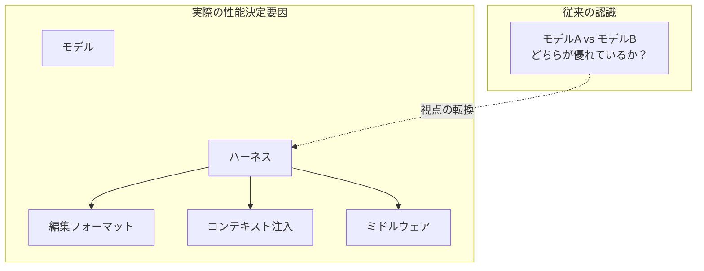
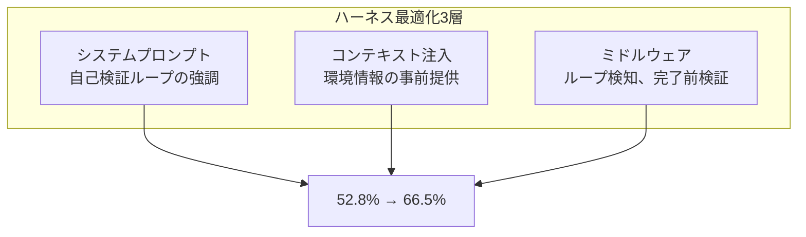

## 概要

「どのLLMがコーディングを一番うまくこなすのか？」

エンジニアリングチームでこの質問が繰り返されるたびに、私たちは重要な変数を一つ見落としています。それは<strong>ハーネス（harness）</strong>です。ハーネスとは、LLMがファイルを読み込み、プロンプトを受け取り、編集を適用する<strong>インターフェースレイヤー</strong>全体を指します。

2026年2月、Can Bolukが発表した「[I Improved 15 LLMs at Coding in One Afternoon. Only the Harness Changed](https://blog.can.ac/2026/02/12/the-harness-problem/)」は、このハーネス問題を正面から取り上げています。編集フォーマットを一つ変えただけで、<strong>15個のLLMのコーディング性能が5〜14ポイント向上</strong>し、<strong>出力トークンは約20%削減</strong>されたというのです。



この記事では、ハーネスエンジニアリングの概念、ベンチマークデータ、そしてEngineering Manager/CTOの観点からの実務適用戦略を整理します。

## ハーネス（Harness）とは何か

ハーネスとは、LLMと実際のコードの間にある<strong>すべてのインフラ</strong>を意味します。

| 構成要素 | 説明 | 例 |
|----------|------|-----|
| 編集フォーマット | モデルがコードを修正する方式 | diff, string_replace, hashline |
| システムプロンプト | モデルに与えられる指示事項 | 自己検証ループ、問題解決戦略 |
| ツールインターフェース | モデルが使用するツール定義 | read_file, edit_file, run_test |
| コンテキスト注入 | 環境情報の事前提供 | ディレクトリ構造、評価基準 |
| ミドルウェア | 実行フロー制御 | ループ検知、完了前検証 |

核心はこれです：<strong>同じモデルでもハーネスによって性能が劇的に変わります。</strong>

Aiderベンチマークで編集フォーマットだけを変えた際、GPT-4 Turboの精度が<strong>26%から59%へ</strong>跳ね上がった事例がこれを証明しています。

## 3つの編集フォーマット比較

現在の主要AIコーディングツールは、それぞれ異なる編集フォーマットを使用しています。

### 1. apply_patch（OpenAI Codex方式）

OpenAIがCodexで使用するdiffベースのパッチフォーマットです。モデルが修正内容をunified diff形式で出力し、ハーネスがこれをパースしてファイルに適用します。

<strong>メリット</strong>：diffに慣れたモデルは安定して動作します。
<strong>デメリット</strong>：diffフォーマットの学習が不足しているモデルでは高い失敗率を示します。Grok 4は<strong>50.7%の失敗率</strong>を記録しました。

### 2. string_replace（Claude Code、Gemini方式）

検索文字列と置換文字列を正確に指定する方式です。Claude Codeの`str_replace`ツールが代表的です。

<strong>メリット</strong>：直感的で実装がシンプルです。
<strong>デメリット</strong>：スペース一つ、インデント一つでも間違えると「String to replace not found」エラーが発生します。<strong>完全な文字列の再現</strong>が求められます。

### 3. hashline（新しいアプローチ）

Can Bolukが提案した方式で、ファイルの各行に2〜3桁のコンテンツハッシュを付与します。

```
11:a3|function hello() {
22:f1|  return "world";
33:0e|}
```

モデルはソースコード全体を再現する代わりに、<strong>ハッシュタグを参照</strong>して修正位置を指定します。「行`2:f1`を置換」や「`3:0e`の後に挿入」といった方式です。

<strong>メリット</strong>：
- 完全な文字列の再現が不要 → エラー削減
- ファイル状態が変更されるとハッシュ不一致で自動検知 → コンフリクト防止
- 出力トークン約20%削減

<strong>デメリット</strong>：すべてのモデルで同一の効果を保証するわけではありません（GPT-3.5はハッシュの再現自体に困難を示します）。

## ベンチマーク結果が示すもの

Can Bolukのベンチマークは、180個のタスクを16モデル × 3編集フォーマットでそれぞれ3回実行した結果です。

| モデル | 既存フォーマット | hashlineフォーマット | 改善幅 |
|--------|-----------------|---------------------|--------|
| Grok Code Fast 1 | 6.7% | 68.3% | +61.6pp |
| Gemini 3 Flash | — | 78.3% | — |
| Grok 4 | 低い | 向上 | 出力トークン61%削減 |
| MiniMax | — | 2倍向上 | — |

<strong>Grok Code Fast 1のケースが特に衝撃的です。</strong>モデル自体は同じなのに、編集フォーマットを変えただけで<strong>6.7%から68.3%へ10倍向上</strong>したのです。これがハーネスエンジニアリングのポテンシャルです。

### Cursorの認識

この問題の深刻さを最もよく示す事例はCursorです。Cursorは編集失敗を修正するために<strong>別途70Bパラメータのニューラルネットワーク</strong>をデプロイしました。編集フォーマットの問題を認め、それを補完するために一つの大規模モデルを追加投入したのです。

## ハーネスエンジニアリング実践事例：LangChainのTerminal Bench

ハーネス最適化の実際の効果を示すもう一つの事例があります。LangChainチームはTerminal Bench 2.0で<strong>モデルを交換せずハーネスのみを最適化</strong>し、<strong>52.8%から66.5%へ13.7ポイント向上</strong>させました。リーダーボードのTop 30からTop 5へ躍進したのです。

彼らが使用したハーネス最適化手法は3つでした：



### 1. 自己検証ループ

エージェントは最初のもっともらしいソリューションですぐに終了しようとする傾向があります。LangChainは「ビルド-検証-修正」ループをシステムプロンプト、コンテキスト注入、ミドルウェアの3層すべてで強制しました。

### 2. 推論コンピュート配分戦略（"Reasoning Sandwich"）

すべてのステップに均一に高い推論を割り当てる代わりに、<strong>戦略的に配分</strong>しました：

- <strong>計画フェーズ</strong>：最高レベル（xhigh）
- <strong>実装フェーズ</strong>：高い（high）
- <strong>検証フェーズ</strong>：最高レベル（xhigh）

この「サンドイッチ」戦略が均一なxhigh推論より<strong>より良い結果</strong>を出しました。タイムアウト制約の中で推論リソースを賢く配分したのです。

### 3. 環境オンボーディング

エージェントに対して新入エンジニアに接するように<strong>環境情報を事前提供</strong>しました：
- 使用可能なツール一覧
- ディレクトリ構造
- 評価基準
- 時間制限

このようにすることで、エージェントが環境を探索するために時間を浪費することを防げます。

## EM/CTOが注目すべき3つの示唆

### 1. モデル交換よりハーネス最適化のROIが高い可能性がある

新しいモデルがリリースされるたびにベンダーを切り替えるよりも、<strong>現行モデルのハーネスを最適化</strong>する方がコスト対効果が大きい可能性があります。モデル交換はAPIキー、プロンプトフォーマット、トークン制限などすべてを再調整する必要がありますが、ハーネス最適化は既存インフラの上で段階的に改善可能です。

### 2. オープンソースハーネスがベンダーロックインより優れている可能性がある

Can Bolukの核心的な主張の一つ：<strong>オープンソースハーネスはコミュニティの多様なモデルユーザーがそれぞれ遭遇する失敗を修正するため</strong>、特定ベンダー専用ハーネスより汎用的により良い性能を発揮します。

一方、AnthropicがOpenCodeをブロックし、Googleが著者のGeminiアカウントを無効化した事例は、ベンダーロックインのリスクを示しています。

### 3.「クールなデモ」と「信頼できるツール」の間のギャップ

> "The gap between 'cool demo' and 'reliable tool' isn't model magic. It's careful, rather boring, empirical engineering at the tool boundary."
> — Can Boluk

CTOとしてAIコーディングツールを評価する際、デモで見せる華やかなコード生成よりも<strong>実際の編集成功率、リトライ比率、トークン効率</strong>を測定すべきです。

## 実務適用ガイド

### チームレベルで実行できること

1. <strong>編集成功率の測定</strong>：AIコーディングツールの編集試行に対する成功率を追跡します。「String not found」エラーが頻発するならハーネスの問題です。

2. <strong>ミドルウェアの導入</strong>：ループ検知、完了前検証、コンテキスト自動注入などのミドルウェアを追加します。

3. <strong>推論戦略の分化</strong>：計画-実装-検証の各フェーズに異なる推論レベルを割り当てます。

4. <strong>トレースベースのデバッグ</strong>：LangSmithのようなツールでエージェントのすべてのアクション、遅延、トークン消費を追跡し、体系的に改善します。

### HNコミュニティで共有された実務ツール

| ツール | 用途 | アプローチ |
|--------|------|------------|
| Serena | コードインテリジェンス | ASTベースの構造分析 |
| RepoMapper | コードベースマッピング | ディレクトリ構造の可視化 |
| Tilth | 編集ツール | ラインハッシュ + セマンティックセクション（17〜25%コスト削減） |
| Tree-sitter統合 | AST認識編集 | ラウンドトリップの大幅削減 |

## まとめ

2026年のAIコーディングツール競争で勝敗を分けるのは「どのモデルを使うか」だけではありません。<strong>そのモデルの上にどのようなハーネスを構築するか</strong>が実質的な性能差を生み出します。

- 編集フォーマット一つで<strong>6.7% → 68.3%</strong>（10倍向上）
- ハーネス最適化だけで<strong>Top 30 → Top 5</strong>（13.7ポイント）
- 出力トークン<strong>20〜61%削減</strong>

Engineering ManagerとしてチームのAIコーディング生産性を高めたいのであれば、次のモデルリリースを待つ前に<strong>現行ハーネスの編集成功率から測定</strong>してみましょう。その数字が意外と多くのことを教えてくれるはずです。

## 参考資料

- [I Improved 15 LLMs at Coding in One Afternoon. Only the Harness Changed](https://blog.can.ac/2026/02/12/the-harness-problem/) — Can Boluk
- [Harness Engineering for Agentic Coding Systems](https://www.zenml.io/llmops-database/harness-engineering-for-agentic-coding-systems) — ZenML
- [Hacker News Discussion](https://news.ycombinator.com/item?id=46988596)
- [Addy Osmani's LLM Coding Workflow 2026](https://medium.com/@addyosmani/my-llm-coding-workflow-going-into-2026-52fe1681325e)
