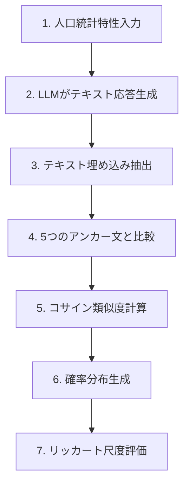
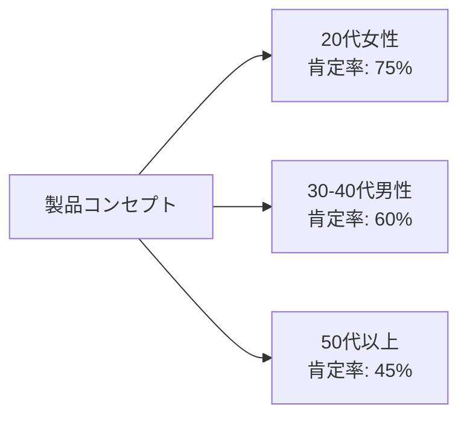

## 概要

消費者調査は企業に毎年数十億ドルのコストを発生させていますが、パネルバイアスと限られた規模という根本的な問題を抱えています。最近arXivに発表された研究は、大規模言語モデル(LLM)を活用して「合成消費者」を生成し、実際の消費者の購買意図を90%の信頼度で再現する革新的な方法論を提示しました。

この研究で提案された<strong>意味的類似度評価(Semantic Similarity Rating, SSR)</strong>手法は、LLMが生成したテキスト応答をリッカート尺度に変換する過程で発生する非現実的な分布問題を解決します。

## 従来の消費者調査の限界

### コストと規模の問題

企業は消費者調査に莫大なコストを投資していますが、以下のような制約に直面しています:

- <strong>高コスト</strong>: 大規模なアンケート調査には時間とコストがかかる
- <strong>パネルバイアス</strong>: 調査参加者が全体の母集団を代表していないことが多い
- <strong>限られた規模</strong>: 十分な統計的信頼性を確保することが困難
- <strong>遅い反応速度</strong>: 市場の変化に迅速に対応できない

### LLMを活用した合成消費者の登場

LLMは様々な人口統計学的特性を持つ「合成消費者」をシミュレートできる可能性を示しました。しかし、初期の研究は重要な問題に直面しました:

<strong>直接的な数値評価の要求時の問題</strong>:
- LLMに「1から5の中から一つを選んでください」と直接尋ねると
- 非現実的に極端または偏った分布が生成される
- 実際の人間の応答パターンと大きく異なる

## SSR手法の革新

### 核心的なアイデア

SSRはLLMの強みである「自然言語生成」を活用しながら、構造化されたアンケートデータの必要性を満たす巧妙なアプローチです。



### 3段階プロセス

#### 第1段階: テキスト応答の生成

LLMに人口統計学的属性(年齢、性別、地域など)と製品コンセプトを提供し、自由形式のテキスト応答を生成します。

<strong>プロンプトの例</strong>:
```
あなたは35歳の女性、東京在住です。
次の新製品に対する購買意図を自由に説明してください:
[製品説明]
```

#### 第2段階: 意味的マッピング

生成されたテキストをOpenAIの`text-embedding-3-small`モデルを使用して埋め込みベクトルに変換します。

#### 第3段階: アンカー文との類似度計算

5つの参照アンカー文(リッカート尺度の各段階に対応)とのコサイン類似度を計算します:

- <strong>1点</strong>: 「全く購入したくありません」
- <strong>2点</strong>: 「あまり購入したくありません」
- <strong>3点</strong>: 「普通です」
- <strong>4点</strong>: 「購入したいです」
- <strong>5点</strong>: 「非常に購入したいです」

計算された類似度値を正規化し、リッカート尺度上の確率分布(PMF)を生成します。

### 数学的表現

コサイン類似度に基づく確率分布生成:

```typescript
function computeLikertDistribution(
  responseEmbedding: number[],
  anchorEmbeddings: number[][]
): number[] {
  // 各アンカーとのコサイン類似度を計算
  const similarities = anchorEmbeddings.map(anchor =>
    cosineSimilarity(responseEmbedding, anchor)
  );

  // ソフトマックスによる正規化
  const probabilities = softmax(similarities);

  return probabilities; // [P(1), P(2), P(3), P(4), P(5)]
}

function cosineSimilarity(vec1: number[], vec2: number[]): number {
  const dotProduct = vec1.reduce((sum, val, i) => sum + val * vec2[i], 0);
  const mag1 = Math.sqrt(vec1.reduce((sum, val) => sum + val * val, 0));
  const mag2 = Math.sqrt(vec2.reduce((sum, val) => sum + val * val, 0));
  return dotProduct / (mag1 * mag2);
}
```

## 実験結果: 驚異的な精度

### データセット

研究チームは、大手パーソナルケア企業が実施した57件の実際の製品アンケート調査を活用しました:
- <strong>総回答数</strong>: 9,300件の人間の回答
- <strong>製品カテゴリー</strong>: パーソナルケア(化粧品、生活用品など)
- <strong>評価指標</strong>: テスト-再テスト信頼性、KS類似度

### 主な成果

<strong>90%の人間テスト-再テスト信頼性を達成</strong>:
- 実際の人間が同じアンケートを2回受けた時の一貫性と比較
- SSR手法が人間の応答一貫性の90%レベルを達成

<strong>KS類似度 > 0.85</strong>:
- Kolmogorov-Smirnov統計を使用して分布類似性を測定
- 0.85以上の高い類似度は、合成応答分布が実際の人間の応答分布と非常に類似していることを意味

### 追加メリット: 質的フィードバック

SSRの独特な利点は、<strong>定量的評価と質的説明を同時に提供</strong>することです:

- リッカート尺度評価だけでなく
- 回答者がなぜそう評価したかについての詳細なテキスト説明も提供
- マーケターは消費者心理をより深く理解できる

## 実践活用事例

### 1. 新製品コンセプトテスト

```python
# SSRを活用した新製品テストの例
from semantic_similarity_rating import SSRModel

# 合成消費者パネルの生成
synthetic_panel = [
    {"age": 25, "gender": "女性", "region": "東京"},
    {"age": 35, "gender": "男性", "region": "大阪"},
    {"age": 45, "gender": "女性", "region": "名古屋"},
    # ... 数千のプロファイル
]

# 製品コンセプト
product_concept = """
環境に優しい竹歯ブラシ: 100%生分解性素材で作られた
プレミアム歯ブラシ、価格は従来製品より20%高い
"""

# SSRモデルで購買意図を評価
ssr_model = SSRModel(model="gpt-4")
results = ssr_model.evaluate(synthetic_panel, product_concept)

# 結果分析
print(f"平均購買意図: {results.mean_rating:.2f}")
print(f"肯定的応答率: {results.positive_ratio:.1%}")
print(f"主な購買動機: {results.top_reasons}")
```

### 2. A/Bテストシミュレーション

製品説明の微妙な違いが購買意図に与える影響を大規模かつ迅速にテストできます:

- <strong>バージョンA</strong>: 「環境に優しい竹歯ブラシ」
- <strong>バージョンB</strong>: 「持続可能な未来のための竹歯ブラシ」

数千人の合成消費者でテストし、どのメッセージがより効果的かを即座に確認できます。

### 3. セグメント別ターゲット分析

様々な人口統計学的セグメント別に反応を分析:



## 限界と考慮事項

### バイアスの問題

LLM自体が持つバイアスが合成消費者の応答にも反映される可能性があります:

- <strong>地理的バイアス</strong>: 欧米、英語圏、先進国に対するパフォーマンスがより優れている
- <strong>人口統計学的バイアス</strong>: 性別、民族、年齢、教育水準によるバイアスが存在
- <strong>文化的文脈</strong>: 特定の文化圏の消費パターンをうまく反映できない可能性

### 補完方法

- <strong>実データとの検証</strong>: SSR結果を小規模な実際のアンケートで検証
- <strong>バイアス緩和技法</strong>: プロンプトエンジニアリングでバイアスを最小化
- <strong>複数モデルの使用</strong>: 複数のLLMの結果をアンサンブルしてバイアスを軽減

## 未来展望

### 消費者調査のパラダイムシフト

SSRのような技術が成熟すれば:

1. <strong>コスト削減</strong>: 従来の調査コストの10%以下で大規模調査が可能
2. <strong>スピード向上</strong>: 数週間かかっていた調査を数時間以内に完了
3. <strong>規模拡大</strong>: 数百人ではなく数万人の合成回答者でテスト
4. <strong>反復実験</strong>: 迅速な反復による製品最適化

### デジタルツイン消費者

各個人の「デジタルツイン」消費者を生成して:
- パーソナライズされた製品推奨
- カスタマイズされたマーケティングメッセージテスト
- リアルタイム市場反応予測

## 実装ガイド

### オープンソース実装

PyMC LabsがSSRアルゴリズムのオープンソース実装をGitHubで公開しています:

```bash
# インストール
pip install semantic-similarity-rating

# 基本的な使用法
from ssr import SemanticSimilarityRating

# SSRインスタンスの作成
ssr = SemanticSimilarityRating(
    llm_model="gpt-4",
    embedding_model="text-embedding-3-small"
)

# アンカー文の定義
anchors = [
    "全く購入したくありません",
    "あまり購入したくありません",
    "普通です",
    "購入したいです",
    "非常に購入したいです"
]

# 評価の実行
result = ssr.evaluate(
    product_description="環境に優しい竹歯ブラシ",
    consumer_profile={"age": 30, "gender": "女性"},
    anchors=anchors
)

print(f"リッカート分布: {result.distribution}")
print(f"応答テキスト: {result.text_response}")
```

### ベストプラクティス

1. <strong>アンカー文の最適化</strong>: 製品カテゴリーに合わせてアンカー文を調整
2. <strong>プロンプトエンジニアリング</strong>: 人口統計学的特性を明確に定義
3. <strong>結果の検証</strong>: 初期には実際のアンケートと並行して精度を検証
4. <strong>継続的改善</strong>: フィードバックを通じてプロンプトとアンカーを改善

## 結論

意味的類似度評価(SSR)は、LLMを活用した消費者調査分野で画期的な進展を遂げました。90%の人間信頼度を達成しながらも豊富な質的フィードバックを提供するこの方法論は、以下のような可能性を開きます:

<strong>主な貢献</strong>:
- ✓ コスト効率的な大規模消費者調査
- ✓ 迅速な反復実験による製品最適化
- ✓ 定量的評価と質的インサイトの統合
- ✓ 多様な人口統計学的セグメント分析

<strong>注意事項</strong>:
- バイアス問題に対する継続的なモニタリングが必要
- 実データとの検証を通じた信頼性の確保
- 倫理的考慮事項(個人情報、操作可能性など)

消費者調査産業はAI時代の新しい転換点を迎えています。SSRのような技術は、企業がより良い製品を作り、消費者をより深く理解するための強力なツールとなるでしょう。

## 参考資料

- [arXiv論文: LLMs Reproduce Human Purchase Intent via Semantic Similarity Elicitation of Likert Ratings](https://arxiv.org/abs/2510.08338)
- [GitHub実装: PyMC Labs SSR Algorithm](https://github.com/pymc-labs/semantic-similarity-rating)
- [VentureBeat: Digital Twin Consumers](https://venturebeat.com/ai/this-new-ai-technique-creates-digital-twin-consumers-and-it-could-kill-the)
- [LLMバイアスに関する研究](https://www.nature.com/articles/s41599-024-03609-x)
