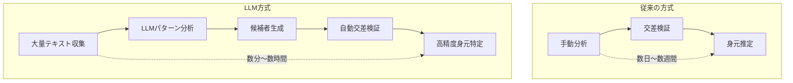
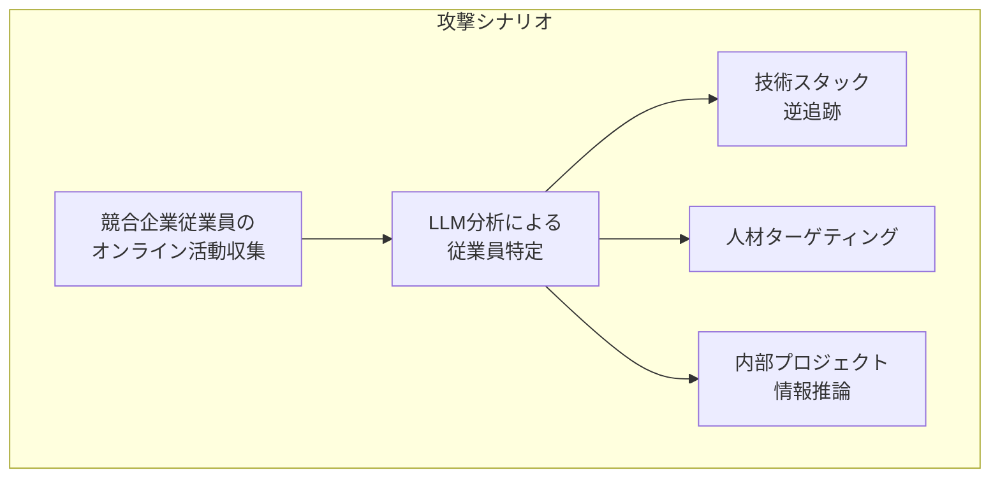
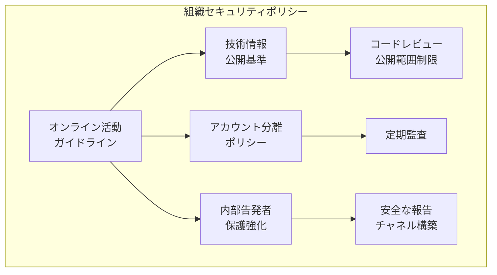

## 匿名投稿338件中226件 — 67%の身元が明かされた

2026年2月、MATS(Model Alignment Technical Studies)の研究チームが発表した論文<strong>「Large-scale online deanonymization with LLMs」</strong>がセキュリティコミュニティに衝撃を与えています。Hacker News、Reddit、LinkedIn、匿名インタビュー記録を対象とした実験において、LLMは338名のターゲット中226名の身元を正確に特定しました。精度(Precision) 90%、成功率67%という数字は、従来の手動分析とは次元が異なる結果です。

セキュリティ専門家Bruce Schneierも2026年3月3日付けの自身のブログでこの研究を取り上げ、警鐘を鳴らしています。<strong>Engineering Manager、VPoE、CTO</strong>として、この研究が組織に及ぼす影響と対応戦略を検討します。

## LLM基盤の匿名解除がどのように機能するのか

### 従来の方式 vs LLM方式

従来の匿名解除(Deanonymization)は、人が直接投稿を分析し、交差検証する方式でした。わずかなデータポイントのみでも個人を特定できるということはすでに知られていますが、<strong>非構造化テキストからこれを自動化することは現実的に不可能</strong>でした。

LLMはこの限界を完全に超えました。



### コア攻撃メカニズム

研究で明らかになったLLM匿名解除のコアメカニズムは以下の通りです。

<strong>1. 文体分析(Stylometry)</strong>: LLMは個人の執筆パターン — 特定の表現、文章構造、技術用語の使用頻度 — を精密に分析します。人が意識的に変更することが難しい細微なパターンまで捉えます。

<strong>2. 意味論的相互参照</strong>: 複数のプラットフォームに散在する投稿を意味的に関連付けます。Hacker Newsの技術討論とRedditの趣味投稿が同一人物のものであるかをLLMが判定します。

<strong>3. コンテキスト推論</strong>: 直接的な識別情報がない場合でも、勤務環境、技術スタック、居住地域などの間接情報を統合して候補者を絞り込みます。

<strong>4. スケール</strong>: 最も危険な点は、数万名の候補を同時に処理できることです。従来は特定個人をターゲットとする必要がありましたが、LLMは「獲物を先に見つけてから攻撃」できます。

## 組織に及ぼす実質的な脅威

### 従業員プライバシーのリスク

開発者とエンジニアは、Stack Overflow、Hacker News、Reddit等で技術質問を行ったり、意見を共有したりします。これらの投稿が特定企業の特定従業員に結びつくと、以下のような問題が発生します。

<strong>ヘッドハンティング・ターゲティング</strong>: 競合企業が内部の技術スタックと構成員を精密に把握し、ターゲット採用を進めることができます。転職市場ではメリットとなる可能性もありますが、組織マネージャーの視点からは人材流出リスクです。

<strong>内部情報の露出</strong>: 従業員の技術的質問やディスカッションから、使用中のインフラストラクチャ、アーキテクチャ、技術的課題が間接的に明らかになる可能性があります。

<strong>ソーシャルエンジニアリング</strong>: 特定された従業員のオンライン活動パターンに基づいて、洗練されたフィッシング攻撃が可能になります。

### 内部告発者保護の弱体化

最も深刻な懸念の一つは、<strong>内部告発者(Whistleblower)の匿名性の弱体化</strong>です。企業の倫理的問題を報告しようとする従業員がLLMによって特定される可能性があるとすれば、これは健全な企業ガバナンスを脅かす深刻な問題です。

### 競争情報(Competitive Intelligence)の悪用



## Engineering Leaderのための防御戦略

### 1. 組織レベルの認識教育

最初にすべきことは、<strong>チームメンバーにこの脅威を認識させることです</strong>。多くの開発者が、匿名掲示板での活動は安全だと信じています。

```markdown
# チーム教育チェックリスト

- [ ] LLM基盤の匿名解除リスクを共有
- [ ] オンライン活動時の注意事項ガイドライン配布
- [ ] 会社関連技術情報の投稿ポリシー策定
- [ ] 定期的なセキュリティ認識教育実施
```

### 2. 技術的防御手段

<strong>文体難読化(Stylometric Obfuscation)</strong>: 匿名投稿時に意図的に執筆スタイルを変更するツールを提供します。LLMが文体を分析しにくくするため、単語選択や文構造を自動的に変形するツールが登場しています。

<strong>メタデータの最小化</strong>: 投稿時間、IPアドレス、ブラウザ情報等の補足情報を最小化します。VPN、Torブラウザ、プライバシー重視ブラウザの使用を推奨します。

<strong>アカウント分離の原則</strong>: 業務関連活動と個人活動のアカウントを完全に分離します。同じメールアドレス、類似のユーザー名の使用を禁止するポリシーを策定します。

### 3. ポリシーフレームワーク



### 4. モニタリングと対応体制

<strong>自社露出度の点検</strong>: 定期的にLLMを活用して自社従業員のオンライン露出度を点検します。攻撃者より先に脆弱性を発見することが重要です。

<strong>インシデント対応計画</strong>: 従業員の匿名性が侵害された場合の対応手順を事前に策定します。法的対応、ソーシャルメディア対応、内部コミュニケーション計画を含めます。

## CTO/VPoEが即座に実行できるアクション項目

<strong>1週間目 — 現状把握</strong>

- チームメンバーの公開オンライン活動の現状調査(自発的アンケート)
- 会社関連技術情報が外部に露出した事例の収集
- 既存のセキュリティポリシーにオンラインプライバシー項目の存在確認

<strong>1ヶ月以内 — ポリシー策定</strong>

- オンライン活動ガイドラインの初案作成
- 内部告発者保護チャネルの確認と強化
- セキュリティ教育カリキュラムにLLM匿名解除リスクを追加

<strong>四半期以内 — 技術的対応</strong>

- 文体難読化ツールの導入検討
- 社内コミュニケーションツールのプライバシー設定強化
- 定期的な露出度点検プロセスの構築

## このテクノロジーの両面性

LLM基盤の匿名解除技術は悪用されるだけではありません。

<strong>肯定的な活用</strong>: サイバー犯罪者の追跡、虚偽情報拡散者の特定、オンラインハラスメント加害者の特定など、法執行機関で活用できます。

<strong>否定的な悪用</strong>: ストーキング、ドキシング(doxxing)、活動家への弾圧、企業監視、政府監視等に悪用される可能性があります。

技術自体は中立的ですが、<strong>現在のところ防御手段が攻撃手段に大きく遅れを取っている</strong>ことが問題です。攻撃者が低コストで大規模な匿名解除を実行できる一方、防御者は個別に対応する必要があるという非対称構造です。

## 結論

LLM基盤の大規模匿名解除は、<strong>すでに可能な現実</strong>です。67%の成功率と90%の精度は、オンライン匿名性に関する既存の前提を完全に覆しています。

Engineering Leaderとして私たちがすべきことは明確です。

1. この脅威を深刻に認識し、チームと共有する
2. 組織レベルのオンライン活動ガイドラインを策定する
3. 技術的防御手段を導入し、定期的に点検する
4. 内部告発者保護体制を強化する

<strong>匿名で投稿したからといって身元が保護されるという仮定はもはや有効ではありません。</strong>

## 参考資料

- [Large-scale online deanonymization with LLMs (arXiv)](https://arxiv.org/abs/2602.16800)
- [LLM-Assisted Deanonymization — Schneier on Security](https://www.schneier.com/blog/archives/2026/03/llm-assisted-deanonymization.html)
- [AI takes a swing at online anonymity — The Register](https://www.theregister.com/2026/02/26/llms_killed_privacy_star/)
- [Large-Scale Online Deanonymization with LLMs — LessWrong](https://www.lesswrong.com/posts/xwCWyy8RvAKsSoBRF/large-scale-online-deanonymization-with-llms)
