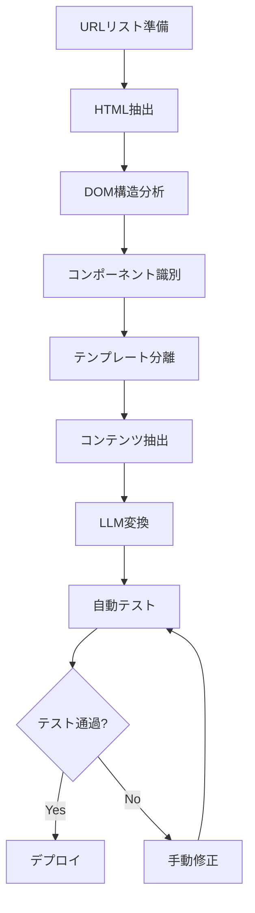

## 概要: Webページ移行の新しいパラダイム

従来のWebサイトリニューアルプロジェクトは、手作業によるHTML変換、膨大なテストケース作成、そして避けられないヒューマンエラーとの戦いでした。しかし、2024年から2025年にかけて、<strong>LLM(Large Language Model)</strong>を活用した自動化アプローチが急速に実用化され、Google、Airbnb、Zalandoなどの企業がプロダクション環境で成功を収めています。

本記事では、以下の技術スタックを組み合わせた実践的なページ移行ワークフローを解説します:

- <strong>Claude Code</strong>: LLMベースの開発エージェント
- <strong>Webコンポーネント</strong>: 再利用可能なUIパーツライブラリ
- <strong>CMSテンプレートシステム</strong>: 静的サイトジェネレーター(Astro/Hugo)
- <strong>包括的テスト自動化</strong>: E2E、ビジュアル回帰、SEO、アクセシビリティ

### なぜLLMが必要なのか?

従来のトランスパイラーとLLMアプローチの比較:

| 項目 | 従来のトランスパイラー | LLMベースアプローチ |
|------|----------------|----------------|
| 変換方式 | 1対1の構文マッピング | 意味論的理解後の変換 |
| コード品質 | 機械的変換 | リファクタリング + 最適化 |
| エラー処理 | 手動修正が必要 | コンテキスト基づく自動修正 |
| テスト生成 | 別途作業 | 自動生成可能 |

## LLMベース自動化の実証された利点

### Google: 大規模コードマイグレーション

2024年に発表された論文「Migrating Code At Scale With LLMs At Google」では、以下の成果が報告されています:

- 抽象データ型のリファクタリング自動化
- 関係型表現不変式を使用したデータ型変更の指定
- 大規模コードベースでの一貫したパターン維持

### Airbnb: テストマイグレーション加速

プロジェクト「Accelerating Large-Scale Test Migration with LLMs」の結果:

- React Testing Libraryへの大規模テスト移行を完遂
- 開発時間を数百時間削減
- エッジケースの自動処理により品質向上

### Zalando: UIコンポーネントライブラリ刷新

2024年9月にGPT-4oを活用した事例:

- Python + LLM APIによる自動変換パイプライン
- GitHub PRベースのレビューフロー
- 正確な変換のためのモデル選択最適化

これらの事例は、LLMが単なる実験的技術ではなく、<strong>プロダクション環境で実用可能な成熟した技術</strong>であることを示しています。

## Webコンポーネントパーツライブラリの選定

### Webコンポーネントとは?

Webコンポーネントは、<strong>再利用可能でカプセル化されたHTML要素を作成するWeb標準技術</strong>です。以下3つのコア技術で構成されます:

1. <strong>Custom Elements</strong>: カスタムHTMLタグの定義
2. <strong>Shadow DOM</strong>: スタイルとDOMの分離
3. <strong>HTML Templates</strong>: 再利用可能なマークアップ

### 2025年の状況: Lit vs Stencil

#### Lit 3.0 - 軽量かつ高速

<strong>特徴</strong>:
- 超軽量(4.3MBメモリ使用)
- リアクティブプロパティ管理
- TypeScriptネイティブサポート
- コンパイル不要(ランタイムライブラリ)

<strong>性能ベンチマーク(2025年)</strong>:
- 初期ロード: 235ms
- メモリ使用: 4.3MB
- 更新速度: Stencilより17%高速

<strong>コード例</strong>:
```typescript
import { LitElement, html, css } from 'lit';
import { customElement, property } from 'lit/decorators.js';

@customElement('my-counter')
export class MyCounter extends LitElement {
  static styles = css`
    button {
      background: blue;
      color: white;
      padding: 8px 16px;
    }
  `;

  @property({ type: Number })
  count = 0;

  render() {
    return html`
      <div>
        <p>カウント: ${this.count}</p>
        <button @click=${this._increment}>増加</button>
      </div>
    `;
  }

  private _increment() {
    this.count++;
  }
}
```

#### Stencil 4.0 - エンタープライズグレード

<strong>特徴</strong>:
- JSXテンプレートサポート
- ビルド時最適化
- 自動LazyLoading
- フレームワーク非依存

<strong>性能ベンチマーク(2025年)</strong>:
- 初期ロード: 284ms
- メモリ使用: 6.2MB
- ビルド時最適化によりランタイムオーバーヘッド最小化

<strong>コード例</strong>:
```typescript
import { Component, Prop, State, h } from '@stencil/core';

@Component({
  tag: 'my-counter',
  styleUrl: 'my-counter.css',
  shadow: true,
})
export class MyCounter {
  @Prop() initialCount = 0;
  @State() count = this.initialCount;

  private increment = () => {
    this.count++;
  };

  render() {
    return (
      <div>
        <p>カウント: {this.count}</p>
        <button onClick={this.increment}>増加</button>
      </div>
    );
  }
}
```

### 選択ガイド

| プロジェクト要件 | 推奨フレームワーク | 理由 |
|-----------------|----------------|------|
| 最小バンドルサイズ | Lit | メモリ使用が30%少ない |
| Reactスタイル希望 | Stencil | JSXテンプレートサポート |
| 高速プロトタイピング | Lit | コンパイルステップ不要 |
| 大規模エンタープライズ | Stencil | ビルド時最適化 |
| チーム学習曲線最小化 | Lit | よりシンプルなAPI |

### Shadow DOMによる完全なスタイル分離

```javascript
class AdvancedTooltip extends HTMLElement {
  constructor() {
    super();
    // Shadow DOMを作成(分離を有効化)
    this.attachShadow({ mode: 'open' });
  }

  connectedCallback() {
    const text = this.getAttribute('text');
    this.shadowRoot.innerHTML = `
      <style>
        :host {
          position: relative;
          display: inline-block;
        }
        .tooltip {
          position: absolute;
          background: #333;
          color: white;
          padding: 8px;
          border-radius: 4px;
          font-size: 14px;
          z-index: 1000;
        }
      </style>
      <div class="tooltip">${text}</div>
    `;
  }
}

customElements.define('advanced-tooltip', AdvancedTooltip);
```

このコードでは、`.tooltip`クラスのスタイルは外部CSSの影響を受けず、逆に外部にも影響しません。これにより、<strong>グローバルCSSによる予期しないスタイルの競合を完全に回避</strong>できます。

## CMSテンプレートシステムとの統合

### 静的サイトジェネレーター(SSG)の比較

#### Astro 5.14+ - 最先端のアーキテクチャ

<strong>特徴</strong>:
- Islands Architecture(部分ハイドレーション)
- マルチフレームワーク対応(React、Vue、Svelte混在可能)
- Content Collections(型安全なコンテンツ管理)
- ゼロJavaScriptデフォルト設定

<strong>ユースケース</strong>:
- ブログ、マーケティングサイト
- ドキュメントサイト
- ポートフォリオ

<strong>コード例</strong>:
```astro
---
// src/pages/blog/[slug].astro
import { getCollection } from 'astro:content';

export async function getStaticPaths() {
  const posts = await getCollection('blog');
  return posts.map(post => ({
    params: { slug: post.slug },
    props: { post },
  }));
}

const { post } = Astro.props;
const { Content } = await post.render();
---

<html>
  <head>
    <title>{post.data.title}</title>
  </head>
  <body>
    <article>
      <h1>{post.data.title}</h1>
      <Content />
    </article>
  </body>
</html>
```

#### Hugo - 圧倒的なビルド速度

<strong>特徴</strong>:
- Go言語による超高速ビルド(数千ページを秒単位でビルド)
- 多言語サポート内蔵
- 強力なテンプレートシステム
- 豊富なテーマエコシステム

<strong>性能</strong>:
- 1000ページビルド: 約1秒
- 10000ページビルド: 約5秒

#### Eleventy (11ty) - 柔軟性重視

<strong>特徴</strong>:
- JavaScriptベース(Node.js)
- 多様なテンプレートエンジン対応(Nunjucks、Liquid、Handlebarsなど)
- 柔軟なデータパイプライン
- ゼロクライアントJavaScript

### 比較マトリックス

| 機能/フレームワーク | Astro | Hugo | 11ty |
|----------------|-------|------|------|
| <strong>ビルド速度</strong>(1000ページ) | 約3秒 | 約1秒 | 約5秒 |
| <strong>学習曲線</strong> | 中程度 | 高い | 低い |
| <strong>Reactコンポーネント使用</strong> | ✅ | ❌ | ⚠️(制限的) |
| <strong>画像最適化</strong> | 自動 | プラグイン | プラグイン |
| <strong>多言語サポート</strong> | 手動 | 内蔵 | プラグイン |
| <strong>GitHub Stars</strong> | 47k+ | 76k+ | 16k+ |

### 動的テンプレートインクルードパターン

```html
<!-- templates/header.html -->
<template id="site-header">
  <header>
    <nav>
      <a href="/">ホーム</a>
      <a href="/about">概要</a>
      <a href="/blog">ブログ</a>
    </nav>
  </header>
</template>

<!-- 使用例 -->
<script>
  const template = document.getElementById('site-header');
  const clone = template.content.cloneNode(true);
  document.body.prepend(clone);
</script>
```

## 総合テスト自動化戦略

### E2Eテスト: Playwright (2024〜2025年推奨)

Playwrightは、Microsoftが開発する次世代E2Eテストフレームワークです。Puppeteerと比較して、以下の優位性があります:

<strong>主な利点</strong>:
- クロスブラウザ(Chromium、Firefox、WebKit)
- 自動待機メカニズム(安定性向上)
- 並列実行サポート
- ビデオ録画とスクリーンショット自動化

<strong>実装例</strong>:
```typescript
import { test, expect } from '@playwright/test';

test('ページ移行後の動作検証', async ({ page }) => {
  await page.goto('https://example.com/migrated-page');

  // ボタンクリック
  await page.click('button[data-testid="submit"]');

  // 結果検証
  await expect(page.locator('.success-message')).toBeVisible();

  // スクリーンショット比較
  await expect(page).toHaveScreenshot('migrated-page.png', {
    maxDiffPixels: 100,
  });
});
```

### リンクチェック自動化

破損リンクは、SEOとユーザー体験に深刻な影響を与えます。Playwrightを使ったカスタムチェッカー:

```typescript
import { test } from '@playwright/test';

test('全リンク検証', async ({ page }) => {
  await page.goto('https://example.com');

  const links = await page.locator('a[href]').all();
  const results = [];

  for (const link of links) {
    const href = await link.getAttribute('href');
    if (!href || href.startsWith('#')) continue;

    const response = await page.request.get(href);
    results.push({
      url: href,
      status: response.status(),
      ok: response.ok(),
    });
  }

  const brokenLinks = results.filter(r => !r.ok);
  expect(brokenLinks).toHaveLength(0);
});
```

### UIテスト: ビジュアル回帰テスティング

Playwrightのネイティブ機能を使用:

```typescript
import { test, expect } from '@playwright/test';

test('ビジュアル回帰テスト', async ({ page }) => {
  await page.goto('https://example.com');

  // 全ページスクリーンショット
  await expect(page).toHaveScreenshot('full-page.png', {
    fullPage: true,
    maxDiffPixelRatio: 0.02, // 2%まで許容
  });

  // 特定要素のみ
  const header = page.locator('header');
  await expect(header).toHaveScreenshot('header.png');
});
```

### SEOチェック: Lighthouse統合

Google公式ツールであるLighthouseをPlaywrightと統合:

```typescript
import { test } from '@playwright/test';
import { playAudit } from 'playwright-lighthouse';

test('Lighthouse性能テスト', async ({ page }) => {
  await page.goto('https://example.com');

  await playAudit({
    page,
    thresholds: {
      performance: 90,
      accessibility: 90,
      'best-practices': 90,
      seo: 90,
    },
    port: 9222,
  });
});
```

### アクセシビリティ(a11y): axe-core

WCAG 2.1/2.2準拠チェック:

```typescript
import { test, expect } from '@playwright/test';
import AxeBuilder from '@axe-core/playwright';

test('アクセシビリティ検査', async ({ page }) => {
  await page.goto('https://example.com');

  const accessibilityScanResults = await new AxeBuilder({ page })
    .withTags(['wcag2a', 'wcag2aa'])
    .analyze();

  expect(accessibilityScanResults.violations).toEqual([]);
});
```

### AEO(Answer Engine Optimization)チェック

AI検索時代の最適化として、Schema.org構造化データの検証が重要です:

```typescript
import { test } from '@playwright/test';

test('Schema.orgマークアップ検証', async ({ page }) => {
  await page.goto('https://example.com/article');

  const structuredData = await page.evaluate(() => {
    const scripts = Array.from(
      document.querySelectorAll('script[type="application/ld+json"]')
    );
    return scripts.map(s => JSON.parse(s.textContent));
  });

  // Article Schemaの検証
  const article = structuredData.find(d => d['@type'] === 'Article');
  expect(article).toBeDefined();
  expect(article.headline).toBeDefined();
  expect(article.author).toBeDefined();
  expect(article.datePublished).toBeDefined();
});
```

### コード品質チェック

#### Biome.js - 次世代ツール

ESLint + Prettierの統合代替として、Rust製の超高速ツール:

```json
{
  "formatter": {
    "enabled": true,
    "indentStyle": "space",
    "indentWidth": 2
  },
  "linter": {
    "enabled": true,
    "rules": {
      "recommended": true
    }
  }
}
```

<strong>利点</strong>:
- ESLint + Prettierの10倍以上の速度
- 単一ツールでリンティング + フォーマッティング
- ゼロ設定で開始可能

### LLMベース自動コードレビュー

GitHub ActionsとLLMを統合:

```yaml
# .github/workflows/ai-code-review.yml
name: AI Code Review

on:
  pull_request:
    types: [opened, synchronize]

jobs:
  ai-review:
    runs-on: ubuntu-latest
    steps:
      - uses: actions/checkout@v4

      - name: Run AI Code Review
        uses: your-org/ai-code-reviewer@v1
        with:
          llm-provider: openai
          model: gpt-4o
          api-key: ${{ secrets.OPENAI_API_KEY }}
          review-scope: changed-files

      - name: Post Review Comments
        uses: actions/github-script@v7
        with:
          script: |
            const fs = require('fs');
            const reviews = JSON.parse(fs.readFileSync('ai-review.json'));

            for (const review of reviews) {
              await github.rest.pulls.createReviewComment({
                owner: context.repo.owner,
                repo: context.repo.repo,
                pull_number: context.issue.number,
                body: review.comment,
                path: review.file,
                line: review.line,
              });
            }
```

## 実践ワークフロー実装

### 全体プロセス



### 1. HTML抽出(Playwright)

```typescript
import { chromium } from 'playwright';
import * as fs from 'fs/promises';

async function extractHTML(url: string) {
  const browser = await chromium.launch();
  const page = await browser.newPage();

  await page.goto(url, { waitUntil: 'networkidle' });

  // 全体HTML
  const html = await page.content();

  // 特定セクションのみ抽出
  const mainContent = await page.locator('main').innerHTML();

  await fs.writeFile(
    `extracted/${url.replace(/[^a-z0-9]/gi, '_')}.html`,
    html
  );

  await browser.close();
  return { html, mainContent };
}
```

### 2. DOM構造分析

```typescript
import { parse } from 'node-html-parser';

interface ComponentStructure {
  tag: string;
  classes: string[];
  children: ComponentStructure[];
  text?: string;
}

function analyzeDOM(html: string): ComponentStructure {
  const root = parse(html);

  function traverse(node): ComponentStructure {
    return {
      tag: node.tagName || 'text',
      classes: node.classList?.value || [],
      text: node.textContent?.trim(),
      children: node.childNodes.map(traverse),
    };
  }

  return traverse(root);
}
```

### 3. LLMによるコンポーネント変換

```typescript
import OpenAI from 'openai';

const openai = new OpenAI({ apiKey: process.env.OPENAI_API_KEY });

async function convertToComponent(
  html: string,
  targetFramework: 'react' | 'vue' | 'webcomponent'
): Promise<string> {
  const prompt = `
以下のHTMLを${targetFramework}コンポーネントに変換してください:

HTML:
${html}

要件:
- TypeScriptを使用
- 適切な型を追加
- 再利用可能なロジックを抽出
- アクセシビリティ属性を追加
- インラインドキュメントを含める

説明なしでコンポーネントコードのみを出力してください。
  `;

  const response = await openai.chat.completions.create({
    model: 'gpt-4o',
    messages: [{ role: 'user', content: prompt }],
    temperature: 0.2, // 一貫性のある出力のため低めに設定
  });

  return response.choices[0].message.content;
}
```

### 4. 自動テスト生成

```typescript
async function generateTests(
  componentCode: string,
  originalURL: string
): Promise<string> {
  const prompt = `
以下のコンポーネントに対するPlaywrightテストを生成してください:

コンポーネント:
${componentCode}

元のURL: ${originalURL}

要件:
- ユーザーインタラクションのテスト
- ビジュアル一貫性の検証
- アクセシビリティのチェック
- レスポンシブ動作のテスト

包括的なテストスイートを生成してください。
  `;

  const response = await openai.chat.completions.create({
    model: 'gpt-4o',
    messages: [{ role: 'user', content: prompt }],
  });

  return response.choices[0].message.content;
}
```

### 段階的デプロイ戦略

#### A/Bテスティングパターン

```typescript
// Edge Function (Vercel/Netlify)
export default async function handler(req) {
  const url = new URL(req.url);
  const useLegacy = Math.random() < 0.5; // 50/50分割

  if (useLegacy) {
    return fetch(`https://legacy.example.com${url.pathname}`);
  } else {
    return fetch(`https://new.example.com${url.pathname}`);
  }
}
```

#### カナリアデプロイ

Kubernetesを使用した段階的ロールアウト:

```yaml
# Kubernetes Canary Deployment
apiVersion: apps/v1
kind: Deployment
metadata:
  name: website-v1
spec:
  replicas: 9  # 90%のトラフィック

---
apiVersion: apps/v1
kind: Deployment
metadata:
  name: website-v2
spec:
  replicas: 1  # 10%のトラフィック(カナリア)
```

## 技術スタック推奨

### 小規模プロジェクト(〜50ページ)

```yaml
SSG: Astro 5.14
Webコンポーネント: Lit 3.0
テスティング:
  - E2E: Playwright
  - ビジュアル: Playwrightネイティブ
  - a11y: axe-core
  - SEO: Lighthouse CLI
リンティング: Biome.js
CI/CD: GitHub Actions
ホスティング: Vercel / Netlify
```

<strong>予想コスト</strong>: 無料〜$20/月

### 中規模プロジェクト(50〜500ページ)

```yaml
SSG: Astro 5.14 + Contentful(ヘッドレスCMS)
Webコンポーネント: Stencil 4.0
テスティング:
  - E2E: Playwright
  - ビジュアル: Percy
  - a11y: Pa11y CI
  - SEO: Lighthouse CI + Core Web Vitals API
リンティング: ESLint 10 + Prettier 5
コードレビュー: GitHub Actions + GPT-4o
CI/CD: GitHub Actions
ホスティング: Vercel Pro
```

<strong>予想コスト</strong>: $50〜$200/月

### 大規模プロジェクト(500+ページ)

```yaml
SSG: Hugo(ビルド速度優先)
Webコンポーネント: Stencil 4.0(エンタープライズ最適化)
テスティング:
  - E2E: Playwright(分散実行)
  - ビジュアル: Chromatic Enterprise
  - a11y: axe-core + 手動テスト
  - SEO: カスタムLighthouse + WebPageTest
  - パフォーマンス: DebugBear
リンティング: ESLint 10 + カスタムルール
コードレビュー: LLMベース + 人間レビュー
CI/CD: GitHub Actions + Kubernetes
モニタリング: Sentry + Datadog
ホスティング: AWS CloudFront + S3
```

<strong>予想コスト</strong>: $500〜$2000/月

### 意思決定ツリー

```
プロジェクトページ数?
├─ <50: Astro + Lit + Playwright
├─ 50〜500: Astro + Stencil + Percy
└─ >500: Hugo + Stencil + Chromatic

ビルド速度が重要?
├─ Yes: Hugo
└─ No: Astro(開発体験優先)

Reactコンポーネント再利用?
├─ Yes: Astro(Islands)
└─ No: Hugo or 11ty

予算制約?
├─ タイト: オープンソース優先(Playwright、axe-core)
└─ 柔軟: 商用ツール(Percy、Chromatic)
```

## まとめ: 重要ポイントと次のステップ

### 核心要約

1. <strong>LLMベース移行</strong>: 単純変換を超えた意味論的理解とリファクタリングが可能。2024〜2025年にGoogle、Airbnb、Zalandoなど主要企業がプロダクション環境で検証済み

2. <strong>Webコンポーネント</strong>: LitとStencilが2025年の標準として確立。ブラウザネイティブサポートによりポリフィル不要

3. <strong>SSG選択</strong>: Astroは開発体験、Hugoはビルド速度、11tyは柔軟性でそれぞれ強み

4. <strong>テスト自動化</strong>: PlaywrightがE2Eテスティング標準、axe-coreがアクセシビリティテスティングの事実上の標準に

5. <strong>AEO最適化</strong>: Schema.org構造化データがAI検索時代の必須要素として台頭

### 実践適用ロードマップ

<strong>Phase 1(1〜2週間)</strong>: 環境構築
- SSG選択と導入
- Webコンポーネントフレームワーク設定
- CI/CDパイプライン構築

<strong>Phase 2(2〜4週間)</strong>: 移行パイロット
- 10〜20ページでパイロット開始
- LLMプロンプト最適化
- 自動化スクリプト開発

<strong>Phase 3(4〜8週間)</strong>: 大規模移行
- バッチ処理自動化
- 自動テスト実行
- 段階的デプロイ(カナリア/A/B)

<strong>Phase 4(継続的)</strong>: モニタリングと最適化
- パフォーマンスモニタリング
- SEO/AEO継続改善
- ユーザーフィードバック反映

### 参考資料

#### LLM & AI
- [Google: Migrating Code At Scale With LLMs](https://arxiv.org/abs/2504.09691)
- [Airbnb: Large-Scale Test Migration with LLMs](https://medium.com/airbnb-engineering/accelerating-large-scale-test-migration-with-llms-9565c208023b)
- [Zalando: LLM Migration UI Components](https://engineering.zalando.com/posts/2025/02/llm-migration-ui-component-libraries.html)

#### Webコンポーネント
- [Lit 3.0 Documentation](https://lit.dev)
- [Stencil 4.0 Documentation](https://stenciljs.com)
- [Web Components 2025 Benchmark](https://markaicode.com/web-components-2025-lit-stencil-enterprise/)

#### テスティング
- [Playwright Documentation](https://playwright.dev)
- [axe-core GitHub](https://github.com/dequelabs/axe-core)
- [Lighthouse Documentation](https://developers.google.com/web/tools/lighthouse)

#### SEO & AEO
- [Answer Engine Optimization Guide 2025](https://cxl.com/blog/answer-engine-optimization-aeo-the-comprehensive-guide-for-2025/)
- [Schema.org](https://schema.org/)

本記事で紹介した手法は、すでにプロダクション環境で実証されています。あなたのプロジェクトに適用し、効率的で高品質なページ移行を実現してください。
