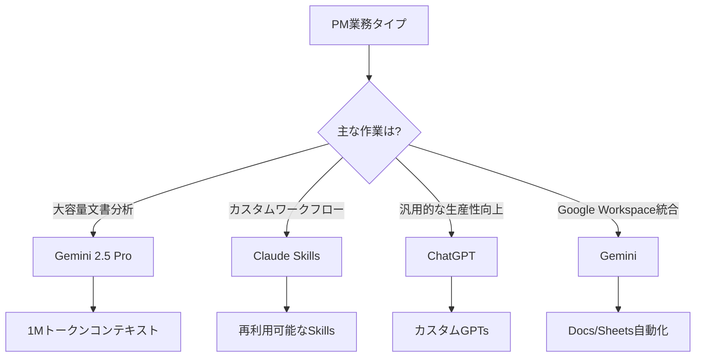
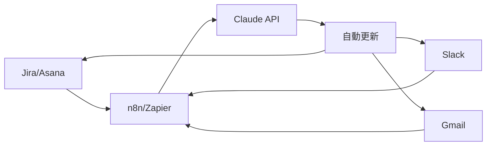
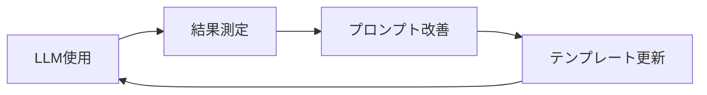

## はじめに

プロジェクトマネージャー(PM)の1日は、会議、ステータス更新、リスク管理、ステークホルダーとのコミュニケーションで埋め尽くされています。2025年現在、LLM(Large Language Model)技術の進化により、こうした反復的な業務を自動化し、<strong>戦略的な意思決定とチームリーダーシップに集中</strong>できるようになりました。

本記事では、ChatGPT、Claude、Geminiなどの最新LLMツールを活用してPM業務を効率化する方法を、実践事例とともにご紹介します。

## PM業務自動化が必要な理由

### 現在PMが直面する課題

最近の調査によると、PMの<strong>60〜70%の時間が反復的な管理業務</strong>に費やされています:

- 議事録の作成と要約
- 進捗レポートの作成
- メールやSlackメッセージへの対応
- プロジェクト文書の更新
- リスクと課題の追跡

### LLM活用のメリット

LLMを導入した組織では、以下のような成果が報告されています:

- <strong>年間14,976時間の削減</strong> (Asana Intelligenceの事例)
- <strong>計画立案時間を65%削減</strong>
- <strong>予測精度が60%向上</strong>
- 顧客対応時間を30%短縮

## 主要LLMツールの比較

### 1. ChatGPT (OpenAI)

<strong>強み</strong>:
- 最も汎用的で使いやすいインターフェース
- GPT-4oによる高速レスポンスとマルチモーダル機能
- カスタムGPTsでPM専用ワークフローの構築が可能
- 大規模なコミュニティとプラグインエコシステム

<strong>PM活用事例</strong>:
```markdown
プロンプト例:
「次の議事録を要約し、アクションアイテムを抽出してください:
[議事録を貼り付け]

フォーマット:
- 主な決定事項
- アクションアイテム (担当者、期限を含む)
- フォローアップが必要な事項」
```

<strong>制限事項</strong>:
- コンテキストウィンドウの制限 (GPT-4o: 128Kトークン)
- リアルタイムWeb検索が限定的

### 2. Claude (Anthropic)

<strong>強み</strong>:
- <strong>200Kトークンのコンテキストウィンドウ</strong>で大容量文書を処理
- Claude SkillsでPM専用のカスタマイズが可能
- Artifacts機能で構造化された出力を生成
- 安全で倫理的なAI応答

<strong>PM活用事例</strong>:
```markdown
Claude Skills 例: "PRD Generator"

入力: プロジェクト概要、目標、制約条件
出力:
1. プロジェクトの背景と目標
2. 機能要件 (優先順位を含む)
3. 非機能要件
4. 成功指標 (KPIs)
5. リスクと依存関係
6. タイムライン草案
```

<strong>制限事項</strong>:
- 画像生成機能なし
- プラグインエコシステムがChatGPTより小規模

### 3. Gemini (Google)

<strong>強み</strong>:
- <strong>1Mトークンのコンテキストウィンドウ</strong> (Gemini 2.5 Pro)
- Google Workspace統合 (Docs、Sheets、Gmail)
- マルチモーダル能力 (テキスト、画像、コード、音声、動画)
- 高速なGemini Flashモデルでリアルタイム処理

<strong>PM活用事例</strong>:
```python
# Gemini APIでプロジェクトリスク分析を自動化
import google.generativeai as genai

genai.configure(api_key='YOUR_API_KEY')
model = genai.GenerativeModel('gemini-2.5-pro')

prompt = """
次のプロジェクト状況報告書を分析し、潜在的なリスクを特定してください:
[状況報告書]

出力形式:
1. 高リスク (影響度: 高、発生可能性: 高)
2. 中リスク (影響度: 中、発生可能性: 中)
3. 低リスク (影響度: 低、発生可能性: 低)
4. 各リスクに対する緩和策
"""

response = model.generate_content(prompt)
print(response.text)
```

<strong>制限事項</strong>:
- ChatGPTほど普及していない
- 一部機能はGoogle Workspace有料プラン必要

### ツール選択ガイド



## 自動化可能なPM日常業務

### 1. 会議管理

<strong>自動化前</strong>:
- 議事録の手動作成: 30分
- アクションアイテムの整理: 15分
- フォローアップメールの送信: 10分
- <strong>合計 55分/会議</strong>

<strong>自動化後 (Claude + n8n)</strong>:
```javascript
// n8nワークフロー例
{
  "nodes": [
    {
      "name": "Zoom Webhook",
      "type": "n8n-nodes-base.webhook",
      "position": [250, 300]
    },
    {
      "name": "Claude API",
      "type": "n8n-nodes-base.httpRequest",
      "parameters": {
        "url": "https://api.anthropic.com/v1/messages",
        "method": "POST",
        "body": {
          "model": "claude-sonnet-4.5",
          "messages": [{
            "role": "user",
            "content": "会議の文字起こしを要約し、アクションアイテムを抽出してください: {{$json.transcript}}"
          }]
        }
      },
      "position": [450, 300]
    },
    {
      "name": "Send Email",
      "type": "n8n-nodes-base.gmail",
      "position": [650, 300]
    }
  ]
}
```

<strong>結果</strong>: 会議後の処理時間が <strong>55分 → 5分 (91%削減)</strong>

### 2. 進捗レポートの作成

<strong>プロンプトテンプレート</strong>:
```markdown
役割: あなたは経験豊富なプロジェクトマネージャーです。

入力データ:
- 先週完了したタスク: [Jira/Asanaから抽出]
- 今週の予定タスク: [ロードマップ参照]
- リスクと課題: [リスクレジスター]
- チームリソース状況: [リソース管理ツール]

出力形式:
## 週次進捗レポート (Week XX, 2025)

### 📊 サマリー
- 全体進捗率: X%
- 完了タスク: X個
- 進行中タスク: X個
- リスク状態: 🟢 低 / 🟡 中 / 🔴 高

### ✅ 今週の完了事項
1. [タスク名] - [担当者]
2. ...

### 🚀 来週の計画
1. [タスク名] - [担当者] - [完了予定日]
2. ...

### ⚠️ リスクとブロッカー
1. [リスク説明] - [影響度] - [緩和計画]
2. ...

### 💡 主な意思決定事項
1. ...
```

<strong>時間削減</strong>: <strong>2時間 → 15分 (87.5%削減)</strong>

### 3. メールとSlack対応の自動化

<strong>Gmail + Claude統合</strong>:
```python
# Gmail API + Claudeでメール下書きを自動生成
from googleapiclient.discovery import build
import anthropic

def draft_email_response(email_content, context):
    client = anthropic.Anthropic(api_key="YOUR_API_KEY")

    prompt = f"""
    次のメールに対する専門的な返信草案を作成してください。

    元のメール:
    {email_content}

    プロジェクトコンテキスト:
    {context}

    返信トーン: 専門的で親切かつ簡潔に
    """

    message = client.messages.create(
        model="claude-sonnet-4.5",
        max_tokens=1024,
        messages=[{"role": "user", "content": prompt}]
    )

    return message.content[0].text

# 使用例
email = "プロジェクトの期限を2週間前倒しできますか?"
context = "現在スプリント2/5、チームリソース80%稼働中"
draft = draft_email_response(email, context)
print(draft)
```

### 4. プロジェクトリスクのモニタリング

<strong>Gemini + BigQuery統合</strong>:
```sql
-- BigQueryでプロジェクトメトリクスを抽出
SELECT
  task_id,
  task_name,
  assigned_to,
  due_date,
  status,
  estimated_hours,
  actual_hours,
  CASE
    WHEN actual_hours > estimated_hours * 1.5 THEN 'High Risk'
    WHEN actual_hours > estimated_hours * 1.2 THEN 'Medium Risk'
    ELSE 'Low Risk'
  END AS risk_level
FROM project_tasks
WHERE due_date BETWEEN CURRENT_DATE() AND DATE_ADD(CURRENT_DATE(), INTERVAL 7 DAY)
```

```python
# Geminiでリスク分析と推奨事項を生成
import google.generativeai as genai

def analyze_project_risks(task_data):
    genai.configure(api_key='YOUR_API_KEY')
    model = genai.GenerativeModel('gemini-2.5-pro')

    prompt = f"""
    次のプロジェクトタスクデータを分析して:
    1. 期限リスクの高いタスクを特定
    2. リソース再配置の推奨事項
    3. ステークホルダーに報告すべき重要メッセージ

    データ:
    {task_data}
    """

    response = model.generate_content(prompt)
    return response.text
```

## 実装戦略: 段階的ロードマップ

### Phase 1: パイロットプロジェクト (1〜2週間)

<strong>目標</strong>: LLMツールの効果を検証し、チームの受容度を確認

**ステップ**:
1. <strong>ツール選択</strong>: ChatGPT PlusまたはClaude Proのサブスクリプション開始
2. <strong>ユースケース選定</strong>: 議事録要約から開始 (最も時間がかかる作業)
3. <strong>プロンプトテンプレート開発</strong>: 標準プロンプト3〜5個を作成
4. <strong>測定</strong>: 時間削減と品質を評価

**成功指標**:
- 議事録作成時間が50%以上削減
- チームメンバーの満足度が4/5以上
- アクションアイテムの漏れ率0%

### Phase 2: ワークフロー統合 (2〜4週間)

<strong>目標</strong>: 既存PMツールとLLMを統合

**ツールスタック例**:


**統合シナリオ**:
1. <strong>Jira → Claude → Slack</strong>
   - Jira課題作成時に自動でコンテキスト分析
   - Slackに優先度と影響度の分析結果を送信

2. <strong>Gmail → Claude → カレンダー</strong>
   - メールから期限を自動抽出
   - Googleカレンダーに自動イベント作成

3. <strong>Zoom → Claude → Notion</strong>
   - 会議の文字起こしを自動要約
   - Notionプロジェクトページに更新

### Phase 3: 高度な自動化 (1〜2ヶ月)

<strong>目標</strong>: AIエージェントベースの自律ワークフローを構築

**Claude Skills活用**:
```markdown
# Skill: スプリントレトロスペクティブアナライザー

## 目的
スプリントレトロデータを分析し、チーム生産性向上のインサイトを導出

## 入力
- スプリント番号
- 完了したストーリーポイント
- 未完了事項
- チームメンバーフィードバック (Keep, Problem, Try形式)

## 処理
1. 定量的メトリクス分析 (ベロシティ、完了率)
2. 定性的フィードバックのテーマ抽出
3. 繰り返される問題点の特定
4. 改善アクションアイテムの生成

## 出力
- スプリントサマリーダッシュボード
- チーム生産性トレンドチャート
- Top 3改善推奨事項
- 次のスプリント目標
```

### Phase 4: ROI測定と最適化 (継続的)

<strong>測定メトリクス</strong>:

| 指標 | 自動化前 | 自動化後 | 改善率 |
|------|----------|----------|--------|
| 議事録作成時間 | 30分/会議 | 3分/会議 | 90% ↓ |
| 週次レポート作成 | 2時間 | 15分 | 87.5% ↓ |
| メール返信時間 | 10分/件 | 2分/件 | 80% ↓ |
| リスク識別速度 | 週1回手動 | リアルタイム自動 | 100% ↑ |
| PM戦略業務時間 | 20% | 60% | 200% ↑ |

**ROI計算**:
```python
# PMの時給を1万円と仮定
hourly_rate = 10000  # 円

# 週当たりの削減時間
weekly_hours_saved = 15  # 時間

# 年間削減コスト
annual_savings = hourly_rate * weekly_hours_saved * 52
# = 780万円

# LLMツールコスト
claude_pro_cost = 20 * 12 * 150  # 月$20、為替レート150円
chatgpt_plus_cost = 20 * 12 * 150
total_cost = claude_pro_cost + chatgpt_plus_cost
# = 7.2万円

# ROI
roi = (annual_savings - total_cost) / total_cost * 100
# = 10,733%
```

## ベストプラクティス

### 1. プロンプトエンジニアリング

<strong>効果的なプロンプト構造</strong>:
```markdown
[役割定義] + [コンテキスト] + [タスク説明] + [出力形式] + [制約条件]

例:
役割: あなたは10年の経験を持つアジャイルプロジェクトマネージャーです。

コンテキスト:
- プロジェクト: Eコマースプラットフォームのリニューアル
- チーム: 5名 (フロント2、バックエンド2、QA 1)
- スプリント: 2週間単位
- 現在: スプリント3/8

タスク: 次のスプリント計画をレビューし、リスクを特定してください。
[スプリント計画を貼り付け]

出力形式:
1. スプリント目標達成可能性 (高/中/低)
2. 主要リスク3つ
3. 各リスクに対する緩和策
4. リソース再配置の推奨事項

制約条件:
- チームの平均ベロシティは1スプリントあたり25ストーリーポイントです
- 1名のバックエンド開発者が来週休暇予定です
```

### 2. データセキュリティとプライバシー保護

<strong>注意事項</strong>:
- ❌ 顧客の個人情報をLLMに直接入力しないでください
- ❌ 会社の機密情報は公開LLMの使用を禁止
- ✅ 機密データは匿名化またはマスキング処理
- ✅ 企業向けLLM API (Azure OpenAI、Anthropic Enterprise) を使用
- ✅ データ保持ポリシーを確認 (Claudeはデフォルト30日保管)

**データマスキング例**:
```python
import re

def mask_sensitive_data(text):
    # メールアドレスをマスキング
    text = re.sub(r'\b[A-Za-z0-9._%+-]+@[A-Za-z0-9.-]+\.[A-Z|a-z]{2,}\b',
                  '[EMAIL]', text)

    # 電話番号をマスキング
    text = re.sub(r'\d{2,4}-\d{2,4}-\d{4}', '[PHONE]', text)

    # 名前をマスキング
    text = re.sub(r'[ぁ-んァ-ヶー一-龠]{2,4}(?=\s?(さん|様|氏|部長|課長))',
                  '[NAME]', text)

    return text

# 使用例
meeting_notes = """
山田部長がjohn.doe@company.comに03-1234-5678で連絡するよう言いました。
"""
masked_notes = mask_sensitive_data(meeting_notes)
# "[NAME]部長が[EMAIL]に[PHONE]で連絡するよう言いました。"
```

### 3. チーム教育と変更管理

<strong>導入チェックリスト</strong>:
- [ ] キックオフミーティング: LLMツールのメリットと使用方法を共有
- [ ] ハンズオンワークショップ: 実際のPM業務で実習
- [ ] プロンプトライブラリ: チーム共通テンプレートを構築
- [ ] チャンピオン指定: 各チームにLLM専門家を育成
- [ ] 定期レビュー: 月1回効果測定と改善

### 4. 継続的な改善

<strong>フィードバックループ</strong>:


**改善方法**:
- 効果の高いプロンプトはチームライブラリに追加
- 週次LLMティップス共有 (Slackチャンネル活用)
- 新しいユースケースの発掘 (チームブレインストーミング)

## 避けるべき落とし穴

### 1. 過度な依存

❌ <strong>誤った使用</strong>:
```markdown
"プロジェクト計画を全部作って"
```

✅ <strong>正しい使用</strong>:
```markdown
"次のプロジェクト計画草案をレビューし、欠けている部分を指摘してください:
[計画草案を貼り付け]
"
```

**原則**: LLMは<strong>補助ツール</strong>であり、代替品ではありません。

### 2. コンテキスト不足

❌ <strong>誤ったプロンプト</strong>:
```markdown
"リスクを分析して"
```

✅ <strong>改善されたプロンプト</strong>:
```markdown
"次の情報に基づいてプロジェクトリスクを分析してください:
- プロジェクト: [プロジェクト名]
- 現在の段階: [段階]
- チーム構成: [構成員]
- 期限: [日付]
- 現在の課題: [課題リスト]
"
```

### 3. 出力検証の省略

<strong>チェックリスト</strong>:
- [ ] LLM出力がプロジェクトコンテキストに合っているか?
- [ ] 日付、数字、名前などが正確か?
- [ ] トーンとスタイルが組織文化に合っているか?
- [ ] 法的/倫理的問題がないか?

## 実際の成功事例

### 事例1: Asana Intelligence

<strong>組織</strong>: グローバル金融サービス企業

<strong>導入背景</strong>:
- リサーチパイプライン管理のボトルネック
- 手動作業による遅延
- リソース配分の非効率

<strong>ソリューション</strong>:
- Asana Intelligenceを活用したワークフロー自動化
- AIベースのタスク優先順位付け
- 自動ステータス更新と通知

<strong>結果</strong>:
- <strong>年間14,976時間の削減</strong>
- プロジェクト完了率35%向上
- 2025 AI Visionary Work Innovation Award受賞

### 事例2: ClickUp Brain

<strong>組織</strong>: スタートアップ製品チーム (30名)

<strong>導入背景</strong>:
- 迅速な製品リリース要求
- 限られたPMリソース
- 複数プロジェクトの同時進行

<strong>ソリューション</strong>:
- ClickUp Brainでプロジェクトブリーフを自動生成
- RACIマトリックスの自動構成
- AIナレッジマネージャーでコンテキスト共有

<strong>結果</strong>:
- プロジェクトキックオフ時間70%短縮
- チームアラインメント改善 (NPS +25ポイント)
- PMが戦略業務に60%の時間を割当可能

## 2025年のトレンドと展望

### 1. エージェンティックAIの台頭

<strong>エージェンティックAI</strong>とは:
- 単純な質疑応答を超えて<strong>自律的にタスクを実行</strong>するAI
- 複数のツールを接続して複雑なワークフローを実行
- 人の承認を得て実際のアクションを実行

**例**: Claude Computer Use
```markdown
PM: "来週のスプリント計画をJiraに作成してチームに通知して"

Claude:
1. Jira APIでスプリント作成
2. ストーリー優先順位に基づいてバックログからアイテムを選択
3. 各アイテムに担当者を自動割り当て
4. Slackにスプリントキックオフメッセージを送信
5. カレンダーにスプリントレビューミーティングを予約

PM: [各ステップ承認後に実行]
```

### 2. マルチモーダルPMツール

<strong>テキスト + 画像 + 音声統合</strong>:
- Gemini 2.5のマルチモーダル機能で<strong>会議ビデオを直接分析</strong>
- ホワイトボード写真を撮ると自動でMiro/Figmaに変換
- 音声コマンドでプロジェクト更新

### 3. リアルタイム協働AI

<strong>リアルタイムコンテキスト認識</strong>:
- Google WorkspaceとGemini統合で<strong>文書作成中にリアルタイム提案</strong>
- Slack会話フローを分析して自動アクションアイテム生成
- コードレビュー中にリアルタイム技術文書参照

## 始め方: 最初の1週間アクションプラン

### Day 1: ツール選択と設定
- [ ] ChatGPT PlusまたはClaude Proをサブスクライブ
- [ ] 最初のプロンプト実験: 最近の議事録を要約してみる
- [ ] 結果評価とフィードバック

### Day 2-3: プロンプトテンプレート開発
- [ ] 最も時間がかかる作業3つを選定
- [ ] 各作業のプロンプトテンプレートを作成
- [ ] 実際のデータでテストと改善

### Day 4-5: チーム共有とフィードバック
- [ ] チームミーティングでLLMをデモ
- [ ] プロンプトライブラリを共有 (Notion/Confluence)
- [ ] チームメンバーのフィードバックを収集

### Day 6-7: ワークフロー統合計画
- [ ] 既存PMツール (Jira、Asana、Slack) を把握
- [ ] 統合可能な自動化シナリオ3つを選定
- [ ] 次のスプリントでパイロットプロジェクトを計画

## まとめ

LLMを活用したプロジェクト管理の自動化は、もはや未来の話ではありません。ChatGPT、Claude、Geminiなどのツールは、すでに<strong>PMの生産性を3倍以上向上</strong>させており、2025年にはさらに強力な機能がリリースされる予定です。

重要なのは<strong>小さく始めて段階的に拡張</strong>することです。議事録要約のような簡単な作業から始めて、チームのフィードバックを受けて改善し、最終的には自律的なAIエージェントワークフローまで発展させることができます。

LLMはPMを置き換えるのではなく、<strong>反復的な業務から解放し、戦略的意思決定とチームリーダーシップに集中</strong>できるようにします。今すぐ始めて、あなたのPMワークフローを革新してみてください。

## 参考資料

- [Anthropic Claude Skills 公式ドキュメント](https://www.anthropic.com/claude-skills)
- [Asana Intelligence 成功事例](https://asana.com/ai)
- [n8n AI Workflows ガイド](https://n8n.io/workflows/ai)
- [ClickUp Brain 活用法](https://clickup.com/features/ai)
- [HBR: Why Agentic AI Projects Fail](https://hbr.org/2025/10/why-agentic-ai-projects-fail)
