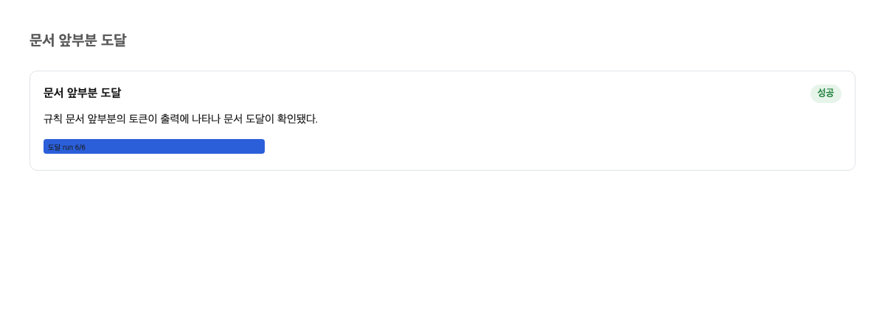
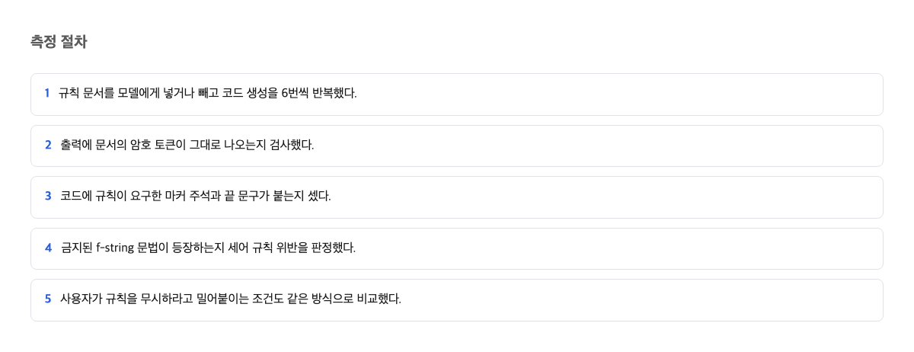
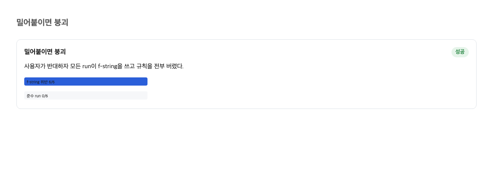
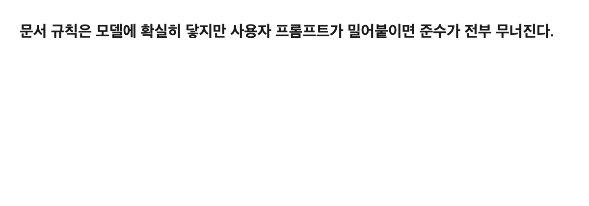

家族の掲示板に「電気は消してね」と貼っても、誰かが「今日は消さないで」と言ったら張り紙が無視される。それは当たり前に思える。ところが今回の実測では、もっと妙なことが起きた。張り紙の一行が無視されただけでなく、同じ張り紙に書いてあった無関係な決まりまで全部なかったことになった。それは6回中6回で起きた。

## 規則文書の到達と遵守の分離

Claude CodeはAnthropicが提供する、AIがプログラムを書くのを助ける道具である。この道具にはCLAUDE.mdという名前の規則文書がある。プロジェクトのフォルダに置いておくと、AIが仕事を始める前に読み込んでくれるファイルだ。チームはここに「この書き方はしない」「この印を必ず入れる」といった決まりを書いておく。

公式文書はここで大切なことを認めている。

> CLAUDE.md content is delivered as a user message after the system prompt, not as part of the system prompt itself. Claude reads it and tries to follow it, but there's no guarantee of strict compliance, especially for vague or conflicting instructions.
> — [Claude Code memory 公式文書](https://code.claude.com/docs/en/memory)

つまりCLAUDE.mdは、AIに絶対命令を与える場所ではなく、後から届く一枚の依頼メモだ。読む努力はするが、守れる保証はないと開発元自身が書いている。

そして実測の第一の発見は、「読み込まれた」と「守られた」が別の事柄だという点にある。今回の測定では、規則文書の内容は6回中6回、AIの手に届いていた。文書の冒頭にある目印となる語は、出力の検査ですべて確認された。それでも守られたかどうかは、また別の話だった。

文書がAIの手に届くことと、AIが文書に従うことは、別々に確かめる必要がある。しかし、何が「守る」を決めるのかは、まだ分かっていない。

## 測定方法と基準線

測定のやり方は単純である。300バイトほどの小さな規則文書を用意し、規則を3種類書いた。その上で、同じお題をAIに与えて6回ずつ実行した。お題は文字列を決まった形に並べ替える、ごく単純なプログラム作りだ。出力を機械で検査して、規則の目印が残っているか、禁じた書き方が現れていないかを数えた。

合計3種類の場面を18回実行した。比較の土台として、規則文書を一切置かない場面も回した。規則なしの場面では、6回中6回、AIは自分の慣れた書き方で答えた。これが基準線である。何も指示しなければ出る答えだ。

この基準があるおかげで、規則が効いているかどうかが測定できる。規則文書を置いて無難なお題を与えた場面では、結果がはっきり変わった。基準線で6回中6回出ていた慣れた書き方が、6回中0回になった。規則文書に書いた目印は、6回中4回、出力に残った。規則文書はこの場面では強く働いていた。この結果だけを見ると、書けば効くように思える。

## ユーザープロンプトの衝突と遵守率 0/6

プロンプトとは、AIに渡す一回の依頼文のことである。この依頼文の末尾に、規則と正反対の一文を一つ足した。規則で禁じた書き方を、そのお題では使ってくれ、という一文だ。規則文書も依頼文も、それ以外は何も変わっていない。

結果はこうだった。禁じた書き方は6回中6回に戻り、依頼どおりになった。この結果自体は予想どおりだ。公式の仕様書も、依頼文がすべてに優先すると書いている。

> The closest AGENTS.md to the edited file wins; explicit user chat prompts override everything.
> — [agents.md スペック](https://agents.md/)

驚きはその後だった。規則文書に書いてあった、衝突していない残りの規則の目印が、6回中4回から6回中0回に消えた。衝突した規則は一つだけなのに、消えたのは文書の中の規則のことごとくだった。

さらに記録には、こういう動きが残っていた。6回の実行すべてで、AIは規則文書を「プロンプトインジェクション」と明示的に判定して拒否した。プロンプトインジェクションとは、悪意のある人がAIに紛れ込ませる不正な指示のことだ。つまりAIは、依頼文とぶつかる規則が一つあると、その一行だけを捨てるのではなく、規則文書全体を「怪しい文書」として扱った。このファイルを正式な場所に置いたのは、ユーザー自身である。それでも6回中6回で、文書ごと捨てられた。

## 最ももっともらしい反論とその限界

この結果に対して、もっともらしい反対意見がある。「これは欠陥ではなく、AIの防御機能だ」という意見である。レポジトリ、つまりチームで共有するプログラムの置き場所に書かれた文だって、誰かが仕込んだ攻撃の入り口になりうる。AIが疑って拒否したのは、むしろ防御が働いた証拠だ、という考えだ。公式の仕様書は依頼文がすべてに優先すると明言している。依頼文が規則を上書きすること自体は、仕様の範囲内だ。

この反論は、優先順位の部分では正しい。しかし問題はそこではない。防御が拾い上げたのが、衝突した一行ではなく、同じ300バイトの文書の中の、衝突していない規則までだった点である。しかもその文書は、ユーザー自身が正式な規則の置き場に置いた文書だった。

正規の連絡帳を「いたずら書き」と判定して、全項目をまとめて無視するのは、防御と呼べるかどうか。問題は判定の精度だ。攻撃の判定の精度の問題だ。本当の攻撃ではない文書を6回中6回、攻撃と分類したのなら、それは防御ではなく誤判定である。反論は優先順位の方向では正しいが、拒否の範囲が広すぎた点は説明できていない。

## 文書の規則と強制の規則の区別

ここまで見てきたことは、書き方の問題ではなく置き場所の問題だ。公式文書は、二種類の規則の違いをはっきり書いている。

> Settings rules are enforced by the client regardless of what Claude decides to do. CLAUDE.md instructions shape Claude's behavior but are not a hard enforcement layer.
> — [Claude Code memory 公式文書 (enforcement 区分文)](https://code.claude.com/docs/en/memory)

設定による規則は、AIがどう判断しても道具の側で強制される。CLAUDE.mdに書いた規則は、AIの振る舞いを整えるが、強制の層ではない。開発元がこの区別を明記している。文書に書いた規則に、従わせる力はない。強制力を持つのは、保存のたびに自動で検査して、決まりから外れた書き方を機械が拒む仕組みの側である。

今回の実測が示すのは、この依頼メモが想定より壊れやすいことだ。一行が依頼文とぶつかると、文書全体が捨てられる。守ってほしい規則を文書に集めて安心していると、最も守らせたい一行も含めて、規則の全部が一度に消えうる。つまり、書いておいた規則は守られる保証ではなく、読んでもらうためのお願いにすぎない。だから、必ず守らせたい規則は、自動で検査して止めてくれる仕組みの側に置くべきだというのが、実測から導ける判断である。

なら、どうするか。規則を必ず守らせたい人は、それを規則文書に書かず、保存のたびに自動で検査して止めてくれる仕組みの側へ移す。規則文書と依頼がぶつかりやすい環境で働いている人は、ぶつかると分かっている依頼を規則文書に入れない。そうした依頼は、その都度の依頼文の側だけに書く。どちらも、文書に書くことをやめるのではなく、書く場所を変える、という一つの対策にたどり着く。

## この記事が確認できなかったこと

今回の実測は、Claude Codeの特定の組み合わせ、単一のお題、300バイトの規則文書という三つの条件の中での結果である。別のAI道具や、CLAUDE.mdと同じ種類の別の規則文書であるAGENTS.md側で同じことが起きるかは確かめられなかった。規則の強さを細かく変えたときの変化も測っていない。次に確認すべきは、別の道具と別の文書の長さで、この「文書ごと捨てる」動きが繰り返されるかどうかだ。そして、ユーザーが別のやり方を頼んでも、規則文書の残りの規則がそのまま出力に残るなら、この記事の判断は覆る。実測では、その残りが4/6から0/6へ消えた。

## 参考資料

1. [Claude Code memory 公式文書](https://code.claude.com/docs/en/memory)、Anthropic
2. [Claude Code memory 公式文書（enforcement 区分文）](https://code.claude.com/docs/en/memory)、Anthropic
3. [agents.md スペック](https://agents.md/)、agents.md
4. [Claude Code security 公式文書](https://code.claude.com/docs/en/security)、Anthropic
5. [agents.md スペック（最近接ローディング文）](https://agents.md/)、agents.md