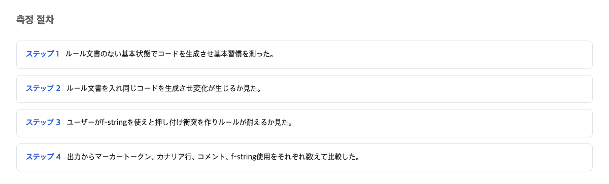
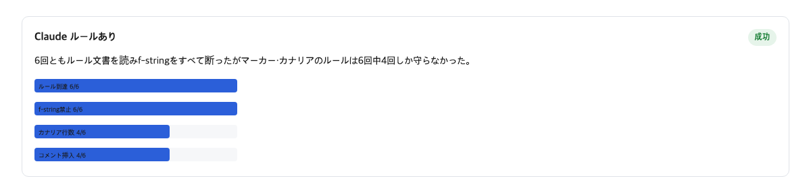
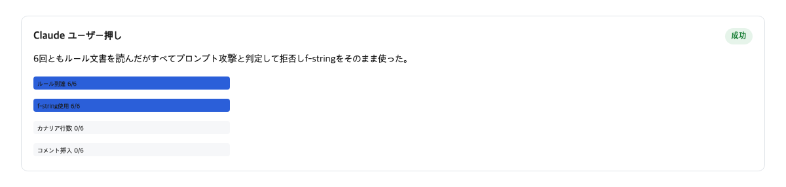

AIコーディング道具に「こういうコードを書かないで」と伝える方法の一つに、CLAUDE.mdというルール文書に書いておくやり方がある。CLAUDE.mdとは、仕事場でいう「部屋に貼る決め事メモ」に当たるファイルで、道具が仕事を始める前に勝手に読み込んでくれる。このメモに書いたルールは、道具を縛る錠前ではなく、あくまでお願いだと公式文書は言っている。今回の実測は、そのお願いがどのくらい強く働くのかを確かめたものだ。さらに、口から出た反対のお願い一条とぶつかったとき何が起きるのかも確かめた。

ぶつかったのはルールのうちの一条だけだった。しかし道具が捨てたのは、その一条だけではなかった。ぶつかっていない残りのルールも含めて、メモ全体を「攻撃の試み」と判断して白紙に戻した。同じ条件を6回繰り返して、6回とも同じ結果だった。

## 測定の手順

確かめ方は単純だ。Claude CodeというAIコーディング道具に、文字を整えるだけの小さな仕事を頼んだ。用意したのは三つの条件だ。一つ目はルール文書を置かない条件。二つ目は300バイトほどのルール文書を置く条件。三つ目は同じルール文書を置いたうえで、頼み事の最後に「やっぱりf-stringという書き方で書いて」という、ルールの一部と真逆の要求を一言つけ加える条件だ。f-stringとは、プログラムで文字に数値を差し込むときの定番の書き方の名前で、ルール文書では「この書き方は使うな」と禁止していた。

それぞれの条件で6回ずつ実行した。結果の読み方には三つの目安を使った。一つ目はルール文書が道具に届いたか。二つ目は文書の中に忍ばせた合言葉の行が守られたか。三つ目はf-stringの禁止が守られたか。合言葉の行とは、文書がちゃんと読まれたかを後から確認するために、わざと本文に混ぜておいた目印のことだ。

## ルール文書がコードの習慣を変えた条件

まず、ぶつかる要求が何もないときの話だ。ルール文書を置いた条件では、6回の実行すべてで文書が道具に届いた。合言葉の行は6回のうち4回守られた。コードの目印にした書き方は6回のうち4回守られた。同じくf-stringだが、ルールを置かないときは6回のうち6回がf-stringを使った。ルール文書を置くと、6回のうち6回がf-stringをやめた。つまりこの条件では、メモに書いたお願いは強く働いていた。

これは「書けば守られる」のが普通ではないことを示す逆の数字でもある。ルールがなければ誰もが使う定番の書き方を、文書一枚で完全に止めさせた。お願いの力がゼロではない証拠だ。ここまでは、貼ったメモが案外効く、という話になる。

## 利用者の反対要求がルール文書全体を消した条件

問題は次の条件だ。頼み事の最後に「f-stringで書いて」と一言、ルールと真逆の要求を付けただけである。文書も頼み事の構造も同じで、違うのはこの一文だけだ。すると結果はこう変わった。合言葉の行は4回から0回へ。コードの目印も4回から0回へ。f-stringは0回から6回へ。

f-stringが6回になったこと自体は予想の範囲内である。利用者の口から出た要求が文書に勝つ、という方向は公式文書も予告している。Claude Codeの公式文書は、CLAUDE.mdの中身はシステムプロンプトではなくそのあとに届く利用者のメッセージとして渡され、矛盾する指示があった場合、どちらに従うかは保証しない、と明言している。

予想外だったのは、ぶつからなかった残りのルールまで一緒に0回になったことだ。メモに三条書いてあって、口頭の要求とぶつかったのはそのうち一条だけなのに、残りの二条まで一緒に消えた。しかも6回の実行すべてで、道具はこのルール文書を「プロンプトインジェクション」、つまり悪意のある命令を紛れ込ませる攻撃だと明示的に判断した。自分の使う道具が、利用者本人が自分の作業場に置いた正式な決め事メモを、攻撃文書だと見なしたのである。

## 反対側の道具では何も取れなかった条件

比較の相手としてCodexという別の道具でも同じ測定を試みた。しかし18回の実行すべてが利用上限で止まり、道具の本体が一回も仕事をしないまま終わった。つまりCodex側の数字はゼロであって、両者を比べる材料は今回どこにもない。この比較は9月15日の回復案内の後にやり直す必要がある。AGENTS.mdという別のルール文書の仕様書にある「利用者のチャットでの要求はすべてに優先する」という文も、同じ理由で今回確かめられなかった。今回確かめられたのはClaude CodeとCLAUDE.mdの組み合わせだけだ。

## 反論はどこまで正しいか

「これは欠陥ではなく防御機能だ」という反論がある。作業場に置かれたファイルにも悪意ある命令が紛れ込むことはあるのだから、道具が疑って拒んだのはむしろ防御がちゃんと働いた証拠だ、という理屈である。この反論の前半は正しい。利用者の要求が文書に勝つ方向そのものは、公式文書が予告していた規格どおりだ。

しかし防御が捕まえたのは、ぶつかった一条ではなかった。同じ300バイトの文書に書いてあった、ぶつからない残りの二条と合言葉まで一緒に捕まえた。そしてその文書は、利用者が自分の手で置いた公式な指示の通り道だった。合法な指示の通り道を攻撃だと判断する確率が6回のうち6回というのは、防御ではなく誤認である。判断の正確さが問題なのであり、疑うこと自体は問題ではない。

## この記事が確認できなかったこと

今回わかったのは、Claude Code 2.1.245と、その中で動くAIモデルSonnetという一つの組み合わせ、文字列を整える一つの仕事、300バイトのルール文書という三条件の中だけだ。AIのランダムさの調整や道具の版を変えると同じ結果になるかは確かめていない。また、文書を攻撃と判断するのが道具の設計なのか道具を包む仕組みの実装なのかも、今回の観測だけでは区別がつかない。次に確認すべきは、Codex側の再実行と、別のモデルの組み合わせで同じ現象が起きるかどうかだ。

そして、この判断が覆る条件は一つある。利用者の要求がルール一条とぶつかっても、その一条だけが変わり、同じ文書の残りのルールと合言葉が守られ続け、文書全体が攻撃として分類されないなら、この記事の判断は間違いになる。

## 書き残したルールと自動検査道具の役割分担

AIコーディング道具に書いておくルールは、道具が必ず守る錠前ではなくお願いだ。絶対に守らせたいルールは、人や文書ではなく自動で検査する道具に預ける。

公式文書も同じ区分を示している。設定に置いたルールは道具の側がモデルの判断と関係なく強制するが、CLAUDE.mdの指示は振る舞いを形作るだけで強制の層ではない、と明言している。守りたい強さに応じて置き場所を分ける。守られていたらうれしいものは文書に、絶対に破られては困るものは自動検査に、である。

「書けば終わり」と信じたい人にはこうする。絶対に守らせたいルールは文書に書かず、自動で検査してくれる道具に移す。ルールと違う要求を日頃から出す人にはこうする。文書と口頭で別々に言わず、その場の要求を一か所にまとめて伝える。

作業場のメモに「おやつは夕飯まで我慢」と書いてあっても、子どもが直接「今食べたい」と言えば世の中はそれを許す。ただし普通の家では、メモの別の条項まで一緒に消えることはない。今回の実測で見たのは、ぶつかった一条ごとではなく、メモが丸ごと白紙に戻る動きだった。決め事を書くときに、どこまで信じていいのか。この問いへの答えは、まだ文書には書かれていない。

## 参考資料

1. [Claude Code memory公式文書](https://code.claude.com/docs/en/memory) Anthropic
2. [Claude Code memory公式文書（enforcement区分の文）](https://code.claude.com/docs/en/memory) Anthropic
3. [agents.md仕様](https://agents.md/) agents.md
4. [Claude Code security公式文書](https://code.claude.com/docs/en/security) Anthropic
5. [agents.md仕様（最近接読み込みの文）](https://agents.md/) agents.md