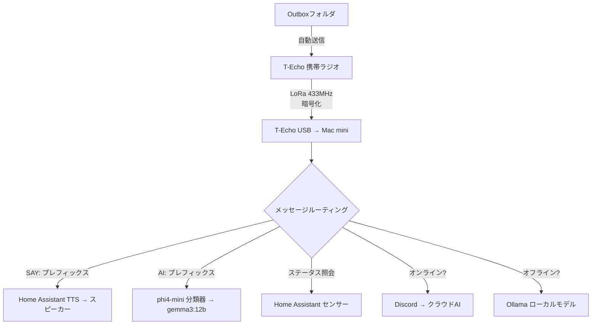
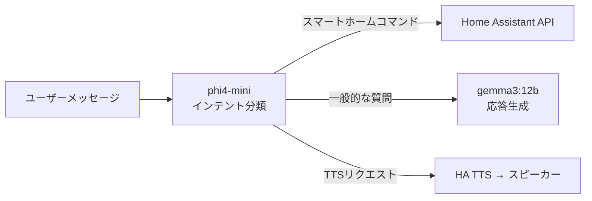

## 概要

インターネットが切れると、スマートホームは停止します。クラウドベースの音声アシスタントもIoT自動化もすべて使えなくなります。しかし、<strong>30ドルのLoRaラジオ</strong>と<strong>Mac miniで動作するローカルLLM</strong>だけで、完全オフラインのスマートホームを実現した事例が登場しました。

ウクライナ在住の開発者が、戦争による頻繁な停電とインターネット断絶の状況で、Meshtastic LoRaラジオとOllamaローカルモデルを組み合わせて<strong>インターネットゼロ</strong>環境のスマートホーム制御システムを構築しました。

この記事では、このプロジェクトのアーキテクチャ、技術スタック、実装コスト、そしてエッジAIの実用的な可能性を分析します。

## システムアーキテクチャ

全体システムは驚くほどシンプルです。



核心は<strong>デュアルルーティング</strong>です。インターネットがあればクラウドAIを活用し、なければ自動的にローカルモデルに切り替わります。ユーザーは違いを意識する必要がありません。

## コア技術スタック

### LoRa通信 — Meshtastic + Lilygo T-Echo

<strong>Meshtastic</strong>はオープンソースのLoRaメッシュネットワークファームウェアです。各ノードがメッセージをリレーするため、複数台を配置すれば数キロメートルにわたる通信網を構築できます。

- <strong>ハードウェア</strong>: Lilygo T-Echo (~30ドル)
- <strong>周波数</strong>: 433MHz LoRa
- <strong>特徴</strong>: 暗号化チャンネル、USB接続、メッシュリレー
- <strong>制約</strong>: メッセージあたり200文字制限（AI応答の自動分割で解決）

### ローカルLLM — Ollama

オフラインAIの核心は<strong>2段階モデル構造</strong>です。

| モデル | 役割 | サイズ | 用途 |
|--------|------|--------|------|
| phi4-mini | インテント分類器 | ~2B | 「スマートホームコマンドか質問か」の判別 |
| gemma3:12b | 応答生成 | 12B | 実際の回答と推論 |

軽量モデルでまず意図を分類し、大きなモデルは必要な時だけ呼び出す構造で、<strong>Mac mini M4 16GB</strong>でも十分にリアルタイム応答が可能です。

### Home Assistant連携

スマートホーム制御とTTS（テキスト音声変換）をHome Assistantが担当します。

- 照明制御、センサー読み取り、在室確認
- <strong>SAY: プレフィックス</strong>でラジオから送信したテキストを自宅スピーカーで音声出力
- ウクライナ語TTS対応

```
SAY: Привіт, я скоро буду вдома
→ 無線電波 → Mac mini → HA TTS → スピーカーで音声再生
```

インターネット接続が一切不要な<strong>完全オフライン音声メッセージ</strong>です。

## 実装コスト分析

このシステムの最大の魅力はコストです。

| 項目 | 価格 | 備考 |
|------|------|------|
| Lilygo T-Echo × 2 | ~60ドル | 固定局 + 携帯用 |
| Mac mini M4 16GB | ~500ドル | 既存保有時は0ドル |
| Home Assistant | 無料 | オープンソース |
| Ollama + モデル | 無料 | オープンソース |
| Meshtasticファームウェア | 無料 | オープンソース |
| HA Voice PEスピーカー | ~50ドル | TTS出力用 |
| <strong>総追加コスト</strong> | <strong>~110ドル</strong> | Mac mini既存保有時 |

クラウドAIサービスの月額サブスクリプションなしに、<strong>一回限りの110ドル投資</strong>で完全なオフラインAIスマートホームが完成します。

## エッジAIの実践的教訓

### 1. オフラインファースト設計の価値

このプロジェクトは戦争という極限状況で生まれましたが、オフラインファースト設計の価値は普遍的です。

- <strong>災害時</strong>: 地震、台風、停電時の通信独立性確保
- <strong>プライバシー</strong>: 音声データがクラウドに送信されない
- <strong>レイテンシ</strong>: ローカル処理で応答速度向上
- <strong>コスト</strong>: 月額サブスクリプションゼロ

### 2. 小さなモデルの戦略的活用

phi4-mini（2B）をルーターに、gemma3:12bを実行器に分離したアーキテクチャは、エッジデバイスでLLMを活用する<strong>模範的なパターン</strong>です。



### 3. メッシュネットワークの拡張可能性

Meshtasticはメッシュプロトコルのため、ノードを追加すれば通信範囲が拡張されます。原作者が構想する<strong>近隣規模AIネットワーク</strong>は現実的なシナリオです。

- 各ノードにローカルLLMを搭載
- メッシュリレーで数キロメートルのカバレッジ
- インターネットなしのコミュニティAIインフラ

## 自分で実装するには

このシステムを再現するために必要な最小要件です。

1. <strong>ハードウェア準備</strong>: Lilygo T-Echo 2台、Mac mini（またはApple Silicon Mac）、HA対応スピーカー
2. <strong>ソフトウェアインストール</strong>: Meshtasticファームウェア、Ollama、Home Assistant
3. <strong>モデルダウンロード</strong>: `ollama pull phi4-mini`、`ollama pull gemma3:12b`
4. <strong>リスナーデーモン構築</strong>: Meshtastic CLIでUSBラジオ接続、Pythonデーモンでメッセージルーティング
5. <strong>HA連携</strong>: REST APIまたはWebSocketでHome Assistantを制御

全スタックがオープンソースのため、コードを直接書くかAIコーディングツールに委任できます。

## 結論

<strong>30ドルラジオ + ローカルAI = インターネット不要スマートホーム</strong>。この等式はシンプルですが、エッジAIの実用的な未来を明確に示しています。

クラウドに依存しないAIシステムはもはや理論ではありません。16GBメモリのMac miniと30ドルのラジオがあれば、今日すぐに実現できる現実です。ローカルLLMの性能が向上し続ける今、<strong>エッジAI × IoT</strong>の組み合わせは最も実用的なAI活用領域の一つになるでしょう。

## 参考資料

- [Reddit - I plugged a $30 radio into my Mac mini and told my AI "connect to this"](https://www.reddit.com/r/LocalLLaMA/comments/1r8ectu/)
- [Meshtastic 公式サイト](https://meshtastic.org/)
- [Ollama 公式サイト](https://ollama.ai/)
- [Home Assistant 公式サイト](https://www.home-assistant.io/)
- [Lilygo T-Echo](https://www.lilygo.cc/products/t-echo)
