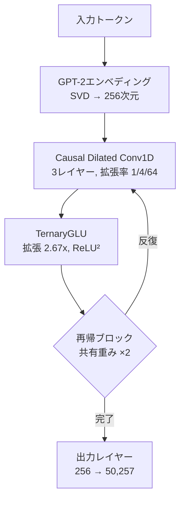

## 概要

GPUなしで言語モデルを訓練できるとしたら？最近、Redditのr/LocalLLaMAコミュニティで、<strong>CPUだけで1.2時間で1,360万パラメータの言語モデルを訓練</strong>したプロジェクトが公開され、大きな注目を集めました。FlashLM v3と呼ばれるこのモデルは、行列乗算（MatMul）を完全に排除したアーキテクチャを使用し、推論時には加算と減算のみで動作します。

本記事では、MatMul-Freeアーキテクチャの核心原理、FlashLM v3の構造、そしてエッジAIと低コスト学習への示唆を解説します。

## MatMul-Freeアーキテクチャとは？

### 行列乗算の課題

従来のTransformerモデルで最も多くの演算を消費するのは、AttentionとFFN（Feed-Forward Network）レイヤーの<strong>行列乗算</strong>です。この演算はO(n²d)またはO(nd²)の計算量を持ち、GPUの並列処理能力に大きく依存しています。

2024年にUC Santa Cruzの研究チームが発表した論文<strong>「Scalable MatMul-free Language Modeling」</strong>（arXiv:2406.02528）は、行列乗算を完全に排除しながらも、数十億パラメータ規模で競争力のある性能を達成できることを示しました。

### 三値重み（Ternary Weights）

MatMul-Freeモデルの核心は、重みを<strong>{-1, 0, +1}</strong>の3つの値に制限することです。これにより：

- <strong>乗算が不要</strong>：重みが-1なら符号反転、0ならスキップ、+1ならそのまま加算
- <strong>メモリ削減</strong>：重みあたり2ビットのみ必要（FP16比8倍削減）
- <strong>エネルギー効率</strong>：整数加算は浮動小数点乗算に比べ数十倍効率的

```python
# 三値重み演算の例
# 従来: output = weight * input  (浮動小数点乗算)
# MatMul-Free: output = sign(weight) * input  (加算/減算のみ)

def ternary_linear(x, weights):
    """三値重み線形変換 — 乗算なし"""
    result = torch.zeros_like(x[..., :weights.shape[1]])
    result += x[..., weights == 1].sum(dim=-1)   # +1: 加算
    result -= x[..., weights == -1].sum(dim=-1)   # -1: 減算
    # weights == 0: 何もしない
    return result
```

## FlashLM v3アーキテクチャの詳細

FlashLM v3は、MatMul-Free概念を実際に実装したオープンソースモデルです。

### 主要構成要素



| 構成要素 | 詳細 |
|---------|------|
| パラメータ数 | 1,360万 |
| モデル次元 | 256 |
| トークンミキサー | Causal Dilated Conv1D（拡張率 1/4/64） |
| FFN | TernaryGLU（拡張 2.67x、ReLU²活性化） |
| エンベディング | GPT-2事前学習 → SVD投影（256次元） |
| トークナイザー | GPT-2（50,257語彙） |
| 再帰回数 | 2（重み共有） |

### 訓練設定

- <strong>データセット</strong>：FineWeb-Eduから3,200万トークン（3万文書）
- <strong>ハードウェア</strong>：CPU 2スレッド（Deepnote環境）
- <strong>訓練時間</strong>：約1.2時間
- <strong>ステップ数</strong>：4,050（シーケンス長 64→128→256 段階的増加）
- <strong>オプティマイザ</strong>：NorMuon（2D重み）+ AdamW（エンベディング、バイアス）
- <strong>検証損失</strong>：6.80

## 興味深い発見：出力レイヤーのボトルネック

開発者が共有した最も驚くべき発見は、<strong>訓練時間の86%が出力レイヤーに消費された</strong>という点です。


256次元を50,257語彙に投影するソフトマックス出力レイヤーが全体の演算の大部分を占めました。つまり、「効率的な」三値コアが非効率なソフトマックスヘッドによって、実質的に学習信号を十分に受け取れていなかったのです。

v4ではソフトマックスを<strong>階層的ツリー構造</strong>に置き換えてこのボトルネックを解決する予定で、同じ時間内に5〜10倍効果的な訓練が可能になると期待されています。

## Scalable MatMul-free LM論文との関係

FlashLM v3はUC Santa CruzのMatMul-Free論文にインスピレーションを受けていますが、いくつかの相違点があります：

| 項目 | 論文（2024） | FlashLM v3 |
|------|-------------|------------|
| 規模 | 最大27億パラメータ | 1,360万パラメータ |
| ハードウェア | GPU | CPU専用 |
| トークンミキサー | MatMul-free Attention変形 | Causal Dilated Conv1D |
| 重み | 三値 | 三値（STE学習） |
| メモリ削減 | 訓練時61%、推論時10倍 | CPUで動作可能なレベル |
| 目標 | 大規模効率性の実証 | 超小型CPU訓練可能性の実証 |

## エッジAIと低コスト学習への示唆

### 1. GPUなしのAI開発

MatMul-Freeアーキテクチャは、GPUアクセスが制限された環境でのAI開発の可能性を開きます：

- <strong>教育目的</strong>：学生がノートPCで直接言語モデルを訓練可能
- <strong>発展途上国</strong>：高価なGPUなしでもローカルAIモデル開発が可能
- <strong>プロトタイピング</strong>：アイデアの素早い検証にGPU待ちが不要

### 2. エッジデバイスでの推論

三値重みの最大の利点は、<strong>エッジデバイスでの推論効率性</strong>です：

- <strong>IoTデバイス</strong>：マイクロコントローラーでも言語モデルの実行が可能
- <strong>モバイル</strong>：バッテリー消費を最小化しながらオンデバイス推論
- <strong>ニューロモーフィックチップ</strong>：論文によると非同期処理でエッジGPU比4倍のスループット、10倍のエネルギー削減

### 3. 現実的な限界

もちろん、現段階では明確な限界があります：

- 検証損失6.80は実用レベルには未達
- 文法的にはもっともらしいが、意味的な一貫性が不足
- Attentionメカニズムなしでは長い文脈依存性の処理に限界
- 出力レイヤーのボトルネックが解決されなければスケーリングが困難

## 今後の展望

MatMul-Freeアーキテクチャはまだ初期段階ですが、いくつかの発展方向が期待されます：

1. <strong>出力レイヤーの最適化</strong>：階層的ソフトマックス、adaptive softmaxなどでボトルネック解消
2. <strong>規模の拡大</strong>：論文が27億パラメータまで検証しているため、CPU訓練も中規模まで可能になり得る
3. <strong>ハードウェア最適化</strong>：三値演算に特化したカスタムハードウェアやFPGAアクセラレーション
4. <strong>ハイブリッドアプローチ</strong>：コアレイヤーはMatMul-Free、出力は従来方式の混合

## 結論

FlashLM v3は「GPUがなくても言語モデルを訓練できる」という可能性を実証した興味深いプロジェクトです。現時点では研究プロトタイプの段階ですが、MatMul-Freeアーキテクチャが発展すれば、<strong>AIの民主化</strong>の重要な柱となり得ます。

特に出力レイヤーのボトルネック現象の発見は、今後の効率的なアーキテクチャ設計に貴重なインサイトを提供します。GPUなしのAI時代が到来するまでにはまだ道のりは長いですが、その第一歩はすでに踏み出されています。

## 参考資料

- [FlashLM v3モデル（Hugging Face）](https://huggingface.co/changcheng967/flashlm-v3-13m)
- [Redditディスカッション（r/LocalLLaMA）](https://www.reddit.com/r/LocalLLaMA/comments/1r7mscr/i_trained_a_language_model_on_cpu_in_12_hours/)
- [Scalable MatMul-free Language Modeling（arXiv:2406.02528）](https://arxiv.org/abs/2406.02528)
