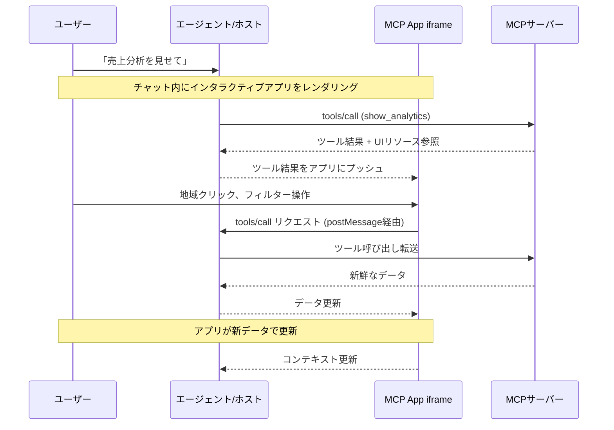

2026年1月26日、Model Context Protocolチームが静かに発表した機能一つが、AIエージェントUXのパラダイムを変えています。それが**MCP Apps**です。AIがテキスト応答の代わりに、AIチャット画面の中で直接動作するインタラクティブなダッシュボード、フォーム、データビジュアライゼーションを提供できるようになりました。

Engineering Manager目線でこれが何故重要かを一言で言うと：これまでAIエージェントが「データを見せれば」ユーザーはそのテキストを読み、再び手動で操作する必要がありました。MCP Appsはそのギャップを埋めます。

## MCP Appsとは何か

MCP Appsは、MCP（Model Context Protocol）の最初の公式拡張（extension）で、<strong>ツール呼び出し（tool call）の応答としてインタラクティブなHTML UIを返せるようにするプロトコル</strong>です。

既存のMCPツールはテキスト、画像、構造化データを返していました。MCP Appsを使うと、同じツール呼び出しが次のものを返せます：

- クリッカブルな地域別売上マップ
- リアルタイム更新のシステム監視ダッシュボード
- 全オプションを一覧できるデプロイ設定フォーム
- PDFビューアー、3Dモデルビューアー、楽譜レンダラー

そしてこのUIが<strong>チャット画面の中で、会話コンテキストの中で</strong>動作します。

## なぜ普通のWebアプリリンクと違うのか

「リンクを渡せばいいのでは？」と思うかもしれません。MCP Appsが別のWebアプリと根本的に異なる理由は4つあります。

<strong>1. コンテキスト保持</strong>

UIが会話の中に存在します。ユーザーがタブを切り替えたり、どのチャットでそのダッシュボードを見たかを思い出す必要がありません。会話の流れにUIが自然に溶け込んでいます。

<strong>2. 双方向データフロー</strong>

MCP AppはMCPサーバーのすべてのツールを呼び出せ、ホストは新しい結果をアプリにプッシュできます。別のWebアプリなら独自のAPI、認証、状態管理が必要ですが、MCP Appsは既存のMCPパターンをそのまま活用します。

<strong>3. ホスト機能との統合</strong>

アプリがホストに作業を委任できます。「このミーティングをスケジュールに追加して」というリクエストをアプリがホストに送ると、ホストがユーザーがすでに連携しているカレンダー統合を通じて処理します。すべての外部統合をアプリが直接実装する必要がありません。

<strong>4. セキュリティ保証</strong>

MCP Appsはsandboxed iframeの中で実行されます。親ページへのアクセス、クッキーの盗取、コンテナからの脱出ができません。ホストがサーバー開発者を完全に信頼しなくても、サードパーティアプリを安全にレンダリングできます。MCPエコシステム全体のセキュリティ脅威とハードニング方法については[MCPセキュリティ危機 — 60日間で30件のCVE、エンタープライズハードニングガイド](/ja/blog/ja/mcp-security-crisis-30-cves-enterprise-hardening)を参照してください。

## 動作原理：アーキテクチャ詳細

MCP Appsは2つのMCPプリミティブを組み合わせます：UIリソースを宣言するツール（tool）と、そのデータをインタラクティブHTMLとしてレンダリングするUIリソースです。



### ステップ別の動作フロー

<strong>Step 1: UIプリロード</strong>

ツール説明（tool description）に `_meta.ui.resourceUri` フィールドが含まれています。このフィールドは `ui://` リソースを指します。ホストはツールが呼ばれる前にこのリソースをプリロードでき、ストリーミング入力などの機能が可能になります。

<strong>Step 2: リソースフェッチ</strong>

ホストがサーバーからUIリソースを取得します。このリソースはHTMLページで、通常JavaScriptとCSSがバンドルされています。

<strong>Step 3: Sandboxedレンダリング</strong>

ホストが会話の中でsandboxed iframeとしてHTMLをレンダリングします。sandboxがアプリの親ページへのアクセスを制限します。

<strong>Step 4: 双方向通信</strong>

アプリとホストは `ui/` メソッド名プレフィックスを持つJSON-RPCプロトコルで通信します。アプリはツール呼び出しリクエスト、メッセージ送信、モデルコンテキスト更新、ホストからのデータ受信が可能です。

## 実践実装：MCP Appサーバーを作る

実際にMCP Appサーバーを実装してみましょう。シンプルな売上分析ダッシュボードの例です。

### 1. 依存関係のインストール

```bash
npm install @modelcontextprotocol/sdk @modelcontextprotocol/ext-apps express
```

### 2. UI宣言付きMCPサーバー

```typescript
import { McpServer } from "@modelcontextprotocol/sdk/server/mcp.js";
import { StdioServerTransport } from "@modelcontextprotocol/sdk/server/stdio.js";

const server = new McpServer({
  name: "analytics-dashboard",
  version: "1.0.0",
});

// UIリソースを宣言するツール定義
server.tool(
  "show_sales_dashboard",
  "地域別売上データをインタラクティブダッシュボードで表示します",
  {
    region: {
      type: "string",
      description: "分析する地域 (all, kr, jp, us, cn)",
      default: "all",
    },
    period: {
      type: "string",
      description: "分析期間 (7d, 30d, 90d)",
      default: "30d",
    },
  },
  // _meta.ui: MCP Appsの核心 — UIリソース参照の宣言
  {
    _meta: {
      ui: {
        resourceUri: "ui://analytics-dashboard/sales",
      },
    },
  },
  async ({ region, period }) => {
    // 実際のデータ取得
    const salesData = await fetchSalesData(region, period);

    return {
      content: [
        {
          type: "text",
          text: `${region}地域の直近${period}売上データをロードしました。`,
        },
        {
          type: "resource",
          resource: {
            uri: "ui://analytics-dashboard/sales",
            mimeType: "text/html",
          },
        },
      ],
      // UIアプリに初期データを渡す
      _meta: {
        ui: {
          resourceUri: "ui://analytics-dashboard/sales",
          initialData: salesData,
        },
      },
    };
  }
);

// UIリソースハンドラー
server.resource("ui://analytics-dashboard/sales", async () => {
  const htmlContent = generateDashboardHTML();
  return {
    contents: [
      {
        uri: "ui://analytics-dashboard/sales",
        mimeType: "text/html",
        text: htmlContent,
      },
    ],
  };
});

async function main() {
  const transport = new StdioServerTransport();
  await server.connect(transport);
}

main();
```

### 3. MCP App UI実装（React例）

```tsx
// dashboard-app/src/App.tsx
import { useEffect, useState } from "react";
import { App as McpApp, useToolCall, useHostData } from "@modelcontextprotocol/ext-apps";

interface SalesData {
  regions: { name: string; revenue: number; growth: number }[];
  total: number;
  period: string;
}

function SalesDashboard() {
  const [data, setData] = useState<SalesData | null>(null);
  const [selectedRegion, setSelectedRegion] = useState<string>("all");

  // ホストから初期データを受信
  const hostData = useHostData<SalesData>();

  // ツール呼び出しhook — ユーザーインタラクション時にサーバーに新データ要求
  const { call: fetchRegionData, loading } = useToolCall("show_sales_dashboard");

  useEffect(() => {
    if (hostData) {
      setData(hostData);
    }
  }, [hostData]);

  const handleRegionClick = async (region: string) => {
    setSelectedRegion(region);
    // UIから直接MCPツールを呼び出し — 追加LLMターンなし！
    const result = await fetchRegionData({ region, period: "30d" });
    if (result?.data) {
      setData(result.data as SalesData);
    }
  };

  if (!data) return <div className="loading">データ読み込み中...</div>;

  return (
    <div className="dashboard">
      <h2>売上現況ダッシュボード</h2>
      <div className="region-filters">
        {["all", "kr", "jp", "us", "cn"].map((region) => (
          <button
            key={region}
            className={selectedRegion === region ? "active" : ""}
            onClick={() => handleRegionClick(region)}
            disabled={loading}
          >
            {region.toUpperCase()}
          </button>
        ))}
      </div>
      <div className="chart-area">
        {data.regions.map((r) => (
          <div key={r.name} className="region-bar">
            <span className="label">{r.name}</span>
            <div
              className="bar"
              style={{ width: `${(r.revenue / data.total) * 100}%` }}
            />
            <span className="value">
              ¥{r.revenue.toLocaleString()}
              <span className={r.growth > 0 ? "up" : "down"}>
                {r.growth > 0 ? "▲" : "▼"}{Math.abs(r.growth)}%
              </span>
            </span>
          </div>
        ))}
      </div>
      <div className="summary">
        合計: ¥{data.total.toLocaleString()} | 期間: {data.period}
      </div>
    </div>
  );
}

// McpAppで包んでホストとの通信を有効化
export default function App() {
  return (
    <McpApp>
      <SalesDashboard />
    </McpApp>
  );
}
```

### 4. セキュリティ設定（CSPと権限）

```typescript
// ツール宣言時にセキュリティポリシーを明示
{
  _meta: {
    ui: {
      resourceUri: "ui://analytics-dashboard/sales",
      permissions: [], // 追加権限なし（基本sandboxのみ）
      csp: {
        // 外部リソース許可ドメインを明示
        "script-src": ["'self'", "https://cdn.jsdelivr.net"],
        "connect-src": ["'self'", "https://api.yourcompany.com"],
        "style-src": ["'self'", "'unsafe-inline'"],
      },
    },
  },
}
```

## 現在のサポートクライアント

2026年3月時点でMCP Appsをサポートするクライアントは以下の通りです：

| クライアント | サポート状況 | 備考 |
|---|---|---|
| Claude (claude.ai) | ✅ 対応 | Web + Desktop |
| Claude Desktop | ✅ 対応 | v3.5以降 |
| VS Code Copilot | ✅ 対応 | InsidersからStableに移行済み |
| Goose (Block) | ✅ 対応 | |
| Postman | ✅ 対応 | APIテストに活用 |
| MCPJam | ✅ 対応 | |
| ChatGPT | ⏳ 未定 | 公式発表なし |
| Cursor | ⏳ 未定 | ロードマップ検討中 |

VS Codeでは `/mcp` チャットコマンドでサーバーの有効化/無効化、OAuth認証管理が可能です。ブラウザでMCPサーバーを直接実行する方式については[WebMCP: Chrome 146でブラウザがAIエージェントのツールサーバーになる](/ja/blog/ja/webmcp-chrome-146-ai-tool-server)を参照してください。

## Engineering Manager視点での実務適用

MCP Appsを導入する際にEMが判断すべきポイントをまとめました。

### MCP Appsが適しているケース

<strong>複雑なデータ探索</strong>が繰り返される場合です。チームメンバーがAIに「今月の障害状況をまとめて」と聞くたびにテキスト応答を読み、改めてダッシュボードを開いて確認するなら、MCP Appsでダッシュボードをチャット内に埋め込めます。

<strong>多段階の設定/承認ワークフロー</strong>も適しています。インフラデプロイ設定、コスト承認、コードレビュートリアージのような作業は、「一つずつ質問する会話」方式よりも全オプションを一覧で見せるフォームの方がはるかに効率的です。

<strong>リアルタイム監視</strong>も強みです。チャットで質問を投げ、その場でライブメトリクスダッシュボードが表示される体験は、従来の方式とは根本的に異なります。

### 導入時の注意点

<strong>バンドルサイズ管理</strong>：UIリソースはチャットでロードされるため、初期ロードパフォーマンスが重要です。React全バンドルよりPreactやvanilla JSの使用が推奨されます。

<strong>CSP（Content Security Policy）設定</strong>：外部スクリプト、APIエンドポイントを明示的に宣言する必要があります。セキュリティチームと協議して許可ドメインリストを管理してください。

<strong>Fallback設計</strong>：MCP Appsをサポートしないクライアントでもツールが有用なテキスト応答を返すよう、必ずフォールバックを設計してください。

<strong>ユーザー同意フロー</strong>：UIからツールを呼び出す際、ホストがユーザーの同意を求めます。このUXを自然に設計する必要があります。

### クライアント実装（独自ホスト構築時）

独自のAIクライアントを構築中のチームには2つの選択肢があります：

```bash
# 選択肢1: @mcp-ui/client パッケージ（Reactコンポーネント提供）
npm install @mcp-ui/client

# 選択肢2: App Bridge直接実装
# SDKのApp Bridgeモジュールを活用
# - sandboxed iframeレンダリング
# - メッセージパッシング
# - ツール呼び出しプロキシ
# - セキュリティポリシー適用
```

## ユースケースギャラリー

公式リポジトリにある実際の例を見ると、可能性の範囲を実感できます。

- <strong>map-server</strong>：CesiumJSグローブ — 「アジアの物流状況を見せて」→ 3D地球儀がチャット内に
- <strong>cohort-heatmap-server</strong>：コホートヒートマップ — ユーザー維持率分析ダッシュボード
- <strong>pdf-server</strong>：PDFビューアー — 契約書をチャット内で直接レビュー
- <strong>system-monitor-server</strong>：リアルタイムシステムメトリクス監視
- <strong>scenario-modeler-server</strong>：ビジネスシナリオモデリングツール
- <strong>budget-allocator-server</strong>：予算配分シミュレーター

すべての例はReact、Vue、Svelte、Preact、Solid、vanilla JSバージョンが提供されています。

## まとめ

MCP AppsはAIエージェントインターフェースの根本的な限界を解決します。テキストのみでコミュニケーションしていたAIが、<strong>生きたUIを会話の中で直接起動</strong>できるようになりました。

Engineering Manager視点でこの技術の価値は明確です。チームメンバーがAIに質問し、その場でインタラクティブツールを受け取って作業を完了するワークフローが実現します。別のダッシュボードタブや別のツール切り替えなしに。

今すぐすべてのMCPサーバーにUIを追加する必要はありません。しかし、チームで最もよく使うツール一つにMCP Appsを適用してみることから始めてください。その経験が今後のAIワークフロー設計の方向性を変えてくれるでしょう。AIエージェントに活用できる標準化されたスキルシステムについては[Anthropic Agent Skills標準：AIエージェント能力の拡張](/ja/blog/ja/anthropic-agent-skills-standard)も合わせてお読みください。

## 参考資料

- [MCP Apps公式発表 (2026-01-26)](http://blog.modelcontextprotocol.io/posts/2026-01-26-mcp-apps/)
- [MCP Apps公式ドキュメント](https://modelcontextprotocol.io/extensions/apps/overview)
- [ext-apps GitHubリポジトリ](https://github.com/modelcontextprotocol/ext-apps)
- [WorkOS: MCP Apps are here](https://workos.com/blog/2026-01-27-mcp-apps)
- [VS Code: MCP Apps Support](https://code.visualstudio.com/blogs/2026/01/26/mcp-apps-support)
- [Goose: From MCP-UI to MCP Apps](https://block.github.io/goose/blog/2026/01/22/mcp-ui-to-mcp-apps/)
