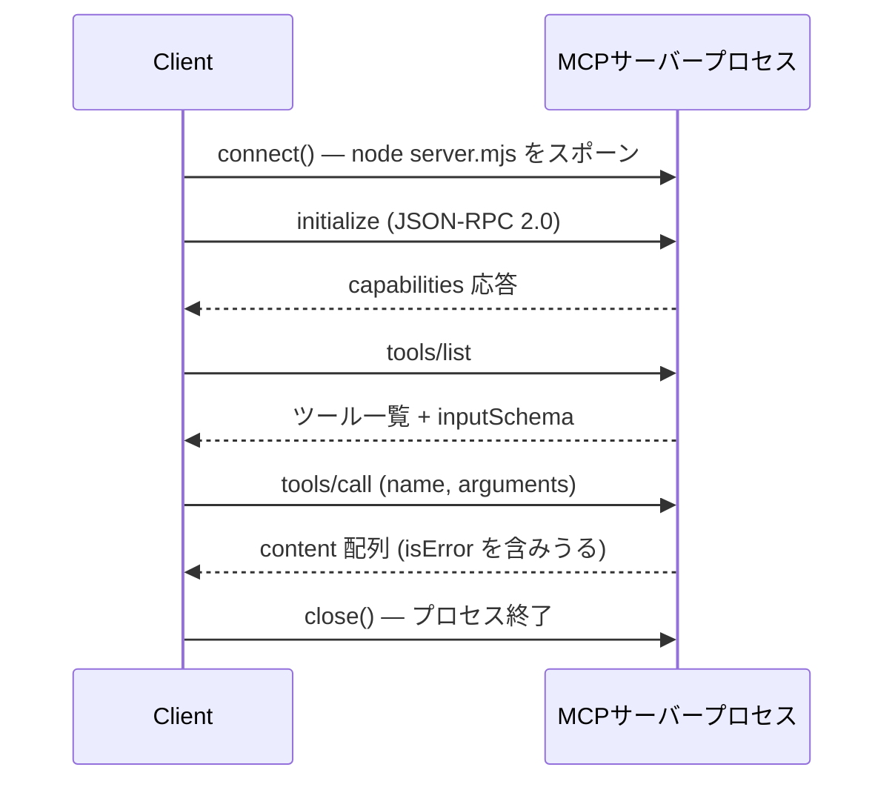

Claude Desktopがサーバーに接続するとき、内部で何が起きているのかずっと気になっていた。「stdioで接続している」という説明は聞いていたが、コードレベルで実際にどう実装されているかは自分で書いてみないとわからない。そこで今日は`@modelcontextprotocol/sdk`をインストールし、TypeScript MCPクライアントをゼロから作ってみた。

結論から言うと、思っていたよりはるかに簡単だった。そして予期しない動作が一つあった。エラー処理の仕方が自分の想定と違っていた。

## Claude Desktopがやることを自分でやってみるという発想

MCP（Model Context Protocol）はAIエージェントが外部ツールとデータにアクセスするための標準インターフェースだ。これまでMCP関連の記事ではサーバー構築をよく扱ってきた。[TypeScriptでMCPサーバーを作る方法](/ja/blog/ja/mcp-server-typescript-sdk-step-by-step-2026)も書いたし、[Python FastMCPで30分でサーバーを立ち上げる方法](/ja/blog/ja/fastmcp-python-mcp-server-build-guide-2026)も試した。だがクライアント側を自分で実装した記事は書いたことがなかった。

本番ユースケースを考えると、カスタムMCPクライアントが必要な瞬間は明らかにある。

- CI/CDパイプラインからMCPサーバーのツールを自動的に呼び出したいとき
- 独自のエージェントレイヤーを開発しながらMCPサーバーと直接連携したいとき
- 既存のPython/TypeScriptコードからMCPサーバーの機能をライブラリのように使いたいとき

Claude DesktopもClaude Codeも不要だ。`@modelcontextprotocol/sdk`にはクライアント実装に必要なものがすべて入っている。

## SDKのインストールと核心クラス2つ

```bash
npm install @modelcontextprotocol/sdk zod
```

今日時点でインストールされるバージョンは`1.29.0`だ。SDK内にサーバーとクライアントの実装が両方含まれている。

MCPクライアントを作るための核心クラスはわずか2つ。

**`Client`** — サーバーとの論理的な接続を管理する。`listTools()`、`callTool()`、`listResources()`、`readResource()`などのメソッドを提供する。

**`StdioClientTransport`** — stdioベースのMCPサーバーと通信するトランスポート層。`command`と`args`でサーバープロセスを直接スポーンする。

SSEやStreamable HTTPサーバーに接続する場合は別のTransportクラスを使う。今日はstdioのみを扱う。

## 実習環境の構成 — サーバーとクライアントを両方自作

デモのために簡単なMCPサーバーを一つ作った。機能は2つ: 四則演算を行う`calculate`ツールとテキストを変換する`transform_text`ツールだ。

```javascript
// server.mjs
import { McpServer } from "@modelcontextprotocol/sdk/server/mcp.js";
import { StdioServerTransport } from "@modelcontextprotocol/sdk/server/stdio.js";
import { z } from "zod";

const server = new McpServer({ name: "demo-tools", version: "1.0.0" });

server.tool(
  "calculate",
  "Basic arithmetic: add, subtract, multiply, divide",
  {
    operation: z.enum(["add", "subtract", "multiply", "divide"]),
    a: z.number(),
    b: z.number(),
  },
  async ({ operation, a, b }) => {
    const ops = {
      add: a + b, subtract: a - b,
      multiply: a * b,
      divide: b === 0 ? null : a / b,
    };
    const result = ops[operation];
    return {
      content: [{
        type: "text",
        text: result === null ? "Error: division by zero" : `${a} ${operation} ${b} = ${result}`,
      }],
    };
  }
);

server.tool(
  "transform_text",
  "Text transformation: uppercase, lowercase, reverse, word_count",
  { text: z.string(), op: z.enum(["uppercase", "lowercase", "reverse", "word_count"]) },
  async ({ text, op }) => {
    const results = {
      uppercase: text.toUpperCase(), lowercase: text.toLowerCase(),
      reverse: [...text].reverse().join(""),
      word_count: `Word count: ${text.trim().split(/\s+/).length}`,
    };
    return { content: [{ type: "text", text: results[op] }] };
  }
);

server.resource(
  "server-info", "mcp://demo/info",
  async (uri) => ({
    contents: [{ uri: uri.href, mimeType: "text/plain", text: "MCP demo server v1.0.0 — stdio transport" }],
  })
);

const transport = new StdioServerTransport();
await server.connect(transport);
```

サーバーを別途起動する必要はない。クライアントの`StdioClientTransport`がサーバープロセスを自動的にスポーンするからだ。

## クライアントの実装 — listTools → callTool → listResources

```javascript
// client.mjs
import { Client } from "@modelcontextprotocol/sdk/client/index.js";
import { StdioClientTransport } from "@modelcontextprotocol/sdk/client/stdio.js";

const transport = new StdioClientTransport({
  command: "node",
  args: ["server.mjs"],
  cwd: process.cwd(),
});

const client = new Client(
  { name: "demo-client", version: "1.0.0" },
  { capabilities: {} }
);

await client.connect(transport);
```

`client.connect(transport)`を呼び出した瞬間、`node server.mjs`プロセスがスポーンされる。以後クライアントとサーバーはstdin/stdoutパイプを通じてJSON-RPC 2.0メッセージを交換する。

接続完了後、3つの操作を順に実行した。

**1. ツール一覧の取得**

```javascript
const { tools } = await client.listTools();
for (const t of tools) {
  const params = Object.keys(t.inputSchema?.properties ?? {}).join(", ");
  console.log(`  • ${t.name}(${params}) — ${t.description}`);
}
```

**2. ツールの呼び出し**

```javascript
const result = await client.callTool({
  name: "calculate",
  arguments: { operation: "multiply", a: 42, b: 7 },
});
console.log(result.content[0].text);
```

**3. リソースの一覧取得と読み込み**

```javascript
const { resources } = await client.listResources();
const info = await client.readResource({ uri: "mcp://demo/info" });
console.log(info.contents[0].text);
```

実際に実行した結果だ。

```
=== MCP Client Demo — @modelcontextprotocol/sdk v1.29.0 ===

✓ Connected to MCP server

Found 2 tool(s):
  • calculate(operation, a, b) — Basic arithmetic: add, subtract, multiply, divide
  • transform_text(text, op) — Text transformation: uppercase, lowercase, reverse, word_count

--- calculate tool ---
  42 multiply 7 = 294
  100 divide 4 = 25
  999 add 1 = 1000

--- transform_text tool ---
  "Model Context Protocol" → MODEL CONTEXT PROTOCOL
  "BUILD ONCE RUN EVERYWHERE" → build once run everywhere
  "hello world from MCP" → Word count: 4

Found 1 resource(s): mcp://demo/info
  Content: MCP demo server v1.0.0 — stdio transport

✓ Client closed cleanly.
```

サーバーを別ターミナルで起動しなかった。クライアントが`node server.mjs`を直接スポーンし、通信終了後`client.close()`でプロセスをまとめて終了させた。

ここまでの全体の流れをシーケンスで整理するとこうなる。



## エラーはexceptionではなくisErrorフィールドで返る

MCPのエラー処理の仕方が当初の予想と違った。存在しないツールを呼び出してみると、exceptionが発生しなかった。

```javascript
const result = await client.callTool({
  name: "nonexistent_tool",
  arguments: {},
});
console.log(result);
// {
//   content: [{ type: "text", text: "MCP error -32602: Tool nonexistent_tool not found" }],
//   isError: true
// }
```

`try/catch`で囲む必要はない。代わりに応答オブジェクトの`isError`フィールドを確認しなければならない。

```javascript
async function callToolSafe(client, name, args) {
  const result = await client.callTool({ name, arguments: args });
  if (result.isError) {
    throw new Error(result.content[0]?.text ?? "Unknown MCP error");
  }
  return result.content[0]?.text;
}
```

この動作はMCP仕様で意図されたデザインだ。ツール実行エラーとプロトコルエラーを区別するために、エラーをコンテンツとして返す。Claudeエージェントがツール実行失敗を「テキストメッセージ」として受け取り、そのまま推論を続けるやり方と一致している。そして、その結果をどの形式で直列化して渡すかがそのまま入力トークンコストになる。[同じデータでも形式によってトークンが62%も変わる](/ja/blog/ja/llm-token-cost-data-format-experiment)ため、平坦な結果をJSONではなくCSV・TSVで返すという小さな判断がエージェント全体のコストを変える。

## Promise.allによる並列呼び出し — 4件同時実行が1ms

単一呼び出しだけでなく並列呼び出しも試した。

```javascript
const start = Date.now();
const ops = [
  ["add", 1, 1], ["multiply", 12, 12], ["subtract", 100, 37], ["divide", 144, 12]
];
const results = await Promise.all(
  ops.map(([op, a, b]) =>
    client.callTool({ name: "calculate", arguments: { operation: op, a, b } })
  )
);
console.log(`${ops.length}件の並列呼び出し完了: ${Date.now() - start}ms`);
```

実行結果:

```
Parallel calls (4 ops) in 1ms:
  1 add 1 = 2
  12 multiply 12 = 144
  100 subtract 37 = 63
  144 divide 12 = 12
```

stdioトランスポートでもSDK内部でリクエストの多重化を処理している。4件を同時に送っても応答が正しくマッピングされる。ただしstdioベースのため、サーバー側の処理は順番に行われる可能性がある。ツールの処理コストが高い場合、並列呼び出しのメリットは限定的になりうる。

Claude Desktopのようなホストアプリを使う場合と、カスタムクライアントを直接使う場合の違いを整理すると：

| 観点 | Claude Desktop経由 | カスタムクライアント |
|---|---|---|
| 実行方式 | デスクトップアプリで手動 | スクリプト・CI/CDで自動 |
| LLM依存 | Claude固定 | 任意のLLM、あるいはLLM無しで直接呼び出し |
| 並列呼び出し制御 | ホストが決定 | Promise.allで直接制御（4件1ms実測） |
| 主な用途 | 対話的な利用 | パイプライン・自作エージェント・サーバーテスト |

## カスタムMCPクライアントが本当に役立つ3つの場面

実装してみると、どこで使えるかがより具体的に見えてきた。

**自動化スクリプトからMCPツールを呼び出す**

MCPサーバーにコードのリンティング、ファイル変換、外部API参照などのツールがある場合、GitHub Actionsやローカルスクリプトから自動的に呼び出せる。`node client.mjs`のような簡単なNode.jsスクリプトで解決できる。

**独自エージェントフレームワークの開発**

LangGraphやLlamaIndexなしで独自のエージェントを書く場合、MCPサーバーが提供するツールをエージェントループに組み込める。`listTools()`でツール一覧を取得してLLMプロンプトに注入し、LLMの応答からツール呼び出しパラメータを解析して`callTool()`で実行するパターンだ。AIエージェントにツールを体系的に組み込む方法は[Claude Agent SDKによるtool use完全ガイド](/ja/blog/ja/claude-agent-sdk-tool-use-complete-guide-2026)で詳しく解説している。

**テストとデバッグ**

MCPサーバーを開発する際、Claude Desktopなしでツールの動作を素早く検証できる。`listTools()`の結果でinputSchemaを確認し、様々なパラメータで`callTool()`を呼び出してみる使い方だ。

## 既存のMCPサーバーへの接続

ここまでは自分で作ったサーバーに接続してきた。公開されているMCPサーバーパッケージも同じクライアントで使える。

```bash
npm install @modelcontextprotocol/server-filesystem
```

transportの設定を変えるだけでいい。

```javascript
const transport = new StdioClientTransport({
  command: "npx",
  args: ["-y", "@modelcontextprotocol/server-filesystem", "/path/to/directory"],
});
```

これで`callTool()`経由でファイルシステムMCPサーバーの`read_file`、`write_file`、`list_directory`ツールを直接呼び出せる。Claude Desktopの設定ファイルにある`command`/`args`をそのまま`StdioClientTransport`に渡せばいい。

複数サーバーに同時接続したい場合は、サーバーごとに別の`Client`インスタンスを作る。クライアントとサーバーは1:1の関係だ。

## コンテンツタイプを安全に処理する

`callTool()`と`readResource()`の戻り値で注意すべき点がある。`content`配列の各項目は`type`フィールドによって構造が異なる。

```typescript
for (const item of result.content) {
  if (item.type === "text") {
    console.log(item.text);
  } else if (item.type === "image") {
    console.log(`Image: ${item.mimeType}`);
  } else if (item.type === "resource") {
    console.log(`Resource: ${item.resource.uri}`);
  }
}
```

`type`フィールドを確認せずに`content[0].text`にアクセスすると、ツールが画像や埋め込みリソースを返したときに`undefined`が返る。特に外部MCPサーバーを使う場合は、常に`type`フィールドを先に確認する習慣をつけるといい。

## 率直な評価と限界

いくつか気になった点も正直に書いておく。

**TypeScriptの型が薄い。** `callTool()`の戻り値型が`{ content: Content[], isError?: boolean }`レベルでジェネリックだ。`TextContent`に絞り込むには明示的な型ガードが必要になる。

**SSE/HTTPは別のTransportが必要。** リモートMCPサーバー（HTTP/SSE）に接続する場合は`StreamableHTTPClientTransport`や`SSEClientTransport`を使う必要があり、設定が少し変わる。

**接続維持のコストに注意。** `StdioClientTransport`は呼び出しのたびに新しいプロセスをスポーンしない。接続が維持される間、サーバープロセスが生き続ける。スクリプト終了時は必ず`client.close()`を呼ぶこと。

## 私の考え: クライアント実装は過小評価されている

MCPサーバーの構築についての記事は多い。しかしカスタムクライアントの実装、つまりClaude Desktopがやっていることをプログラムで行う方法についての記事はほとんどない。

AIエージェントパイプラインを自分で構築している開発者、既存コードにMCPを統合したいチーム、GUIなしでサーバーの動作を検証したいエンジニア、いずれにとっても実用的な技術だ。`@modelcontextprotocol/sdk`の`Client`クラスは十分に安定しており、APIも簡潔だ。

70行のTypeScriptで、MCPサーバーへの接続、ツール一覧の取得、ツールの呼び出し、リソースの読み込み、クリーンな終了がすべてできる。これが最初から公式ドキュメントにサンプルとして載っていればよかったのに、なかったので自分で作ってみた。

次は実際のMCPサーバー（ファイルシステムサーバーやGitHub MCPサーバー）にこのクライアントをつないで、小さな自動化スクリプトを作ってみたいと思っている。

## 参考資料

- [Model Context Protocol 公式サイト](https://modelcontextprotocol.io) — MCPの概念、アーキテクチャ、クライアント/サーバーのビルドガイドをまとめた公式ドキュメントサイト。
- [MCPクライアントのビルドガイド](https://modelcontextprotocol.io/docs/develop/build-client) — 公式ドキュメントのうちクライアント実装を扱うチュートリアル。この記事のTypeScript例と比較すると理解が深まる。
- [@modelcontextprotocol/typescript-sdk (GitHub)](https://github.com/modelcontextprotocol/typescript-sdk) — この記事で使ったSDKの公式リポジトリ。`Client`や`StdioClientTransport`の実装とissueを確認できる。
- [@modelcontextprotocol/sdk (npm)](https://www.npmjs.com/package/@modelcontextprotocol/sdk) — 実際にインストールするnpmパッケージ。バージョン履歴とzodのpeer dependencyを確認できる。
