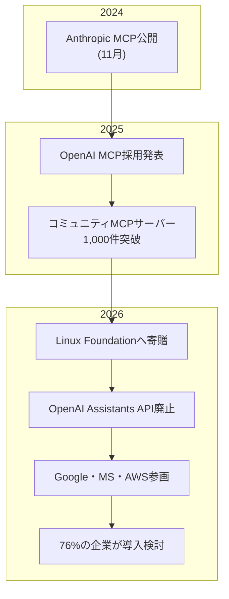
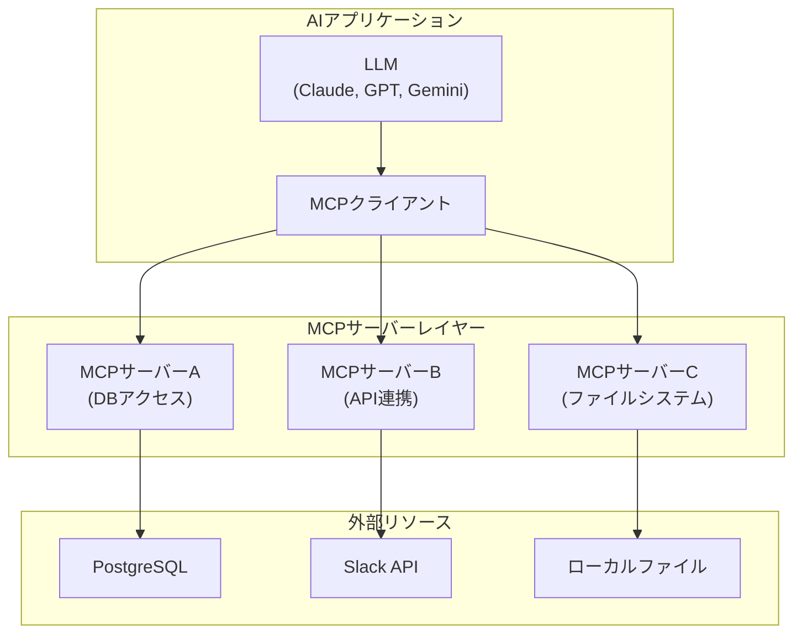
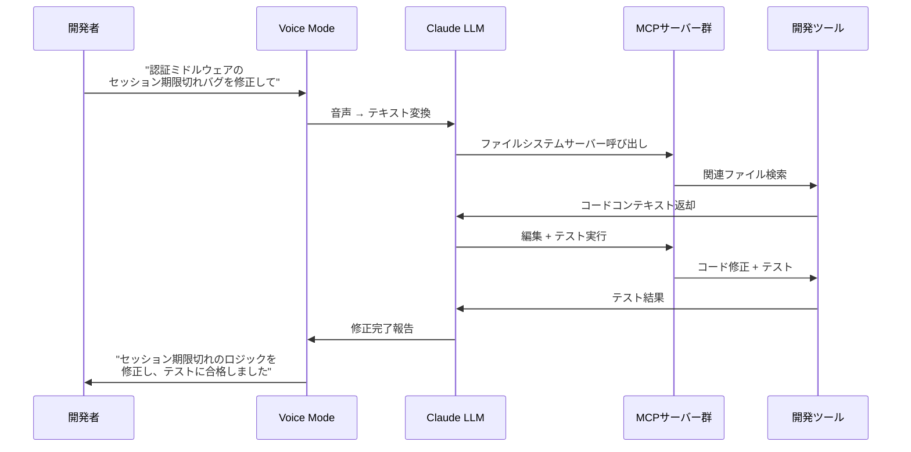
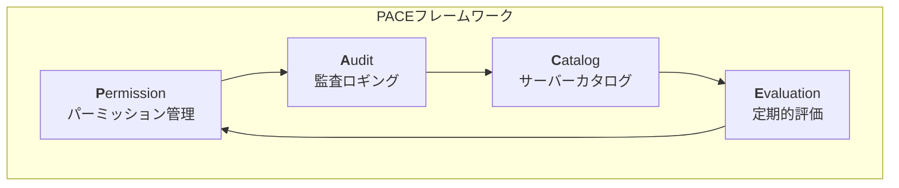
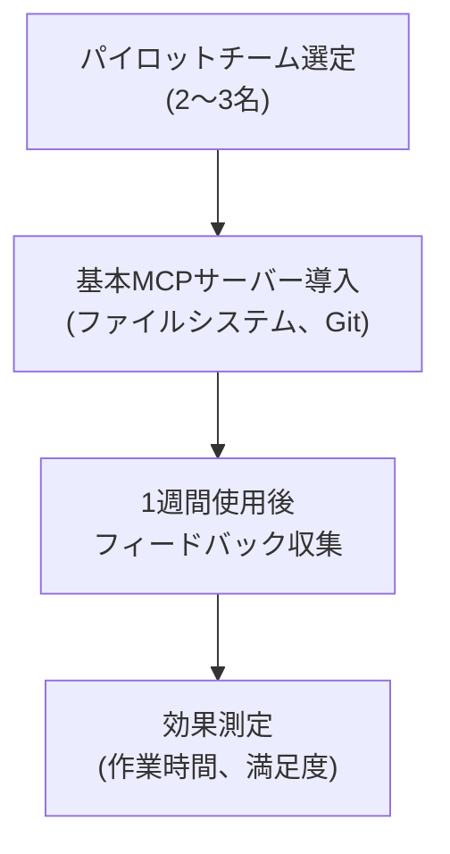

## MCP、「AIのUSB-C」が業界標準になるまで

2024年11月、Anthropicが公開した<strong>Model Context Protocol（MCP）</strong>は、当初「また一つのプロトコル」として受け止められていました。しかし、わずか16か月で状況は一変しました。

2026年初頭、AnthropicはMCPを<strong>Linux Foundation</strong>に寄贈し、OpenAI（Assistants APIを廃止してMCPを採用）、Google DeepMind、Microsoft、AWS、Cloudflareが共同創設メンバーとして参画しました。「AIモデルが外部ツールと対話する方式」に関する事実上唯一の標準が誕生したのです。

この記事では、MCP標準化がエンジニアリング組織にとって何を意味するのか、そして<strong>EM/VPoE/CTO</strong>がどのように導入を準備すべきかを、実践事例とともに解説します。

## なぜ今MCPなのか — 3つの転換点

### 1. プロトコル戦争の終結

2025年まではAIツールの接続方式が断片化していました。

- OpenAI: Function Calling + Assistants API
- Google: Vertex AI Extensions
- Anthropic: Tool Use + MCP
- 各フレームワーク: LangChain Tools、CrewAI Toolsなど

2026年、OpenAIがAssistants APIを公式に廃止しMCPを全面採用したことで、この断片化は事実上終結しました。Linux Foundationガバナンスのもとで単一標準が確立されたことは、HTTP、REST以来最も重要なインフラ標準化の一つです。

### 2. 76%の企業がすでに動き出している

CDataの2026年調査によると、<strong>76%のソフトウェアプロバイダー</strong>がすでにMCPの調査または実装を進めています。これは「導入するかどうか」ではなく「どのように導入するか」の問題に転換したことを意味します。

### 3. セキュリティ統制が普及速度に追いついていない

VentureBeatの報道によると、<strong>エンタープライズにおけるMCP導入速度がセキュリティ統制の整備速度を上回っています</strong>。これは2000年代前半のREST API普及期と類似したパターンです — 利便性がセキュリティに先行し、後で代償を払う構図です。

## MCPアーキテクチャの要点 — 5分で理解

MCPに初めて触れる方のために、コアアーキテクチャを整理します。

<strong>コアコンセプト</strong>：

- <strong>MCPホスト</strong>：AIアプリケーション（Claude Code、Cursor、Windsurfなど）
- <strong>MCPクライアント</strong>：ホスト内部でサーバーと1:1接続を管理
- <strong>MCPサーバー</strong>：特定のリソース（DB、API、ファイルなど）へのアクセスを提供
- <strong>トランスポート</strong>：stdio（ローカル）またはHTTP+SSE（リモート）プロトコル

USB-Cの比喩が適切な理由はここにあります — 一つのプロトコルで、どのAIモデルでもどのツールとも接続できます。

## 実践事例3選 — MCPが変えるワークフロー

### 事例1：Perplexity Computer — 19モデルのエージェンティックオーケストレーション

2026年2月にリリースされた<strong>Perplexity Computer</strong>は、MCPベースのマルチモデルオーケストレーションの最も劇的な事例です。

| 役割 | モデル | 用途 |
|------|--------|------|
| コア推論 | Claude Opus 4.6 | 複雑な意思決定 |
| ディープリサーチ | Gemini | 大量ドキュメント分析 |
| 軽量タスク | Grok | 高速レスポンス |
| 長文脈リコール | ChatGPT 5.2 | 長い対話履歴の活用 |

Perplexityは各モデルを<strong>MCPサーバーとしてラッピング</strong>し、サブエージェントが並列でタスクを実行します。ユーザーが「このPDFを分析して要約してメールで送って」とリクエストすると、システムが自動で最適なモデルの組み合わせを選択し、タスクを分配します。

<strong>EM視点での示唆</strong>：単一モデルに依存しないマルチモデル戦略が可能になりました。チーム内のAIツール選択が「どのモデルを使うか」から「どのタスクにどのモデルを割り当てるか」へと進化します。

### 事例2：Claude Code Voice Mode — 3.7倍の生産性向上

2026年3月3日にリリースされた<strong>Claude Code Voice Mode</strong>は、`/voice`コマンドで起動し、開発者が音声でバグの説明、アーキテクチャの決定、リファクタリングを指示すると、Claudeがコードを作成・実行します。

初期ユーザーデータによると、<strong>3.7倍高速なワークフロー</strong>を達成した事例が報告されています。この速度向上の核心はMCPベースのツール接続です — Voice Modeがファイルシステム、Git、テストランナー、ビルドシステムなどをMCPサーバーで接続し、音声コマンド一つで開発パイプライン全体を制御します。

### 事例3：プラットフォームエンジニアリングチームのMCPゲートウェイ

MintMCP、Cloudflare Workersなどが提供する<strong>MCPゲートウェイ</strong>は、プラットフォームエンジニアリングチームが組織全体のMCPサーバーを一元管理できるようにします。

実際の導入事例で報告された効果：

- <strong>反復作業時間40%削減</strong>：Jiraイシュー作成、Slack通知、DBクエリなどをMCPで自動化
- <strong>オンボーディング時間短縮</strong>：新メンバーが標準化されたMCPサーバーを通じてチームツールに即座にアクセス
- <strong>シャドーIT削減</strong>：個人ごとのスクリプトの代わりに標準MCPサーバーでツールアクセスを統一

## EM/VPoEが注意すべきセキュリティとガバナンス

### セキュリティリスクの現実

MCPの急速な普及には代償が伴います。Ciscoの分析によると、主なリスクは以下のとおりです。

1. <strong>プロンプトインジェクション</strong>：MCPサーバーが返すデータに悪意あるプロンプトが含まれる可能性
2. <strong>サプライチェーン攻撃</strong>：コミュニティMCPサーバー（例：OpenClawの5,700以上のスキル）の品質管理問題
3. <strong>過剰な権限付与</strong>：MCPサーバーに必要以上のシステムアクセス権限を付与
4. <strong>データ流出</strong>：AIモデルを通じた内部データの意図しない外部送信

### ガバナンスフレームワーク：PACEモデル

エンジニアリング組織向けのMCPガバナンスフレームワークを提案します。

<strong>Permission（パーミッション管理）</strong>：
- MCPサーバーごとに最小権限の原則を適用
- 読み取り専用 vs 書き込み可能なサーバーの明確な分離
- チームごとにアクセス可能なサーバーのホワイトリスト管理

<strong>Audit（監査ロギング）</strong>：
- すべてのMCP呼び出しに対するログ記録
- 異常パターンの検知（大量データアクセス、業務時間外の呼び出しなど）
- 週次監査レポートの自動生成

<strong>Catalog（サーバーカタログ）</strong>：
- 承認済みMCPサーバー一覧の一元管理
- バージョン管理およびセキュリティパッチの追跡
- コミュニティサーバー利用時のコードレビュー必須化

<strong>Evaluation（定期的評価）</strong>：
- 四半期ごとのMCPサーバーセキュリティ監査
- 利用率に基づく不要サーバーの整理
- 新たなセキュリティ脆弱性に対する影響評価

## エンジニアリング組織の導入ロードマップ

### Phase 1：パイロット（2〜4週間）

- <strong>対象</strong>：AIツールに関心のある2〜3名のシニアエンジニア
- <strong>サーバー</strong>：ファイルシステム、Git、基本的なDB参照など低リスクなサーバーのみ
- <strong>測定</strong>：反復作業時間の変化、開発者満足度

### Phase 2：チーム拡大（1〜2か月）

- <strong>対象</strong>：チーム全体（10〜20名）
- <strong>サーバー追加</strong>：Slack、Jira、CI/CD連携
- <strong>ガバナンス</strong>：PACEフレームワークの適用開始
- <strong>教育</strong>：MCPの基本概念 + セキュリティガイドラインの共有

### Phase 3：組織標準化（2〜3か月）

- <strong>MCPゲートウェイ導入</strong>：一元管理 + 認証・権限の統合
- <strong>カスタムサーバー開発</strong>：社内システム専用MCPサーバー
- <strong>CI/CD統合</strong>：MCPサーバーデプロイパイプラインの構築
- <strong>KPI設定</strong>：生産性メトリクスの正式トラッキング

### Phase 4：最適化（継続的）

- マルチモデル戦略の策定（Perplexity Computerの事例を参考）
- MCPサーバーのパフォーマンスモニタリング
- 新規サーバーの評価・導入プロセスの自動化

## 「80/13ギャップ」を埋める鍵

McKinseyの2026年調査によると、<strong>80%の企業がGenAIをデプロイ済みですが、実質的なインパクトを得ているのはわずか13%</strong>です。このギャップの主な原因は「ツールの断片化」と「ワークフローの未統合」です。

MCP標準化はこのギャップを埋めるインフラレイヤーです：

| 課題 | MCP以前 | MCP以後 |
|------|---------|---------|
| ツール接続 | モデルごとのカスタム統合 | 標準プロトコルで統一 |
| 切り替えコスト | モデル交換時にすべての統合を再構築 | サーバー維持、クライアントのみ交換 |
| チーム連携 | 個人ごとのスクリプトが乱立 | 標準サーバーカタログを共有 |
| セキュリティ管理 | 統合ごとの個別監査 | ゲートウェイレベルで一括管理 |

## CTO視点：投資トレンドが示すもの

TechCrunchの2026年3月報道によると、VCはもはや<strong>「薄いワークフローレイヤー」</strong>のSaaSには投資していません。代わりに<strong>ミッションクリティカルなワークフローに深く組み込まれたAIネイティブインフラ</strong>に注力しています。

これはMCPを「単なるツール接続」ではなく<strong>「組織のAIインフラレイヤー」</strong>としてポジショニングすべきことを意味します。MCPサーバーエコシステムを早期に構築した組織は：

1. <strong>モデル切り替えに柔軟</strong>：ClaudeからGPTへ、またはオープンソースモデルへ移行してもワークフローを維持
2. <strong>ベンダーロックイン脱却</strong>：特定のAIプロバイダーに依存しないインフラを構築
3. <strong>継続的イノベーション</strong>：新しいMCPサーバーの追加だけでAI機能を拡張可能

## まとめ — 今がMCP投資の好機

MCPのLinux Foundation参画は、「このプロトコルが生き残るかどうか」という問いに終止符を打ちました。OpenAI、Google、Microsoft、AWSがすべて同じテーブルに着いたということは、<strong>HTTP以来最も重要なインフラの合意</strong>に近いものです。

エンジニアリングリーダーとして今やるべきことは3つです：

1. <strong>パイロットを始めましょう</strong> — 2〜3名のシニアエンジニアと基本MCPサーバーからスタート
2. <strong>ガバナンスを先に設計しましょう</strong> — セキュリティ統制なしに拡散させると、後で代償を払うことになります
3. <strong>マルチモデル戦略を検討しましょう</strong> — MCPのおかげで特定モデルに依存しないアーキテクチャが実現可能です

「USB-Cがすべてのデバイスの充電方式を統一したように、MCPはすべてのAIのツール接続方式を統一します。違いは — USB-Cは10年かかりましたが、MCPは2年もかかっていないということです。」

## 参考資料

- [How MCP will supercharge AI automation in 2026 — Hallam](https://hallam.agency/blog/how-mcp-will-supercharge-ai-automation-in-2026/)
- [Enterprise MCP adoption is outpacing security controls — VentureBeat](https://venturebeat.com/security/enterprise-mcp-adoption-is-outpacing-security-controls)
- [2026: The Year for Enterprise-Ready MCP Adoption — CData](https://www.cdata.com/blog/2026-year-enterprise-ready-mcp-adoption)
- [MCP Explained: How AI Agents Actually Work (2026) — DEV Community](https://dev.to/aristoaistack/mcp-explained-how-ai-agents-actually-work-2026-5p8)
- [Claude Code rolls out a voice mode — TechCrunch](https://techcrunch.com/2026/03/03/claude-code-rolls-out-a-voice-mode-capability/)
- [Best MCP Gateways for Platform Engineering Teams — MintMCP](https://www.mintmcp.com/blog/mcp-gateways-platform-engineering-teams)
