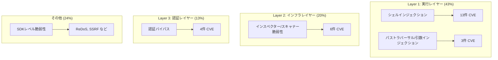
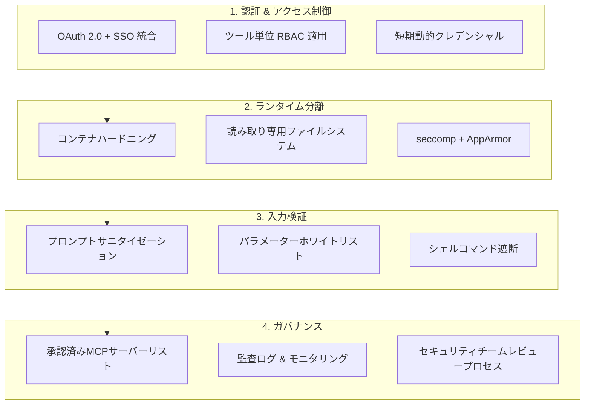

## MCP、AIのUSBポートになった代償

Model Context Protocol（MCP）は、LLMが外部ツールやデータと接続するための事実上の標準となりました。Linux Foundation傘下のオープンガバナンス体制へ移行し、Anthropic・OpenAI・Googleなど主要ベンダーがサポートを表明したことで、採用が爆発的に増加しています。しかし、<strong>利便性が確保された場所には必ず攻撃対象面が伴います。</strong>

2026年1〜2月、わずか60日の間に<strong>30件のCVE</strong>がMCPエコシステムで報告され、インターネットに公開されたMCPサーバーインスタンスは42,665件に達しています。スキャン対象560台のサーバーのうち36%が認証すら実装されていませんでした。MCPがAI時代において最も急速に拡大する攻撃対象面になっているというのは、もはや誇張ではありません。

本記事では、EM/VPoE/CTOの視点からMCPのセキュリティ現況を分析し、チームや組織がすぐに適用できるハードニングガイドをご紹介します。

## 30件のCVEが示す3層攻撃モデル

報告された30件のCVEを分類すると、MCPの攻撃対象面が<strong>3つの明確なレイヤー</strong>へ進化していることが分かります。

### Layer 1 — 実行レイヤー（43%、13+3件 CVE）

最も古典的でありながら、依然として最も大きな割合を占めています。MCPサーバーがユーザー入力をシェルコマンドに直接渡すパターンが繰り返し発見されています。

<strong>代表事例</strong>：Anthropicの公式Git MCPサーバーで発見された3件の脆弱性（CVE-2025-68143〜68145）では、プロンプトインジェクションを通じたリモートコード実行（RCE）が可能でした。パス検証のバイパス、無制限の`git_init`、引数インジェクションが複合的に作用していました。

### Layer 2 — インフラレイヤー（20%、6件 CVE）

MCPサーバー自体ではなく、<strong>MCPを管理・モニタリングするツール</strong>が脆弱性となる新しいパターンです。インスペクター、スキャナー、ホストアプリケーションなどの「メタツール」が攻撃対象となっています。

### Layer 3 — 認証レイヤー（13%、4件 CVE）

<strong>macOSにおけるOAuthトークン更新メカニズムの操作</strong>（CVE-2026-27487）や、`~/.openclaw/credentials/`に平文で保存されたクレデンシャルなど、認証関連の脆弱性が報告されています。

## SDKレベルの脅威 — サプライチェーン汚染

個別のサーバーを超えて、<strong>MCPエコシステム全体を脅かすサプライチェーン攻撃</strong>が検知されています。

### 公式TypeScript SDKの脆弱性

`@modelcontextprotocol/sdk`（公式TypeScript SDK）で2件のクリティカルな脆弱性が確認されています。

- <strong>ReDoS</strong>：`UriTemplate`クラスのリソースURIマッチングに使用される正規表現が壊滅的バックトラッキングに脆弱。特殊なURIによりサーバープロセスのハングアップが可能
- <strong>SSRF</strong>：MicrosoftのMarkItDown MCPサーバーで発見されたSSRF脆弱性が、全MCPサーバーの約36.7%に潜在的に存在

### スキルレジストリの汚染

| 時期 | スキャン範囲 | 悪意あるスキル数 | 割合 |
|------|------------|----------------|------|
| 2026-01-29 | 2,857パッケージ | 341件 | 11.9% |
| 2026-02-16 | 10,700+パッケージ | 824+件 | 7.7% |

Bitdefender Labsは、深層分析対象の約<strong>20%で悪意あるペイロード</strong>を確認しています。npmやPyPIのサプライチェーン攻撃がMCPスキルレジストリに拡大した形です。

## EM/CTOのためのエンタープライズハードニングチェックリスト

### 1. 認証 & アクセス制御

- <strong>OAuth 2.0 + SSO統合は必須</strong>：MCPエンドポイントをSSOの背後に配置します。36%のサーバーが認証なしで公開されている現状を考えると、最優先課題です
- <strong>ツール単位のRBAC</strong>：すべてのMCPツールにロールベースのアクセス制御を適用します。「ファイル読み取り」ツールに「ファイル削除」権限が一緒に付与されないよう分離します
- <strong>動的クレデンシャル</strong>：静的APIキーの代わりに短期トークンを使用します。自動ローテーションを実装します

### 2. ランタイム分離

- <strong>イミュータブルインフラ</strong>：読み取り専用コンテナファイルシステム、制限されたLinuxケーパビリティ
- <strong>リソース制限</strong>：CPU/メモリクォータの設定によりReDoSなどのリソース枯渇攻撃を緩和します
- <strong>強制アクセス制御</strong>：seccompプロファイル + AppArmor/SELinuxによるシステムコールレベルの制限

### 3. 入力検証

- <strong>プロンプトサニタイゼーション</strong>：プロンプトインジェクション防御。すべてのユーザー入力とツールパラメーターをホワイトリスト方式で検証します
- <strong>シェルコマンドの直接実行を遮断</strong>：事前定義されたコマンドのみ許可する構造へ移行します

### 4. ガバナンス

- <strong>承認済みサーバーリストの運用</strong>：開発者が任意にMCPサーバーをインストールできないよう、セキュリティチームの承認プロセスを構築します
- <strong>監査ログ</strong>：すべてのMCPツール呼び出しに対する監査証跡を残します。規制要件（GDPR、HIPAA、SOC2）への準拠が求められます
- <strong>SAST + SCA</strong>：MCPサーバーコードに静的解析ツールとソフトウェアコンポジション分析を適用します

## 実務適用 — MCPセキュリティ成熟度の3段階

組織の現状に合わせて段階的にセキュリティレベルを引き上げるアプローチが現実的です。

### Stage 1：即時対応（1〜2週間）

- 認証のないMCPエンドポイントを即時無効化またはアクセス遮断
- クレデンシャルの平文保存の有無を点検（`~/.openclaw/credentials/`、`.env`）
- 使用中のMCP SDKバージョンの確認およびパッチ適用

### Stage 2：基盤構築（1〜2ヶ月）

- OAuth 2.0 + SSO統合を完了
- コンテナベースのMCPサーバーデプロイへ移行
- 承認済みMCPサーバー/スキルレジストリを構築
- SAST/SCAパイプラインにMCPサーバーコードを組み込み

### Stage 3：成熟運用（3〜6ヶ月）

- リアルタイムモニタリングおよび異常行動の検知
- 定期セキュリティ監査プロセスの定着
- MCPセキュリティポリシーの社内教育プログラム
- レッドチーム演習にMCPシナリオを組み込み

## OWASPのMCPセキュリティガイド

OWASPは2026年初頭、MCPサーバーのセキュアな開発に向けた実務ガイドを発表しました。主な推奨事項は以下の通りです。

- <strong>最小権限の原則</strong>：各MCPツールに必要最小限の権限のみを付与します
- <strong>シークレット管理</strong>：環境変数ではなく専用のシークレットマネージャーを使用します。ランタイムで動的に注入します
- <strong>コンポーネント署名</strong>：MCPサーバーバイナリとスキルパッケージに署名を適用します
- <strong>DevSecOps統合</strong>：MCPセキュリティをCI/CDパイプラインの一部として自動化します

## まとめ — 利便性とセキュリティのバランスを見つける

MCPはAIエージェントの実質的な業務遂行を可能にした中核プロトコルです。しかし、60日間で30件のCVEが報告された現実は、<strong>「接続性はすなわち脆弱性」</strong>というセキュリティの基本原則を改めて示しています。

EMやCTOにとって重要なのは、MCPの使用を禁止することではなく、<strong>統制された環境で安全に活用する体制を構築する</strong>ことです。認証のないサーバーの排除、ランタイム分離、承認プロセス — この3つを即時実行するだけでも、現在報告されているCVEの76%以上を緩和できます。

AIエージェントが組織の中核業務に深く入り込む今、MCPセキュリティは選択ではなく必須です。

## 参考資料

- [Adversa AI — Top MCP Security Resources (March 2026)](https://adversa.ai/blog/top-mcp-security-resources-march-2026/)
- [30 CVEs Later: How MCP's Attack Surface Expanded Into Three Distinct Layers](https://dev.to/kai_security_ai/30-cves-later-how-mcps-attack-surface-expanded-into-three-distinct-layers-ihp)
- [OWASP — A Practical Guide for Secure MCP Server Development](https://genai.owasp.org/resource/a-practical-guide-for-secure-mcp-server-development/)
- [MCP Security Best Practices — Model Context Protocol Official](https://modelcontextprotocol.io/specification/draft/basic/security_best_practices)
- [Red Hat — Model Context Protocol: Understanding Security Risks and Controls](https://www.redhat.com/en/blog/model-context-protocol-mcp-understanding-security-risks-and-controls)
- [Practical DevSecOps — MCP Security Vulnerabilities](https://www.practical-devsecops.com/mcp-security-vulnerabilities/)
