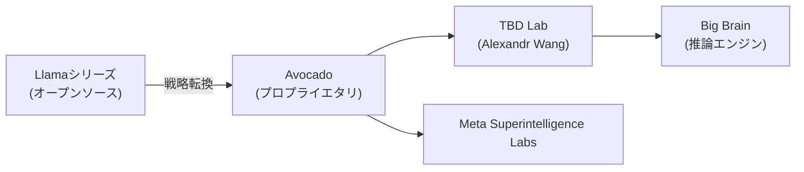
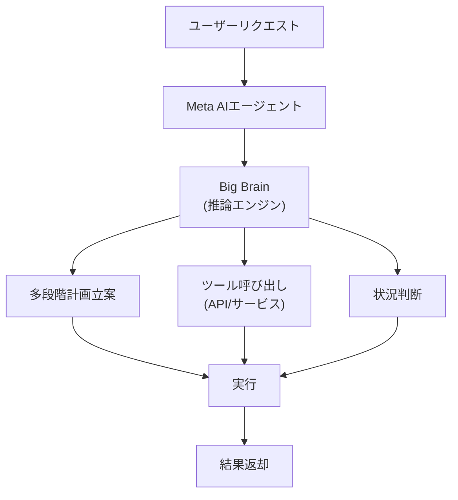
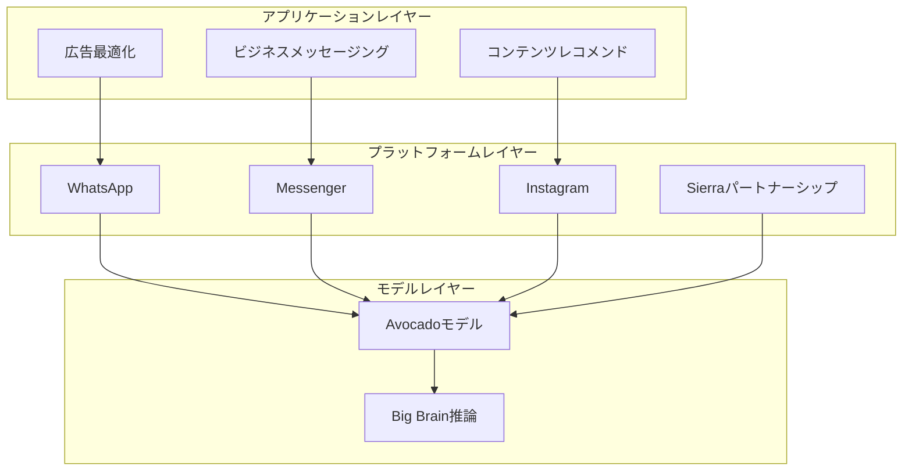

## 概要

Metaが単なるソーシャルメディア企業から**AIエージェントプラットフォーム企業**への大転換を図っています。2025年末から本格化したこの戦略は、3つのキーワードで要約されます：外部エージェントパートナーシップの**Sierra**、次世代フロンティアモデルの内部コードネーム**Avocado**、そして高度な推論能力を意味する**Big Brain**です。

この記事では、MetaのAI戦略がどのように変化しているのか、そしてそれが開発者やビジネスにどのような意味を持つのかを分析します。

## LlamaからAvocadoへ — 戦略の大転換

### オープンソースからプロプライエタリへ

MetaはLlamaモデルシリーズを通じて**オープンソースAI**のリーダーとして位置づけてきました。2024年、Mark Zuckerbergは Llamaが「業界で最も先進的なモデル」になると予測しました。

しかし、2025年4月のLlama 4リリースが開発者コミュニティで期待を下回り、戦略転換のきっかけとなりました。Zuckerbergは2025年7月に「オープンソースとして公開する内容については慎重であるべきだ」と述べ、方向転換を示唆しました。

### Avocado — 次世代フロンティアモデル

**Avocado**はMetaの次世代フロンティアAIモデルのコードネームです。CNBCの報道によると、このモデルには以下の特徴があります：

- **プロプライエタリモデル**：従来のLlamaと異なり、ウェイトを公開しない可能性
- **TBD Labで開発**：Scale AI出身のAlexandr Wangが率いるエリート研究組織
- **2026年第1四半期リリース予定**：OpenAI、Google、Anthropicとの競争が本格化

## Sierra — 外部エージェントパートナーシップ

### Sierra AIとは？

Sierra AIは、元Salesforce共同CEOでOpenAI理事会議長の**Bret Taylor**が設立したAIエージェントスタートアップです。企業向けAIエージェントプラットフォームを提供し、複雑で規制の多いビジネスでも迅速にエージェントを展開できる拡張可能なプラットフォームを備えています。

### Meta × Sierraのシナジー

MetaがSierraとのパートナーシップを推進することは、戦略的に大きな意味があります：

| 領域 | Metaの強み | Sierraの強み |
|------|-----------|-------------|
| **ユーザー基盤** | 30億以上のDAU | 企業顧客ネットワーク |
| **AIモデル** | Avocado/Llama | エージェントオーケストレーション |
| **チャネル** | WhatsApp、Messenger、Instagram | B2Bコミュニケーション |
| **データ** | ソーシャルグラフ | ビジネスプロセス |

Metaはすでに WhatsAppで**Business AI**を通じて週100万件以上の会話を処理しており、さらなる拡大を計画しています。

## Big Brain — 高度な推論エンジン

### 推論能力の重要性

**Big Brain**はMeta AIの高度な推論機能を指すとされています。OpenAIのo1/o3シリーズやGoogleのGemini 3が示したように、単純なテキスト生成を超えた**ディープリーズニング（深層推論）** 能力はAIエージェントの核心的な競争力です。

エージェントが複雑なビジネスタスクを遂行するためには、以下が必要です：

1. **多段階計画立案**：複雑なリクエストをステップごとに分解
2. **ツール活用**：外部APIやサービスの呼び出し
3. **状況判断**：例外状況での適切な意思決定
4. **自己検証**：結果の正確性確認

Big Brainはこれらの推論能力をAvocadoモデルに内蔵し、Metaのエージェントエコシステムを一段階引き上げる役割を担います。

## Metaのエージェントプラットフォーム戦略の全体像

Metaの AIエージェントプラットフォーム戦略は3つのレイヤーで構成されています：

### 1. モデルレイヤー（Avocado + Big Brain）

- 次世代フロンティアモデルで競合他社に対する性能優位を確保
- 推論能力によるエージェントの自律性向上

### 2. プラットフォームレイヤー（Sierra + Business AI）

- WhatsApp、Messenger、Instagramを通じたエージェントデプロイ
- 企業向けエージェントSDKおよびAPI提供
- ビジネスAIアシスタントのグローバル展開

### 3. アプリケーションレイヤー

- **広告最適化**：AI基盤の広告クリエイティブ生成（2025年Q4の動画生成ツール売上が100億ドルに到達）
- **コンテンツレコメンデーション**：オーガニックフィード閲覧数7%増加
- **ビジネスメッセージング**：クリック・トゥ・メッセージ広告売上が米国内で50%以上成長

## 開発者への影響

### 注目すべきポイント

1. **エージェントAPIエコシステム**：MetaがエージェントSDKを公開すれば、30億ユーザー向けのエージェント開発が可能に
2. **WhatsAppビジネスエージェント**：メキシコとフィリピンで開始済みのBusiness AIがグローバルに拡大予定
3. **Avocadoモデルの性能**：プロプライエタリ転換時、API経由のアクセスが主要な利用方法に
4. **Sierraプラットフォームとの統合**：企業向けエージェント開発時にSierraのオーケストレーションレイヤーを活用可能

### 競争構図の変化

| 企業 | エージェント戦略 | 核心モデル |
|------|--------------|---------|
| **Meta** | ソーシャルプラットフォーム基盤エージェント | Avocado |
| **OpenAI** | ChatGPT + Operator | o3/GPT-5 |
| **Google** | Gemini + Android統合 | Gemini 3 |
| **Anthropic** | Claude + Agent Teams | Opus 4.6 |
| **Salesforce** | Agentforce + CRM | Einstein |

## まとめ

MetaのAIエージェントプラットフォーム化は、単なる技術転換ではなく**ビジネスモデルの根本的な再編**です。広告収益という強固な基盤の上で、30億ユーザーを抱えるプラットフォームをエージェントインフラへ転換するこの試みは、AI業界の勢力図を変える潜在力を持っています。

Sierraパートナーシップで企業エージェント能力を強化し、Avocadoでモデル競争力を確保し、Big Brainで推論能力を引き上げる——この三角戦略が成功すれば、Metaはソーシャルメディア企業から**AIエージェントプラットフォームの強者**へと生まれ変わるでしょう。

2026年第1四半期のAvocadoモデルリリースとBusiness AIのグローバル展開が、その最初の試金石となります。

## 参考資料

- [CNBC: From Llamas to Avocados: Meta's shifting AI strategy](https://www.cnbc.com/2025/12/09/meta-avocado-ai-strategy-issues.html)
- [Meta: 2026 AI Drives Performance](https://about.fb.com/news/2026/01/2026-ai-drives-performance/)
- [Sierra AI: Year Two in Review](https://sierra.ai/blog/year-two-in-review)
- [Gadgets360: Meta AI Could Get New Avocado Models, AI Agents](https://www.gadgets360.com/ai/news/meta-ai-avocado-models-ai-agents)
