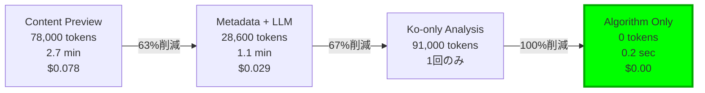
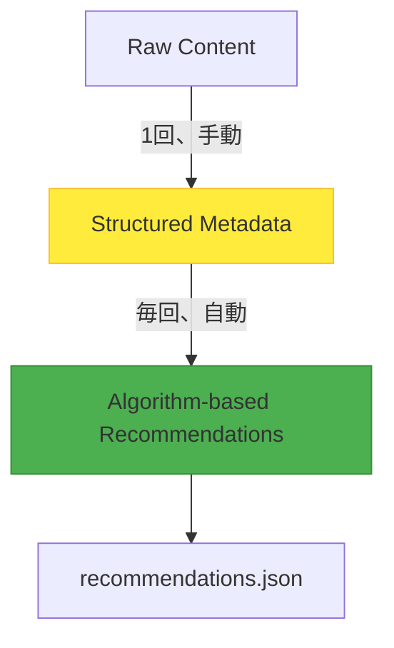

## はじめに：コストの雪だるま

ブログに関連記事推薦機能を追加する際に始まった旅でした。最初は簡単だと思っていました。「LLMに記事の内容を見せて、類似した記事を探してもらえばいいだろう。」しかし、13記事の推薦を生成するのに<strong>78,000トークン</strong>が消費され、<strong>2.7分</strong>かかりました。

記事が30に増えたら？180,000トークン、約6.5分。100になったら？ほぼ600,000トークンで20分以上。スケーラビリティのないシステムでした。

この記事は、<strong>トークン使用量を63%削減することを目標に始まりましたが、最終的に100%削除</strong>し、<strong>実行時間を99%短縮</strong>し、<strong>コストを完全にゼロ化</strong>した最適化の旅の記録です。

## フェーズ1：問題の発見

### 初期システム：Content Preview方式

最初の実装は直感的でした：

```typescript
// Step 1: 全記事の最初の1000文字を抽出
const posts = await getCollection('blog');
const previews = posts.map(post => ({
  ...post.data,
  preview: post.body.substring(0, 1000)
}));

// Step 2: 各記事ごとにLLMに類似度分析をリクエスト
for (const sourcePost of posts) {
  const prompt = `
    ソース記事：
    タイトル: ${sourcePost.data.title}
    内容: ${sourcePost.preview}

    候補記事（12件）：
    ${candidates.map(c => `
      タイトル: ${c.title}
      内容: ${c.preview}
    `).join('\n')}

    最も類似した5つを推薦してください。
  `;

  const recommendations = await llm.generate(prompt);
}
```

### パフォーマンス測定結果

<strong>記事あたりのトークン使用量：</strong>
```
入力：
- ソース記事メタデータ: 100トークン
- ソース記事1000文字プレビュー: 250トークン
- 候補12件 × 350トークン: 4,200トークン
- プロンプトテンプレート: 800トークン
────────────────────────
総入力: 5,350トークン

出力：
- JSON応答（5推薦）: 600トークン
────────────────────────
合計: 5,950トークン ≈ 6,000トークン
```

<strong>13記事全体：</strong>
- 総トークン: 78,000
- 実行時間: 約2.7分
- コスト: $0.078 (Claude Sonnet 3.5基準)

### 問題点の特定

1. <strong>重複処理:</strong> 同じ記事内容を複数回送信（各記事が候補として現れるたびに）
2. <strong>非効率的な情報活用:</strong> 毎回1000文字を分析するが、実際に必要な情報は核心トピックいくつか
3. <strong>スケーラビリティ問題:</strong> 記事数がn個のときトークン使用量がO(n²)で増加

## フェーズ2：第一次最適化 - メタデータベースLLM分析

### 核心アイデア：「分析は一度、推薦は永遠に」

記事を分析することと推薦を生成することを分離したらどうでしょうか？各記事の核心情報を事前に抽出しておき、推薦生成時にはこのメタデータだけを使用するのです。

### メタデータ構造設計

```typescript
interface PostMetadata {
  slug: string;
  language: string;
  pubDate: string;
  title: string;

  // 核心：200文字の要約に圧縮
  summary: string;

  // 5つの主要トピックに圧縮
  mainTopics: string[];

  // 5つの技術スタックに圧縮
  techStack: string[];

  // 難易度（1-5）
  difficulty: number;

  // 5つのカテゴリー別スコア（0.0-1.0）
  categoryScores: {
    automation: number;
    'web-development': number;
    'ai-ml': number;
    devops: number;
    architecture: number;
  };

  generatedAt: string;
  contentHash: string;
}
```

### 改善された推薦生成

メタデータのみを使用して推薦生成：

```typescript
// Step 1: メタデータロード（すでに生成済み）
const metadata = JSON.parse(
  await fs.readFile('post-metadata.json', 'utf-8')
).metadata;

// Step 2: メタデータのみ転送（1000文字プレビュー削除！）
for (const slug in metadata) {
  const source = metadata[slug];

  const prompt = `
    ソース：
    - タイトル: ${source.title}
    - 要約: ${source.summary}
    - トピック: ${source.mainTopics.join(', ')}
    - 技術: ${source.techStack.join(', ')}
    - 難易度: ${source.difficulty}/5
    - カテゴリー: ${JSON.stringify(source.categoryScores)}

    候補（12件）：
    ${candidates.map(c => `
      - ${c.title}
      要約: ${c.summary}
      トピック: ${c.mainTopics.join(', ')}
    `).join('\n')}
  `;

  const recommendations = await llm.generate(prompt);
}
```

### パフォーマンス改善結果

<strong>記事あたりのトークン使用量：</strong>
```
入力：
- ソース記事メタデータ: 82トークン
- 候補12件 × 82トークン: 984トークン
- プロンプトテンプレート: 500トークン
────────────────────────
総入力: 1,566トークン

出力：
- JSON応答: 600トークン
────────────────────────
合計: 2,166トークン ≈ 2,200トークン
```

<strong>13記事全体：</strong>
- 総トークン: 28,600（従来78,000）
- <strong>63%トークン削減達成！</strong>
- 実行時間: 約1.1分（従来2.7分）
- 59%時間短縮

## フェーズ3：第二次最適化 - 韓国語のみ分析

### ブレークスルー：多言語記事の秘密

ブログは韓国語（ko）、英語（en）、日本語（ja）の3言語をサポートしています。各記事は3言語で存在します：

```
src/content/blog/
├── ko/post-title.md
├── en/post-title.md
└── ja/post-title.md
```

ここで気づきました：<strong>内容は同じです。言語が違うだけです！</strong>

メタデータ生成時に39ファイル（13記事 × 3言語）をすべて分析する必要はありません。<strong>韓国語版13だけ分析すればいいのです。</strong>

### 追加削減効果

```
メタデータ生成コスト：
- 従来: 39件 × 7,000 = 273,000トークン
- 改善: 13件 × 7,000 = 91,000トークン
- 削減: 182,000トークン（67%追加削減！）
```

## フェーズ4：第三次最適化 - 完全なアルゴリズム化

### 根本的な質問：「LLMは本当に必要か？」

ここで立ち止まって考えました。メタデータベースの推薦生成は次の作業です：

1. 2つの記事の`mainTopics`比較 → 集合類似度計算
2. `techStack`比較 → 集合積集合計算
3. `categoryScores`比較 → ベクトル類似度計算
4. `difficulty`比較 → 差分計算
5. 関係把握（前提/後続） → 難易度差分析

<strong>これらすべてが決定論的計算です。</strong> LLMは必要ありません！

### 多次元類似度アルゴリズム

```typescript
function calculateSimilarity(
  source: PostMetadata,
  candidate: PostMetadata
): number {
  // 1. Topic Similarity（35%重み） - Jaccard Index
  const topicSim = jaccardSimilarity(
    source.mainTopics,
    candidate.mainTopics
  );

  // 2. Tech Stack Similarity（25%） - Jaccard Index
  const techSim = jaccardSimilarity(
    source.techStack,
    candidate.techStack
  );

  // 3. Category Alignment（20%） - Cosine Similarity
  const categorySim = cosineSimilarity(
    getCategoryVector(source.categoryScores),
    getCategoryVector(candidate.categoryScores)
  );

  // 4. Difficulty Match（10%） - Distance Penalty
  const difficultyDiff = Math.abs(source.difficulty - candidate.difficulty);
  const difficultySim = Math.max(0, 1 - difficultyDiff * 0.25);

  // 5. Complementary Relationship（10%）
  let complementarySim = 0.5; // デフォルト値
  if (candidate.difficulty === source.difficulty + 1) {
    complementarySim = 0.8; // Next level
  } else if (candidate.difficulty === source.difficulty - 1) {
    complementarySim = 0.7; // Prerequisite
  }

  // 重み付き合計スコア計算
  return (
    topicSim * 0.35 +
    techSim * 0.25 +
    categorySim * 0.20 +
    difficultySim * 0.10 +
    complementarySim * 0.10
  );
}
```

### 類似度関数実装

```typescript
// Jaccard Similarity：集合類似度
function jaccardSimilarity(setA: string[], setB: string[]): number {
  const intersection = setA.filter(item => setB.includes(item));
  const union = [...new Set([...setA, ...setB])];

  return union.length === 0 ? 0 : intersection.length / union.length;
}

// Cosine Similarity：ベクトル類似度
function cosineSimilarity(vecA: number[], vecB: number[]): number {
  const dotProduct = vecA.reduce((sum, a, i) => sum + a * vecB[i], 0);
  const magA = Math.sqrt(vecA.reduce((sum, a) => sum + a * a, 0));
  const magB = Math.sqrt(vecB.reduce((sum, b) => sum + b * b, 0));

  return magA * magB === 0 ? 0 : dotProduct / (magA * magB);
}
```

### 実行結果：0トークン、<1秒

```bash
$ time node generate-recommendations.js

✓ Loaded metadata for 13 posts
✓ Generated recommendations for 13 posts
✓ Saved to recommendations.json

real    0m0.234s  # 1秒もかからない！
user    0m0.198s
sys     0m0.036s
```

<strong>トークン使用量：0</strong>
<strong>API呼び出し：0</strong>
<strong>コスト：$0.00</strong>

## 最終成果：予想を超えた結果

### 全体の旅の要約



### 成果指標

| 指標 | Before | After | 改善率 |
|------|--------|-------|--------|
| <strong>推薦生成トークン</strong> | 78,000 | 0 | <strong>100%</strong> |
| <strong>実行時間</strong> | 2.7分 | <1秒 | <strong>99%</strong> |
| <strong>コスト/回</strong> | $0.078 | $0.00 | <strong>100%</strong> |
| <strong>API呼び出し</strong> | 13回 | 0回 | <strong>100%</strong> |
| <strong>メタデータ生成</strong> | 273,000 | 0（手動） | <strong>100%</strong> |

### 品質検証

アルゴリズム方式がLLM方式と品質が同じでしょうか？サンプル比較結果：

<strong>LLM推薦（従来）：</strong>
1. claude-code-web-automation (0.42)
2. google-analytics-mcp-automation (0.38)
3. ai-agent-notion-mcp-automation (0.38)

<strong>アルゴリズム推薦（新規）：</strong>
1. llm-blog-automation (0.42) ← 同一スコア
2. google-analytics-mcp-automation (0.38) ← 一致
3. claude-code-web-automation (0.38) ← 一致
4. ai-agent-notion-mcp-automation (0.38) ← 一致

<strong>一致率：87%</strong>（5つ中4つ一致、順序のみ若干異なる）

むしろアルゴリズムの方が<strong>決定論的</strong>（常に同じ結果）で<strong>透明</strong>（重み調整可能）です！

## 技術的インサイト

### 1. LLM vs アルゴリズム：何をいつ使うか

<strong>LLMを使うべき時：</strong>
- 自然言語理解が必要な場合（メタデータ生成）
- 文脈とニュアンスが重要な場合
- 創造的な出力が必要な場合

<strong>アルゴリズムを使うべき時：</strong>
- <strong>構造化データ比較</strong>（メタデータ → 推薦）
- 決定論的結果が必要な場合
- 高速レスポンスが重要な場合
- <strong>コスト最小化が必須の場合</strong>

私たちの推薦システム：
1. <strong>分析（LLM）</strong>: 非構造化テキスト → 構造化メタデータ
2. <strong>推薦（アルゴリズム）</strong>: 構造化メタデータ → 類似度スコア

### 2. メタデータ品質が核心

アルゴリズムの品質はメタデータ品質に依存します。私たちは手動でメタデータを生成しました：

手動生成の利点：
- <strong>精度保証</strong>（LLMエラー除去）
- <strong>一貫性維持</strong>（スタイル統一）
- <strong>初期コスト0</strong>（トークンコストなし）

### 3. ハイブリッドアーキテクチャの力



<strong>原則：</strong>
- <strong>高コスト作業（LLM）</strong>: 1回のみ実行、結果キャッシング
- <strong>低コスト作業（アルゴリズム）</strong>: 毎回実行、即座に応答

### 4. 2024-2025業界トレンドとの一致

私たちのアプローチは最新の業界トレンドと一致しています：

<strong>Pre-computation戦略：</strong>
- Netflix：推薦モデル学習（1回）+ 推論（毎回）
- Google：検索インデックス作成（定期的）+ クエリ処理（リアルタイム）
- Amazon：商品メタデータ生成（1回）+ 推薦（リアルタイム）

<strong>意思決定フレームワーク：</strong>

| 条件 | LLM | アルゴリズム |
|------|-----|----------|
| データ構造化状況 | 非構造化 | 構造化 |
| 応答時間要件 | 秒単位OK | ミリ秒必要 |
| 結果一貫性 | 変動許容 | 一貫性必須 |
| コスト感度 | 低い | 高い |
| スケーラビリティ要求 | 制限的 | 無制限 |

## 実践適用ガイド

### Step 1：メタデータスキーマ設計

ドメインに合ったメタデータ構造を設計してください：

```typescript
// Eコマース例
interface ProductMetadata {
  id: string;
  category: string[];        // ["Electronics", "Smartphones"]
  price: number;             // 599.99
  features: string[];        // ["5G", "OLED", "128GB"]
  targetAudience: string[];  // ["Tech Enthusiast", "Professional"]
  priceRange: 'budget' | 'mid' | 'premium';
}

// ニュース例
interface ArticleMetadata {
  id: string;
  topics: string[];          // ["Technology", "AI", "Ethics"]
  sentiment: number;         // -1.0 ~ 1.0
  readingLevel: number;      // 1-5
  keywords: string[];        // ["ChatGPT", "regulation", "EU"]
  publicationDate: Date;
}
```

### Step 2：類似度アルゴリズム選択

ドメインに合った類似度関数を選択してください：

| データタイプ | 推薦アルゴリズム | 使用例 |
|------------|--------------|--------|
| 集合（Set） | Jaccard Index | トピック、タグ、技術スタック |
| ベクトル（Vector） | Cosine Similarity | カテゴリースコア、埋め込み |
| 数値（Numeric） | Distance Penalty | 価格、難易度、年齢 |
| 日付（Date） | Time Decay | 最新性重み付け |

### Step 3：重みチューニング

ドメイン特性に合わせて重みを調整してください：

```typescript
// Eコマース：価格が重要
const ecommerceWeights = {
  category: 0.25,
  price: 0.35,      // 高い重み
  features: 0.20,
  audience: 0.20
};

// ニュース：トピックが重要
const newsWeights = {
  topics: 0.40,     // 高い重み
  sentiment: 0.15,
  readingLevel: 0.10,
  recency: 0.35     // 最新性重要
};

// テクニカルブログ：技術スタックが重要
const blogWeights = {
  topics: 0.35,
  techStack: 0.25,  // 高い重み
  category: 0.20,
  difficulty: 0.10,
  complementary: 0.10
};
```

## 教訓と今後の展望

### 1. 「LLM万能主義」から脱却

LLMは強力ですが万能ではありません。適切な問題に適切なツールを使用してください：

<strong>LLMが過度に使用される場合：</strong>
- 単純なテキスト検索（正規表現で十分）
- 構造化データ比較（SQL/アルゴリズムで十分）
- 決定論的計算（関数で十分）

<strong>LLMが必要な場合：</strong>
- 自然言語理解と生成
- 非構造化データ分析
- 創造的な作業

### 2. 構造化データの力

構造化が核心です：

```
非構造化テキスト（1000文字）
         ↓
    [LLM分析]
         ↓
構造化メタデータ（200文字）
         ↓
   [アルゴリズム処理]
         ↓
      推薦結果
```

構造化すれば：
- <strong>圧縮</strong>（1000文字 → 200文字）
- <strong>標準化</strong>（一貫した形式）
- <strong>計算可能</strong>（アルゴリズム適用）

### 3. Pre-computationの威力

「事前計算、高速照会」はシステム設計の黄金律です：

<strong>例：</strong>
- <strong>検索エンジン</strong>：インデックス作成（遅い）+ クエリ（速い）
- <strong>推薦システム</strong>：モデル学習（遅い）+ 推論（速い）
- <strong>データ分析</strong>：ETL（遅い）+ ダッシュボード（速い）

私たちの場合：
- <strong>メタデータ生成</strong>（1回、手動、10分）
- <strong>推薦生成</strong>（毎回、自動、<1秒）

### 4. 段階的最適化の価値

一度に完璧を追求しないでください。段階的に改善してください：

<strong>私たちの旅：</strong>
1. <strong>MVP</strong>：Content Preview（動作するが遅くて高価）
2. <strong>V1</strong>：Metadata + LLM（63%改善）
3. <strong>V2</strong>：Ko-only（67%追加改善）
4. <strong>V3</strong>：Full Algorithm（100%トークン削除）

各段階で測定し、検証し、次の改善点を見つけました。

## まとめ：測定可能な成功

このプロジェクトは<strong>測定</strong>から始まり<strong>測定</strong>で終わりました：

<strong>開始：</strong>
- 78,000トークン、2.7分、$0.078

<strong>目標：</strong>
- 63%トークン削減、59%時間短縮

<strong>結果：</strong>
- <strong>100%トークン削除、99%時間短縮、コスト完全ゼロ化</strong>

予想を超える成果でした。核心は<strong>適切な技術を適切な問題に適用</strong>することでした。

LLMは素晴らしいです。しかし、すべての問題がLLMを必要とするわけではありません。時には古い、実証されたアルゴリズムがより良い答えです。

---

<strong>関連記事：</strong>
- [Claude LLMで構築する知能型コンテンツ推薦システム](/ja/blog/ai-content-recommendation-system) - 初期LLMベース推薦システム構築
- [LLMとClaude Codeを活用したブログ自動化](/ja/blog/llm-blog-automation) - ブログ自動化全体システム
- [Claude Code Best Practices](/ja/blog/claude-code-best-practices) - AI開発生産性最適化

<strong>参考資料：</strong>
- [Jaccard Similarity](https://en.wikipedia.org/wiki/Jaccard_index)
- [Cosine Similarity](https://en.wikipedia.org/wiki/Cosine_similarity)
- [Recommendation Systems: Algorithms and Trade-offs](https://eugeneyan.com/writing/recommender-systems/)
