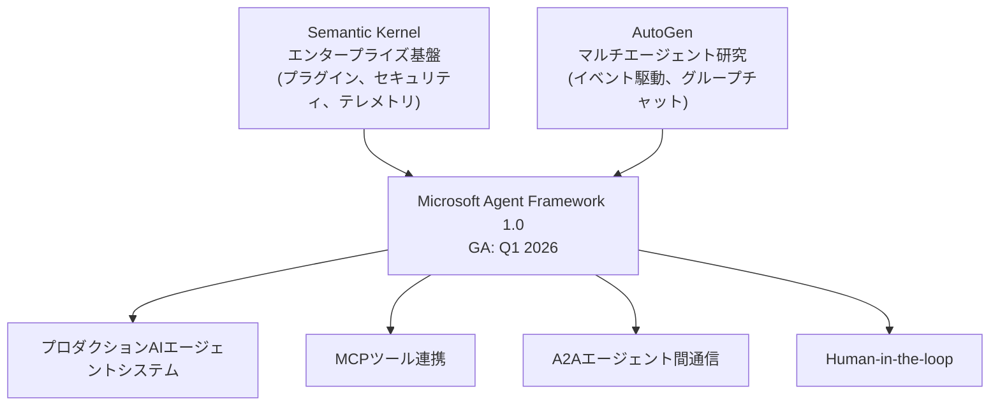
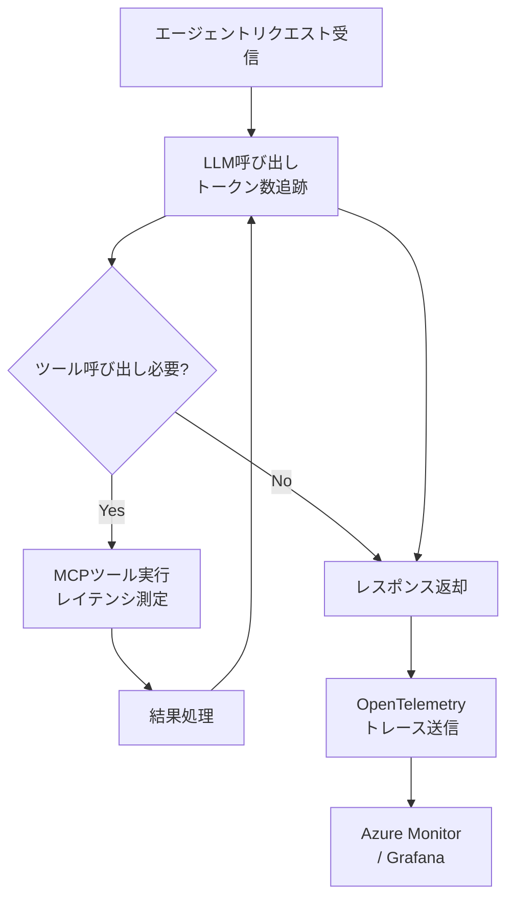
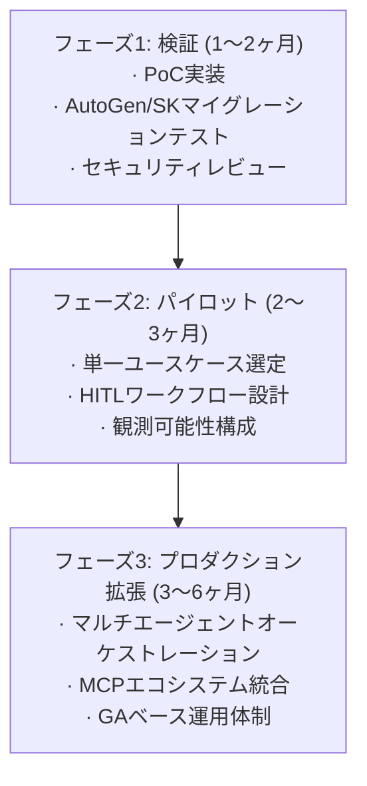

2026年3月現在、AIエージェントフレームワーク市場で最も注目すべき動きが完成段階に入りました。Microsoftが長年にわたって個別に発展させてきた<strong>AutoGen</strong>と<strong>Semantic Kernel</strong>が、一つのプラットフォーム、すなわち<strong>Microsoft Agent Framework</strong>として統合されたのです。2026年2月19日にRC(Release Candidate) 1.0がリリースされ、Q1 2026のGA(一般提供)を目前に控えています。

この記事は、Engineering ManagerまたはCTOの観点から、この統合が何を意味するのか、既存チームがどのように対応すべきか、そしてプロダクション導入をどのように計画すべきかを整理したものです。

## なぜ統合なのか：フレームワーク分断の終わり

AutoGenとSemantic KernelはMicrosoft内で異なる哲学からスタートしました。

- <strong>AutoGen</strong>：Microsoft Research主導、イベント駆動型マルチエージェントフレームワーク。エージェント間の非同期対話を重視。
- <strong>Semantic Kernel</strong>：Azure AIチーム主導、プラグインパターンとエンタープライズ機能（テレメトリ、セキュリティ、メモリ）に強み。

開発者コミュニティは長年「どちらを使うべきか？」という問いに悩まされてきました。両フレームワークはエコシステムを分断し、企業は人材と学習コストを二重に負担しなければなりませんでした。Microsoft Agent Frameworkはこの問いに明確な答えを出します：<strong>これからは一つだけです。</strong>



## Microsoft Agent Frameworkの主要機能

### 1. グラフベースワークフローオーケストレーション

LangGraphと同様に、状態を持つ(stateful)グラフベースワークフローをサポートします。順次実行、並列実行、条件分岐をすべて処理でき、<strong>チェックポインティング(checkpointing)</strong>により長時間実行ワークフローの中断/再開が可能です。

```python
from microsoft.agents import AgentRuntime, Agent, tool
from microsoft.agents.workflows import SequentialWorkflow, ParallelWorkflow

# 基本エージェント定義
@tool
def get_customer_data(customer_id: str) -> dict:
    """CRMから顧客データを取得"""
    return crm_client.get(customer_id)

# エージェント作成
analyst = Agent(
    name="customer_analyst",
    instructions="顧客データを分析し、リスクスコアを算出します。",
    tools=[get_customer_data],
    model="gpt-4o"
)

# ワークフロー構成 (順次 + 並列)
workflow = SequentialWorkflow([
    analyst,
    ParallelWorkflow([risk_scorer, compliance_checker]),
    approval_agent  # Human-in-the-loop
])
```

### 2. MCPおよびA2Aプロトコルのネイティブサポート

Microsoft Agent Frameworkは、最初からMCP(Model Context Protocol)とA2A(Agent-to-Agent)プロトコルをサポートするよう設計されています。これはHubSpot、Salesforce、Slack、Azure DevOpsなど数百のMCPサーバーと即時連携可能であることを意味します。

```python
from microsoft.agents.mcp import MCPToolServer

# MCPサーバー接続 (例: GitHub MCP)
github_tools = MCPToolServer(
    name="github",
    transport="stdio",
    command=["npx", "@modelcontextprotocol/server-github"]
)

# エージェントにMCPツールを注入
dev_agent = Agent(
    name="dev_assistant",
    instructions="コードレビューとPR管理を担当します。",
    tools=[*github_tools.get_tools()],
    model="gpt-4o"
)
```

### 3. Human-in-the-loop (HITL) アーキテクチャ

エンタープライズ環境で最も重要な機能の一つが<strong>承認ワークフロー</strong>です。Microsoft Agent Frameworkは、エージェントが特定の閾値を超える作業を実行する前に人間の承認を受けるよう設計できます。

```python
from microsoft.agents.human import HumanApprovalInterrupt

# 高リスク作業にHuman-in-the-loopを追加
@tool(requires_approval=lambda result: result.get("risk_score", 0) > 0.8)
def execute_transaction(amount: float, account: str) -> dict:
    """金融トランザクション実行 (リスクスコア0.8超過時は承認必要)"""
    return finance_client.transact(amount, account)
```

### 4. YAML宣言型エージェント定義

コードではなくYAMLでエージェントを定義することで、バージョン管理とチームコラボレーションが大幅に容易になります。

```yaml
# agents/customer-support.yaml
name: customer_support_agent
instructions: |
  お客様のお問い合わせを処理し、必要に応じて適切な部署にエスカレーションします。
  回答は必ず丁寧で明確でなければなりません。
model: gpt-4o
tools:
  - crm_lookup
  - ticket_create
  - email_send
escalation_policy:
  threshold: 3  # 3回以上解決失敗時にエスカレーション
  target: human_agent
```

### 5. プロダクショングレードの観測可能性

OpenTelemetryベースの完全なテレメトリが内蔵されています。すべてのエージェントの動作、ツール呼び出し、オーケストレーションステップが自動的に追跡されます。



## EM/CTOが知っておくべき戦略的ポイント

### 1. AutoGenまたはSemantic Kernelをすでに使用している場合

Microsoftは明確なマイグレーションガイドを提供しています。両フレームワークともv1.xのセキュリティパッチは継続提供されますが、<strong>新機能はMicrosoft Agent Frameworkにのみ追加</strong>されます。6〜12ヶ月以内のマイグレーションを推奨します。

| 既存フレームワーク | 主な変更点 |
|---|---|
| Semantic Kernel | プラグイン(Plugin) → Tool、Kernel → AgentRuntime |
| AutoGen | AssistantAgent → Agent、GroupChat → Workflow |
| 共通 | ベクターストア統合はそのまま維持 |

### 2. 完全に新しく始めるチーム

Microsoftエコシステム(Azure AI、Microsoft 365、Copilot Studio)に深く投資している組織であれば、Microsoft Agent Frameworkが<strong>最も自然な選択</strong>です。Azure AI Foundryとの完全な統合、Entra ID認証、コンプライアンスサポートは、他のフレームワークでは実装が難しいエンタープライズ機能です。

一方、AWSやGCPベースの組織、またはPython-nativeチームであれば、LangGraphやCrewAIの方が適している場合があります。<strong>選択は技術スタックではなく、組織エコシステムを基準にすべきです。</strong>

### 3. Q1 2026 GA前の注意事項

RCからGAへの移行時にマイナーなブレーキングチェンジが発生する可能性があります。プロダクションデプロイはGA公式発表後に延期するのが安全です。今は<strong>PoC(概念実証)と内部実験段階</strong>として活用するのが適切です。

### 4. 実際の導入企業事例

Microsoft Agent Frameworkはすでに複数のグローバル企業が検証しています：

- <strong>KPMG</strong>：監査自動化 — エージェントが財務データの異常検知後にHITL承認ワークフローと連携
- <strong>BMW</strong>：車両テレメトリ分析 — マルチエージェントがセンサーデータを並列処理
- <strong>Commerzbank</strong>：顧客サポート自動化 — MCPを通じたCRM/ERP連携
- <strong>Fujitsu</strong>：エンタープライズIT運用自動化 — 宣言的YAMLベースのエージェントオーケストレーション

## チーム導入ロードマップ (3段階)



<strong>フェーズ1 — 検証 (1〜2ヶ月)</strong>：GA発表直後に簡単なPoCを実装します。既存のAutoGen/SKコードをマイグレーションして互換性を確認します。セキュリティチームとともにAzure AI Foundry統合とEntra ID連携を検討します。

<strong>フェーズ2 — パイロット (2〜3ヶ月)</strong>：実際のビジネスインパクトがあるユースケースを一つ選定します（例：顧客サポートエスカレーション自動化）。HITL閾値を定義し、OpenTelemetryダッシュボードを設定します。

<strong>フェーズ3 — プロダクション拡張</strong>：パイロットの成果を基にマルチエージェントアーキテクチャを拡張します。MCPエコシステム（CRM、ERP、BIツール）との統合を体系化します。

## まとめ

Microsoft Agent Frameworkは単なるフレームワークのアップグレードではありません。これはMicrosoftがエンタープライズAIエージェント市場で<strong>単一プラットフォーム戦略</strong>を宣言したものです。

AutoGenまたはSemantic Kernelを使用しているチームは、今がまさにマイグレーション計画を立てる時期です。新しく始めるチームにとって、Microsoftエコシステム内ではMicrosoft Agent Frameworkが事実上のデフォルト選択となりました。

重要なのは技術の選択ではなく、<strong>組織のAIエージェント能力の内製化</strong>です。どのフレームワークを選択しても、HITL設計、観測可能性の構築、段階的ロールアウトの原則は同様に適用されます。

## 参考資料

- [Microsoft Agent Framework公式発表 (Microsoft Foundry Blog)](https://devblogs.microsoft.com/foundry/introducing-microsoft-agent-framework-the-open-source-engine-for-agentic-ai-apps/)
- [Microsoft Agent Framework RCリリースノート (InfoQ)](https://www.infoq.com/news/2026/02/ms-agent-framework-rc/)
- [Semantic Kernel → Microsoft Agent Frameworkマイグレーションガイド](https://devblogs.microsoft.com/semantic-kernel/migrate-your-semantic-kernel-and-autogen-projects-to-microsoft-agent-framework-release-candidate/)
- [Microsoft Learn: Agent Framework Overview](https://learn.microsoft.com/en-us/agent-framework/overview/)
- [AutoGen GitHub Discussion #7066](https://github.com/microsoft/autogen/discussions/7066)
