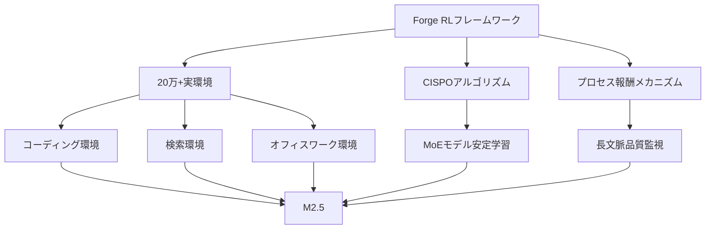
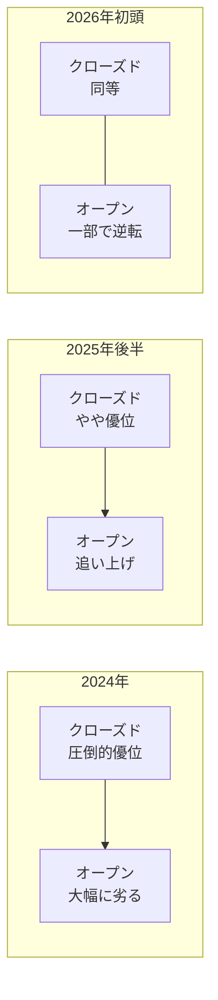

## オープンウェイトモデルの逆襲が始まった

2026年2月、AI業界に衝撃が走りました。中国のAIスタートアップMiniMaxが公開した<strong>MiniMax M2.5</strong>が、コーディング・エージェントタスク・検索など複数のベンチマークで<strong>プロプライエタリモデルを上回るスコア</strong>を記録したのです。

Reddit r/LocalLLAMAでは362ポイント以上の注目を集め、「オープンウェイトモデルがついにクローズドモデルに追いついた」という議論が活発化しています。この記事では、M2.5の具体的な性能データと、オープンvsクローズドモデルの構図変化を詳しく分析します。

## MiniMax M2.5の主要スペック

MiniMax M2.5は229Bパラメータのオープンウェイトモデルで、HuggingFaceから自由にダウンロードできます。主な特徴は以下の通りです。

- <strong>パラメータ数</strong>: 229B（MoEアーキテクチャ）
- <strong>学習手法</strong>: 20万以上の実環境での強化学習（RL）
- <strong>推論速度</strong>: 100トークン/秒（Lightningバージョン）
- <strong>対応言語</strong>: Go、C、C++、TypeScript、Rust、Python、Java等10言語以上
- <strong>デプロイ</strong>: SGLang、vLLM、Transformers、KTransformers対応

## ベンチマーク比較：クローズドモデルとの差がほぼゼロに

### SWE-Bench Verified（コーディング）

SWE-Bench Verifiedは実際のGitHubイシューを解決する能力を測定するベンチマークです。

| モデル | スコア | 種類 |
|--------|--------|------|
| <strong>MiniMax M2.5</strong> | <strong>80.2%</strong> | オープンウェイト |
| Claude Opus 4.6 | — | プロプライエタリ |
| MiniMax M2.1 | — | オープンウェイト |

さらに、異なるエージェントハーネスでのテスト結果も注目に値します：

- <strong>Droidハーネス</strong>: M2.5（79.7%）> Opus 4.6（78.9%）
- <strong>OpenCodeハーネス</strong>: M2.5（76.1%）> Opus 4.6（75.9%）

いずれの環境でも、オープンウェイトモデルがプロプライエタリモデルを<strong>僅差ながら上回る</strong>という歴史的な結果です。

### Multi-SWE-Bench（マルチリポジトリ）

複数リポジトリにまたがるタスクでは<strong>51.3%</strong>を達成。より複雑な実務シナリオでも高い性能を示しています。

### BrowseComp（検索・ツール使用）

ウェブ検索とツール呼び出し能力を測定するBrowseCompでは<strong>76.3%</strong>（コンテキスト管理込み）を記録し、業界最高水準に到達しました。

## コスト革命：性能だけでなく価格でも圧倒

M2.5の衝撃は性能だけではありません。<strong>コストパフォーマンス</strong>が桁違いです。

| 項目 | M2.5 Lightning | M2.5 Standard |
|------|---------------|---------------|
| 入力価格 | $0.3/100万トークン | $0.15/100万トークン |
| 出力価格 | $2.4/100万トークン | $1.2/100万トークン |
| 推論速度 | 100 TPS | 50 TPS |
| 1時間連続稼働コスト | $1.0 | $0.3 |

Claude Opus、Gemini 3 Pro、GPT-5と比較すると、出力トークン単価で<strong>10分の1から20分の1</strong>のコストです。年間4インスタンスを24時間稼働させても約$10,000で済みます。

## なぜM2.5はここまで速く進化できたのか

### 大規模強化学習（RL Scaling）

MiniMaxは独自の「<strong>Forge</strong>」というエージェントネイティブRLフレームワークを開発しました。

主な技術的ポイント：

- <strong>非同期スケジューリング最適化</strong>: システムスループットとサンプルのオフポリシー度のバランスを最適化
- <strong>ツリー構造マージ戦略</strong>: トレーニングサンプルの結合で約<strong>40倍の学習速度向上</strong>
- <strong>CISPOアルゴリズム</strong>: MoEモデルの大規模学習安定性を確保
- <strong>プロセス報酬</strong>: エージェントロールアウトの長文脈における信用割り当て問題に対処

### Spec-Writing能力の創発

M2.5の特筆すべき点は、コードを書く前に<strong>アーキテクトのように設計・計画する能力</strong>が学習中に自然と創発したことです。プロジェクトの機能、構造、UIデザインを事前に分解・計画してからコーディングに入るため、より実務に即した開発が可能です。

## オープンvsクローズドの構図変化

### 歴史的な転換点

これまでAI業界では「最高性能のモデルは常にプロプライエタリ」という暗黙の了解がありました。しかし、M2.5の登場で状況が一変しています。

### 企業にとっての意味

1. <strong>ベンダーロックイン回避</strong>: オープンウェイトモデルでフロンティア性能が得られるなら、特定APIベンダーへの依存を減らせる
2. <strong>カスタマイズの自由</strong>: 自社データでのファインチューニング、ドメイン特化が可能
3. <strong>コスト最適化</strong>: セルフホスティングによるコスト管理、M2.5のAPI利用でも1/10〜1/20のコスト
4. <strong>データプライバシー</strong>: 機密データを外部に送信する必要がない

### ローカルデプロイメントの現実性

229Bパラメータは決して小さくありませんが、KTransformersなどのフレームワークを使えば、消費者向けハードウェアでも動作可能です。SGLangやvLLMでの本番デプロイメントも公式にサポートされています。

## M2シリーズの急速な進化

わずか3.5ヶ月（2025年10月末〜2026年2月）で、MiniMaxはM2、M2.1、M2.5と3世代をリリースしました。

| バージョン | リリース時期 | SWE-Bench改善 | 特筆事項 |
|-----------|------------|---------------|---------|
| M2 | 2025年10月末 | ベースライン | HuggingFace 450Kダウンロード |
| M2.1 | 2025年12月 | 大幅改善 | 86.7Kダウンロード |
| M2.5 | 2026年2月 | 80.2% SOTA | 37%高速化、コスト1/10 |

この進化速度は、Claude、GPT、Geminiファミリーを<strong>上回るペース</strong>であるとMiniMax自身が報告しています。

## 社内での実践導入

MiniMaxは自社でもM2.5を積極活用しています：

- <strong>全社タスクの30%</strong>をM2.5が自律的に完了
- R&D、プロダクト、営業、人事、財務にまたがる活用
- <strong>新規コミットコードの80%</strong>がM2.5生成

これは「自社のAIモデルで自社の業務を回す」という、AGIへの一歩とも言える実践です。

## まとめ：知っておくべき3つのポイント

1. <strong>性能格差の消滅</strong>: オープンウェイトモデルがSWE-Benchでクローズドモデルを超えた。これは一時的な現象ではなく、構造的な変化の始まり

2. <strong>コスト革命</strong>: M2.5はOpus比1/10〜1/20のコストで同等以上の性能を提供。「コストを気にしなくていいフロンティアモデル」が現実に

3. <strong>選択肢の拡大</strong>: 企業はもはやプロプライエタリモデル一択ではない。オープンウェイトモデルによるセルフホスティング、カスタマイズ、コスト最適化が実用的な選択肢に

AI開発者にとって、2026年はオープンウェイトモデルの「黄金時代」の幕開けとなるかもしれません。

## 参考資料

- [MiniMax M2.5 - HuggingFace](https://huggingface.co/MiniMaxAI/MiniMax-M2.5)
- [MiniMax Agent](https://agent.minimax.io/)
- [MiniMax API Platform](https://platform.minimax.io/)
- [Reddit r/LocalLLaMA Discussion](https://www.reddit.com/r/LocalLLaMA/)
