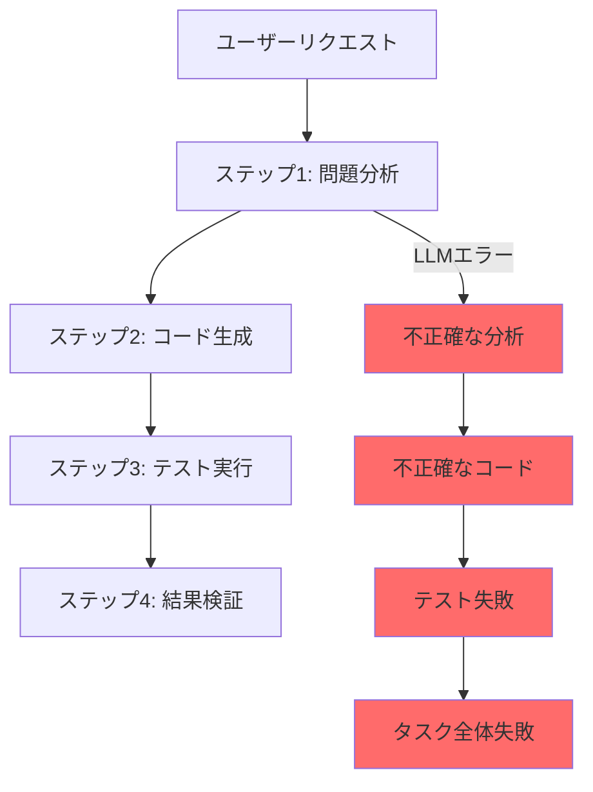
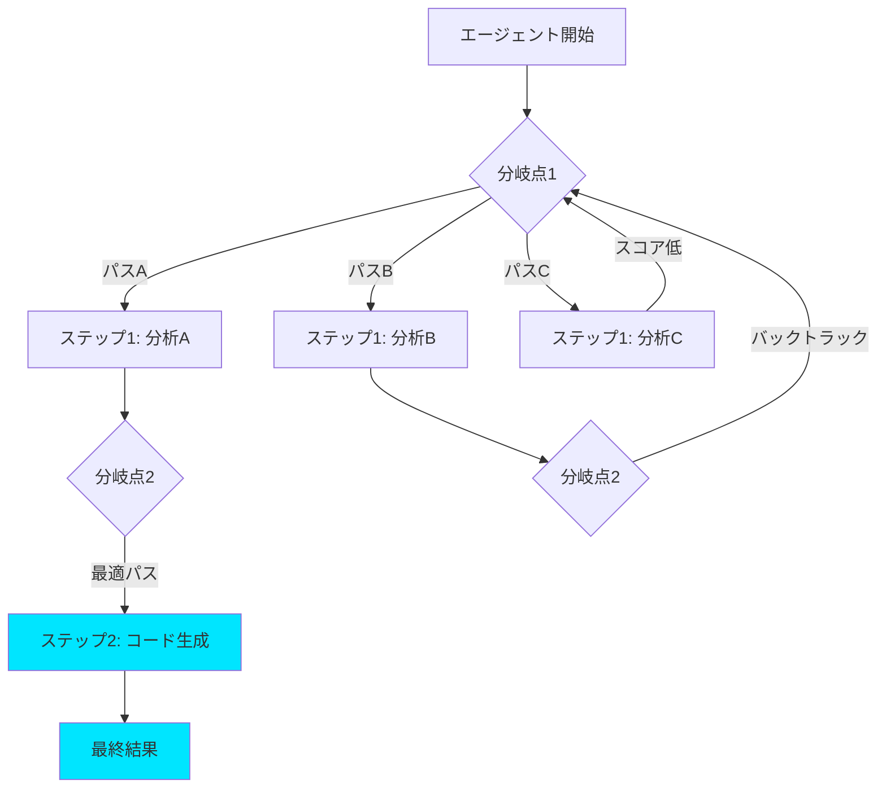
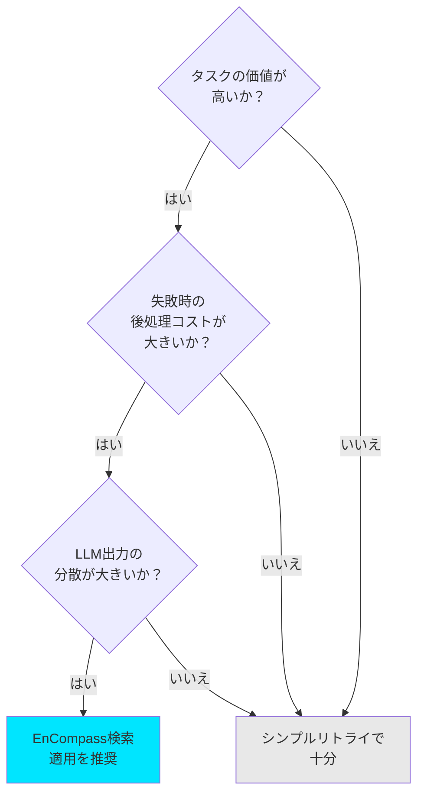

## 概要

2026年、AIエージェントがプロダクション環境でますます多くの役割を担うようになってきましたが、<strong>信頼性</strong>という根本的な課題はまだ解決されていません。LLMベースのエージェントは本質的に確率的であるため、同じタスクを実行させても毎回異なる結果が得られる可能性があり、あるステップでの失敗がその後のすべてのタスクに連鎖的に影響を及ぼします。

MIT CSAILとAsari AIが開発した<strong>EnCompass</strong>フレームワークは、この問題に対して根本的に異なるアプローチを提示しています。エージェントプログラムの実行パスに<strong>検索アルゴリズム</strong>（ビームサーチ、モンテカルロ木探索など）を組み込むことで、エージェントが失敗した場合に自動的にバックトラックし、より良いパスを探索できるようにするのです。その結果、<strong>15〜40%の精度向上</strong>を達成し、実装に必要なコードは逆に82%削減されました。

この記事では、EnCompassの核となる概念、動作原理、そしてエンジニアリングマネージャーの視点からの実務適用戦略を分析します。

## AIエージェント信頼性問題の本質

### なぜエージェントは失敗するのか

LLMベースのAIエージェントがプロダクション環境で失敗する核となる原因は、<strong>エラーの連鎖伝播</strong>です。



従来型のエージェントシステムは<strong>単一実行パス</strong>のみに従います。ステップ1でLLMが誤った判断を下すと、その後のすべてのステップがその誤った判断の上に積み重ねられます。リトライロジックを追加しても、同じコンテキストで同じ失敗を繰り返す場合が多いです。

### 既存アプローチの限界

業界で現在使用されているエージェント信頼性戦略：

| 戦略 | 長所 | 限界 |
|------|------|------|
| シンプルリトライ | 実装が簡単 | 同じミスを繰り返す可能性がある |
| 思考の鎖 | 推論品質の向上 | 誤った推論の鎖を修正できない |
| 自己検証 | エラー検出が可能 | 代替パスの探索がない |
| マルチエージェント | 複数の視点 | 調整コストが高い |

すべてのアプローチに共通する限界は、<strong>既に選択したパスから逃れられない</strong>という点です。

## EnCompass：検索ベースのエージェント実行

### コアアイデア — 「アドベンチャーゲームブック」

EnCompassのコアアイデアは、驚くほどシンプルです。エージェントプログラムの実行を<strong>「物語」</strong>に例えるなら：

- <strong>従来の方式</strong>：単一のプロットに沿って進む小説
- <strong>EnCompass方式</strong>：分岐点ごとに選択肢がある「アドベンチャーゲームブック」

開発者はエージェントコードの特定の地点に<strong>「分岐点」</strong>というアノテーションを追加します。EnCompassはこの分岐点で複数の可能なLLM出力を探索し、最も良い結果を生み出すパスを自動的に選択します。



### 動作原理

EnCompassの動作は3つのステップで構成されます。

<strong>ステップ1：分岐点の定義</strong>

開発者がエージェントコード内でLLM呼び出しが発生する地点を分岐点としてマークします。これは「ここでLLM出力が異なる可能性があり、その差異が最終結果に影響を与える」ことを宣言するのです。

<strong>ステップ2：評価関数の定義</strong>

各ステップの結果がどれほど良いかを評価する関数を定義します。例えば、コーディングエージェントであれば「テスト成功率」が評価関数になる可能性があります。

<strong>ステップ3：検索戦略の選択</strong>

EnCompassはさまざまな検索戦略をサポートしています：

- <strong>ビームサーチ</strong>：各分岐点で上位N個のパスのみを保持して進む
- <strong>モンテカルロ木探索（MCTS）</strong>：ランダム探索と経験ベースの探索を組み合わせる
- <strong>カスタム戦略</strong>：ドメインに合わせたカスタム検索戦略の実装が可能

### コードレベルの実装パターン

EnCompassを使用したエージェントコードの概念的構造：

```python
# 従来のエージェントコード（単一パス）
def coding_agent(task):
    analysis = llm.analyze(task)       # LLM呼び出し1
    code = llm.generate_code(analysis) # LLM呼び出し2
    result = run_tests(code)           # 評価
    return result

# EnCompass適用コード（検索ベース）
def coding_agent_with_search(task):
    @branchpoint                        # 分岐点アノテーション
    analysis = llm.analyze(task)

    @branchpoint
    code = llm.generate_code(analysis)

    @evaluate                           # 評価関数
    score = run_tests(code)

    return code, score

# 検索戦略の適用
result = encompass.search(
    agent=coding_agent_with_search,
    strategy=BeamSearch(beam_width=4),
    budget=16  # 最大16倍のLLM呼び出し
)
```

重要なのは、<strong>既存のエージェントロジックをほぼ変更することなく</strong>アノテーションを追加するだけで良いという点です。MIT研究チームによれば、手動で検索を実装する場合と比較して<strong>348行のコード（約82%）を削減</strong>することができました。

## パフォーマンス分析

### 定量的結果

EnCompass論文で報告された核となる成果：

| メトリック | 数値 |
|--------|------|
| 精度向上 | 15〜40%（5つのリポジトリベース） |
| コード削減 | 82%（348行削減） |
| 検索予算 | ベースラインエージェント比16倍のLLM呼び出し |
| 最適戦略 | 2レベルビームサーチ |

<strong>注目すべき点</strong>は、「2レベルビームサーチ」が最適戦略として判明したことです。これは単にランダムに多くを試すのではなく、<strong>構造化された検索戦略がより効果的である</strong>ことを意味しています。

### コスト対効果分析

検索予算が16倍ということは、LLM API呼び出しコストも16倍になるということです。これが実務で合理的かどうか判断してみましょう：

```
ベースラインエージェント実行コスト: $0.50/タスク（例）
EnCompass適用コスト:              $8.00/タスク（16倍）

ベースラインエージェント成功率: 60%
EnCompass成功率:               85%（+25ポイント）

成功当たりの実質コスト：
  ベースライン: $0.50 / 0.60 = $0.83/成功
  EnCompass:   $8.00 / 0.85 = $9.41/成功
```

単純なコストだけを見るとEnCompassは高額ですが、<strong>失敗したタスクの後処理コスト</strong>（人間による手動修正、再作業、品質問題）を含めると話が変わります。特に高価値タスク（コードレビュー、セキュリティ分析など）では、精度向上の価値が追加コストを十分に相殺します。

## 実務適用戦略

### エンジニアリングマネージャー観点の導入ガイド

EnCompassの概念を実務に適用する際に考慮すべき事項をまとめます。

<strong>1. 適用対象の選別</strong>

すべてのエージェントタスクに検索を適用する必要はありません。次の基準で選別してください：



<strong>2. 段階的導入ロードマップ</strong>

| ステージ | 期間 | 目標 | 検索予算 |
|------|------|------|-----------|
| PoC | 2週間 | 単一タスクへの適用、効果測定 | 4倍 |
| パイロット | 1ヶ月 | チーム内の2〜3個のワークフロー適用 | 8倍 |
| 拡大 | 3ヶ月 | 中核プロダクションワークフロー適用 | 16倍 |
| 最適化 | 継続中 | コスト最適化、カスタム戦略開発 | 動的調整 |

<strong>3. 評価関数の設計が鍵</strong>

EnCompassの効果は<strong>評価関数の品質</strong>に大きく左右されます。良い評価関数の条件：

- 自動化可能でなければならない（人間の介入なしでスコア算出）
- 高速に実行される必要がある（検索ループ内で数千回呼び出される）
- 最終品質との相関関係が高いこと

例：
- コーディングエージェント：テスト成功率、リント警告数
- ドキュメント生成エージェント：構造完成度、キーワードカバレッジ
- データ分析エージェント：結果一貫性、統計的有意性

### 2026年のエージェント信頼性エコシステム

EnCompass以外にも、エージェント信頼性を高めるための複数の取り組みがあります：

- <strong>エージェント定義言語（ADL）</strong>：Mocaがオープンソースで公開したエージェント定義標準。エージェントの権限、ツール、セキュリティ境界を宣言的に定義してガバナンスを確保
- <strong>OpenAI Open Responses</strong>：エージェンティックAIワークフローを標準化し、モデル間の切り替えを容易にする仕様
- <strong>GitHub Agentic Workflows</strong>：マークダウンで自動化目標を記述するとAIがGitHub Actionsワークフローを生成

これらの取り組みの共通の方向は、<strong>「エージェントをより予測可能で制御可能にすること」</strong>です。

## 結論

MIT EnCompassは、AIエージェントの信頼性問題に対して<strong>根本的でありながら実用的な解決策</strong>を提示しています。核となるインサイトをまとめると：

1. <strong>検索はエージェントの「セーフティネット」</strong>：LLMがミスしてもバックトラックと代替パス探索により復旧可能
2. <strong>構造化検索がランダム再試行より効果的</strong>：2レベルビームサーチが最適戦略
3. <strong>82%のコード削減</strong>：検索ロジックを直接実装する場合と比較して画期的に簡潔
4. <strong>コスト対価値のトレードオフ</strong>：高価値タスクでは16倍コストも合理的

エンジニアリングマネージャーとして最も重要な示唆は、<strong>「AIエージェントの性能はモデル自体の問題だけでなく実行ハーネスの問題である」</strong>ということです。同じLLMでも、どのような実行戦略を採用するかによって結果は大きく異なります。

プロダクションAIエージェントを運用しているのであれば、単により優れたモデルを待つのではなく<strong>実行戦略自体を改善する</strong>方が、より速く確実な成果を上げることができます。

## 参考資料

- [MIT CSAIL - Helping AI agents search to get the best results out of large language models](https://news.mit.edu/2026/helping-ai-agents-search-to-get-best-results-from-llms-0205)
- [EnCompass: Enhancing Agent Programming with Search Over Program Execution Paths (arXiv)](https://arxiv.org/pdf/2512.03571)
- [When agents backtrack, AI starts to scale](https://www.insights.onegiantleap.com/when-agents-backtrack-ai-starts-to-scale/)
- [Next Moca - Agent Definition Language (ADL)](https://www.nextmoca.com/blogs/agent-definition-language-adl-the-open-source-standard-for-defining-ai-agents)
- [GitHub Agentic Workflows (Technical Preview)](https://github.blog/changelog/2026-02-13-github-agentic-workflows-are-now-in-technical-preview/)
