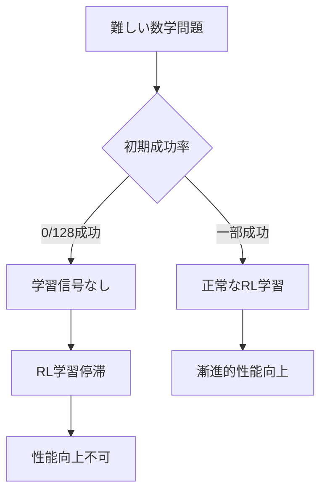
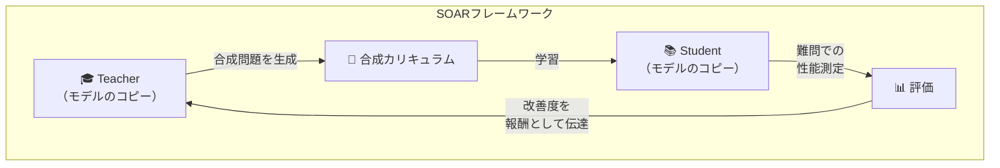
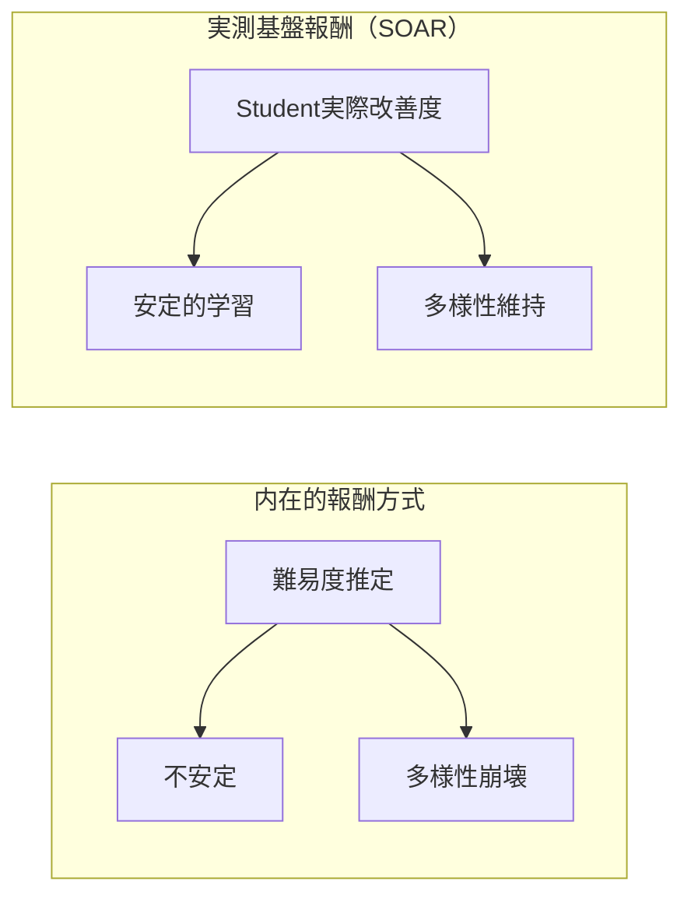

## 概要

大規模言語モデル（LLM）の推論能力を強化するための強化学習（RL）ファインチューニングは、ここ数年大きな注目を集めてきました。しかし、<strong>初期成功率が極めて低い難問</strong>では学習信号がほとんど得られず、RL学習が停滞（プラトー）するという根本的な限界がありました。

MIT研究チーム（Shobhita Sundaram他）が発表した論文<strong>「Teaching Models to Teach Themselves: Reasoning at the Edge of Learnability」</strong>は、この問題に対する革新的な解答を提示します。それが<strong>SOAR（Self-improvement through Open-ended Automated Reasoning）</strong>— LLMが自ら学習用カリキュラムを生成し、解けなかった問題を段階的に克服するフレームワークです。

## 核心問題：RL学習のプラトー現象

従来のLLM推論強化学習における最大の問題は以下の通りです：

数学ベンチマークの最難問サブセットで128回試行しても一度も成功しなければ、モデルは何が正しく何が間違っているかのフィードバックを一切受け取れません。これが<strong>学習可能性の境界（Edge of Learnability）</strong>で発生する根本的な問題です。

## SOARフレームワークの核心構造

SOARは<strong>メタRL（Meta-Reinforcement Learning）</strong>基盤の自己改善フレームワークで、Teacher-Student構造を活用します。

### ステップ1：Teacherが合成問題を生成

Teacherモデル（元のLLMのコピー）は、Studentが現在解けない難問への<strong>踏み石（stepping stones）</strong>となる中間難度の問題を生成します。

### ステップ2：Studentが合成問題で学習

Studentモデルは、Teacherが生成したカリキュラムでRL学習を行います。この過程で段階的により難しい問題を解決する能力を育てます。

### ステップ3：実際の難問で評価

Studentの性能を元々解けなかった<strong>少数の難問セット</strong>で測定します。

### ステップ4：測定された改善度でTeacherに報酬

核心的な差別化ポイントはここです。Teacherは<strong>Studentの実際の改善度</strong>を報酬（reward）として受け取ります。これは従来の内在的（intrinsic）報酬方式とは根本的に異なります。

## 3つの核心的発見

### 発見1：二重レベルメタRLの実現可能性

SOARは事前学習されたモデルが持つ<strong>潜在的能力（latent capacity）</strong>を活用し、疎な二値報酬（sparse binary rewards）環境でも有用な踏み石問題を生成できることを示しました。モデルが難問を直接解けなくても、その問題への学習経路を設計する能力は保持しているということです。

### 発見2：実測報酬が内在的報酬を圧倒

従来のLLMセルフプレイ研究で使用されていた<strong>内在的報酬（intrinsic rewards）</strong>は、不安定性と多様性崩壊（diversity collapse）を頻繁に引き起こします。一方、SOARの<strong>実測基盤報酬（grounded rewards）</strong>はStudentの実際の進捗を測定するため、これらの問題を安定的に回避します。

### 発見3：構造的品質が正答精度より重要

生成された合成問題を分析した結果、学習効果に最も大きな影響を与えるのは<strong>問題の構造的品質と適切な定式化（well-posedness）</strong>でした。驚くべきことに、解答の正確性よりも問題自体の構造がより重要だったのです。

これは非常に直感的でありながら重要な示唆です：<strong>良い質問を作る能力は、正答を知る能力とは別物</strong>だということです。

## 実践的意義と今後の展望

### 追加データなしで推論プラトーを脱出

SOARの最大の意義は、<strong>別途キュレーションされたデータなしで</strong>モデル自らが学習停滞を脱出できる原理的な経路を提示した点です。これはデータ収集とラベリングにかかる膨大なコスト問題を解決する潜在力を持ちます。

### 教育学的観点からのAI学習

SOARは人間教育の<strong>足場かけ（scaffolding）</strong>概念をAI学習に成功的に適用した事例です。学習者が現在のレベルよりやや上の問題（最近接発達領域、ZPD）を通じて成長するように、LLMも自ら生成した段階的問題を通じて能力を拡張します。

### 自己進化するAIシステムの可能性

この研究は、外部の人間の監督なしにAIが自律的に学習カリキュラムを設計・実行する<strong>自律的自己改善（autonomous self-improvement）</strong>の可能性を開きます。安全性の観点から慎重なアプローチが必要ですが、技術的可能性は明確に実証されました。

## 結論

MITのSOARフレームワークは、LLM推論強化の核心的ボトルネック — 難問での学習信号不在 — を優雅に解決します。Teacher-Student構造と実測基盤報酬の組み合わせは、従来のセルフプレイ方式の不安定性問題を克服し、「良い質問を作る能力」が「正答を知る能力」とは別物であることを実験的に証明しました。

今後このアプローチが数学を超えてコーディング、科学的推論など他のドメインに拡張されれば、<strong>自ら教える AI</strong>の新たなパラダイムが開かれるでしょう。

## 参考資料

- [Teaching Models to Teach Themselves: Reasoning at the Edge of Learnability（arXiv, 2026）](https://arxiv.org/search/?query=%22Teaching+Models+to+Teach+Themselves%22&searchtype=all)
- [Chris LaubのXポスト — SOAR解説](https://x.com/ChrisLaubAI/status/2020789996622664023)
