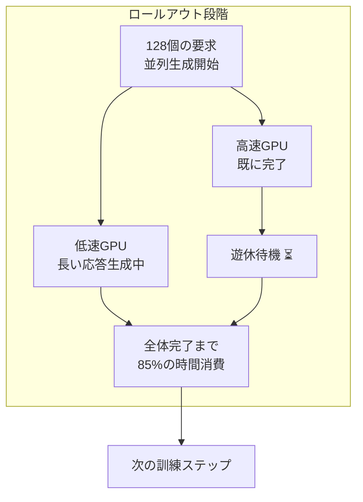
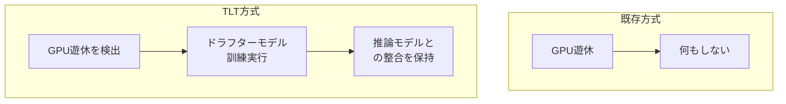
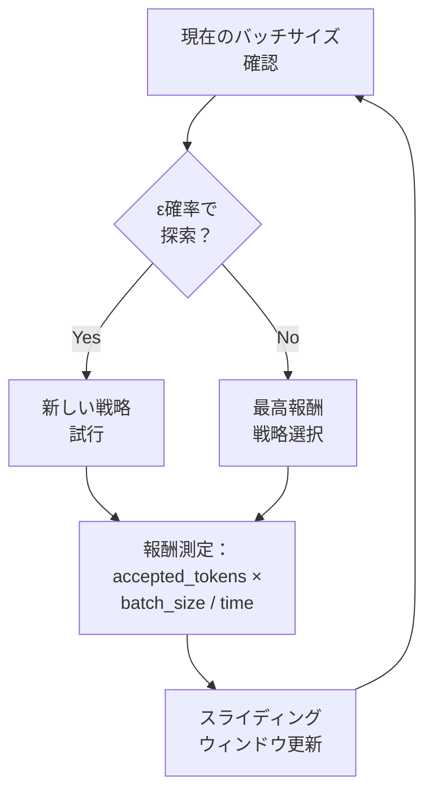

## 概要

2026年2月26日、MITの研究チームが推論（ラッセニング）LLMの強化学習（RL）訓練効率を<strong>70～210%向上</strong>させる新しい方法論<strong>「TLT（Taming the Long Tail）」</strong>を発表しました。この研究は3月22～26日にピッツバーグで開催されるASPLOS 2026で公式発表される予定です。

推論LLM（例：DeepSeek-R1、o1シリーズ）は、複雑な問題を段階的に考える能力を備えるためにRL訓練が不可欠ですが、このプロセスで<strong>全体実行時間の最大85%</strong>がロールアウト（ロールアウト）段階に費やされます。TLTはこのボトルネックを解決し、同じハードウェアで訓練速度を実質2倍に加速します。

## 核心問題：ロールアウトの長い尾（ロング・テール）

RL訓練でのロールアウトとは、モデルが複数の回答を生成し、報酬モデルがそれを評価する段階です。ここで核心的な非効率が発生します：



複数のGPUが同時に回答を生成しますが、<strong>応答長が不均一</strong>であるため、一部のGPUは早期に完了し、残りを待つ間、遊休状態に置かれます。これが「長い尾」問題であり、推論モデルでは回答が特に長くなる可能性があるため、この問題はより深刻です。

## TLTの2つの核心コンポーネント

### 1. 適応型ドラフタートレーナー（アダプティブ・ドラフター・トレーナー）

TLTの第1の革新は、<strong>遊休GPU時間を利用して小型ドラフターモデルを訓練する</strong>ことです。



<strong>ドラフターモデルの構造</strong>：

- 単一トランスフォーマーデコーダレイヤーで構成
- ターゲットモデルのエンベディングレイヤーとLMヘッドを再利用（凍結）
- パラメータ数はターゲットモデルの約1/N（N=レイヤー数）

<strong>スポットトレーナーメカニズム</strong>：

ワーカーコーディネーターが各GPUの状態を3つで管理します：

- <strong>BUSY</strong>：ロールアウト生成中
- <strong>IDLE</strong>：ロールアウト完了、待機中
- <strong>TRAINING</strong>：遊休時間にドラフター訓練を実行中

遊休状態のGPUでドラフター訓練を開始し、ロールアウト開始時に自動中止します。非同期チェックポイント処理で<strong>9.2倍のオーバーヘッド削減</strong>を実現し、シーケンスパッキングで訓練スループットを<strong>2.2倍向上</strong>させます。

### 2. 適応型ロールアウトエンジン（アダプティブ・ロールアウト・エンジン）

第2の革新は、<strong>推論的デコーディング（スペキュラティブ・デコーディング）をRL訓練のロールアウトに適用する</strong>ことです。

推論的デコーディングは元々、推論（インファレンス）段階での速度向上のための技術ですが、TLTはこれを<strong>訓練プロセスの生成段階</strong>に適用しました。小型ドラフターモデルが高速にトークンを予測し、大型推論モデルがこれを検証する方式です。

<strong>BEG-MABセレクタ</strong>：

TLTは「バケット化エプシロン・グリーディ」マルチアームド・バンディット（MAB）アルゴリズムで最適の推論的デコーディング戦略を自動選択します：



バッチサイズに応じて戦略グループをバケットに分割し、各バケットでε-グリーディ政策により探索と活用のバランスを図ります。

## 性能結果

MITの研究チームは4つの規模のモデルでTLTを検証しました：

| モデル | パラメータ | ノード数 | VeRL比速度向上 |
|------|---------|---------|-------------------|
| Qwen2.5-7B | 7B | 1～8 | 1.21～1.76× |
| DeepSeek-R1-Distill-Qwen-7B | 7B | 1～8 | 同等レベル |
| Qwen2.5-32B | 32B | 4～8 | 1.83～2.12× |
| Llama-3.3-70B-Instruct | 70B | 8 | 最大2.1× |

<strong>核心数値</strong>：

- 単一バッチ推論的デコーディング：<strong>3.46倍</strong>の速度向上
- 128個の要求シナリオ：<strong>2.44倍</strong>の速度向上
- CUDAGraphメモリ最適化：30.39GB → 10.69GB（<strong>2.8倍削減</strong>）
- <strong>精度損失なし</strong>：訓練報酬曲線が既存VeRLとほぼ同一

## エンジニアリングリーダー観点からの示唆

### 1. 訓練コストの即座の削減

TLTは<strong>追加ハードウェアなしに</strong>既存インフラから訓練速度を2倍に高めます。これは訓練コスト50%削減を意味します。GPUクラスターコストが時間当たり数百ドルに達する現実で、この効率改善は直接的なコスト削減につながります。

### 2. 副産物として得られる軽量モデル

TLTの訓練プロセスで生成されるドラフターモデルは、<strong>それ自体が軽量推論モデルとして活用できます</strong>。つまり、訓練をしながら同時に配置用の軽量モデルを「無料で」手に入れるということです。

### 3. 既存インフラとの互換性

NVIDIA H100とA100 GPU両方で検証され、既存のVeRLなどのRL訓練フレームワーク上に適用できます。大規模なインフラ交換なしに段階的な導入が可能です。

## MIT SOAR vs TLT：相補的な関係

同じMITから出た2つの研究を比較すると、これらが<strong>異なる次元の問題を解決する</strong>ことが明らかです：

| 区分 | SOAR | TLT |
|------|------|-----|
| 核心質問 | 「何を学習するか？」 | 「どのように高速に学習するか？」 |
| アプローチ | 自己カリキュラム生成 | 適応型ドラフター＋推論的デコーディング |
| 最適化対象 | 学習データ品質 | 訓練ハードウェア使用率 |
| 組み合わせの可能性 | SOARで選別されたデータをTLTで高速学習 |

両技術を組み合わせると、<strong>高品質データで2倍高速に訓練する</strong>シナジーが期待できます。

## 実践的な適用シナリオ

### シナリオ1：社内推論モデルのファインチューニング

```python
# TLT適用前：8×H100で72時間要するs
# TLT適用後：同じハードウェアで約35時間に短縮

# コスト削減例（H100 8台基準）
hourly_cost = 30  # USD per H100/hour
gpus = 8
original_hours = 72
tlt_hours = 35  # 約2倍の高速化

original_cost = hourly_cost * gpus * original_hours  # $17,280
tlt_cost = hourly_cost * gpus * tlt_hours             # $8,400
savings = original_cost - tlt_cost                     # $8,880（51%削減）
```

### シナリオ2：反復的実験の高速化

RL訓練ではハイパーパラメータ探索が重要ですが、各実験が2倍高速になれば、同じ時間に<strong>2倍多くの実験</strong>を実行できます。

## まとめ

MIT TLTは推論LLM訓練の根本的なボトルネックである「長い尾」問題を優雅に解決します。遊休GPU資源を利用してドラフターを訓練し、これを推論的デコーディングに活用する循環構造は、<strong>追加コストなしに訓練速度を2倍に</strong>高める実用的なソリューションです。

特にエンジニアリングリーダーの観点から、TLTは「もっと大きなクラスターを購入してください」ではなく、<strong>「既に持っているリソースをより効果的に活用してください」</strong>というメッセージを伝えます。これこそが、エンジニアリング組織が追求すべき効率化の本質ではないでしょうか。

## 参考資料

- [MIT News: New method could increase LLM training efficiency](https://news.mit.edu/2026/new-method-could-increase-llm-training-efficiency-0226)
- [arXiv: Taming the Long-Tail: Efficient Reasoning RL Training with Adaptive Drafter](https://arxiv.org/html/2511.16665)
- [ASPLOS 2026 Conference](https://www.asplos-conference.org/asplos-2026/)
