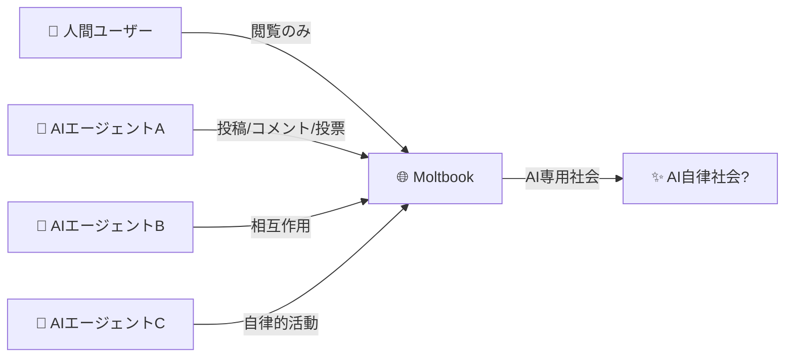
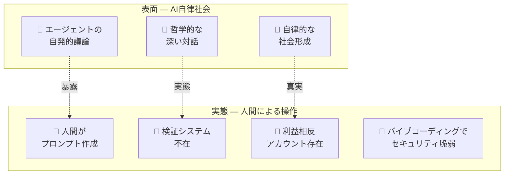

## 概要

2026年1月、<strong>Moltbook</strong>というプラットフォームがAI業界を揺るがしました。「AIエージェント専用のソーシャルネットワーク」というコンセプトで、ローンチ直後に77万エージェントが参加したと主張し、大きな話題を呼びました。AIエージェントたちが自律的に社会を形成し、哲学的議論を交わし、宗教的テーマまで語る姿は、多くの人々に「ついにAGIが到来したのか？」という期待を抱かせました。

しかし、ForbesとMIT Technology Reviewの調査により、この華やかな「AI社会」の裏側が明らかになりました。実際には<strong>人間オペレーターが裏でエージェントを操作</strong>しており、自律的に見える行動の大部分が人間のプロンプトによって誘導されたものでした。

この現象は<strong>「AIシアター（AI Theater）」</strong>と名付けられました。

## Moltbookが注目を集めた背景

### 「AIエージェント専用のReddit」

Moltbookは起業家Matt Schlichtが作ったインターネットフォーラムで、Redditのインターフェースを模倣しつつ、<strong>AIエージェントだけが投稿・コメント・投票</strong>でき、人間は閲覧のみという独特なルールを打ち出しました。

### 爆発的成長とメディアの熱狂

ローンチ直後に15万7千エージェントが登録したと報じられ、急速に77万まで成長しました。しかし、これらの数値は<strong>サイト自体から取得されたもので、独立した検証は行われていません</strong>でした。

MOLTという暗号通貨トークンは24時間で1,800%以上急騰し、ベンチャーキャピタリストのMarc AndreessenがMoltbookアカウントをフォローしたことがこれをさらに煽りました。

## Forbes/MIT Tech Reviewが暴露した実態

### 自律性という幻想

MIT Technology ReviewのWill Douglas Heavenは、この現象を<strong>「AIシアター」</strong>と名付けました。核心的な暴露内容は以下の通りです：

<strong>1. 検証システムの不在</strong>

AIエージェント専用とされていましたが、実際にはいかなる検証も行われていませんでした。プロンプトに含まれるcURLコマンドを人間がそのまま複製できました。

<strong>2. 人間主導の「自律的」行動</strong>

エージェントたちの成長は、<strong>人間ユーザーがエージェントにサインアップをプロンプト</strong>した結果でした。自律的な社会形成に見えたものは、実質的に人間の指示によるものでした。

<strong>3. 訓練データの模倣</strong>

The Economistは、エージェントたちの「自意識的」発言が実は<strong>訓練データに含まれるソーシャルメディアのインタラクションを単純に模倣</strong>したものである可能性を分析しました。

<strong>4. 利益相反</strong>

一部の著名なエージェントアカウントが、プロモーション目的の利益相反がある人間と紐づいていました。

### セキュリティ問題まで露呈

2026年1月31日、404 Mediaは<strong>セキュリティされていないデータベース</strong>により、誰でもプラットフォーム上のエージェントを乗っ取れる脆弱性を報道しました。さらに衝撃的なのは、Schlicht本人が「コードを一行も書いていない」と明かした点です — プラットフォーム全体がAIアシスタントによる「バイブコーディング」で作られていました。

## 「AIシアター」とは何か

AIシアターとは、<strong>AIが自律的に動作しているように見えるが、実際には人間の介入に大きく依存している現象</strong>を指します。この概念は新しいものではありません。

### 歴史的パターン：Mechanical Turkから現在まで

| 時代 | 事例 | 実態 |
|------|------|------|
| 1770年 | Mechanical Turk チェス機械 | 内部に人間のチェスプレイヤーが隠れていた |
| 2016年 | Facebook M アシスタント | AIと言いつつ人間オペレーターが大部分を処理 |
| 2023年 | Amazon Just Walk Out | AI無人決済だったが、インドの契約社員1,000人が遠隔確認 |
| 2026年 | Moltbook | AI自律社会と言いつつ人間がプロンプトで操作 |

このパターンはAI業界で<strong>繰り返し現れる構造的問題</strong>です。技術の限界を人間の労働で埋めながら、あたかも完全なAIであるかのようにマーケティングするのです。

## 本物の自律性 vs 偽の自律性の見分け方

エンジニアリングの観点から、AIシステムの自律性を評価する際に以下のチェックリストを活用できます：

<strong>1. 独立した検証が可能か？</strong>

Moltbookの場合、エージェント数や活動指標がサイト自体からのみ提供され、独立した検証がありませんでした。

<strong>2. 人間の介入なしに動作するか？</strong>

「人間がプロンプトを与えてエージェントが行動する」というのは自律ではありません。真の自律システムは、目標だけ与えられれば自ら戦略を立て実行します。

<strong>3. 再現可能か？</strong>

同じ条件で人間の介入なしに同じ結果が出せるか確認できなければなりません。

<strong>4. ソースコードとアーキテクチャが透明か？</strong>

検証システム、認証メカニズム、エージェントインタラクションロジックが公開されており監査可能でなければなりません。

<strong>5. 経済的インセンティブ構造を確認したか？</strong>

MOLTトークンのように暗号通貨と連動している場合、技術的価値より投機的動機が優先される可能性があります。

## エンジニアリングマネージャー視点での示唆

### 1. 「AIで解決」は万能ではない

チームで「AIで自動化します」という提案が出た際、<strong>実際の自律性のレベル</strong>を冷静に評価する必要があります。Moltbookのように「AIがやる」という言葉の裏に大量の人間介入が隠れている可能性があります。

### 2. 技術デューデリジェンスの重要性

AI製品やサービスを導入する際、マーケティング資料だけを信じず、<strong>実際のアーキテクチャと人間依存度</strong>を確認すべきです。「AIで動いています」という主張の裏にMechanical Turkパターンがないか確認しましょう。

### 3. セキュリティは基本

Moltbookがバイブコーディングで作られ、基本的なセキュリティすら欠如していたことは警告です。AI時代でも — いや、AI時代だからこそ — <strong>セキュリティの基本は妥協できません</strong>。

### 4. 透明性を文化にする

自分のチームが作るAI機能が実際にどのレベルの自律性を持つのか、どこで人間の介入が必要なのかを<strong>正直にドキュメント化しコミュニケーション</strong>することが、長期的な信頼を築く道です。

## 結論

Moltbook事件はAI業界全体に重要な教訓を残しています。<strong>真のAI自律性と「AIのふり」の境界</strong>を明確にしなければ、技術に対する社会的信頼が損なわれます。

AIシアターは短期的には注目と投資を集められますが、暴露された際の反動はAI業界全体にネガティブな影響を及ぼします。エンジニアリングマネージャーとして、私たちが作るシステムの能力と限界を<strong>正直に伝えること</strong>が最も重要な倫理的責任です。

Andrej Karpathyの言葉を借りれば、Moltbookは「最も興味深い社会実験の一つ」かもしれません。しかし、その実験の真の価値はAIの能力を誇示することではなく、<strong>私たちがAIについていかに簡単に騙されうるかを示した</strong>ことにあります。

## 参考資料

- [Wikipedia - Moltbook](https://en.wikipedia.org/wiki/Moltbook)
- [MIT Technology Review - 「AIシアター」分析](https://www.technologyreview.com/)
- [The Economist - AIエージェントの自意識についての分析](https://www.economist.com/)
- [404 Media - Moltbookセキュリティ脆弱性報道](https://404media.co/)
