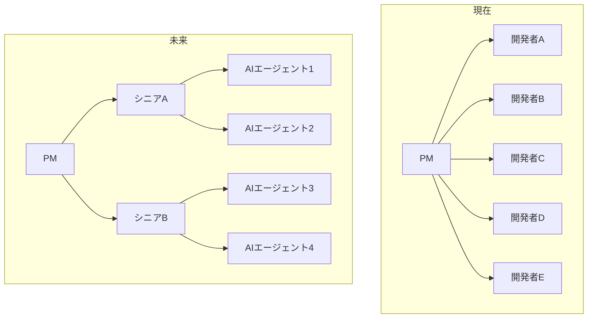
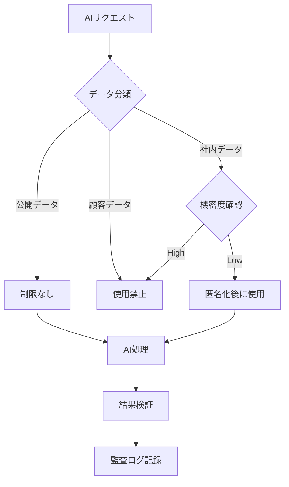
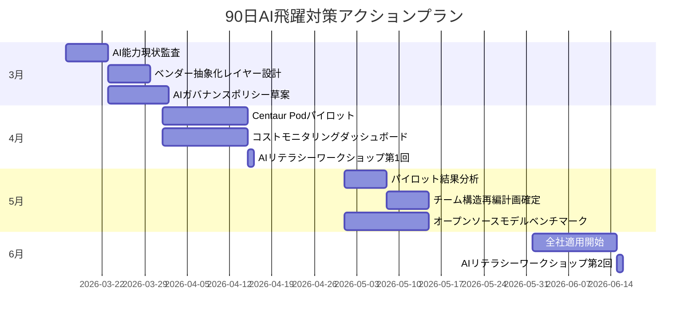

## Morgan Stanleyの警告：「世界は準備できていない」

2026年3月13日、Morgan Stanleyはあるレポートを発表しました。核心メッセージはシンプルです：

> 「2026年4〜6月の間にAI能力の<strong>非線形飛躍（non-linear jump）</strong>が起こり、ほとんどの組織はこれに準備できていない。」

これはマーケティングのバズワードではありません。Morgan Stanleyの分析によると、米国のトップAI研究所に<strong>前例のない規模のコンピュートが集中</strong>しており、この演算量の10倍増加がモデルの「知能」を2倍に引き上げるスケーリング法則が依然として有効であるということです。

実際にOpenAIの最新GPT-5.4「Thinking」モデルは、GDPValベンチマークで<strong>83.0%</strong>を記録し、人間の専門家レベルに到達しました。これは単なる漸進的な改善ではなく、経済的に価値のある作業においてAIが人間を代替できる臨界点に近づいていることを意味します。

エンジニアリングリーダーとして、この予測が当たっても外れても、<strong>準備しないことが最大のリスク</strong>です。この記事では、CTO/VPoE/EMが今すぐ実行すべき5つの準備戦略を整理します。

## 1. AI導入ロードマップを四半期単位で再設計する

ほとんどの組織は年間単位でAI導入計画を立てています。しかし、モデル性能が3〜6ヶ月で世代交代する環境では、年間計画には意味がありません。

### 実行方法

- <strong>四半期ごとのAI能力再評価</strong>：各四半期の開始時に最新モデルのベンチマークを確認し、現在のワークフローで自動化可能な領域を再特定します。
- <strong>「AI-Ready」バックログ管理</strong>：現在は手動で行っていますが、AI性能が向上すれば自動化できるタスクリストを別途管理します。
- <strong>ベンダーロックイン回避</strong>：単一のAIベンダーに依存しないよう、抽象化レイヤーを設計します。MCP（Model Context Protocol）などの標準がこれを支援します。

```typescript
// AIベンダー抽象化レイヤーの例
interface AIProvider {
  complete(prompt: string, options: CompletionOptions): Promise<Response>;
  embed(text: string): Promise<number[]>;
}

class AIService {
  private providers: Map<string, AIProvider> = new Map();

  // 四半期ごとのベンダー切り替えが容易な構造
  switchProvider(name: string): void {
    this.activeProvider = this.providers.get(name);
  }
}
```

## 2. チーム構造を「AI協業ユニット」に再編する

Morgan Stanleyのレポートが予測するレベルのAI飛躍が実現すると、現在のチーム構造は非効率になります。重要なのは、<strong>AIをツールとして使うチーム</strong>ではなく、<strong>AIと協業するチーム</strong>への転換です。

### 実行方法

- <strong>Centaur Podモデルの導入</strong>：2〜3名のシニアエンジニア＋AIエージェントの組み合わせで、従来の5〜6名チームの産出量を達成します。
- <strong>AIオーケストレーター役割の新設</strong>：チーム内でAIエージェントの作業フローを設計し、品質を管理する専門的な役割を設けます。
- <strong>コードレビュープロセスの更新</strong>：AIが生成したコードに対するレビュー基準とプロセスを別途定義します。



## 3. インフラコスト構造を根本的に見直す

Morgan Stanleyのレポートは<strong>「15-15-15」ダイナミクス</strong>に言及しています：15年のデータセンターリース、15%の収益率、ワットあたり$15の純価値創出。AIコンピュートに対する需要爆発により、インフラコスト構造が根本的に変わりつつあります。

### 実行方法

- <strong>ハイブリッドAIインフラ戦略</strong>：すべてのAIワークロードをクラウドに載せるべきではありません。推論（inference）はローカル/エッジで、学習（training）はクラウドで行う分離戦略を検討します。
- <strong>コストモニタリングダッシュボードの構築</strong>：AI APIの呼び出しコストをリアルタイムで追跡し、モデル別・機能別のROIを測定します。
- <strong>オープンソースモデル活用計画</strong>：Mistral 3、GLM-5などプロプライエタリモデルの92%の性能を15%のコストで達成するオープンソース代替案を常にベンチマークします。

| 戦略 | コスト削減効果 | 適したワークロード |
|------|--------------|-------------------|
| ローカル推論（Ollama + llama.cpp） | 70〜90% | 反復的なコード生成、文書要約 |
| クラウドAPI（GPT-5.x、Claude） | 基準線 | 複雑な推論、マルチモーダル |
| オープンソースファインチューニング | 50〜70% | ドメイン特化タスク |
| バッチ処理最適化 | 30〜50% | 夜間分析、大量処理 |

## 4. AIガバナンスフレームワークを先制的に構築する

AI能力が急激に向上すると、ガバナンスなきAI使用は組織にとって実質的なリスクとなります。最近、Anthropicが米国防総省の大量監視および自律兵器へのAI使用を拒否し「サプライチェーンリスク」に分類された事件は、AIガバナンスが単なるコンプライアンスではなく<strong>ビジネス継続性の問題</strong>であることを示しています。

### 実行方法

- <strong>AI使用ポリシーの策定</strong>：どのデータをAIに入力できるか、AI出力物の検証基準は何かを明文化します。
- <strong>モデル依存性管理</strong>：特定モデルの退役（GPT-4o退役の事例のように）に備えたマイグレーション計画を事前に策定します。
- <strong>AI監査ログ体系の構築</strong>：AIが下した判断と生成した成果物に対するトレーサビリティ（traceability）を確保します。



## 5. エンジニアリングチームのAIリテラシーを体系的に高める

Morgan Stanleyが「世界は準備できていない」と警告した核心は、<strong>技術そのものではなく、技術を活用する組織の能力</strong>です。AIツールを使えることと、AIを戦略的に活用することは、まったく異なる次元の話です。

### 実行方法

- <strong>プロンプトエンジニアリングワークショップ</strong>：月1回、実際の業務シナリオに基づいて実施します。単に「AIに質問する」のではなく、「AIと共に設計する」レベルまで引き上げます。
- <strong>AIコードレビュースキル</strong>：AIが生成したコードのセキュリティ脆弱性、パフォーマンスの問題、アーキテクチャ適合性を評価する能力を養います。
- <strong>社内AIチャンピオンプログラム</strong>：各チームでAI活用事例を発掘し共有する「AIチャンピオン」を任命します。

### 段階別AIリテラシー成熟度モデル

| レベル | 名称 | 説明 | 代表的な活動 |
|--------|------|------|-------------|
| L1 | コンシューマー | AIツールを単純に使用 | ChatGPTで質問する |
| L2 | プラクティショナー | 業務にAIを統合 | AIコード生成＋レビュー |
| L3 | デザイナー | AIワークフローを設計 | エージェントパイプラインの構築 |
| L4 | ストラテジスト | AI基盤の組織戦略策定 | AI導入ROI分析、チーム再編 |

ほとんどのエンジニアはL1〜L2に留まっています。Morgan Stanleyの予測が現実化する時点で競争力を維持するには、チームの<strong>コア人材をL3以上に引き上げること</strong>が急務です。

## タイムライン：今から6月までのアクションプラン

Morgan Stanleyが予測した飛躍時点である4〜6月まで、残された時間は多くありません。以下は現実的な90日アクションプランです。



## 結論：楽観でも悲観でもなく、プラグマティズムに基づく準備

Morgan Stanleyの予測が正確に当たるかどうかは誰にもわかりません。しかし方向性は明確です。AI能力は線形的には発展せず、いずれ必ず非線形飛躍が起こります。

核心は次の3つです：

1. <strong>柔軟なアーキテクチャ</strong>：モデルとベンダーを迅速に切り替えられる構造
2. <strong>適応力のあるチーム</strong>：AIと協業できる能力を備えた人材
3. <strong>体系的なガバナンス</strong>：迅速な導入と安全な使用のバランス

この3つが整っていれば、飛躍が4月に来ても12月に来ても、皆さんの組織は準備ができているはずです。

## 参考資料

- [Morgan Stanley warns an AI breakthrough is coming in 2026](https://fortune.com/2026/03/13/elon-musk-morgan-stanley-ai-leap-2026/)
- [OpenAI GPT-5.4 "Thinking" Model Release](https://llm-stats.com/ai-news)
- [Anthropic Pentagon Supply Chain Risk Dispute](https://techcrunch.com/2026/03/09/openai-and-google-employees-rush-to-anthropics-defense-in-dod-lawsuit/)
- [MIT TLT Training Efficiency Method](https://news.mit.edu/2026/new-method-could-increase-llm-training-efficiency-0226)
- [Claude for Excel/PowerPoint Shared Context](https://claude.com/blog/claude-excel-powerpoint-updates)
