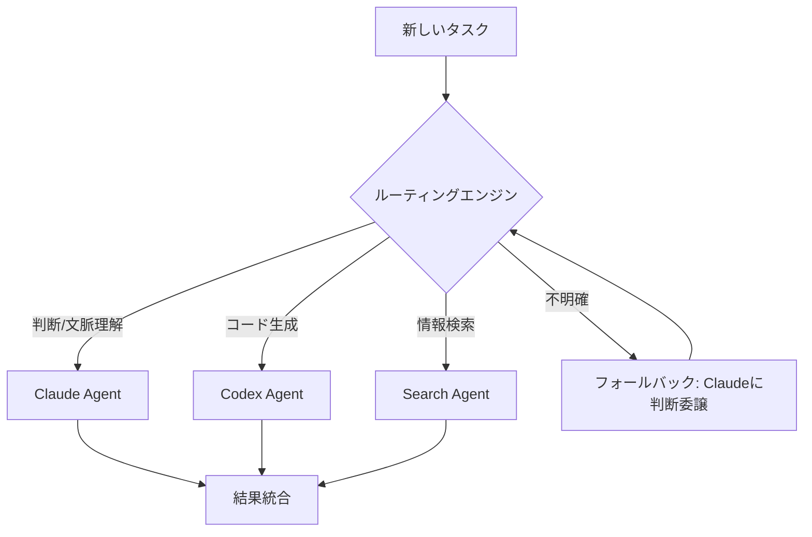
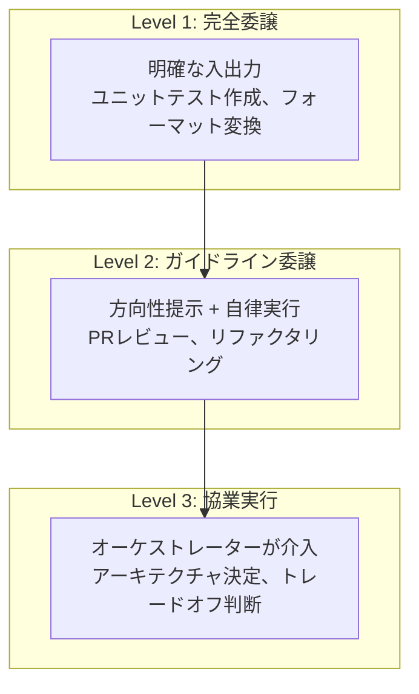
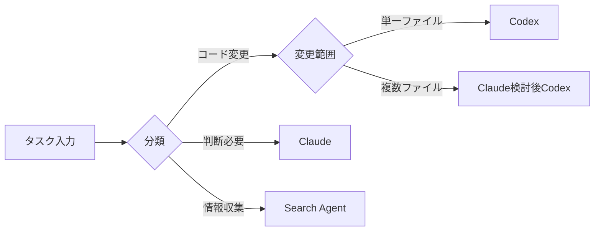

## 概要

AIエージェントを1台ではなく複数台同時に運用する時代が到来しました。Claudeは判断と文脈理解に、Codexは緻密なコード生成に強みを持ちます。しかし最も困難な問題は「このタスクをどのエージェントに送るか？」という**ルーティング（Routing）**設計です。

この記事では、Engineering Manager（EM）の視点から、マルチエージェントルーティングがなぜ**部下マネジメントにおける権限委譲**と同一構造なのかを論じます。

## なぜルーティングが最難関なのか

### 単一エージェントの限界

1つのエージェントにすべてを任せると、コンテキストウィンドウの超過、専門性の不足、レスポンス遅延などの問題が発生します。そのため複数エージェントを専門領域別に分割することになります。

### 分割後の本当の問題

エージェントを分割すること自体は難しくありません。本当の問題は：

1. **タスク分類の曖昧性**：「このPRレビューはコード品質か、アーキテクチャ判断か？」
2. **コンテキスト伝達コスト**：エージェント間で文脈を渡す際の情報損失
3. **失敗時の再ルーティング**：あるエージェントが失敗した時のフォールバック戦略
4. **依存関係管理**：Aの出力がBの入力となるパイプライン設計



## EMの権限委譲と同一構造

### マネージャーの日常

Engineering Managerが毎日行っていることを考えてみてください：

| EMの判断 | エージェントルーティング |
|----------|--------------------------|
| 「この機能実装はAさんに」 | 「コード生成はCodexに」 |
| 「アーキテクチャレビューはBさんに」 | 「設計判断はClaudeに」 |
| 「簡単なバグ修正はジュニアに」 | 「単純タスクは軽量モデルに」 |
| 「曖昧なものは自分で対応」 | 「不明確なものはオーケストレーターが処理」 |

### 権限委譲の3階層

EM経験から導き出した権限委譲フレームワークをエージェントに適用すると：



**Level 1 — 完全委譲**：入出力が明確なタスク。ユニットテスト作成、JSONフォーマット変換など。これはCodexに投げれば済みます。

**Level 2 — ガイドライン委譲**：方向性は定めつつ具体的実行はエージェントに任せるタスク。PRレビュー、コードリファクタリングなど。Claudeがガイドラインを作成し、Codexが実行します。

**Level 3 — 協業実行**：オーケストレーター自体が判断に深く関与すべきタスク。アーキテクチャ決定、技術選択など。

## 実践事例から学ぶルーティング設計

### okash1nのClaude Code + Codex MCP構成

[okash1n（super_bonochin）](https://x.com/okaboringcode)は、Claude CodeにCodexをMCPで接続して運用する構成を共有しました。この構成の核心は：

- **Claude Codeがオーケストレーター**役を担い全体フローを管理
- **CodexはMCPサーバー**としてコード生成専門家の役割
- Claudeが「これはコード生成だ」と判断するとCodexに委譲

これはすなわち**EM（Claude）がシニアエンジニア（Codex）に実装を委譲**する構造です。

### NabbilKhanの8体エージェント運用

NabbilKhanは8つのエージェントを同時運用する構成を公開しました。その際にぶつかった最大の問題がまさに**ルーティング**でした：

- 8つのエージェント中「誰がこのタスクを処理するか」の判断コスト
- タスクが複数エージェントの専門領域にまたがる場合の分割戦略
- エージェント間のコンテキスト同期の困難さ

これは**8人のエンジニアを管理するEM**が経験するものとまったく同じ問題です。

## ルーティング設計の核心原則

### 1. 明確な役割定義（Role Boundary）

各エージェントの責任範囲を明確にドキュメント化します。Job Descriptionを書くように。

```yaml
# agents/codex.yaml
name: Codex Agent
role: コード生成専門
capabilities:
  - 関数/クラス実装
  - ユニットテスト作成
  - リファクタリング実行
boundaries:
  - アーキテクチャ決定禁止
  - 外部API設計禁止
escalation: Claude Agentにエスカレーション
```

### 2. ルーティング基準の明示的設計



### 3. 失敗時のエスカレーションパス

部下が行き詰まればマネージャーに上がってくるように、エージェントが失敗すればオーケストレーターにエスカレーションします。

```python
async def route_task(task: Task) -> Result:
    agent = classify(task)
    result = await agent.execute(task)

    if result.confidence < 0.7:
        # エスカレーション: オーケストレーターが直接処理
        return await orchestrator.handle(task, context=result)

    return result
```

### 4. フィードバックループによるルーティング改善

マネージャーが委譲結果を見て次の判断を調整するように、エージェントルーティングも結果に基づいて改善する必要があります：

- エージェント別の成功/失敗率追跡
- 再ルーティングが頻発するパターンの特定
- ルーティングルールの段階的細分化

## 結論

マルチエージェントオーケストレーションの本質は技術ではなく**設計哲学**です。EMがチームメンバーに仕事を分配するように、エージェントにタスクを分配します。その核心は：

1. **役割境界を明確に** — Job Descriptionのようにエージェントの責任を定義
2. **委譲レベルを区別** — 完全委譲 / ガイドライン委譲 / 協業実行
3. **エスカレーションパスを設計** — 失敗時のフォールバックを事前準備
4. **フィードバックで継続改善** — ルーティング結果を追跡しルールを細分化

結局、良いマネージャーが良いチームを作るように、良いオーケストレーターが良いエージェントシステムを作ります。

## 参考資料

- [okash1n（super_bonochin）のClaude Code + Codex MCP構成](https://x.com/okaboringcode)
- [NabbilKhanのマルチエージェント運用事例](https://x.com/NabbilKhan)
- [Anthropic - Building effective agents](https://docs.anthropic.com/en/docs/build-with-claude/agent-patterns)
- [OpenAI - Codex](https://openai.com/index/codex/)
