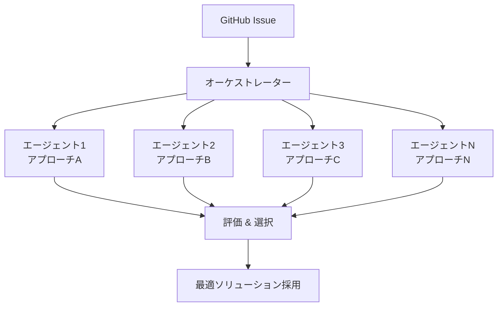

## 概要

2026年2月、SWE-bench Verifiedリーダーボードに興味深い名前が登場しました。<strong>Verdent AI</strong>が<strong>76.1%</strong>の解決率を記録し、上位に入ったのです。注目すべきは、この成果が単体の大規模モデルではなく、<strong>複数エージェントの並列実行アーキテクチャ</strong>で達成されたという事実です。

これはソフトウェアエンジニアリング自動化分野において重要な転換点を示唆しています。「より大きなモデル」ではなく「より良い協業構造」が成果の鍵になり得ることを示しているからです。

## SWE-bench Verifiedとは？

SWE-benchは実際のGitHub Issueを基にAIのソフトウェアエンジニアリング能力を評価するベンチマークです。Verified版は人間がフィルタリングした500個のインスタンスで構成されており、OpenAIと協力して作成された信頼性の高いデータセットです。

評価方式はシンプルです。実際のオープンソースプロジェクトのIssueとテストケースが与えられ、AIがコードを修正してテストを通過させる割合を測定します。

## 従来のパラダイム：単体大規模モデルの限界

これまでSWE-benchの上位は主に単体の大規模モデルが占めてきました。

| 順位 | システム | 解決率 | アプローチ |
|------|---------|--------|-----------|
| - | Claude Opus 4系 | ~70%+ | 単体モデル＋ツール使用 |
| - | GPT-5系 | ~70%+ | 単体モデル＋ツール使用 |
| - | <strong>Verdent AI</strong> | <strong>76.1%</strong> | <strong>マルチエージェント並列実行</strong> |

単体モデルアプローチはモデルのサイズと能力に依存します。より良い性能を求めるなら、より大きなモデル、より多くの計算が必要でした。しかし、この方式には根本的な限界があります。

- <strong>単一視点の制約</strong>：一つのモデルは一つの解釈経路をたどります
- <strong>エラー回復の難しさ</strong>：間違った方向に進むと戻すのが困難です
- <strong>コンテキストウィンドウの限界</strong>：複雑なコードベース全体を把握するのは困難です

## 新しいパラダイム：マルチエージェント並列実行

Verdent AIのアプローチは根本的に異なります。

### コアメカニズム

1. <strong>並列分析</strong>：複数のエージェントが同時に同じ問題を分析します。各エージェントは異なる戦略でアプローチできます。

2. <strong>多様な解決経路</strong>：一つのエージェントが失敗しても、別のエージェントが正しい経路を見つけられます。これは単体モデルの「一度で正解しなければならない」というプレッシャーから解放されます。

3. <strong>最適結果の選択</strong>：複数のソリューションの中からテストを通過する最適な結果を採用します。

4. <strong>集合知</strong>：個々のエージェントの能力の合計よりシステム全体の能力が大きくなります。

## エンジニアリングマネージャーの視点：チームvs個人

この結果は、ソフトウェアエンジニアリングの現場でもおなじみの議論と重なります。

> <strong>優れた個人1名 vs 普通のスキルのチーム5名、どちらが生産的か？</strong>

AI世界でも同じ問いが有効です。

| 観点 | 単体大規模モデル（個人） | マルチエージェント（チーム） |
|------|------------------------|---------------------------|
| 強み | 一貫したコンテキスト維持 | 多様な視点、エラー補完 |
| 弱み | 単一障害点 | 調整コスト、一貫性管理 |
| スケーラビリティ | モデルサイズに依存 | エージェント数で拡張可能 |
| コスト効率 | 大規模モデル＝高コスト | 小型モデル複数＝柔軟なコスト |

実際のソフトウェアチームでもコードレビュー、ペアプログラミング、モブプログラミングなどの協業手法が個人の限界を超えるように、AIエージェントの世界でも<strong>協業構造が個別能力を超越する結果</strong>を生み出しています。

## 実務への示唆

### 1. AIツール選択基準の変化

これまで「どのモデルを使うか」が核心的な問いでしたが、今後は<strong>「どのアーキテクチャでエージェントを組み合わせるか」</strong>がより重要な問いになります。

### 2. コスト対効果の最適化

必ずしも最も高価な大規模モデルを使う必要はありません。中小型モデルを複数並列実行する方が、コスト対効果でより良い成果を出せる可能性があります。

### 3. フォールトトレラントなシステム設計

マルチエージェントアーキテクチャは本質的に<strong>フォールトトレラント</strong>なシステムです。一つのエージェントが失敗しても、システム全体は正解を見つけることができます。

## 今後の展望

Verdent AIの76.1%達成は始まりに過ぎません。マルチエージェントアーキテクチャが発展すれば、以下のような変化が予想されます。

- <strong>専門化されたエージェントエコシステム</strong>：デバッグ専門、リファクタリング専門、テスト作成専門など役割別エージェント
- <strong>動的チーム構成</strong>：問題の性質に応じて最適なエージェント組み合わせを自動決定
- <strong>学習するオーケストレーター</strong>：過去の成功/失敗パターンを学習し、より良いエージェント配置を実現

## 結論

単体モデルのサイズ競争からマルチエージェントのアーキテクチャ競争へ、ソフトウェアエンジニアリング自動化のパラダイムが転換しています。Verdent AIのSWE-bench Verified 76.1%達成は、この転換の具体的な証拠です。

開発者として、そしてエンジニアリングリーダーとして、私たちは「どのAIモデルを使うか」を超えて<strong>「どのAIチームを構成するか」</strong>を考えるべき時に来ています。

## 参考資料

- [SWE-bench公式リーダーボード](https://www.swebench.com/)
- [Verdent AI SWE-bench結果（X/Twitter）](https://x.com/hasantoxr/status/2020854332217049281)
- [SWE-bench Verified紹介（OpenAI）](https://openai.com/index/introducing-swe-bench-verified/)
