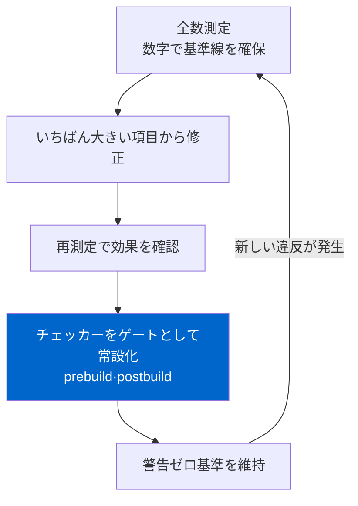

SEO監査を、ツールのレポートを1枚吐き出して終わりにするケースは多い。Lighthouseを回し、Search Consoleのカバレッジをキャプチャし、「検出された問題12件」のパネルを保存して完了とする。ところが、そうやって終えた監査の結果はたいてい3か月後に元へ戻る。誰かが新しい記事を上げ、コンポーネントをリファクタし、フォントを差し替えた瞬間、静かに戻ってくる。誰にも気づかれずに。

この5日間、自分の4言語ブログ（ko/ja/en/zh、言語あたり記事298本）を実際に監査した。項目は5つ、全部直した。だが本当に話したいのは「何を直したか」ではない。直した5つより、それらが二度と戻れないようにした<strong>ビルドゲート</strong>のほうがはるかに重要だった、という話だ。監査はイベントではなくループであるべきだ。

## レポート1枚で終わる監査が必ず戻ってくる理由

技術SEOの問題はたいてい「コードが間違っている」ではなく「不変条件がどこにも強制されていない」から来る。たとえば「公開記事はdraft記事を内部リンクで指してはいけない」というルールは明白だ。だがこれを人間が毎回覚えていなければならないなら、推薦生成器がドラフトのスラッグを一つ拾ってきた瞬間に404が生まれる。レポートはその404を捕まえて見せてくれるが、次の同じミスは防げない。

だから私は監査を3ステップのループで回した。測る。いちばん大きい項目から直す。そしてその項目を<strong>検査器にしてビルドに打ち込む</strong>。3つ目が抜けると、最初の2つは半年ごとに繰り返す徒労になる。ゲートが入った瞬間から、同じ種類の問題が再発すれば`npm run build`が失敗する。人間の記憶力ではなくパイプラインがルールを守る。

これは新発明ではない。テストがバグの回帰を防ぐのと同じ論理を、コンテンツとマークアップの層に当てはめただけだ。ただSEOの領域では、この習慣が意外と珍しい。多くのチームが「SEO点検」を四半期ごとの手作業として残している。

この記事が語るループを一枚の図にまとめるとこうなる。



## 5日間で実際に回した5項目

まず測定から。各項目のbefore/afterを数字で残した。「良くなった気がする」ではなく、再現できる数値で。（5項目の元記録は[改善履歴ページ](/ja/improvement-history)にも残してある。）

| 日付 | 項目 | Before | After | ゲート |
|---|---|---|---|---|
| 07-02 | relatedPosts整合性 | draft参照の404 <strong>12件</strong> | 0件 | prebuild |
| 07-04 | hreflang相互性 | ホームクラスターのbroken pair <strong>4ペア</strong> | 253ページ破損0 | postbuild |
| 07-05 | 性能クリティカルパス | レンダーブロッキングのフォントCSS <strong>405KB</strong> | レンダーブロッキング0 | 手動回帰 |
| 07-05 | 翻訳構造ドリフト | 不一致スラッグ <strong>21/50</strong> | 1（許容レガシー） | prebuild |
| 07-06 | JSON-LDエンティティモデル | 記事あたりld+json <strong>7ブロック</strong> | 1ブロック、6ノード連結 | コンポーネント単一化 |

表面的には5つの独立した修正に見える。実際には一つの視点を共有している。すべて<strong>画面に見えるものではなく、クローラーが読むマークアップ</strong>の問題だという点だ。hreflangもJSON-LDもdraftリンクも、人の目には見えない。だから目視QAでは絶対に捕まらず、自動検査器でしか捕まらない。

before/afterをわざわざ数字で釘付けにした理由がある。「良くなった気がする」は再現できず、再現できなければゲートを作れない。ゲートは結局「この数字が閾値を超えたら失敗」という判定だ。draft参照の404が12件なら、ゲートの条件は「0を超えたらビルドエラー」になる。測定を数字で残した瞬間、その測定がそのまま回帰テストの基準線になる。これが監査をイベントからループへ変える最初の一手だ。ちなみに公開記事298本のうち索引対象は55本、残り972本（4言語合算）はdraftとしてフィードから外れている——この比率自体も測定で見えた。これを知らないと「なぜサイトマップに記事がこれだけしかないのか」と的外れな方向を探る。

5項目それぞれはすでに個別の記事で深掘りした。ここでは繰り返さない。hreflang相互性がなぜ双方向でなければならないかは[hreflangを実測監査してホームページのバグを見つけた記事](/ja/blog/ja/hreflang-reciprocity-audit-multilingual-2026)に、スキーマの断片を一つの`@graph`につなぐ理由は[JSON-LD @graphでエンティティを連結した記事](/ja/blog/ja/json-ld-graph-entity-linking-2026)に整理した。この記事の焦点は個別の手法ではなく、5つを貫くループそのものだ。

## いちばん大きい項目から、ただし測定値をまず疑った

優先順位は単純だった。影響範囲 × 再発可能性がいちばん大きい項目から。その基準で翻訳構造ドリフト（21/50スラッグ）が1番だった。

ここで一つ学んだ。<strong>外れ値は着手する前に測定方法を検算する。</strong>「ドリフトが最大のスラッグ」を開いてみると、実際には翻訳が粗いのではなく、ネストされたコードフェンスが壊れてレンダリング自体が崩れていた。韓国語ファイルでバッククォート3つのコードブロックの中にさらにバッククォート3つのブロックを入れたせいで、パーサーが半分をコード、半分を本文と誤読していた。測定器が「構造不一致」で拾った最大値は、翻訳品質の問題ではなくパース汚染だった。

もし数字をそのまま信じて「翻訳をやり直そう」に進んでいたら、見当違いの場所に数日を溶かしていた。測定器が何を数えるかを先に検算したので、21件のうち最大の外れ値はコードフェンス問題で、残りは翻訳で脱落したセクション（約40個）とダイアグラム（12個）の復元に整理できた。復元するときは言語ごとに手で移さず、共通テンプレートに文字列パラメータだけ差し替えた。そうしないと二次ドリフトが生まれる。

性能項目でも同じだった。レンダーブロッキングのフォントCSSが405KBだったが、最適化の最初の問いは「どう速く読み込むか」ではなかった。「そもそも読み込む必要があるか」だった。どの言語も使わないグリフまで運んでいた。Google Fontsを言語別サブセットに割ると405KBが言語に応じて1〜137KBに減り、フォントCSSを非同期にしてレンダーブロッキングを0にした。副次的にアクセシビリティスコアも91から100へ上がった。アクセシビリティを数字で押さえる方法は[Lighthouseアクセシビリティ監査を実際に回して直した記事](/ja/blog/ja/a11y-lighthouse-audit-fix-2026)に別途書いた。

## 直すのではなく、戻れないようにする

ループの3ステップ目が、このキャンペーンの本当の成果物だ。直した項目ごとに検査器を一つずつ付けた。

relatedPostsの404を例にすると、生成器のフィルターを直すだけで終わらせなかった。消費直前のゲートで不変条件を強制した。ビルド前に走る`validate-publishing.mjs`がこのルールを検査する。

```javascript
// 索引可能な記事どうしだけが互いを推薦できる。
// draft/noindex/未来記事/欠落スラッグを指すとビルドエラー。
const indexableSlugsByLang = new Map(languages.map((lang) => [lang, new Set()]));
for (const post of posts.filter((item) => item.indexable)) {
  indexableSlugsByLang.get(post.lang).add(post.slug);
}

for (const post of posts.filter((item) => item.indexable)) {
  const related = Array.isArray(post.data.relatedPosts) ? post.data.relatedPosts : [];
  for (const rec of related) {
    if (!rec?.slug) continue;
    if (!indexableSlugsByLang.get(post.lang).has(rec.slug)) {
      errors.push(`${post.relPath}: relatedPosts references non-indexable post "${rec.slug}"`);
    }
  }
}
```

核心は<strong>生成層ではなく消費直前の層で止める</strong>点だ。推薦を作るコードが100個あっても、最終的に発行される記事がドラフトを指した瞬間、たった一か所で捕まる。このゲートが入ってからdraftの404は算術的に0になり、これからも0で保たれる。

hreflangはソースだけでは判定できない。最終HTMLをクロールして、ページどうしが実際に互いを指しているかを見る必要がある。だからこれはビルド後（postbuild）に回す。Google公式のルールは明確だ。AがBを代替版として指名したらBもAを指名し返さなければならず（相互性）、各ページは自分自身も指さなければならない（self-reference）。この2つのルールをそのままコードに移した。

```javascript
for (const [url, targets] of annotations) {
  if (!targets.has(url)) missingSelf.push(url);        // self-reference欠落
  for (const target of targets) {
    if (target === url) continue;
    const back = annotations.get(target);
    if (back && !back.has(url)) {
      brokenPairs.push(`${url} -> ${target} (return link なし)`);  // 相互性破損
    }
  }
}
```

ビルドを回すと2つの検査器が実際にこう通る。以下はこの記事を書きながら回したログだ。

```text
[publishing-check] posts by language: {"ko":{"total":298,"published":55,"indexable":55}, ...}
[publishing-check] past draft/noindex posts kept out of feeds: 972
[publishing-check] OK
...
[hreflang-check] annotated pages: 257
[hreflang-check] self-reference missing: 0
[hreflang-check] broken return-link pairs: 0
[orphan-check] pages: 260, orphans (allowlist除外): 0
[hreflang-check] OK
```

`orphan-check`も同じpostbuildに乗せた。どのページからも内部リンクが届かない孤立ページは、クローラーが見つけにくく、見つけても孤立したシグナルとして読む。監査の途中で孤立していたページ一つをFooterリンクでつないだあと、再発を防ぐためにこの検査を常設化した。限界を認めるのもループの一部だ。翻訳ドリフトは21件から1件に減らしたが、その1件はわざと残した。とても古いレガシー記事が言語間で構造が違うのだが、今さら無理に揃えると既に索引されたURL構造を触ることになり、得るものよりリスクが大きかった。だから検査器のallowlistにそのスラッグ一つを明示的に登録した。「0でなければ即失敗」ではなく、「受け入れると決めた例外はコードに根拠を残して通す」ほうが現実的だ。すべての項目を0にするのが目的ではなく、意図しない再発を防ぐのが目的だ。AIクローラーをどう差別的に制御するかは[robots.txtとllms.txtでクローラーを統制した記事](/ja/blog/ja/ai-crawler-control-robots-txt-llms-txt-2026)で別に扱った。

## Googleが保証しないこと

ここで正直に線を引く。このキャンペーンは順位を上げる作業では<strong>ない</strong>。Google Search Central公式ドキュメントは、構造化データがリッチリザルトの<strong>対象資格</strong>を与えるだけで、掲載や順位を保証しないと言い切っている。hreflangも順位シグナルではなく、「ユーザーを適切な言語・地域版へ案内する」ルーティング装置だと説明される。誤って入れたhreflangがなかった順位を作ることはなく、相互性が壊れればその注釈はただ無視される。

だからこの5項目の正確な効用はこう言うのが正しい。クローラーが私のサイトを<strong>誤読する余地を減らす衛生作業</strong>だ。404リンクはクロールバジェットを浪費させ、破損したhreflangは言語ターゲティングを無効化し、断片化したJSON-LDは「この組織・この著者・この記事」の連結を断つ。これを直せばクローラーが意図どおり読む確率が上がる。それが順位上昇につながるかはコンテンツ品質と無数の他の変数に依存し、私はWeb開発者であって検索アルゴリズムの内部を知る人間ではない。その部分は断定しない。

性能でも限界を見た。ラボ（Lighthouseシミュレーション）の数値と実測（observed LCP 2.4秒）は違った。ラボスコアだけ見て過剰最適化に走ると、実ユーザー環境では体感がないのにコードだけ複雑になる。ラボとフィールドの乖離を知ることが、むしろ止めどころを教えてくれる。

## そのまま使えるチェックリスト

自分のブログに適用したことを一般化すると、どんなサイトでもこのループをこう始められる。

- <strong>測定が先、次に疑う。</strong> 外れ値を見つけたら、直す前に「測定器は正確に何を数えているか」を検算する。私の最大ドリフトは翻訳問題ではなくコードフェンスのパース汚染だった。
- <strong>影響 × 再発可能性で優先順位。</strong> 目立つものより、静かに再発し続けるものから。
- <strong>消費直前の層で止める。</strong> 生成コードが複数なら、その一つ一つを直すのではなく、発行直前の一か所で不変条件を強制する。
- <strong>ソースで判定できるならprebuild、レンダー結果を見る必要があるならpostbuild。</strong> frontmatterやリンク参照はprebuild、hreflang相互性や孤立ページは最終HTMLをクロールするpostbuild。
- <strong>直した項目は必ず検査器に。</strong> 検査器なしで終えた修正は回帰の予約だ。30行の検査器一つが四半期の手動監査に勝る。
- <strong>順位を約束しない。</strong> これは衛生であって魔法ではない。クローラーの誤読を減らすところまでが開発者の仕事だ。

5日間を振り返ると、最も価値ある産出物は直した5つではなく、リポジトリに残った3つの検査器だ。5つはいつか忘れられるが、検査器は私がミスするたびに私の代わりに覚えている。監査をイベントではなくループにするとは、結局この意味だ。

構造化データをサーバーサイドで確実に出したい、あるいは多言語サイトのhreflang・JSON-LD・性能を実測で点検して回帰ゲートまで付けたいなら、個人的に相談・実装の依頼を受けている。サーバーがクローラーに何を送るかをコードで制御する仕事が私の専門領域だ。サイトをサーバーが出すマークアップの視点で見直したいなら、[LocalBusiness構造化データをサーバーサイドで出した記事](/ja/blog/ja/localbusiness-structured-data-server-side-vs-js-2026)も同じ筋の話だ。

---

本記事のようなAI引用・GEOの実測は、noteの連載[「AIに引用されるブログの作り方」](https://note.com/jw_effloow/n/n91d7682a8aff)でも扱っている。検索露出56万回・AI引用19.6万回という当ブログの生データから始まる日本語シリーズだ（一部有料）。
