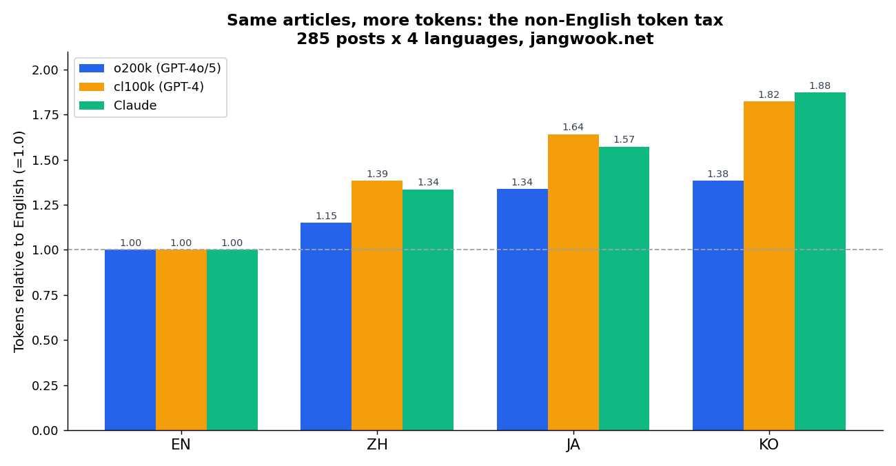
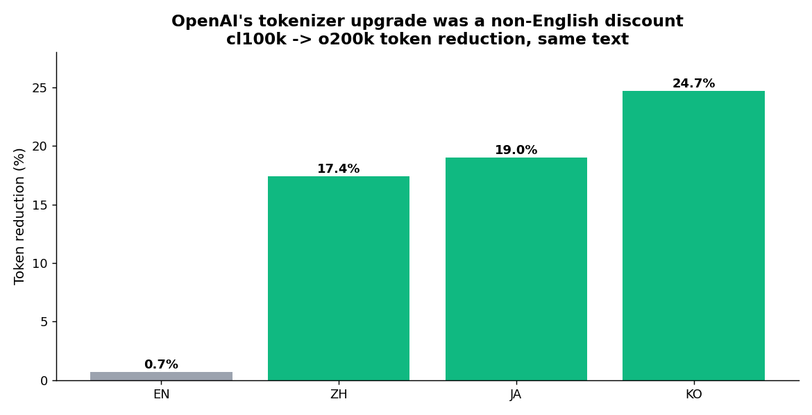

英語の一文を入れた。「I refactored the agent loop to cut token usage.」OpenAIのo200k_baseで12トークン。同じ意味を韓国語にする。「토큰 사용량을 줄이려고 에이전트 루프를 다시 짰다.」20トークン。文字数は韓国語が半分以下なのに、トークンは1.7倍だ。

これが一文の偶然なのか、それとも自分のブログ全体に敷かれた構造的なコストなのかが気になった。ちょうどいい実験素材があった。このブログは記事一本を韓国語・日本語・英語・中国語の4バージョンで出す。意味が同じ文書が4言語で285組あるということだ。翻訳品質の議論を抜きにして、同じ内容で言語だけ変えたときトークンがどれだけ増えるかをきれいに測れるデータセットが、すでに手元にあった。

そこで285本×4言語を実トークナイザー3種で全部トークン化した。結論から言う。非英語のトークン税は本物で、思ったより大きく、モデルを替えると税率が変わった。

## なぜ自分で測る必要があったか

「韓国語は英語よりトークンを食う」はコミュニティでよく聞く話だ。ところが「何倍か」と訊くと答えがばらばらになる。2倍という人もいれば1.2倍という人もいる。当然だ。測ったテキストが違い、トークナイザーが違い、コードブロックが混ざっているかも違うからだ。

私に必要なのは漂っている数字ではなく、「自分のブログを、自分が実際に使うモデルで回したとき」に乗るコストだった。翻訳・要約・埋め込み・RAGのコンテキスト注入まで、私の自動化パイプラインはほぼ全段がトークン課金だ。韓国語が英語の1.4倍高いなら、それは毎月の請求書にそのまま刻まれる数字になる。

測定対象は3つのトークナイザーにした。最新のOpenAI系であるo200k_base(GPT-4o/GPT-5世代)、旧cl100k_base(GPT-4/3.5世代)、そしてClaudeトークナイザー。3つともBPE系だが、語彙を学習したデータが違うため非英語の扱いが異なる。私が日常的に使うモデルはだいたいこの3系統に収まる。

## どう測ったか(フロントマターだけ外して本文まるごと)

大げさな道具は使っていない。tiktokenはオフラインですぐ動くし、ClaudeトークナイザーはHugging Faceの`Xenova/claude-tokenizer`から読み込んだ。各Markdownファイルでは、YAMLフロントマターだけを切り落として本文全体(コードブロック含む)をそのままトークン化した。実際にLLMへ入るのは本文まるごとなので、あえて整形していない。

```python
import tiktoken
from transformers import AutoTokenizer

o200k  = tiktoken.get_encoding('o200k_base')   # GPT-4o / GPT-5 世代
cl100k = tiktoken.get_encoding('cl100k_base')  # GPT-4 / 3.5 世代
claude = AutoTokenizer.from_pretrained('Xenova/claude-tokenizer')

def strip_frontmatter(text):
    if text.startswith('---'):
        end = text.find('\n---', 3)
        if end != -1:
            text = text[end + 4:]
    return text.strip()

# 4言語すべてに同じslugがある記事のみ集計(285組)
for lang in ['ko', 'ja', 'en', 'zh']:
    body = strip_frontmatter(open(path(lang, slug)).read())
    o200k_tokens  = len(o200k.encode(body))
    cl100k_tokens = len(cl100k.encode(body))
    claude_tokens = len(claude.encode(body))
```

4言語に同じファイル名が揃っている285本だけを集計対象にした。こうすれば「英語版はあるが韓国語版はない記事」のような標本の偏りが入る余地がない。同じ記事の4バージョンを1:1:1:1で比べたわけだ。

## 数字が語ること

285本を全部足した結果だ。単位はトークン。

| 言語 | o200k(最新) | cl100k(旧) | Claude | 文字数 |
|------|------------:|-----------:|-------:|-------:|
| 英語(en) | 908,938 | 915,128 | 1,003,948 | 3,859,685 |
| 中国語(zh) | 1,045,977 | 1,267,007 | 1,340,943 | 2,493,687 |
| 日本語(ja) | 1,217,284 | 1,502,403 | 1,579,075 | 2,584,255 |
| 韓国語(ko) | 1,256,718 | 1,668,007 | 1,882,800 | 3,076,489 |

英語を1.0に置くと、非英語のトークン税が一目で見える。

| 言語 | o200k倍率 | cl100k倍率 | Claude倍率 |
|------|----------:|-----------:|-----------:|
| 英語 | 1.00 | 1.00 | 1.00 |
| 中国語 | 1.15 | 1.39 | 1.34 |
| 日本語 | 1.34 | 1.64 | 1.57 |
| 韓国語 | 1.38 | 1.82 | 1.88 |

最新のトークナイザー(o200k)でも韓国語は英語の1.38倍、日本語は1.34倍だ。旧トークナイザー(cl100k)に行くと韓国語は1.82倍まで開く。Claudeトークナイザーでは韓国語が1.88倍で3つの中で最も高かった。

興味深かったのは、文字数とトークン数が別々に動くことだ。英語版は文字数では386万字で一番長い。韓国語版は308万字でむしろ短い。なのにトークンは韓国語が英語より38%多い。文字は少ないのにトークンは多いのだ。文字あたりトークン(tok/char)で見ると、英語0.235、韓国語0.408、中国語0.419、日本語0.471。英語のBPEはよく使う単語を丸ごと1トークンに押し込むが、ハングル・かな・漢字はそう学習されておらず、トークンが細かく割れる。



## なぜ韓国語はトークンを食うのか、「에이전트」を実際に切ってみた

原因を自分の目で見たくて、単語を一つトークナイザーに入れて、どう割れるかをデコードしてみた。

```python
w = "에이전트"   # = agent
[o200k.decode([t]) for t in o200k.encode(w)]
# ['에', '이', '전', '트']   → 4トークン
```

英語「agent」は1トークン。韓国語「에이전트」は音節単位で4トークンに割れる。cl100kでも結果は同じだった。英語は単語がそのままトークンだが、韓国語は文字(音節ブロック)がトークンに近い。この一語の4:1の差が記事全体に積み重なると1.4倍になる。

短い一文を3つのトークナイザーで同時に見るともっとはっきりする。意味はすべて「I refactored the agent loop to cut token usage.」と同じだ。

| 言語 | 文字数 | o200k | cl100k | Claude |
|------|------:|------:|-------:|-------:|
| 英語 | 47 | 12 | 12 | 12 |
| 中国語 | 19 | 14 | 24 | 21 |
| 日本語 | 30 | 22 | 28 | 27 |
| 韓国語 | 28 | 20 | 31 | 32 |

英語は3つとも12でそろっている。非英語に行くとトークナイザーごとに数字が分かれる。同じ韓国語の文がo200kで20、Claudeで32だ。1.6倍の差が、モデル選択一つで決まる。

日本語には別の手触りがある。文字あたりトークンでは日本語が0.471で3つの中で最も高い。漢字・ひらがな・カタカナが一文に混ざり、カタカナ外来語(「エージェント」)は音節ごとに細かく割れるからだ。ところが文書全体の合計で見ると、韓国語のほうが日本語よりトークンが多い。日本語は漢字一字に多くの意味を押し込んで文書が短くなる一方、韓国語は文書の長さそのものが長いので、文字あたり効率が日本語より良くても総量で逆転する。効率と総量は同じ方向を指さない。

## トークナイザーの世代交代は実質「非英語の割引」だった

今回の実験で最も意外だった発見だ。cl100kからo200kにトークナイザーが変わったとき、言語ごとにトークンがどれだけ減ったかを計算してみた。

- 英語: 0.7%減
- 中国語: 17.4%減
- 日本語: 19.0%減
- 韓国語: 24.7%減

英語ユーザーはトークナイザーが変わってもトークン数がほぼそのままだ。0.7%なら誤差の範囲だ。ところが韓国語は同じ記事が4分の1ぶん安くなった。OpenAIがo200kで語彙を増やしてやったことの実質は、非英語圏に静かに割引を渡したことだった。英語はすでにほぼ最適で、もう絞れるものがなかったわけだ。



これは実務判断に直結する。CJKテキストを大量に回すワークロードなら、モデルを選ぶときベンチマークのスコアだけでなくトークナイザーの世代も見るべきだ。同じ価格表でも、非英語テキストでの実際の請求額はトークナイザーが分ける。以前[データ形式がトークン費用をどれだけ動かすかを測ったとき](/ja/blog/ja/llm-token-cost-data-format-experiment)も同じ教訓だった。モデルの価格表は出発点にすぎず、本当のコストは入力がどうトークンに変わるかで決まる。

## 記事ごとに税が違う、平均だけ信じてはいけない理由

合計だけ見れば整然としているが、記事単位に分けると分散がかなり大きい。285本それぞれについて英語対比の韓国語トークン倍率を出し、中央値と平均を別々に取った(o200k基準)。

| 言語 | 記事別倍率の中央値 | 記事別倍率の平均 |
|------|------------------:|----------------:|
| 中国語 | 1.10 | 1.14 |
| 日本語 | 1.41 | 1.40 |
| 韓国語 | 1.31 | 1.40 |

韓国語は中央値1.31なのに平均が1.40だ。平均が中央値より高いということは、トークンをやたら食う少数の記事が平均を押し上げているということだ。覗いてみると、そういう記事は韓国語の散文比率が高く、英語のコードや固有名詞が少ない記事だった。逆にコードブロックが多いチュートリアル記事は倍率が1.1前後で低かった。コードはどうせ英語なので、4言語版でほぼ同じようにトークン化されるからだ。

実務上の教訓が一つ。記事一本のコストをコーパスの平均倍率で見積もると、コードが少なく散文の多い記事で大きく外す。コストが効く単発の作業なら、そのテキストを直接トークン化するのが正しい。

## だから私の請求書には何が出るか

このブログは新しい記事を英語原稿から始め、3言語に展開し、コーパス全体を埋め込んで関連記事の推薦と検索に使う。ほぼ全段がトークン課金だ。

コーパス全体で見ると、英語版285本はo200kで約91万トークン。4言語を全部足すと約443万トークンだ。英語だけ運用する場合に比べ、多言語は単に4倍ではなく、非英語税が上乗せされてさらにかかる。翻訳版3つ(ko+ja+zh)だけ見ると約352万トークンで、英語3本分(273万)で見積もっていたら約29%を過小計上していたことになる。

ここで私がよくやっていたミスが露わになる。英語のトークン数で韓国語コストを当てる癖だ。最新モデルでも28%外し、旧モデルではほぼ半分を取りこぼす。見積もりを英語で立てて韓国語で請求されると、毎月差が積もる。

具体的に描くとこうだ。新しい記事を英語原稿から韓国語に移す作業を考えよう。入力に英語原文(約3,200トークン)を入れ、出力として韓国語訳が出る。だが韓国語出力は同じ分量でもトークンが1.38倍乗る。出力トークン単価はたいてい入力より高いので、非英語税は最も高い側に乗る。日本語・中国語まで移せば、この税が3回別々に付く。一本を4言語で出す私の運用構造では、非英語の出力トークンは発行コスト全体の中で英語一本が占める分よりずっと大きな塊だ。多言語を一度[中国語まで拡張して](/ja/blog/ja/adding-chinese-support)記事数が4倍になったとき、コストが正確に4倍ではなくそれ以上に跳ねた理由がここにあった。

トークン税を減らすために今変えていること。同じコンテキストを繰り返し押し込む推薦パイプラインには[プロンプトキャッシュを適用](/ja/blog/ja/claude-api-prompt-caching-cost-optimization-guide)し、非英語税が呼び出しごとに付くのを止める。RAGのチャンクは文字数ではなく実トークン数で切る。文字あたりトークンの数値を逆に使えばチャンクサイズが出る。埋め込みモデルのコンテキストが512トークンだとして、英語は0.235 tok/charなので約2,170字まで入るが、韓国語は0.408 tok/charなので約1,250字で同じ上限に達する。韓国語を英語と同じ「1,000字」で切ると、英語チャンクよりトークンが1.7倍多くなり、知らないうちにコンテキストウィンドウや埋め込み上限を超えるか切り捨てられる。[韓国語RAG埋め込みをまとめた記事](/ja/blog/ja/sentence-transformers-korean-rag-embedding-guide-2026)でチャンクサイズを見直したのもこのためだ。

## この測定が届かないところ

正直に限界を書く。第一に、トークン数はコストの一軸にすぎない。同じトークンでもモデルごとに単価が違うし、入力と出力でも単価が違う。この記事は「トークンが何個か」だけを測った。「で、ドルでいくらか」は各自のモデルと料金プランに当てはめる必要がある。

第二に、トークンが多いから必ず損というわけではない。CJKは同じ情報をより少ない文字に収める。韓国語版が英語版より文字数が少ないのに意味が同じだったのがその証拠だ。トークン効率と情報密度は別の話だ。

第三に、私のコーパスは技術ブログなので、本文に英語のコード・固有名詞・技術用語が多く混ざっている。純粋な日常の韓国語散文なら倍率はもっと大きくなりうる。だからこの1.38倍は「技術文書基準・私の環境値」であって普遍定数ではない。トークナイザーの挙動にもっと踏み込みたいなら、[BPEの量子化・マージを扱った記事](/ja/blog/ja/llama-cpp-iq-quantization-merge)が隣接した出発点だ。

第四に、モデルは変わり続ける。次世代のトークナイザーがCJK語彙をさらに増やせば、この差はまた縮む。だからこの記事の本当の結論は「韓国語は1.38倍だ」ではない。「見積もるな、自分のテキストを自分のモデルのトークナイザーで直接回せ」が結論だ。コードは上に全部ある。自分のコーパスに付けるのに10分あれば足りる。

トークン単位で出力を再現し測る感覚がなぜ重要かは、[temperatureとseedで出力再現性を測った実験](/ja/blog/ja/llm-determinism-temperature-seed-experiment)でも同じ文脈で扱った。LLMを使う仕事は、結局トークンを数える仕事だ。その数える単位が言語ごとに違うと数字で知って始めるのと、知らずに始めるのとでは、毎月の請求書で差が出る。

## 参考資料

- [openai/tiktoken (GitHub)](https://github.com/openai/tiktoken) — OpenAI公式のBPEトークナイザー。この記事で測った`o200k_base`・`cl100k_base`エンコーディングはすべてこのライブラリから来ている。
- [Anthropic — トークンカウント文書](https://platform.claude.com/docs/en/build-with-claude/token-counting) — リクエスト前にトークン数を数える公式ドキュメント。Claude側のコストを自分のテキストで直接測る正確な方法だ。
- [Petrov 他「Language Model Tokenizers Introduce Unfairness Between Languages」(arXiv:2305.15425)](https://arxiv.org/abs/2305.15425) — 同じ文章が言語によって最大15倍までトークンが増えることを示したNeurIPS 2023論文。この記事で測ったトークン税の学術的な裏付けだ。
