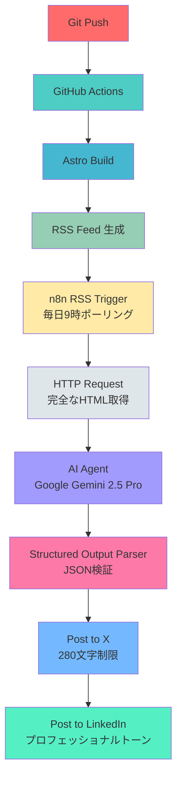

# n8nとRSSでブログ公開を完全自動化する

## ブログ公開後のSNS投稿、まだ手動でやっていませんか?

ブログ記事を公開した後、X（Twitter）とLinkedInに手動で投稿していませんか?各プラットフォームに合わせた文章を考え、ハッシュタグを選び、投稿する。これを毎回繰り返すのは時間の無駄です。

この記事では、<strong>GitHub ActionsでブログをビルドしてRSSフィードを生成し、n8nのRSSトリガーが新しい記事を検知して、AI（Google Gemini 2.5 Pro）が各プラットフォームに最適化されたコンテンツを生成し、自動的にX（Twitter）とLinkedInに投稿する</strong>完全自動化システムの構築方法を紹介します。

## なぜRSSとn8nなのか?

従来のブログ公開ワークフローは非効率的です:

1. <strong>ブログ記事を公開</strong> (GitHub Push)
2. <strong>X（Twitter）投稿文を作成</strong> (280文字以内、ハッシュタグ選定)
3. <strong>X（Twitter）に手動投稿</strong>
4. <strong>LinkedIn投稿文を作成</strong> (プロフェッショナルなトーン、ハッシュタグ選定)
5. <strong>LinkedInに手動投稿</strong>

平均して<strong>15〜20分</strong>かかり、投稿を忘れることもあります。しかし、RSSとn8nを活用すれば、これらすべてのプロセスを<strong>完全自動化</strong>し、<strong>品質は向上</strong>させることができます。

### RSS + n8nの利点

- <strong>リアルタイム検知</strong>: RSSフィードをポーリングし、新しい記事を即座に検知
- <strong>プラットフォーム最適化</strong>: AI（Google Gemini）が各SNSに最適化されたコンテンツを自動生成
- <strong>完全自動化</strong>: GitHub Pushから30秒〜1分以内にSNS投稿完了
- <strong>一貫性</strong>: ブランドボイスとフォーマットを維持
- <strong>スケーラビリティ</strong>: 新しいプラットフォームを簡単に追加可能

## システムアーキテクチャ: GitHub Actions → RSS → n8n → AI → SNS

全体のワークフローは以下の通りです:



### コア技術スタック

- <strong>GitHub Actions</strong>: CI/CDパイプライン、自動ビルド・デプロイ
- <strong>Astro 5</strong>: 静的サイトジェネレーター、RSSフィード生成
- <strong>n8n</strong>: ワークフロー自動化プラットフォーム
- <strong>Google Gemini 2.5 Pro</strong>: AI駆動のコンテンツ生成
- <strong>X（Twitter）API</strong>: ツイート自動投稿
- <strong>LinkedIn API</strong>: LinkedIn自動投稿

## Step 1: AstroでRSSフィードを生成する

Astroは`@astrojs/rss`統合を使用してRSSフィードを簡単に生成できます。

### RSSフィード生成コード

```typescript
// src/pages/rss-ja.xml.ts
import rss from '@astrojs/rss';
import { getCollection } from 'astro:content';
import { SITE_TITLE, SITE_DESCRIPTION } from '../consts';

export async function GET(context) {
  // 日本語ブログ記事のみを取得
  const posts = await getCollection('blog');
  const jaPosts = posts.filter((post) => post.id.startsWith('ja/'));

  return rss({
    title: `${SITE_TITLE} - 日本語`,
    description: SITE_DESCRIPTION,
    site: context.site,
    items: jaPosts.map((post) => ({
      title: post.data.title,
      pubDate: post.data.pubDate,
      description: post.data.description,
      link: `/blog/${post.id}/`,
      // カスタムフィールド（オプション）
      customData: post.data.tags
        ? `<tags>${post.data.tags.join(', ')}</tags>`
        : '',
    })),
    // RSS仕様に準拠したXML生成
    customData: `<language>ja</language>`,
  });
}
```

### 多言語対応RSSフィード

言語ごとに別のRSSフィードを生成します:

```typescript
// src/pages/rss-ko.xml.ts (韓国語)
const koPosts = posts.filter((post) => post.id.startsWith('ko/'));

// src/pages/rss-en.xml.ts (英語)
const enPosts = posts.filter((post) => post.id.startsWith('en/'));

// src/pages/rss-ja.xml.ts (日本語)
const jaPosts = posts.filter((post) => post.id.startsWith('ja/'));
```

### GitHub Actionsで自動デプロイ

```yaml
# .github/workflows/deploy.yml
name: Deploy to Production

on:
  push:
    branches:
      - main

jobs:
  deploy:
    runs-on: ubuntu-latest
    steps:
      - uses: actions/checkout@v3

      - name: Setup Node.js
        uses: actions/setup-node@v3
        with:
          node-version: '18'

      - name: Install dependencies
        run: npm ci

      - name: Build Astro site
        run: npm run build

      - name: Deploy to Vercel
        uses: amondnet/vercel-action@v20
        with:
          vercel-token: ${{ secrets.VERCEL_TOKEN }}
          vercel-org-id: ${{ secrets.ORG_ID }}
          vercel-project-id: ${{ secrets.PROJECT_ID }}
```

<strong>結果</strong>: `git push`すると自動的に:
1. Astroサイトがビルドされる
2. RSSフィード（`/rss-ja.xml`）が生成される
3. Vercelにデプロイされる

## Step 2: n8nワークフロー構成

n8nは視覚的なワークフロー自動化ツールです。以下の6つのノードで構成されます。

### ワークフローの全体像


### 1. RSS Feed Trigger - RSSフィード監視

```json
{
  "parameters": {
    "url": "https://jangwook.net/rss-ja.xml",
    "pollTimes": {
      "item": [
        {
          "mode": "everyHour",
          "hour": 9
        }
      ]
    }
  },
  "name": "RSS Feed Trigger",
  "type": "n8n-nodes-base.rssFeedReadTrigger"
}
```

<strong>動作</strong>:
- 毎朝9時にRSSフィードをチェック
- 新しい記事があれば次のノードに渡す
- 最後にチェックした時刻以降の記事のみを検知

### 2. HTTP Request - 記事の完全なHTMLコンテンツを取得

```json
{
  "parameters": {
    "url": "={{ $json.link }}",
    "method": "GET",
    "options": {}
  },
  "name": "HTTP Request",
  "type": "n8n-nodes-base.httpRequest"
}
```

<strong>理由</strong>:
- RSSフィードには記事の要約しか含まれない
- AI（Gemini）が記事全体を解析するには完全なHTMLが必要
- `{{ $json.link }}`でRSSフィードから記事URLを取得

### 3. AI Agent (Google Gemini 2.5 Pro) - コンテンツ生成

```json
{
  "parameters": {
    "agent": "conversationalAgent",
    "promptType": "define",
    "text": "={{ $json.data }}",
    "hasOutputParser": true,
    "options": {
      "systemMessage": "あなたは技術ブログのコンテンツを分析し、SNS投稿文を生成する専門家です。\n\n与えられたHTML記事コンテンツから核心的な洞察を抽出し、プラットフォームごとに最適化された投稿文を生成してください。\n\n**X（Twitter）投稿要件**:\n- 最大280文字\n- 簡潔で魅力的\n- 2〜3個のハッシュタグ\n- 記事へのリンクを含める\n- カジュアルで親しみやすいトーン\n\n**LinkedIn投稿要件**:\n- 200〜400文字\n- プロフェッショナルなトーン\n- 3〜5個のハッシュタグ\n- 記事の価値提案を明確に\n- ビジネスコンテキストを強調\n\n**出力形式（必須）**:\n```json\n{\n  \"x\": \"X（Twitter）投稿文（280文字以内、ハッシュタグ含む）\",\n  \"linked_in\": \"LinkedIn投稿文（200〜400文字、ハッシュタグ含む）\"\n}\n```"
    }
  },
  "name": "AI Agent",
  "type": "@n8n/n8n-nodes-langchain.agent"
}
```

<strong>重要ポイント</strong>:
1. <strong>詳細なプロンプト</strong>: プラットフォームごとの要件を明確に指定
2. <strong>文字数制限</strong>: X（Twitter）280文字、LinkedIn 200〜400文字
3. <strong>トーンの違い</strong>: Xはカジュアル、LinkedInはプロフェッショナル
4. <strong>構造化された出力</strong>: JSON形式で`x`と`linked_in`フィールドを返す

### 4. Structured Output Parser - JSON検証

```json
{
  "parameters": {
    "schemaType": "fromJson",
    "jsonSchema": "{\n  \"type\": \"object\",\n  \"properties\": {\n    \"x\": {\n      \"type\": \"string\",\n      \"description\": \"X（Twitter）投稿文（280文字以内）\"\n    },\n    \"linked_in\": {\n      \"type\": \"string\",\n      \"description\": \"LinkedIn投稿文（200〜400文字）\"\n    }\n  },\n  \"required\": [\"x\", \"linked_in\"]\n}"
  },
  "name": "Structured Output Parser",
  "type": "@n8n/n8n-nodes-langchain.outputParserStructured"
}
```

<strong>役割</strong>:
- AIの出力がJSON形式であることを保証
- `x`と`linked_in`フィールドが存在することを検証
- 次のノードで安全にデータを使用可能

### 5. Create Tweet - X（Twitter）投稿

```json
{
  "parameters": {
    "text": "={{ $json.output.x }}\n\n{{ $('RSS Feed Trigger').item.json.link }}",
    "additionalFields": {}
  },
  "name": "Create Tweet",
  "type": "n8n-nodes-base.twitter"
}
```

<strong>投稿内容</strong>:
- AI生成のX投稿文（`$json.output.x`）
- 記事へのリンク（`$('RSS Feed Trigger').item.json.link`）

### 6. Create a post - LinkedIn投稿

```json
{
  "parameters": {
    "text": "={{ $json.output.linked_in }}\n\n{{ $('RSS Feed Trigger').item.json.link }}",
    "additionalFields": {}
  },
  "name": "Create a post",
  "type": "n8n-nodes-base.linkedin"
}
```

<strong>投稿内容</strong>:
- AI生成のLinkedIn投稿文（`$json.output.linked_in`）
- 記事へのリンク（`$('RSS Feed Trigger').item.json.link`）

## Step 3: AI駆動のコンテンツ生成

Google Gemini 2.5 Proは記事のHTMLコンテンツ全体を解析し、各プラットフォームに最適化されたコンテンツを生成します。

### AIプロンプトの詳細

```text
あなたは技術ブログのコンテンツを分析し、SNS投稿文を生成する専門家です。

与えられたHTML記事コンテンツから核心的な洞察を抽出し、プラットフォームごとに最適化された投稿文を生成してください。

**X（Twitter）投稿要件**:
- 最大280文字
- 簡潔で魅力的
- 2〜3個のハッシュタグ
- 記事へのリンクを含める
- カジュアルで親しみやすいトーン

**LinkedIn投稿要件**:
- 200〜400文字
- プロフェッショナルなトーン
- 3〜5個のハッシュタグ
- 記事の価値提案を明確に
- ビジネスコンテキストを強調

**出力形式（必須）**:
```json
{
  "x": "X（Twitter）投稿文（280文字以内、ハッシュタグ含む）",
  "linked_in": "LinkedIn投稿文（200〜400文字、ハッシュタグ含む）"
}
```
```

### 実際のAI出力例

**入力**: ブログ記事のHTMLコンテンツ（この記事自体）

**AI出力**:

```json
{
  "x": "ブログ公開後のSNS投稿、まだ手動？n8nとRSSで完全自動化しましょう！GitHub ActionsでRSSフィード生成→n8nがRSSトリガー→AI（Gemini）が各プラットフォーム最適化→自動投稿✨ #automation #n8n #rss",
  "linked_in": "ブログ公開からSNS投稿まで完全自動化する実践ガイドを公開しました。GitHub ActionsでRSSフィードを生成し、n8nのRSSトリガーが新しい記事を検知、Google Gemini 2.5 Proがプラットフォームごとにコンテンツを最適化して自動投稿します。平均15〜20分かかっていた作業が30秒〜1分に短縮されます。 #automation #n8n #rss #github-actions #ai"
}
```

### プロンプトエンジニアリングのポイント

1. <strong>明確な役割定義</strong>: "あなたは技術ブログのコンテンツを分析し、SNS投稿文を生成する専門家です"
2. <strong>プラットフォーム別要件</strong>: 文字数、トーン、ハッシュタグ数を明確に指定
3. <strong>構造化された出力</strong>: JSON形式で返すことを明示
4. <strong>コンテキスト提供</strong>: HTMLコンテンツ全体を渡すことで、AIが記事の核心を理解

## Step 4: 実践活用ヒント

### 1. RSSフィードのテスト

RSSフィードが正しく生成されているか確認:

```bash
# 開発サーバー起動
npm run dev

# ブラウザでRSSフィードにアクセス
# http://localhost:4321/rss-ja.xml
```

<strong>確認項目</strong>:
- `<item>`要素が正しく生成されているか
- `<title>`、`<link>`、`<description>`が正しいか
- `<pubDate>`が正しいフォーマットか（RFC 822）

### 2. n8nのテスト実行

新しいワークフローを作成したら、まずテスト実行:

```
1. n8nエディターで「Test workflow」をクリック
2. RSS Feed Triggerの「Fetch Test Event」をクリック
3. 各ノードの出力を確認
4. AI Agentの出力がJSON形式か確認
5. X（Twitter）とLinkedInに実際に投稿されるか確認
```

### 3. AIプロンプトの最適化

初期プロンプトで満足できない場合、反復的に改善:

<strong>Before（悪い例）</strong>:
```text
SNS投稿文を生成してください。
```

<strong>After（良い例）</strong>:
```text
あなたは技術ブログのコンテンツを分析し、SNS投稿文を生成する専門家です。

[プラットフォーム別要件...]
[出力形式...]
```

### 4. エラーハンドリング

n8nワークフローにエラーハンドリングを追加:

```json
{
  "parameters": {
    "options": {
      "timeout": 30000,
      "retry": {
        "maxRetries": 3,
        "retryInterval": 5000
      }
    }
  }
}
```

### 5. 通知設定

ワークフロー成功/失敗時に通知:

```
[Create Tweet] → [Slack Notification: 成功]
[Error Trigger] → [Slack Notification: 失敗]
```

### 6. スケジュール調整

RSSフィードのポーリング頻度を調整:

```json
{
  "pollTimes": {
    "item": [
      {
        "mode": "everyHour",
        "hour": 9  // 毎朝9時
      },
      {
        "mode": "everyHour",
        "hour": 15  // 毎日15時も追加
      }
    ]
  }
}
```

### 7. コスト最適化

Google Gemini 2.5 Proの使用量を最適化:

- <strong>HTMLの前処理</strong>: 不要なタグ（`<script>`、`<style>`）を削除
- <strong>文字数制限</strong>: 最初の5000文字のみをAIに渡す
- <strong>キャッシング</strong>: 同じ記事に対して複数回実行しない

```typescript
// HTMLの前処理例
const cleanHTML = (html: string): string => {
  return html
    .replace(/<script\b[^<]*(?:(?!<\/script>)<[^<]*)*<\/script>/gi, '')
    .replace(/<style\b[^<]*(?:(?!<\/style>)<[^<]*)*<\/style>/gi, '')
    .substring(0, 5000);
};
```

## Step 5: 実際の動作フロー

### タイムライン

```
00:00 - GitHub Pushでブログ記事をコミット
00:30 - GitHub Actionsがビルド開始
01:00 - Astroサイトビルド完了、RSSフィード生成
01:30 - Vercelにデプロイ完了
09:00 - （翌朝）n8n RSS Feed Triggerがポーリング
09:01 - 新しい記事を検知、HTTP RequestでHTMLコンテンツ取得
09:02 - AI Agent（Gemini）がコンテンツ解析、投稿文生成
09:03 - Structured Output ParserがJSON検証
09:04 - X（Twitter）とLinkedInに並行投稿
09:05 - 完了！
```

<strong>合計所要時間</strong>: GitHub Pushから約9時間5分（朝9時のポーリング待ち）、ポーリング後は<strong>約5分</strong>で自動投稿完了

### 実際の投稿例

<strong>X（Twitter）投稿</strong>:
```
n8nとRSSでブログ公開を完全自動化する方法を公開しました！
GitHub Actions→RSS→n8n→AI（Gemini）→SNS投稿までの
ワークフローを詳しく解説しています。
手動投稿の時代は終わりです✨

#automation #n8n #rss

https://jangwook.net/blog/ja/n8n-rss-automation
```

<strong>LinkedIn投稿</strong>:
```
ブログ公開からSNS投稿まで完全自動化する実践ガイドを公開しました。

GitHub ActionsでRSSフィードを生成し、n8nのRSSトリガーが新しい記事を検知、
Google Gemini 2.5 Proがプラットフォームごとにコンテンツを最適化して自動投稿します。

従来15〜20分かかっていた作業が30秒〜1分に短縮され、
投稿の一貫性と品質も向上します。

詳細な実装方法とn8nワークフローの構成を解説しています。

#automation #n8n #rss #github-actions #ai

https://jangwook.net/blog/ja/n8n-rss-automation
```

## 結論: 自動化で時間を取り戻す

ブログ公開後のSNS投稿は、もはや手動で行う必要はありません。GitHub Actions、RSS、n8n、AIを組み合わせることで、<strong>完全自動化</strong>が実現できます。

### 主な利点

1. <strong>時間節約</strong>: 15〜20分 → 30秒〜1分（約95%削減）
2. <strong>一貫性</strong>: ブランドボイスとフォーマットを維持
3. <strong>品質向上</strong>: AI（Gemini）がプラットフォームごとに最適化
4. <strong>スケーラビリティ</strong>: 新しいプラットフォームを簡単に追加
5. <strong>完全自動化</strong>: GitHub Pushから自動投稿まで、人間の介入不要

### 今すぐ始める

この記事を読んだあなたは、ブログ公開自動化のすべてを知ることになりました。しかし、<strong>知ることと実行することは違います</strong>。

今日すぐに始めてください:

1. <strong>AstroでRSSフィードを追加</strong> (5分)
   ```bash
   npx astro add rss
   ```

2. <strong>n8nアカウントを作成</strong> (5分)
   ```
   https://n8n.io/
   ```

3. <strong>ワークフローをインポート</strong> (5分)
   - RSS Feed Trigger
   - HTTP Request
   - AI Agent
   - Structured Output Parser
   - Create Tweet
   - Create LinkedIn Post

4. <strong>最初のブログ記事を公開</strong> (変動)
   ```bash
   git add .
   git commit -m "feat: add new blog post"
   git push
   ```

<strong>15分で十分です。</strong> 始めが肝心です。

### 最後に

この自動化システムは、私のブログワークフローを劇的に改善しました。毎回15〜20分かかっていたSNS投稿が、今では完全自動化され、その時間を新しい記事の執筆に使えるようになりました。

<strong>あなたのブログ公開自動化の旅を応援します！</strong>

---

<strong>P.S.</strong> この記事を公開すると、n8nワークフローが自動的にXとLinkedInに投稿します。未来はすでにここにあります。✨

<strong>質問やフィードバックがありましたら、コメントでお知らせください！</strong> 一緒に学び、成長しましょう。
