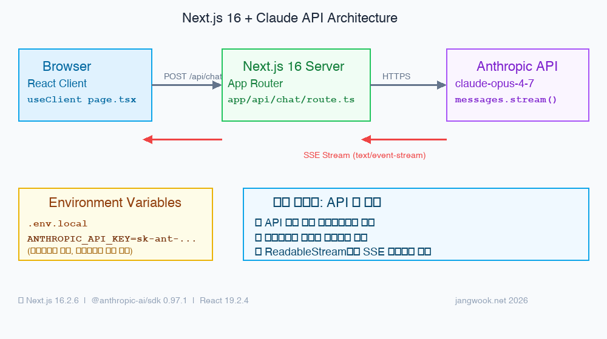

2026年になっても「Next.jsでAIチャットを作る」という検索結果には、相変わらずVercel AI SDKが標準として紹介されている。SDKそのものが悪いわけではない。ただ、SDKを使っていると、ストリーミングがどう動くのか、Route Handlerの内部で何が起きているのかを理解しないまま進みがちだ。

今回、Anthropic SDKだけを使って最初からサンドボックスで作ってみた。`create-next-app`でプロジェクトを生成し、`@anthropic-ai/sdk`を追加し、Route Handlerを実装する全工程だ。結論を言えば、思ったより簡単だった。50行ほどでプロダクション配備可能なストリーミングチャットバックエンドが完成する。

もう一つ気づいたことがある。`create-next-app@latest`が今や**Next.js 16**をインストールするということだ。検索上位の多くのガイドはまだNext.js 14か15ベースだ。この記事は2026年5月時点での実際のインストール結果をそのまま反映している。

## 作るもの：App RouterベースのClaudeストリーミングチャット

今日作るアプリの構造はこうだ：

- **Next.js 16.2.6** + App Router
- Route Handler（`/api/chat`）でClaude APIをサーバーサイドから呼び出す
- SSE（Server-Sent Events）でストリーミングレスポンスをクライアントに配信
- React 19の`"use client"`コンポーネントがストリーミングをリアルタイムでレンダリング

最重要ポイントは一つ。**APIキーはサーバーでのみ読まれ、クライアントバンドルには絶対に含まれない。** Next.js App Routerの設計のおかげだ。

実際にビルドするとこうなる：

```
▲ Next.js 16.2.6 (Turbopack)
✓ Compiled successfully in 1874ms

Route (app)
┌ ○ /           (Static)  prerendered as static content
└ ƒ /api/chat   (Dynamic) server-rendered on demand
```



## 最終的なプロジェクト構造

完成するとこの構造になる。核心は2ファイルで、残りはcreate-next-appが自動生成する。

```
nextjs-claude-chat/
├── src/
│   └── app/
│       ├── api/
│       │   └── chat/
│       │       └── route.ts    ← Claude APIストリーミングエンドポイント（核心）
│       ├── page.tsx             ← チャットUI（核心）
│       ├── layout.tsx           ← 自動生成
│       └── globals.css          ← 自動生成
├── .env.local                   ← ANTHROPIC_API_KEY をここに
├── package.json
└── tsconfig.json
```

## Prerequisites

ローカルに準備が必要なもの：

- Node.js 18以上
- Anthropic APIキー（`sk-ant-...`） — [console.anthropic.com](https://console.anthropic.com)で発行
- TypeScriptの基礎知識
- Next.js App Routerの基本理解（なくてもついていける）

## Step 1: プロジェクト作成と依存関係インストール

```bash
npx create-next-app@latest nextjs-claude-chat \
  --typescript \
  --tailwind \
  --eslint \
  --app \
  --src-dir \
  --import-alias "@/*"

cd nextjs-claude-chat
npm install @anthropic-ai/sdk
```

2026年5月時点で`create-next-app@latest`は**Next.js 16.2.6**をインストールする。Reactも19.2.4に上がっている。

インストール後の`package.json`の主要依存関係：

```json
{
  "dependencies": {
    "@anthropic-ai/sdk": "^0.97.1",
    "next": "16.2.6",
    "react": "19.2.4",
    "react-dom": "19.2.4"
  }
}
```

## Step 2: Claude API Route Handlerの実装

核心ファイルだ。`src/app/api/chat/route.ts`を作成する。

```typescript
import Anthropic from "@anthropic-ai/sdk";

const client = new Anthropic({
  apiKey: process.env.ANTHROPIC_API_KEY,
});

export async function POST(req: Request) {
  const { messages } = await req.json();

  const stream = await client.messages.stream({
    model: "claude-opus-4-7",
    max_tokens: 1024,
    messages,
  });

  const encoder = new TextEncoder();
  const readable = new ReadableStream({
    async start(controller) {
      for await (const chunk of stream) {
        if (
          chunk.type === "content_block_delta" &&
          chunk.delta.type === "text_delta"
        ) {
          controller.enqueue(
            encoder.encode(
              `data: ${JSON.stringify({ text: chunk.delta.text })}\n\n`
            )
          );
        }
      }
      controller.enqueue(encoder.encode("data: [DONE]\n\n"));
      controller.close();
    },
  });

  return new Response(readable, {
    headers: {
      "Content-Type": "text/event-stream",
      "Cache-Control": "no-cache",
      Connection: "keep-alive",
    },
  });
}
```

注目すべき点が2つある。

<strong>1つ目、`client.messages.stream()`は`AsyncIterableStream`を返す。</strong> `for await...of`でチャンクを1つずつ受け取り、クライアントに送り出す。ストリームが終了したら`[DONE]`シグナルを送ってコントローラーを閉じる。

<strong>2つ目、`ReadableStream` + `TextEncoder`の組み合わせがWeb Streams API標準だ。</strong> Next.js Route HandlerはNode.jsの`stream`モジュールではなくWeb Streamsを使う。[FastAPIのストリーミング](/ja/blog/ja/fastapi-claude-api-streaming-production-guide-2026)とAPIが異なる理由がこれだ。

## Step 3: 環境変数とセキュリティ設定

`.env.local`ファイルをプロジェクトルートに作成する。

```bash
ANTHROPIC_API_KEY=sk-ant-ここに実際のキーを入れる
```

**`NEXT_PUBLIC_`プレフィックスは絶対につけてはいけない。** これはNext.jsセキュリティの核心だ。

| 変数名の形式 | アクセス可能な場所 | 用途 |
|---|---|---|
| `ANTHROPIC_API_KEY` | サーバー専用（Route Handler, Server Component） | ✓ APIキーに使用 |
| `NEXT_PUBLIC_API_KEY` | クライアント公開（ブラウザバンドルに含まれる） | ✗ APIキーには絶対使用禁止 |

## Step 4: クライアントチャットUIの実装

`src/app/page.tsx`にストリーミングレスポンスをリアルタイムでレンダリングするUIを作る。

```typescript
"use client";

import { useState, useRef, useEffect } from "react";

type Message = {
  role: "user" | "assistant";
  content: string;
};

export default function ChatPage() {
  const [messages, setMessages] = useState<Message[]>([]);
  const [input, setInput] = useState("");
  const [isLoading, setIsLoading] = useState(false);
  const bottomRef = useRef<HTMLDivElement>(null);

  useEffect(() => {
    bottomRef.current?.scrollIntoView({ behavior: "smooth" });
  }, [messages]);

  const sendMessage = async () => {
    if (!input.trim() || isLoading) return;

    const userMessage: Message = { role: "user", content: input };
    const updatedMessages = [...messages, userMessage];
    setMessages(updatedMessages);
    setInput("");
    setIsLoading(true);

    const assistantMessage: Message = { role: "assistant", content: "" };
    setMessages([...updatedMessages, assistantMessage]);

    const res = await fetch("/api/chat", {
      method: "POST",
      headers: { "Content-Type": "application/json" },
      body: JSON.stringify({ messages: updatedMessages }),
    });

    if (!res.body) return;

    const reader = res.body.getReader();
    const decoder = new TextDecoder();

    while (true) {
      const { done, value } = await reader.read();
      if (done) break;

      const chunk = decoder.decode(value);
      const lines = chunk.split("\n");

      for (const line of lines) {
        if (line.startsWith("data: ") && line !== "data: [DONE]") {
          const data = JSON.parse(line.slice(6));
          setMessages((prev) => {
            const last = prev[prev.length - 1];
            return [
              ...prev.slice(0, -1),
              { ...last, content: last.content + data.text },
            ];
          });
        }
      }
    }

    setIsLoading(false);
  };

  return (
    <main className="flex flex-col h-screen max-w-2xl mx-auto p-4">
      <h1 className="text-2xl font-bold mb-4">Claude Chat</h1>
      <div className="flex-1 overflow-y-auto space-y-4 mb-4">
        {messages.map((msg, i) => (
          <div key={i} className={`p-3 rounded-lg ${
            msg.role === "user"
              ? "bg-blue-100 ml-auto max-w-xs"
              : "bg-gray-100 mr-auto max-w-md"
          }`}>
            <span className="text-xs text-gray-500 block mb-1">
              {msg.role === "user" ? "You" : "Claude"}
            </span>
            <p className="whitespace-pre-wrap">{msg.content}</p>
          </div>
        ))}
        <div ref={bottomRef} />
      </div>
      <div className="flex gap-2">
        <input
          type="text"
          value={input}
          onChange={(e) => setInput(e.target.value)}
          onKeyDown={(e) => e.key === "Enter" && sendMessage()}
          placeholder="メッセージを入力..."
          className="flex-1 border rounded-lg px-3 py-2 focus:outline-none focus:ring-2 focus:ring-blue-400"
        />
        <button
          onClick={sendMessage}
          disabled={isLoading || !input.trim()}
          className="bg-blue-500 text-white px-4 py-2 rounded-lg disabled:opacity-50"
        >
          送信
        </button>
      </div>
    </main>
  );
}
```

## Step 5: ビルドと動作確認

```bash
npm run dev
# ▲ Next.js 16.2.6 (Turbopack)
# ✓ Ready in 337ms
# Local: http://localhost:3000

npm run build
# ✓ Compiled successfully in 1874ms
# Route: ƒ /api/chat  (Dynamic)
```

Turbopackのおかげで開発サーバーが0.3秒で起動する。

## 現在の実装の限界

率直に言えば、このコードをそのままプロダクションに乗せるべきではない。3つの明確な限界がある。

<strong>エラーハンドリングがない。</strong> Claude API呼び出しが失敗した際（レートリミット、ネットワークエラー、無効なAPIキー）、クライアントに何のエラーメッセージも送らない。ストリームが単純に切断される。実サービスなら`try/catch`を追加し、エラー時に`data: {"error": "message"}`形式のSSEイベントを送る必要がある。

<strong>会話の長さ制限がない。</strong> このコードは毎リクエストで会話履歴全体をClaude APIに送る。会話が長くなるとコンテキストウィンドウを超えてエラーになる。実サービスなら最近のN件のメッセージだけ送るか、トークン数を管理するロジックが必要だ。

<strong>同時リクエスト管理がない。</strong> ユーザーが素早く複数のメッセージを送るとストリームが重なる。AbortControllerを使って以前のリクエストをキャンセルするロジックが実装されていない。

## Vercel配備時の注意点

`ANTHROPIC_API_KEY`をVercelダッシュボードのProject Settings → Environment Variablesに追加する必要がある。`.env.local`はローカル専用でVercelサーバーにはアップロードされない。

Edge RuntimeとNode.js Runtimeの選択も重要だ。Anthropic SDKはNode.js標準ライブラリの一部を使用するため、Route Handlerに明示的に指定する：

```typescript
export const runtime = 'nodejs';
```

## トラブルシューティングFAQ

**APIキーを設定したのにサーバーが`undefined`を受け取る**

`.env.local`ファイルがプロジェクトルートにあるか確認する。ファイルの場所が正しければ開発サーバーを再起動する必要がある。

**ストリーミングが動かず、レスポンスが一度に届く**

Route Handlerの`Response`ヘッダーに`"Content-Type": "text/event-stream"`と`"Cache-Control": "no-cache"`の両方が設定されているか確認する。

## Vercel AI SDKとの比較

| 項目 | Raw Anthropic SDK | Vercel AI SDK |
|---|---|---|
| コード量 | 多い（〜50行のRoute Handler） | 少ない（`useChat`一行） |
| カスタマイズ | 完全自由 | SDK抽象化範囲内 |
| デバッグ | SSEの流れが透明 | 内部ロジックの把握が難しい |
| 学習価値 | Web Streams、SSEの理解が必要 | 即時利用可能 |

個人的には初学者にはまずこの記事のようにRaw APIで試して、次にSDKを使うことを勧める。SDKが何をやってくれているかを知ってこそ、SDKを正しく使える。

[Vercel AI SDKでClaudeストリーミングエージェントを作る](/ja/blog/ja/vercel-ai-sdk-claude-streaming-agent-2026)と直接比較してみてほしい。

## 次のステップ

1. **Tool Use追加** — Claudeに関数呼び出し能力を付与 → [Claude Agent SDK実践ガイド](/ja/blog/ja/claude-agent-sdk-tool-use-complete-guide-2026)
2. **Prompt Caching** — APIコストを最大90%削減 → [Claude API Prompt Caching実践](/ja/blog/ja/claude-api-prompt-caching-cost-optimization-guide)
3. **エラーハンドリング強化** — AbortController、retryロジック、エラーSSEイベント
4. **Vercel配備** — 上記の注意点を適用してプロダクション公開
