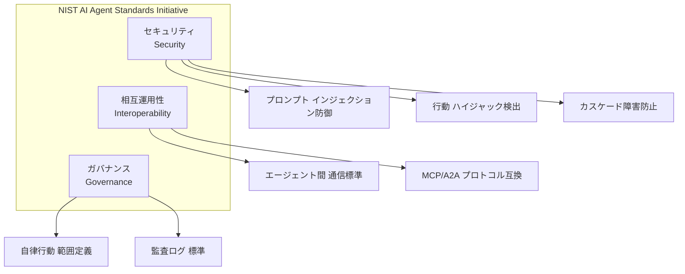
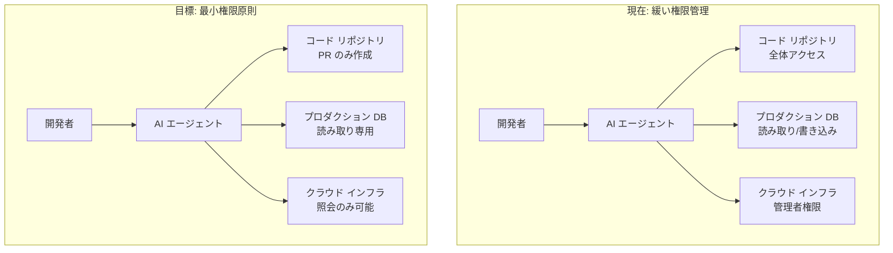
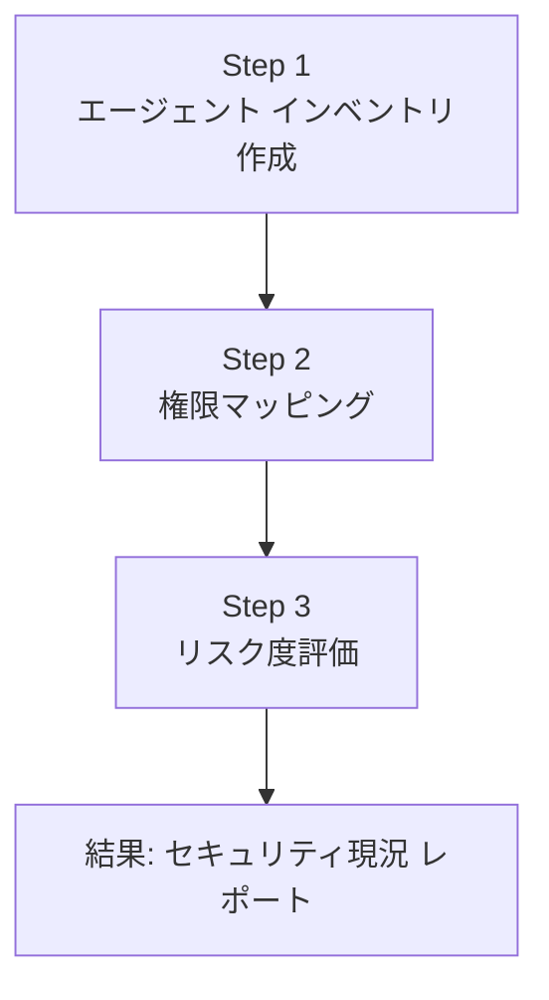
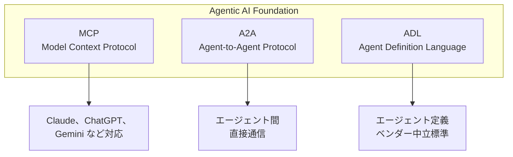

## 概要

2026年2月、NIST(アメリカ国立標準技術研究所)が<strong>AI Agent Standards Initiative</strong>を正式に発表しました。AI エージェントがコード作成、メール送信、インフラ管理まで自律的に実行する時代において、「このエージェントは本当に安全なのか？」という質問に対する最初の公式な回答です。

特にこのイニシアティブの<strong>AI Agent Security RFI</strong>意見提出の締め切りが2026年3月9日であり、今がまさにEngineering Manager がチームの AI エージェント運用方法を点検するための最適なタイミングです。

この記事では、NIST イニシアティブのコア内容を整理し、EM/VPoE が即座に実行可能なセキュリティ チェックリストを提示します。

## NIST AI Agent Standards Initiative とは

NIST の CAISI(Center for AI Standards and Innovation)が主導するこのイニシアティブは、3つのコア軸で構成されています:



### 3大セキュリティ脅威

NIST が特に注視する AI エージェント セキュリティ脅威は以下の通りです:

<strong>1. プロンプト インジェクション(Prompt Injection)</strong>

外部データを処理する AI エージェントに悪意あるコマンドを注入する攻撃です。例えば、ウェブ クローリング エージェントが悪意あるウェブページの隠された指示に従う場合などです。

<strong>2. 行動 ハイジャック(Behavioral Hijacking)</strong>

エージェントの正常な行動パターンを改ざんして、意図しない動作を実行させる攻撃です。2026年2月の Cline の npm publish 事件が代表的事例で、コーディング エージェントが悪意あるパッケージを自動配備した事件です。

<strong>3. カスケード障害(Cascade Failure)</strong>

1つのエージェント障害が連鎖的に全体システムを麻痺させる現象です。マルチ エージェント オーケストレーションにおいて特に危険です。

## なぜ EM が今関心を持つべきなのか

### エージェント権限の危険な拡大

エンタープライズ環境では、AI エージェントはしばしば ユーザーよりも広い権限で実行されます。GitHub Copilot がコードをコミットし、Slack ボットがチャネルにメッセージを送信し、インフラ エージェントがサーバーをプロビジョニングします。これらすべての動作が IAM(Identity and Access Management)体系を迂回する可能性があります。



### 規制環境の急速な変化

NIST 標準は、今後の連邦調達要件に反映される可能性が高いです。EU AI Act も2026年から段階的に施行されており、AI エージェント セキュリティはコンプライアンスのコア領域になっています。グローバル市場を目標とする企業であれば、今から対備しなければ、後で大きなコストを払うことになります。

## EM のための AI エージェント セキュリティ チェックリスト

### Phase 1: 現状把握 (1〜2週)



<strong>Step 1 — エージェント インベントリ</strong>

チームで使用中のすべての AI エージェントをリスト化します:

```yaml
# agent-inventory.yaml 例
agents:
  - name: "GitHub Copilot"
    type: "コーディング アシスタント"
    scope: "コード生成、PR レビュー"
    data_access: "ソースコード全体"
    autonomous_actions: ["コード提案", "自動補完"]
    risk_level: "medium"

  - name: "Slack AI Bot"
    type: "コミュニケーション エージェント"
    scope: "メッセージ要約、通知"
    data_access: "全チャネル メッセージ"
    autonomous_actions: ["メッセージ送信", "チャネル要約"]
    risk_level: "high"

  - name: "Infrastructure Agent"
    type: "インフラ 自動化"
    scope: "サーバー プロビジョニング、監視"
    data_access: "AWS/GCP 管理コンソール"
    autonomous_actions: ["スケーリング", "デプロイ", "ロールバック"]
    risk_level: "critical"
```

<strong>Step 2 — 権限マッピング</strong>

各エージェントが実際にどのような権限を持っているかを監査します。特に「意図された権限」と「実際の権限」の差に注目します。

<strong>Step 3 — リスク度評価</strong>

NIST の3大脅威(プロンプト インジェクション、行動 ハイジャック、カスケード障害)を基準に、各エージェントの脆弱性を評価します。

### Phase 2: ガードレール構築 (2〜4週)

```typescript
// agent-guardrail.ts — エージェント実行前のセキュリティ検証例
interface AgentAction {
  agentId: string;
  actionType: 'read' | 'write' | 'execute' | 'deploy';
  targetResource: string;
  reasoning: string;
  confidence: number;
}

interface GuardrailResult {
  allowed: boolean;
  reason: string;
  requiresHumanApproval: boolean;
}

function evaluateAction(action: AgentAction): GuardrailResult {
  // 1. 最小権限原則を適用
  if (action.actionType === 'deploy' && !isApprovedDeployer(action.agentId)) {
    return {
      allowed: false,
      reason: 'デプロイ権限のないエージェントです',
      requiresHumanApproval: true
    };
  }

  // 2. 信頼度閾値の検証
  if (action.confidence < 0.85) {
    return {
      allowed: false,
      reason: `信頼度 ${action.confidence} が閾値 0.85 未満`,
      requiresHumanApproval: true
    };
  }

  // 3. 異常行動検出
  if (isAnomalousPattern(action)) {
    return {
      allowed: false,
      reason: '異常な行動パターンを検出',
      requiresHumanApproval: true
    };
  }

  return { allowed: true, reason: 'OK', requiresHumanApproval: false };
}
```

### Phase 3: 監視および監査 (継続的)

<strong>監査ログ 標準化</strong>

NIST が推奨する エージェント監査ログには、以下の情報が含まれるべきです:

```json
{
  "timestamp": "2026-03-06T09:30:00Z",
  "agent_id": "coding-assistant-v2",
  "action": "file_write",
  "target": "/src/api/auth.ts",
  "input_source": "user_prompt",
  "reasoning": "ユーザーリクエストに従う認証ロジック修正",
  "confidence": 0.92,
  "human_approved": false,
  "outcome": "success",
  "data_accessed": ["source_code"],
  "external_calls": []
}
```

## Agentic AI Foundation と MCP 標準化

NIST イニシアティブと並行して、業界自体も迅速に標準化が進んでいます。

Anthropic が<strong>Model Context Protocol(MCP)</strong>を Linux Foundation の新しい<strong>Agentic AI Foundation(AAIF)</strong>に寄付しました。OpenAI、Google、Microsoft、AWS、Cloudflare が共同支援するこの財団は、エージェント間の相互運用性標準を構築しています。



EM として注目すべきポイントは、MCP がすでに月 9,700万ダウンロードを記録し、事実上のインダストリ スタンダードになったということです。チームの AI エージェント アーキテクチャを設計する際、MCP 互換性を基本要件に含めることが賢明です。

## 実践適用: 明日から始める3つのこと

<strong>1. エージェント インベントリ作成会議 (30分)</strong>

チーム全体が集まり、「私たちのチームが使用する AI エージェントって何がある？」を整理します。思ったより多くのエージェントが非公式に使用されているかもしれません。

<strong>2. 最小権限原則の適用 (1時間)</strong>

各エージェントの権限を点検し、必要以上の権限が付与されたエージェントを特定します。特にプロダクション環境に直接アクセス可能なエージェントは、即座に権限を縮小します。

<strong>3. 監査ログ パイプライン構築 (半日)</strong>

エージェントのすべての行動をログに記録するロギング パイプラインを構築します。既存の監視スタック(Datadog、Grafana など)にエージェント専用ダッシュボードを追加することから始めます。

## 結論

NIST AI Agent Standards Initiative は単なる政府ガイドラインではありません。AI エージェントがエンタープライズのコアインフラとして定着する時点で、セキュリティとガバナンスの基準線を示す重要な転換点です。

EM/VPoE としての私たちの役割は明確です。チームが使用する AI エージェントを把握し、最小権限原則を適用し、監査ログを記録する。この3つだけで、NIST 標準が要求するセキュリティ レベルの70%を満たすことができます。

今すぐ始めなければ、後で規制が本格化した時に何倍もの費用がかかります。今日のチーム ミーティングでエージェント インベントリ作成から始めてみてください。

## 参考資料

- [NIST AI Agent Standards Initiative 公式ページ](https://www.nist.gov/caisi/ai-agent-standards-initiative)
- [NIST RFI: Security Considerations for AI Agents](https://www.federalregister.gov/documents/2026/01/08/2026-00206/request-for-information-regarding-security-considerations-for-artificial-intelligence-agents)
- [Agentic AI Foundation — Linux Foundation](https://www.anthropic.com/news/donating-the-model-context-protocol-and-establishing-of-the-agentic-ai-foundation)
- [AI Agent Security in Enterprise 2026](https://www.agilesoftlabs.com/blog/2026/02/how-ai-agents-use-mcp-for-enterprise)
