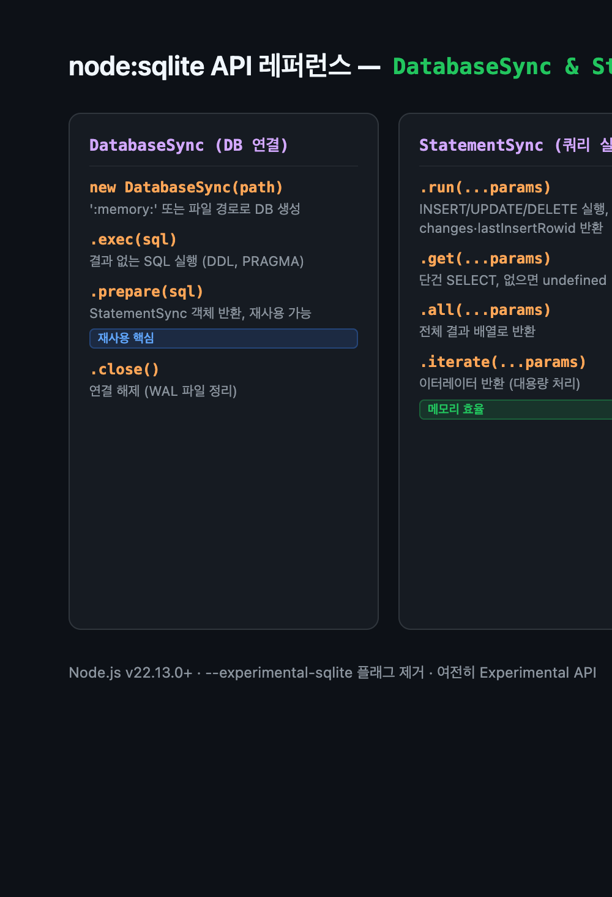

`npm install sqlite3` と入力する習慣を止める時がきた。

Node.js 22.5.0 から `node:sqlite` という内蔵モジュールが追加された。インストール不要、`package.json` への追記も不要。`require('node:sqlite')` と書くだけで動く。現時点（v22.22.0）では実験的(experimental)な警告が出るが、Node.js v26 では安定化している。

実際に API を全部叩いてみた。この記事はその記録だ。

## なぜ今 node:sqlite なのか

外部パッケージが不要というのは、単なる利便性以上の意味がある。`better-sqlite3` や `sqlite3` はネイティブバインディング（`node-gyp` ビルド）が必要で、CI 環境や Alpine Linux ベースのコンテナでビルドが失敗することが多かった。`node:sqlite` は Node.js バイナリに SQLite が内蔵されているため、その問題がない。

正直に言えば、Node.js 22 では まだ experimental ラベルがついている点は本番投入を躊躇させる。v26 が LTS ラインに上がるまでは、内部ツール、スクリプト、プロトタイプで先に検証するのが現実的だ。ただし API 自体は今でも十分安定していて完成度が高い。

### better-sqlite3 との違い

一言でいえば：設計思想は似ているが API の表面積が狭い。

- 同期(sync)専用という点は同じ
- `db.transaction()` ラッパーがない。これが最大の違いで、詳しくは後述する
- `db.function()`、`db.aggregate()` はある
- `serialize()`/`deserialize()` 方式のメモリ DB シリアライズはない

## インストールなしで始める

```bash
# Node.js 22.5.0 以上があればすぐ動く
node --version  # v22.22.0

node -e "const {DatabaseSync} = require('node:sqlite'); console.log('OK');"
# (node:...) ExperimentalWarning: SQLite is an experimental feature and might change at any time
# OK
```

警告を消すには `--no-warnings` フラグか `NODE_NO_WARNINGS=1` 環境変数を使う。

API の中心は二つのクラスだ:

- `DatabaseSync`: データベース接続オブジェクト
- `StatementSync`: プリペアドステートメント

```js
const { DatabaseSync } = require('node:sqlite');

// インメモリデータベース
const memDb = new DatabaseSync(':memory:');

// ファイルベース（なければ自動作成）
const fileDb = new DatabaseSync('./my-app.db');
```

## DatabaseSync のメソッド一覧

実際に API を調べた。利用可能なメソッドは以下の通り:



```js
// DatabaseSync のメソッド
// ['open', 'close', 'prepare', 'exec', 'function',
//  'location', 'aggregate', 'createSession',
//  'applyChangeset', 'enableLoadExtension', 'loadExtension']

// StatementSync のメソッド
// ['iterate', 'all', 'get', 'run', 'columns',
//  'setAllowBareNamedParameters', 'setAllowUnknownNamedParameters',
//  'setReadBigInts', 'setReturnArrays']
```

## 基本的な CRUD パターン

```js
const { DatabaseSync } = require('node:sqlite');
const db = new DatabaseSync(':memory:');

db.exec(`
  CREATE TABLE products (
    id    INTEGER PRIMARY KEY AUTOINCREMENT,
    name  TEXT    NOT NULL,
    price REAL,
    stock INTEGER DEFAULT 0
  )
`);

// PreparedStatement を作成
const insert = db.prepare(
  'INSERT INTO products (name, price, stock) VALUES (:name, :price, :stock)'
);

// run() — INSERT/UPDATE/DELETE。戻り値: { lastInsertRowid, changes }
const result = insert.run({ name: 'AirPods Pro', price: 249.99, stock: 50 });
console.log(result);  // { lastInsertRowid: 1, changes: 1 }

insert.run({ name: 'MacBook Pro', price: 2499.99, stock: 10 });
insert.run({ name: 'iPad Air',    price: 749.99,  stock: 25 });

// all() — 複数行取得
const all = db.prepare('SELECT * FROM products ORDER BY price DESC').all();
// [{ id: 2, name: 'MacBook Pro', ... }, ...]

// get() — 単一行取得（なければ undefined）
const cheapest = db.prepare(
  'SELECT * FROM products ORDER BY price ASC LIMIT 1'
).get();
console.log(cheapest.name, cheapest.price);  // AirPods Pro 249.99

// iterate() — 大量データをイテレータで処理
const stmt = db.prepare('SELECT * FROM products');
for (const row of stmt.iterate()) {
  console.log(row.id, row.name);
}

db.close();
```

位置パラメータ（`?`）と名前付きパラメータ（`:name`）の両方に対応している。

## トランザクション: better-sqlite3 との核心的な違い

`better-sqlite3` から移行する際に最初に詰まるのがここだ。

```js
// ❌ node:sqlite にはこれがない
const insertMany = db.transaction((items) => { ... });
```

`db.transaction()` がない。代わりに `exec()` で BEGIN/COMMIT/ROLLBACK を直接管理する必要がある。

```js
const { DatabaseSync } = require('node:sqlite');
const db = new DatabaseSync(':memory:');
db.exec('CREATE TABLE log (id INTEGER PRIMARY KEY AUTOINCREMENT, msg TEXT)');

const insert = db.prepare('INSERT INTO log (msg) VALUES (?)');

function insertBatch(messages) {
  db.exec('BEGIN');
  try {
    for (const msg of messages) {
      insert.run(msg);
    }
    db.exec('COMMIT');
    console.log('✅ Committed:', messages.length, 'rows');
  } catch (e) {
    db.exec('ROLLBACK');
    console.error('❌ Rolled back:', e.message);
    throw e;
  }
}

insertBatch(['サーバー起動', 'リクエスト受信', 'レスポンス送信']);
// ✅ Committed: 3 rows
```

このパターンはヘルパーとして切り出しておくと便利だ:

```js
function withTransaction(db, fn) {
  db.exec('BEGIN');
  try {
    const result = fn();
    db.exec('COMMIT');
    return result;
  } catch (e) {
    db.exec('ROLLBACK');
    throw e;
  }
}
```

[Hono.js で API サーバーを構成する際](/ja/blog/ja/hono-typescript-api-2026)も、このヘルパーをそのまま使える。

## ユーザー定義関数と集計関数

SQL の中で JavaScript 関数を直接呼べる。

```js
const { DatabaseSync } = require('node:sqlite');
const db = new DatabaseSync(':memory:');
db.exec('CREATE TABLE scores (player TEXT, score INTEGER)');

const ins = db.prepare('INSERT INTO scores VALUES (?, ?)');
ins.run('Alice', 1200);
ins.run('Bob',   850);
ins.run('Alice', 1050);

// db.function() — スカラー関数
db.function('double_score', (score) => score * 2);

const rows = db.prepare(
  'SELECT player, double_score(score) as ds FROM scores ORDER BY ds DESC'
).all();
console.log(rows);

// db.aggregate() — 集計関数
db.aggregate('weighted_avg', {
  start:  () => ({ sum: 0, count: 0 }),
  step:   (acc, val) => ({ sum: acc.sum + val, count: acc.count + 1 }),
  result: (acc) => acc.count > 0 ? acc.sum / acc.count : 0,
});

const avg = db.prepare('SELECT weighted_avg(score) as avg FROM scores').get();
console.log('平均スコア:', avg.avg);  // 1033.33...
```

## StatementSync の高度なオプション

### setAllowBareNamedParameters

コロン接頭辞なしでパラメータを渡せるようにする。

```js
const stmt = db.prepare('INSERT INTO kv VALUES (:key, :value)');
stmt.setAllowBareNamedParameters(true);
stmt.run({ key: 'hello', value: 'world' });  // { ':key': 'hello' } でなくて OK
```

### setReadBigInts

`Number.MAX_SAFE_INTEGER` を超える整数を BigInt で返す。

```js
const stmt = db.prepare('SELECT val FROM big');
stmt.setReadBigInts(true);
const row = stmt.get();
console.log(typeof row.val);  // bigint
```

### setReturnArrays

オブジェクトの配列ではなく配列の配列で返す。大量データのバルク処理に向いている。

```js
const stmt = db.prepare('SELECT id, name FROM products');
stmt.setReturnArrays(true);
console.log(stmt.all());  // [[1, 'AirPods Pro'], [2, 'MacBook Pro'], ...]
```

## 実践例: CLI タスク管理ツール

```js
// task-manager.js
const { DatabaseSync } = require('node:sqlite');
const path = require('path');

const db = new DatabaseSync(path.join(__dirname, 'tasks.db'));

db.exec(`
  CREATE TABLE IF NOT EXISTS tasks (
    id    INTEGER PRIMARY KEY AUTOINCREMENT,
    title TEXT    NOT NULL,
    done  INTEGER DEFAULT 0,
    created_at INTEGER NOT NULL
  )
`);

const stmtAdd  = db.prepare('INSERT INTO tasks (title, created_at) VALUES (?, ?)');
const stmtDone = db.prepare('UPDATE tasks SET done = 1 WHERE id = ?');
const stmtList = db.prepare('SELECT * FROM tasks ORDER BY created_at DESC');
const stmtDel  = db.prepare('DELETE FROM tasks WHERE id = ?');

function add(title)     { return stmtAdd.run(title, Date.now()).lastInsertRowid; }
function complete(id)   { return stmtDone.run(id).changes; }
function list()         { return stmtList.all(); }
function remove(id)     { return stmtDel.run(id).changes; }

// デモ
const id1 = add('node:sqlite のテスト作成');
const id2 = add('ブログ記事の下書き');
const id3 = add('ビルド検証');

complete(id1);
list().forEach(t => console.log(`[${t.done ? '✓' : ' '}] #${t.id} ${t.title}`));

remove(id3);
db.close();
```

実行結果:

```
[ ] #3 ビルド検証
[ ] #2 ブログ記事の下書き
[✓] #1 node:sqlite のテスト作成
```

`node-gyp` も `better-sqlite3` も不要。Node.js 一本で動く。

## WAL モードとパフォーマンス設定

```js
const db = new DatabaseSync('./app.db');
db.exec('PRAGMA journal_mode=WAL');
db.exec('PRAGMA synchronous=NORMAL');
db.exec('PRAGMA cache_size=-64000');   // 64MB キャッシュ
db.exec('PRAGMA temp_store=MEMORY');

const mode = db.prepare('PRAGMA journal_mode').get();
console.log(mode.journal_mode);  // wal
```

[Deno 2 vs Bun の比較](/ja/blog/ja/deno-2-vs-bun-nodejs-runtime-2026-comparison)でも触れたが、WAL モードまで有効にすれば、内部ツールの大半で PostgreSQL を使う理由がなくなる。

## エラー処理

```js
try {
  db.exec('INVALID SQL @@@@');
} catch (e) {
  console.log(e.constructor.name);  // Error
  console.log(e.errcode);           // 1 (SQLITE_ERROR)
  console.log(e.message);           // near "INVALID": syntax error
}

try {
  db.exec("INSERT INTO t VALUES (1, 'b')");  // UNIQUE 制約違反
} catch (e) {
  console.log(e.errcode);  // 19 (SQLITE_CONSTRAINT)
}
```

## 現在の限界と私の判断

**限界:**

- Node.js 22 では依然 experimental。マイナーバージョンで API が変わる可能性あり
- 非同期 API なし。同期呼び出しだけなので、イベントループをブロックしうる
- `db.transaction()` ラッパーなし。コードが冗長になる
- `serialize()`/`deserialize()` なし

**私の立場:**

本番サーバーへの即時投入はまだ早い。Node.js v26 LTS が安定するまで待つべきだ。ただし内部 CLI ツール、スクリプト、プロトタイプには今すぐ使って問題ない。[Bun Shell スクリプト](/ja/blog/ja/bun-shell-scripting-practical-guide-2026)のような自動化ツールを作る際に外部依存を最小化したいなら特にそうだ。

## 内部ツールなら今でも十分使える

API を全部叩いてみて残ったのは、ひとつの感想だった。思ったよりも完成度が高い。`DatabaseSync`、`StatementSync`、ユーザー定義関数、集計関数、WAL モード、BigInt サポート。内部ツールで手が伸びる機能はほぼ揃っている。

`better-sqlite3` の `db.transaction()` のような便利ラッパーがない点は残念だ。とはいえ `withTransaction` ヘルパーを一つ書けば済む話でもある。

これは Node.js エコシステムが外部依存を減らす方向に動いているシグナルとして読める。`fetch`、`WebCrypto`、`test runner` に続いて、今度は `sqlite` が入った。次は `postgresql` の内蔵を期待してもいいだろうか。書いてみて、さすがに欲張りかと思った。
